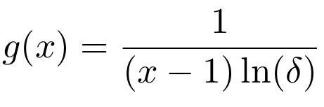
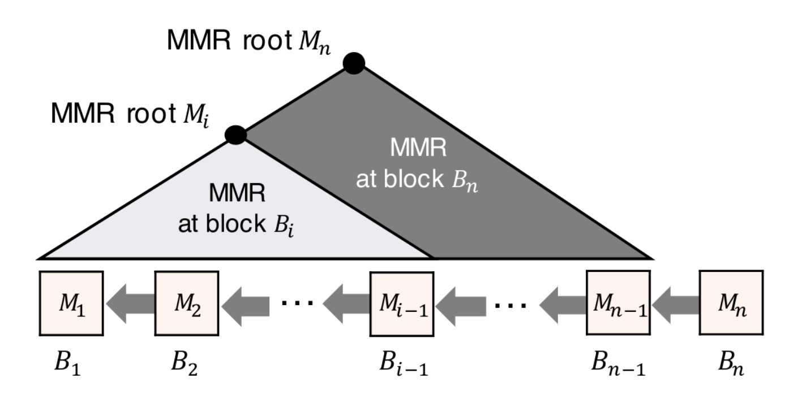
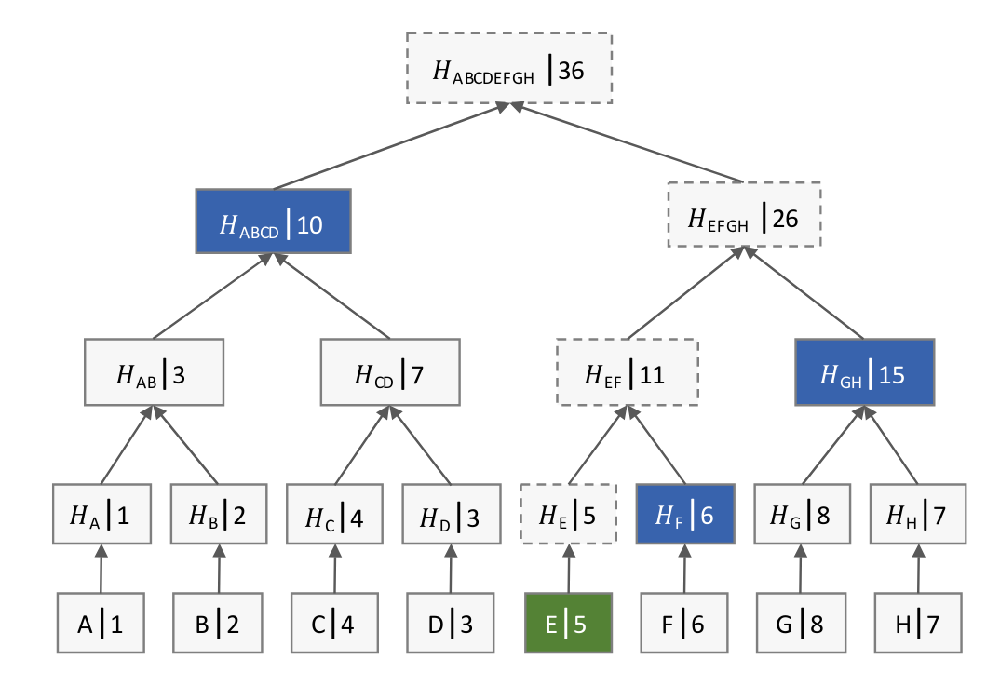

::

  ZIP: 0311 
  Title: FlyClient ZCash SPV
  Champions: 
  Status: Draft
  Category: Consensus
  Created: 2019-03-30
  License: MIT 


Terminology
===========
The key words "MUST", "SHOULD", and "MAY" in this document are to be interpreted as described in RFC 2119. [#RFC2119]_

Light client
  A client that is not a full participant in the network of Zcash peers. It can send and receive payments, but does not store or validate a copy of the blockchain.

High probability
  An event occurs with high probability if it occurs with probability 1-O(1/2^λ), where λ is the security parameter.

Negligible probability
  An event occurs with negligible probability if it occurs with probability O(1/2^λ), where λ is the security parameter.

Merkle mountain range (MMR)
  A Merkle mountain range (MMR) is binary hash tree that allows for efficient appends of new leaves without changing the value of existing nodes [#PeterTodd]_.

Hard fork 
  A hard fork is a change to a protocol that makes transactions from older clients invalid. 
  

Abstract
========
A proposed implementation of the probabilistic verification FlyClient protocol [#FlyClient]_ on top of the existing ZCash reference light client protocol [#ZIPXXX]_. This can be implemented with a hard fork to include a MMR proof in each block header.

Motivation
==========
FlyClient reduces the number of block headers needed for light client verification of a valid chain, from linear (as in the current reference protocol) to logarithmic in blockchain length. This verification is correct with high probability. It also allows creation of subchain proofs, so light clients need only check blocks later than the most recently verified block index. Following that, verification of a transaction inclusion within that block follows the usual reference protocol [#ZIPXXX]_. 

A smaller proof size could facilitate ‘side-chaining’ with other blockchains such as Ethereum. It also reduces bandwidth and storage requirements for limited clients like mobile or IoT devices.


Specification
=============

Probabilistic sampling
```````````````````````
Instead of downloading every block header, the FlyClient samples blocks from the full node with the given sampling distribution. Here, x is the relative aggregate weight at the given block (e.g. if x=1/2 at some block, it means that half the chain's difficulty has been amassed in the interval up to that block), and δ is the fraction of the blocks which are always checked by the client with probability 1.


    
It has been found that as long as log_c(δ) is constant, where c is the adversary's mining power as a fraction of the honest mining power, then the number of light client queries needed are logarithmic in the size of the blockchain [#FlyClient]_.


New block header
`````````````````
Each FlyClient prover has to maintain a commitment to all its block headers in a Merkle mountain range (MMR). This means that each ZCash block header must include the MMR root of all the blocks before it. This can be implemented in a hard fork of the ZCash protocol, in which the MMR root is added to the header of all old and new blocks. 

Merkle mountain range
``````````````````````



    Schematic of Merkle mountain range (from [#FlyClient]_).
    
The MMR structure allows for subchain proofs. Consider a client who has already received a verified a proof for a chain of n blocks. When it later receives k new blocks, it need only verify that the new section of length k is honest, as well as that the old chain is a prefix of the new chain.



Besides the block hash (or the hash of its children nodes), each MMR node contains an additional field of 8 bytes to store the cumulative difficulty of the nodes below it.

Verifier
`````````
**Verifying a valid chain**: the hash of the block B_n at the head of the chain specifies a random subset of blocks to sample. If the PoW solution or the MMR proofs of any of the sampled blocks is invalid, then the verifier rejects the proof.  Otherwise, it accepts B_n as the last block of the honest chain.

**Verifying a block in the valid chain**: For a single block B_k in a chain committed to by a block B_n, the prover provides the corresponding block header and an MMR proof that B_k is located at the correct height of the chain committed by B_n. The verifier checks that the MMR root stored in each sampled block correctly commits to the correct subchain of the chain committed to in B_n. 

**Verifying transaction inclusion in the block**: To ensure that tx is included in the block, we can follow the existing ZCash light client reference specification [#ZIPXXX]_.


Rationale
=========
Unlike previous skip list SPVs (PoPoW, NIPoPoW), the FlyClient protocol allows for variable block difficulty, which is appropriate for ZCash's variable difficulty [#difficulty]_. FlyClient also avoids bribing attacks since the selection of blocks on its skip list is random and not rule-based.

Security and privacy considerations
===================================
This protocol is probabilistic, meaning there is a negligible probability that an invalid chain can be verified. Assumes adversary mining power is bounded by a known fraction of combined mining power of honest nodes, and cannot drop or tamper with messages between client and full nodes. Assume client is connected to at least one full node and knows the genesis block.


Reference implementation
========================
A Proof-of-Concept Python implementation has been tested by the FlyClient authors. It assumed a block header of size 508 bytes and a hash output of 32 bytes. [is there a FlyClient repository?]

References
==========
.. [#RFC2119] `Key words for use in RFCs to Indicate Requirement Levels <https://tools.ietf.org/html/rfc2119>`

.. [#FlyClient] `FlyClient protocol (2019) <https://eprint.iacr.org/2019/226.pdf>`

.. [#ZIPXXX] `ZCash reference light client protocol <https://github.com/gtank/zips/blob/light_payment_detection/zip-XXX-light-payment-detection.rst>`

.. [#PeterTodd] _`Merkle Mountain Range <https://github.com/proofchains/python-proofmarshal/blob/master/proofmarshal/mmr.py>`

.. [#difficulty] `ZCash historical block difficulty <https://www.coinwarz.com/difficulty-charts/zcash-difficulty-chart>`
