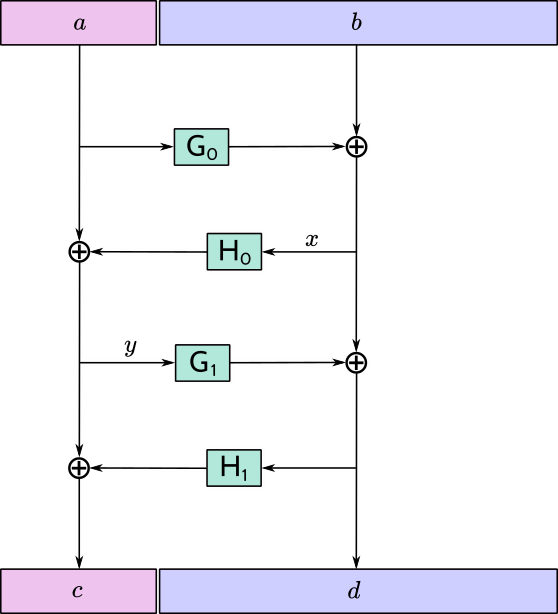
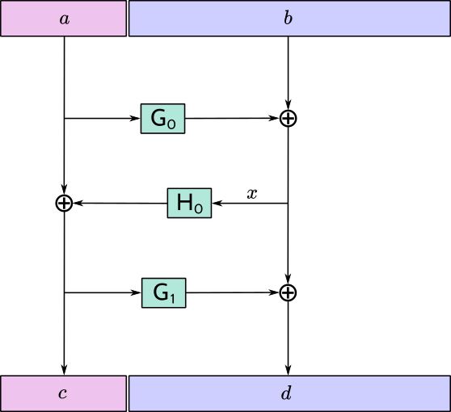

::

  ZIP: 316
  Title: Unified Addresses and Unified Viewing Keys
  Owners: Daira Hopwood <daira@electriccoin.co>
          Nathan Wilcox <nathan@electriccoin.co>
          Taylor Hornby <taylor@electriccoin.co>
          Jack Grigg <jack@electriccoin.co>
          Sean Bowe <sean@electriccoin.co>
          Kris Nuttycombe <kris@electriccoin.co>
          Ying Tong Lai <yingtong@electriccoin.co>
  Status: Proposed
  Category: Standards / RPC / Wallet
  Created: 2021-04-07
  License: MIT
  Discussions-To: <https://github.com/zcash/zips/issues/482>

Terminology
===========

The key words "MUST", "MUST NOT", and "SHOULD" in this document are to
be interpreted as described in RFC 2119. [#RFC2119]_

The terms below are to be interpreted as follows:

Recipient
  A wallet or other software that can receive transfers of assets (such
  as ZEC) or in the future potentially other transaction-based state changes.
Producer
  A wallet or other software that can create an Address (in which case it is
  normally also a Recipient) or a Viewing Key.
Consumer
  A wallet or other software that can make use of an Address or Viewing Key
  that it is given.
Sender
  A wallet or other software that can send transfers of assets, or other
  consensus state side-effects defined in future. Senders are a subset of
  Consumers.
Receiver
  The necessary information to transfer an asset to a Recipient that generated
  that Receiver using a specific Transfer Protocol. Each Receiver is associated
  unambiguously with a specific Receiver Type, identified by an integer Typecode.
Receiver Encoding
  An encoding of a Receiver as a byte sequence.
Viewing Key
  The necessary information to view information about payments to an Address,
  or (in the case of a Full Viewing Key) from an Address. An Incoming Viewing
  Key can be derived from a Full Viewing Key, and an Address can be derived
  from an Incoming Viewing Key.
Viewing Key Encoding
  An encoding of a Viewing Key as a byte sequence.
Metadata Encoding
  An encoding of metadata that is not a Receiver or Viewing Key, but may affect
  the interpretation of the overall Unified Address/Viewing Key.
Item
  An Receiver Encoding, Viewing Key Encoding, or Metadata Encoding.
Legacy Address
  A Transparent, Sprout, or Sapling Address.
Unified Address (or UA)
  A Unified Address combines multiple Receiver (and optionally Metadata) items.
Unified Full Viewing Key (or UFVK)
  A Unified Full Viewing Key combines multiple Full Viewing Key (and optionally
  Metadata) items.
Unified Incoming Viewing Key (or UIVK)
  A Unified Incoming Viewing Key combines multiple Incoming Viewing Key (and
  optionally Metadata) items.
Unified Viewing Key
  Either a Unified Full Viewing Key or a Unified Incoming Viewing Key.
Address
  Either a Legacy Address or a Unified Address.
Transfer Protocol
  A specification of how a Sender can transfer assets to a Recipient.
  For example, the Transfer Protocol for a Sapling Receiver is the subset
  of the Zcash protocol required to successfully transfer ZEC using Sapling
  Spend/Output Transfers as specified in the Zcash Protocol Specification.
  (A single Zcash transaction can contain transfers of multiple
  Transfer Protocols. For example a t→z transaction that shields to the
  Sapling pool requires both Transparent and Sapling Transfer Protocols.)
Address Encoding
  The externally visible encoding of an Address (e.g. as a string of
  characters or a QR code).

Notation for sequences, conversions, and arithmetic operations follows the
Zcash protocol specification [#protocol-notation]_.

Abstract
========

This proposal defines Unified Addresses, which bundle together Zcash Addresses
of different types in a way that can be presented as a single Address Encoding.
It also defines Unified Viewing Keys, which perform a similar function for
Zcash viewing keys.

Motivation
==========

Up to and including the Canopy network upgrade, Zcash supported the following
Payment Address types:

* Transparent Addresses (P2PKH and P2SH)
* Sprout Addresses
* Sapling Addresses

Each of these has its own Address Encodings, as a string and as a QR code.
(Since the QR code is derivable from the string encoding, for many purposes
it suffices to consider the string encoding.)

The Orchard proposal [#zip-0224]_ adds a new Address type, Orchard Addresses.

The difficulty with defining new Address Encodings for each Address type, is
that end-users are forced to be aware of the various types, and in particular
which types are supported by a given Consumer or Recipient. In order to make
sure that transfers are completed successfully, users may be forced to
explicitly generate Addresses of different types and re-distribute encodings
of them, which adds significant friction and cognitive overhead to
understanding and using Zcash.

The goals for a Unified Address standard are as follows:

- Simplify coordination between Recipients and Consumers by removing complexity
  from negotiating Address types.
- Provide a “bridging mechanism” to allow shielded wallets to successfully
  interact with conformant Transparent-Only wallets.
- Allow older conformant wallets to interact seamlessly with newer wallets.
- Enable users of newer wallets to upgrade to newer transaction technologies
  and/or pools while maintaining seamless interactions with counterparties
  using older wallets.
- Facilitate wallets to assume more sophisticated responsibilities for
  shielding and/or migrating user funds.
- Allow wallets to potentially develop new transfer mechanisms without
  underlying protocol changes.
- Support abstractions corresponding to a Unified Address that provide the
  functionality of Full Viewing Keys and Incoming Viewing Keys.
- Provide forward compatibility that is standard for all wallets across a
  range of potential future features. Some examples might include Layer 2
  features, cross-chain interoperability and bridging, and decentralized
  exchange.
- Allow for Metadata items to be included in Unified Addresses/Viewing Keys
  in order to provide future extensibility.
- The standard should work well for Zcash today and upcoming potential
  upgrades, and also anticipate even broader use cases down the road such
  as cross-chain functionality.

Requirements
============

Overview
--------

Unified Addresses specify multiple methods for payment to a Recipient's Wallet.
The Sender's Wallet can then non-interactively select the method of payment.

Importantly, any wallet can support Unified Addresses, even when that wallet
only supports a subset of payment methods for receiving and/or sending.

Despite having some similar characteristics, the Unified Address standard is
orthogonal to Payment Request URIs [#zip-0321]_ and similar schemes, and the
Unified Address format is likely to be incorporated into such schemes as a new
Address type.

Concepts
--------

Wallets follow a model *Interaction Flow* as follows:

1. A Producer *generates* an Address.
2. The Producer *encodes* the Address.
3. The Producer wallet or human user *distributes* this Address Encoding,
   This ZIP leaves distribution mechanisms out of scope.
4. A Consumer wallet or user *imports* the Address Encoding through any of
   a variety of mechanisms (QR Code scanning, Payment URIs, cut-and-paste,
   or “in-band” protocols like ``Reply-To`` memos).
5. A Consumer wallet *decodes* the Address Encoding and performs validity
   checks.
6. (Perhaps later in time) if the Consumer wallet is a Sender, it can execute
   a transfer of ZEC (or other assets or protocol state changes) to the
   Address.

Encodings of the same Address may be distributed zero or more times through
different means. Zero or more Consumers may import Addresses. Zero or more of
those (that are Senders) may execute a Transfer. A single Sender may execute
multiple Transfers over time from a single import.

Steps 1 to 5 inclusive also apply to Interaction Flows for Unified Full Viewing
Keys and Unified Incoming Viewing Keys.

Addresses
---------

A Unified Address (or UA for short) combines one or more Receivers.

When new Transport Protocols are introduced to the Zcash protocol after
Unified Addresses are standardized, those should introduce new Receiver Types
but *not* different Address types outside of the UA standard. There needs
to be a compelling reason to deviate from the standard, since the benefits
of UA come precisely from their applicability across all new protocol
upgrades.

Receivers
---------

Every Wallet must properly *parse* a Unified Address or Unified Viewing
Key containing unrecognized Items.

A Wallet may process unrecognized Items by indicating to the user their
presence or similar information for usability or diagnostic purposes.

Transport Encoding
------------------

The string encoding is “opaque” to human readers: it does *not* allow
visual identification of which Receivers or Receiver Types are present.

The string encoding is resilient against typos, transcription errors,
cut-and-paste errors, unanticipated truncation, or other anticipated
UX hazards.

There is a well-defined encoding of a Unified Address (or UFVK or UIVK)
as a QR Code, which produces QR codes that are reasonably compact and
robust.

There is a well-defined transformation between the QR Code and string
encodings in either direction.

The string encoding fits into ZIP-321 Payment URIs [#zip-0321]_ and
general URIs without introducing parse ambiguities.

The encoding must support sufficiently many Recipient Types to allow
for reasonable future expansion.

The encoding must allow all wallets to safely and correctly parse out
unrecognized Receiver Types well enough to ignore them.

Transfers
---------

When executing a Transfer the Sender selects a Receiver via a Selection
process.

Given a valid UA, Selection must treat any unrecognized Item as though
it were absent.

- This property is crucial for forward compatibility to ensure users
  who upgrade to newer protocols / UAs don't lose the ability to smoothly
  interact with older wallets.

- This property is crucial for allowing Transparent-Only UA-Conformant
  wallets to interact with newer shielded wallets, removing a
  disincentive for adopting newer shielded wallets.

- This property also allows Transparent-Only wallets to upgrade to
  shielded support without re-acquiring counterparty UAs. If they are
  re-acquired, the user flow and usability will be minimally disrupted.

Experimental Usage
------------------

Unified Addresses and Unified Viewing Keys must be able to include
Receivers and Viewing Keys of experimental types, possibly alongside
non-experimental ones. These experimental Receivers or Viewing Keys
must be used only by wallets whose users have explicitly opted into
the corresponding experiment.

Viewing Keys
------------

A Unified Full Viewing Key (resp. Unified Incoming Viewing Key) can be
used in a similar way to a Full Viewing Key (resp. Incoming Viewing Key)
as described in the Zcash Protocol Specification [#protocol-nu5]_.

For a Transparent P2PKH Address that is derived according to BIP 32
[#bip-0032]_ and BIP 44 [#bip-0044]_, the nearest equivalent to a
Full Viewing Key or Incoming Viewing Key for a given BIP 44 account
is an extended public key, as defined in the section “Extended keys”
of BIP 32. Therefore, UFVKs and UIVKs should be able to include such
extended public keys.

A wallet should support deriving a UIVK from a UFVK, and a Unified
Address from a UIVK.

Open Issues and Known Concerns
------------------------------

Privacy impacts of transparent or cross-pool transactions, and the
associated UX issues, will be addressed in ZIP 315 (in preparation).

Specification
=============

Encoding of Unified Addresses
-----------------------------

Rather than defining a Bech32 string encoding of Orchard Shielded
Payment Addresses, we instead define a Unified Address format that
is able to encode a set of Receivers of different types. This enables
the Consumer of a Unified Address to choose the Receiver of the best
type it supports, providing a better user experience as new Receiver
Types are added in the future.

Assume that we are given a set of one or more Receiver Encodings
for distinct types. That is, the set may optionally contain one
Receiver of each of the Receiver Types in the following fixed
Priority List:

* Typecode :math:`\mathtt{0x03}` — an Orchard raw address as defined
  in [#protocol-orchardpaymentaddrencoding]_;

* Typecode :math:`\mathtt{0x02}` — a Sapling raw address as defined
  in [#protocol-saplingpaymentaddrencoding]_;

* Typecode :math:`\mathtt{0x01}` — a Transparent P2SH address, *or*
  Typecode :math:`\mathtt{0x00}` — a Transparent P2PKH address.

If, and only if, the user of a Producer or Consumer wallet explicitly
opts into an experiment as described in `Experimental Usage`_, the
specification of the experiment MAY include additions to the above
Priority List (such additions SHOULD maintain the intent of preferring
more recent shielded protocols).

We say that a Receiver Type is “preferred” over another when it appears
earlier in this Priority List (as potentially modified by experiments).

The Sender of a payment to a Unified Address MUST use the Receiver
of the most preferred Receiver Type that it supports from the set.

For example, consider a wallet that supports sending funds to Orchard
Receivers, and does not support sending to any Receiver Type that is
preferred over Orchard. If that wallet is given a UA that includes an
Orchard Receiver and possibly other Receivers, it MUST send to the
Orchard Receiver.

The raw encoding of a Unified Address is a concatenation of
:math:`(\mathtt{typecode}, \mathtt{length}, \mathtt{addr})` encodings
of the consituent Receivers, in ascending order of Typecode:

* :math:`\mathtt{typecode} : \mathtt{compactSize}` — the Typecode from the
  above Priority List;

* :math:`\mathtt{length} : \mathtt{compactSize}` — the length in bytes of
  :math:`\mathtt{addr};`

* :math:`\mathtt{addr} : \mathtt{byte[length]}` — the Receiver Encoding.

The values of the :math:`\mathtt{typecode}` and :math:`\mathtt{length}`
fields MUST be less than or equal to :math:`\mathtt{0x2000000}.`

A Receiver Encoding is the raw encoding of a Shielded Payment Address,
or the :math:`160\!`-bit script hash of a P2SH address [#P2SH]_, or the
:math:`160\!`-bit validating key hash of a P2PKH address [#P2PKH]_.

Let ``padding`` be the Human-Readable Part of the Unified Address in
US-ASCII, padded to 16 bytes with zero bytes. We append ``padding`` to
the concatenated encodings, and then apply the :math:`\mathsf{F4Jumble}`
algorithm as described in `Jumbling`_. The output is then encoded with
Bech32m [#bip-0350]_, ignoring any length restrictions. This is chosen
over Bech32 in order to better handle variable-length inputs.

To decode a Unified Address Encoding, a Consumer MUST use the following
procedure:

* Decode using Bech32m, rejecting any address with an incorrect checksum.
* Apply :math:`\mathsf{F4Jumble}^{-1}` (this can also reject if the input
  is not in the correct range of lengths).
* Let ``padding`` be the Human-Readable Part, padded to 16 bytes as for
  encoding. If the result ends in ``padding``, remove these 16 bytes;
  otherwise reject.
* Parse the result as a raw encoding as described above, rejecting the
  entire Unified Address if it does not parse correctly.

For Unified Addresses on Mainnet, the Human-Readable Part (as defined
in [#bip-0350]_) is “``u``”. For Unified Addresses on Testnet, the
Human-Readable Part is “``utest``”.

A wallet MAY allow its user(s) to configure which Receiver Types it
can send to. It MUST NOT allow the user(s) to change the order of the
Priority List used to choose the Receiver Type, except by opting into
experiments.

Encoding of Unified Full/Incoming Viewing Keys
----------------------------------------------

Unified Full or Incoming Viewing Keys are encoded and decoded
analogously to Unified Addresses. A Consumer MUST use the decoding
procedure from the previous section. For Viewing Keys, a Consumer
will normally take the union of information provided by all contained
Receivers, and therefore the Priority List defined in the previous
section is not used.

For each FVK Type or IVK Type currently defined in this specification,
the same Typecode is used as for the corresponding Receiver Type in a
Unified Address. Additional FVK Types and IVK Types MAY be defined in
future, and these will not necessarily use the same Typecode as the
corresponding Unified Address.

The following FVK or IVK Encodings are used in place of the
:math:`\mathtt{addr}` field:

* An Orchard FVK or IVK Encoding, with Typecode :math:`\mathtt{0x03},` is
  is the raw encoding of the Orchard Full Viewing Key or Orchard Incoming
  Viewing Key respectively.

* A Sapling FVK Encoding, with Typecode :math:`\mathtt{0x02},` is the
  encoding of :math:`(\mathsf{ak}, \mathsf{nk}, \mathsf{ovk}, \mathsf{dk})`
  given by :math:`\mathsf{EncodeExtFVKParts}(\mathsf{ak}, \mathsf{nk}, \mathsf{ovk}, \mathsf{dk})`,
  where :math:`\mathsf{EncodeExtFVKParts}` is defined in [#zip-0032-sapling-helper-functions]_.
  This SHOULD be derived from the Extended Full Viewing Key at the Account
  level of the ZIP 32 hierarchy.

* A Sapling IVK Encoding, also with Typecode :math:`\mathtt{0x02},`
  is an encoding of :math:`(\mathsf{dk}, \mathsf{ivk})` given by
  :math:`\mathsf{I2LEOSP}_{88}(\mathsf{dk})\,||\,\mathsf{I2LEOSP}_{256}(\mathsf{ivk}).`

* There is no defined way to represent a Viewing Key for a Transparent
  P2SH Address in a UFVK or UIVK (because P2SH Addresses cannot be
  diversified in an unlinkable way). The Typecode :math:`\mathtt{0x01}`
  MUST NOT be included in a UFVK or UIVK by Producers, and MUST be
  treated as unrecognized by Consumers.

* For Transparent P2PKH Addresses that are derived according to BIP 32
  [#bip-0032]_ and BIP 44 [#bip-0044]_, the FVK and IVK Encodings have
  Typecode :math:`\mathtt{0x00}.` Both of these are encodings of the
  chain code and public key :math:`(\mathsf{c}, \mathsf{pk})` given by
  :math:`\mathsf{c}\,||\,\mathsf{ser_P}(\mathsf{pk})`. (This is the
  same as the last 65 bytes of the extended public key format defined
  in section “Serialization format” of BIP 32 [#bip-0032-serialization-format]_.)
  However, the FVK uses the key at the Account level, i.e. at path
  :math:`m / 44' / coin\_type' / account'`, while the IVK uses the
  external (non-change) child key at the Change level, i.e. at path
  :math:`m / 44' / coin\_type' / account' / 0`.

The Human-Readable Parts (as defined in [#bip-0350]_) of Unified Viewing
Keys are defined as follows:

* “``uivk``” for Unified Incoming Viewing Keys on Mainnet;
* “``uivktest``” for Unified Incoming Viewing Keys on Testnet;
* “``uview``” for Unified Full Viewing Keys on Mainnet;
* “``uviewtest``” for Unified Full Viewing Keys on Testnet.

Requirements for both Unified Addresses and Unified Viewing Keys
----------------------------------------------------------------

* A Unified Address or Unified Viewing Key MUST NOT contain only
  transparent P2SH or P2PKH addresses (Typecodes :math:`\mathtt{0x00}`
  and :math:`\mathtt{0x01}`). The rationale is that the existing
  P2SH and P2PKH transparent-only address formats, and the existing
  P2PKH extended public key format, suffice for this purpose and are
  already supported by the existing ecosystem.

* The :math:`\mathtt{typecode}` and :math:`\mathtt{length}` fields are
  encoded as :math:`\mathtt{compactSize}.` [#Bitcoin-CompactSize]_
  (Although existing Receiver Encodings and Viewing Key Encodings are
  all less than 256 bytes and so could use a one-byte length field,
  encodings for experimental types may be longer.)

* Within a single UA or UVK, all HD-derived Receivers, FVKs, and IVKs
  SHOULD represent an Address or Viewing Key for the same account (as
  used in the ZIP 32 or BIP 44 Account level).

* For Transparent Addresses, the Receiver Encoding does not include
  the first two bytes of a raw encoding.

* There is intentionally no Typecode defined for a Sprout Shielded
  Payment Address or Sprout Incoming Viewing Key. Since it is no
  longer possible (since activation of ZIP 211 in the Canopy network
  upgrade [#zip-0211]_) to send funds into the Sprout chain value
  pool, this would not be generally useful.

* Consumers MUST ignore constituent Addresses/Viewing Keys with
  Typecodes they do not recognize.

* Consumers MUST reject Unified Addresses/Viewing Keys in which the
  same Typecode appears more than once, or that include both P2SH and
  P2PKH Transparent Addresses, or that contain only a Transparent
  Address.

* Consumers MUST reject Unified Addresses/Viewing Keys in which *any*
  constituent address does not meet the validation requirements of its
  Receiver Encoding, as specified in the Zcash Protocol Specification
  [#protocol-nu5]_.

* Consumers MUST reject Unified Addresses/Viewing Keys in which the
  constituent Items are not ordered in ascending Typecode order. Note
  that this is different to priority order, and does not affect which
  Receiver in a Unified Address should be used by a Sender.

* There MUST NOT be additional bytes at the end of the raw encoding
  that cannot be interpreted as specified above.

Adding new types
----------------

It is intended that new Receiver Types and Viewing Key Types SHOULD
be introduced either by a modification to this ZIP or by a new ZIP,
in accordance with the ZIP Process [#zip-0000]_.

For experimentation prior to proposing a ZIP, experimental types MAY
be added using the reserved Typecodes :math:`\mathtt{0xFFFA}` to
:math:`\mathtt{0xFFFF}` inclusive. This provides for six simultaneous
experiments, which can be referred to as experiments A to F. This
should be sufficient because experiments are expected to be reasonably
short-term, and should otherwise be either standardized in a ZIP (and
allocated a Typecode outside this reserved range) or discontinued.

New types SHOULD maintain the same distinction between FVK and IVK
authority as existing types, i.e. an FVK is intended to give access to
view all transactions to and from the address, while an IVK is intended
to give access only to view incoming payments (as opposed to change).

Metadata Items
--------------

Typecodes :math:`\mathtt{0xE0}` to :math:`\mathtt{0xFC}` inclusive
are reserved to indicate Metadata Items other than Receivers or
Viewing Keys. These items MAY affect the overall interpretation of
the UA / UVK (for example, by specifying an expiration date).

Since Metadata Items are not Receivers, they MUST NOT be selected by
a Sender when choosing a Receiver to send to, and since they are not
Viewing Keys, they MUST NOT provide additional authority to view
information about transactions.

Currently no Metadata Types are defined. New Metadata Types SHOULD be
introduced either by a modification to this ZIP or by a new ZIP, in
accordance with the ZIP Process [#zip-0000]_.

Deriving a UIVK from a UFVK
---------------------------

The following derivations are applied to each component FVK:

* For a Sapling FVK, the corresponding Sapling IVK is obtained as
  specified in [#protocol-saplingkeycomponents]_.

* For an Orchard FVK, the corresponding Orchard IVK is obtained as
  specified in [#protocol-orchardkeycomponents]_.

* For a Transparent P2PKH FVK, the corresponding Transparent P2PKH IVK
  is obtained by deriving the child key with non-hardened index :math:`0`
  as described in [#bip-0032-public-to-public]_.

In each case, the Typecode remains the same as in the FVK.

Items (including Metadata Items) that are unrecognized by a given
Consumer, or that are specified in experiments that the user has not
opted into (see `Experimental Usage`_), MUST be dropped when deriving
a UIVK from a UFVK.

Deriving a Unified Address from a UIVK
--------------------------------------

To derive a Unified Address from a UIVK we need to choose a diversifier
index, which MUST be valid for all of the Viewing Key Types in the
UIVK. That is,

* A Sapling diversifier index MUST generate a valid diversifier as
  defined in ZIP 32 section “Sapling diversifier derivation”
  [#zip-0032-sapling-diversifier-derivation]_.

* A Transparent diversifier index MUST be in the range :math:`0` to
  :math:`2^{31} - 1` inclusive.

* There are no additional constraints on an Orchard diversifier index.

The following derivations are applied to each component IVK using the
diversifier index:

* For a Sapling IVK, the corresponding Sapling Receiver is obtained as
  specified in [#protocol-saplingkeycomponents]_.

* For an Orchard IVK, the corresponding Orchard Receiver is obtained as
  specified in [#protocol-orchardkeycomponents]_.

* For a Transparent P2PKH IVK, the diversifier index is used as a
  BIP 44 child key index at the Index level [#bip-0044-path-index]_
  to derive the corresponding Transparant P2PKH Receiver. As is usual
  for derivations below the BIP 44 Account level, non-hardened (public)
  derivation [#bip-0032-public-to-public]_ MUST be used. The IVK is
  assumed to correspond to the extended public key for the non-change
  element of the path. That is, if the UIVK was constructed correctly
  then the BIP 44 path of the Transparent P2PKH Receiver will be
  :math:`m / 44' / \mathit{coin\_type\kern0.05em'} / \mathit{account\kern0.1em'} / 0 / \mathit{diversifier\_index}.`

In each case, the Typecode remains the same as in the IVK.

Items (including Metadata Items) that are unrecognized by a given
Consumer, or that are specified in experiments that the user has not
opted into (see `Experimental Usage`_), MUST be dropped when deriving
a Receiver from a UIVK.

Jumbling
--------

Security goal (**near second preimage resistance**):

* An adversary is given :math:`q` Unified Addresses, generated honestly.
* The attack goal is to produce a “partially colliding” valid Unified
  Address that:

  a) has a string encoding matching that of *one of* the input
     Addresses on some subset of characters (for concreteness, consider
     the first :math:`n` and last :math:`m` characters, up to some bound
     on :math:`n+m`);
  b) is controlled by the adversary (for concreteness, the adversary
     knows *at least one* of the private keys of the constituent
     Addresses).

Security goal (**nonmalleability**):

* In this variant, part b) above is replaced by the meaning of the new
  Address being “usefully” different than the Address it is based on, even
  though the adversary does not know any of the private keys. For example,
  if it were possible to delete a shielded constituent Address from a UA
  leaving only a Transparent Address, that would be a significant malleability
  attack.

Discussion
''''''''''

There is a generic brute force attack against near second preimage
resistance. The adversary generates UAs at random with known keys, until
one has an encoding that partially collides with one of the :math:`q` target
Addresses. It may be possible to improve on this attack by making use of
properties of checksums, etc.

The generic attack puts an upper bound on the achievable security: if it
takes work :math:`w` to produce and verify a UA, and the size of the character
set is :math:`c,` then the generic attack costs :math:`\sim \frac{w \cdot
c^{n+m}}{q}.`

There is also a generic brute force attack against nonmalleability. The
adversary modifies the target Address slightly and computes the corresponding
decoding, then repeats until the decoding is valid and also useful to the
adversary (e.g. it would lead to the Sender using a Transparent Address).
With :math:`w` defined as above, the cost is :math:`w/p` where :math:`p` is
the probability that a random decoding is of the required form.

Solution
''''''''

We use an unkeyed 4-round Feistel construction to approximate a random
permutation. (As explained below, 3 rounds would not be sufficient.)

Let :math:`H_i` be a hash personalized by :math:`i,` with maximum output
length :math:`\ell_H` bytes. Let :math:`G_i` be a XOF (a hash function with
extendable output length) based on :math:`H,` personalized by :math:`i.`

Define :math:`\ell^\mathsf{MAX}_M = (2^{16} + 1) \cdot \ell_H.`
For the instantiation using BLAKE2b defined below,
:math:`\ell^\mathsf{MAX}_M = 4194368.`

Given input :math:`M` of length :math:`\ell_M` bytes such that
:math:`48 \leq \ell_M \leq \ell^\mathsf{MAX}_M,` define
:math:`\mathsf{F4Jumble}(M)` by:

* let :math:`\ell_L = \mathsf{min}(\ell_H, \mathsf{floor}(\ell_M/2))`
* let :math:`\ell_R = \ell_M - \ell_L`
* split :math:`M` into :math:`a` of length :math:`\ell_L` bytes and :math:`b` of length :math:`\ell_R` bytes
* let :math:`x = b \oplus G_0(a)`
* let :math:`y = a \oplus H_0(x)`
* let :math:`d = x \oplus G_1(y)`
* let :math:`c = y \oplus H_1(d)`
* return :math:`c \,||\, d.`

The inverse function :math:`\mathsf{F4Jumble}^{-1}` is obtained in the usual
way for a Feistel construction, by observing that :math:`r = p \oplus q` implies :math:`p = r \oplus q.`

The first argument to BLAKE2b below is the personalization.

We instantiate :math:`H_i(u)` by
:math:`\mathsf{BLAKE2b‐}(8\ell_L)(\texttt{“UA_F4Jumble_H”} \,||\,`
:math:`[i, 0, 0], u),` with :math:`\ell_H = 64.`

We instantiate :math:`G_i(u)` as the first :math:`\ell_R` bytes of the
concatenation of
:math:`[\mathsf{BLAKE2b‐}512(\texttt{“UA_F4Jumble_G”} \,||\, [i] \,||\,`
:math:`\mathsf{I2LEOSP}_{16}(j), u) \text{ for } j \text{ from}`
:math:`0 \text{ up to } \mathsf{ceiling}(\ell_R/\ell_H)-1].`

    Diagram of 4-round unkeyed Feistel construction

(In practice the lengths :math:`\ell_L` and :math:`\ell_R` will be roughly
the same until :math:`\ell_M` is larger than :math:`128` bytes.)

Usage for Unified Addresses, UFVKs, and UIVKs
'''''''''''''''''''''''''''''''''''''''''''''

In order to prevent the generic attack against nonmalleability, there
needs to be some redundancy in the encoding. Therefore, the Producer of
a Unified Address, UFVK, or UIVK appends the HRP, padded to 16 bytes with
zero bytes, to the raw encoding, then applies :math:`\mathsf{F4Jumble}`
before encoding the result with Bech32m.

The Consumer rejects any Bech32m-decoded byte sequence that is less than
48 bytes or greater than :math:`\ell^\mathsf{MAX}_M` bytes; otherwise it
applies :math:`\mathsf{F4Jumble}^{-1}.` It rejects any result that does
not end in the expected 16-byte padding, before stripping these 16 bytes
and parsing the result.

(48 bytes allows for the minimum size of a shielded UA, UFVK, or UIVK item
encoding to be 32 bytes, taking into account 16 bytes of padding. Although
there is currently no shielded item encoding that short, it is plausible
that one might be added in future. :math:`\ell^\mathsf{MAX}_M` bytes is
the largest input/output size supported by :math:`\mathsf{F4Jumble}.`)

Heuristic analysis
''''''''''''''''''

A 3-round unkeyed Feistel, as shown, is not sufficient:

    Diagram of 3-round unkeyed Feistel construction

Suppose that an adversary has a target input/output pair
:math:`(a \,||\, b, c \,||\, d),` and that the input to :math:`H_0` is
:math:`x.` By fixing :math:`x,` we can obtain another pair
:math:`((a \oplus t) \,||\, b', (c \oplus t) \,||\, d')` such that
:math:`a \oplus t` is close to :math:`a` and :math:`c \oplus t` is close
to :math:`c.`
(:math:`b'` and :math:`d'` will not be close to :math:`b` and :math:`d,`
but that isn't necessarily required for a valid attack.)

A 4-round Feistel thwarts this and similar attacks. Defining :math:`x` and
:math:`y` as the intermediate values in the first diagram above:

* if :math:`(x', y')` are fixed to the same values as :math:`(x, y),` then
  :math:`(a', b', c', d') = (a, b, c, d);`

* if :math:`x' = x` but :math:`y' \neq y,` then the adversary is able to
  introduce a controlled :math:`\oplus\!`-difference
  :math:`a \oplus a' = y \oplus y',` but the other three pieces
  :math:`(b, c, d)` are all randomized, which is sufficient;

* if :math:`y' = y` but :math:`x' \neq x,` then the adversary is able to
  introduce a controlled :math:`\oplus\!`-difference
  :math:`d \oplus d' = x \oplus x',` but the other three pieces
  :math:`(a, b, c)` are all randomized, which is sufficient;

* if :math:`x' \neq x` and :math:`y' \neq y,` all four pieces are
  randomized.

Note that the size of each piece is at least 24 bytes.

It would be possible to make an attack more expensive by making the work
done by a Producer more expensive. (This wouldn't necessarily have to
increase the work done by the Consumer.) However, given that Unified Addresses
may need to be produced on constrained computing platforms, this was not
considered to be beneficial overall.

The padding contains the HRP so that the HRP has the same protection against
malleation as the rest of the address. This may help against cross-network
attacks, or attacks that confuse addresses with viewing keys.

Efficiency
''''''''''

The cost is dominated by 4 BLAKE2b compressions for :math:`\ell_M \leq 128`
bytes. A UA containing a Transparent Address, a Sapling Address, and an
Orchard Address, would have :math:`\ell_M = 128` bytes. The restriction
to a single Address with a given Typecode (and at most one Transparent
Address) means that this is also the maximum length as of NU5 activation.

For longer UAs (when other Typecodes are added), the cost increases to 6
BLAKE2b compressions for :math:`128 < \ell_M \leq 192,` and 10 BLAKE2b
compressions for :math:`192 < \ell_M \leq 256,` for example. The maximum
cost for which the algorithm is defined would be 196608 BLAKE2b compressions
at :math:`\ell_M = \ell^\mathsf{MAX}_M` bytes.

A naïve implementation of the :math:`\mathsf{F4Jumble}^{-1}` function would
require roughly :math:`\ell_M` bytes plus the size of a BLAKE2b hash state.
However, it is possible to reduce this by streaming the :math:`d` part of
the jumbled encoding three times from a less memory-constrained device. It
is essential that the streamed value of :math:`d` is the same on each pass,
which can be verified using a Message Authentication Code (with key held
only by the Consumer) or collision-resistant hash function. After the first
pass of :math:`d`, the implementation is able to compute :math:`y;` after
the second pass it is able to compute :math:`a;` and the third allows it to
compute and incrementally parse :math:`b.` The maximum memory usage during
this process would be 128 bytes plus two BLAKE2b hash states.

Since this streaming implementation of :math:`\mathsf{F4Jumble}^{-1}` is
quite complicated, we do not require all Consumers to support streaming. If a
Consumer implementation cannot support UAs / UVKs up to the maximum length,
it MUST nevertheless support UAs / UVKs with :math:`\ell_M` of at least
:math:`256` bytes. Note that this effectively defines two conformance levels
to this specification. A full implementation will support UAs / UVKs up to
the maximum length.

Dependencies
''''''''''''

BLAKE2b, with personalization and variable output length, is the only
external dependency.

Related work
''''''''''''

`Eliminating Random Permutation Oracles in the Even–Mansour Cipher <https://www.iacr.org/cryptodb/data/paper.php?pubkey=218>`_

* This paper argues that a 4-round unkeyed Feistel is sufficient to
  replace a random permutation in the Even–Mansour cipher construction.

`On the Round Security of Symmetric-Key Cryptographic Primitives <https://www.iacr.org/archive/crypto2000/18800377/18800377.pdf>`_

`LIONESS <https://www.cl.cam.ac.uk/~rja14/Papers/bear-lion.pdf>`_ is a similarly structured 4-round unbalanced Feistel cipher.

Reference implementation
========================

* https://github.com/zcash/librustzcash/pull/352
* https://github.com/zcash/librustzcash/pull/416

Acknowledgements
================

The authors would like to thank Benjamin Winston, Zooko Wilcox, Francisco Gindre,
Marshall Gaucher, Joseph Van Geffen, Brad Miller, Deirdre Connolly, Teor, and
Eran Tromer for discussions on the subject of Unified Addresses.

References
==========

.. [#RFC2119] `RFC 2119: Key words for use in RFCs to Indicate Requirement Levels <https://www.rfc-editor.org/rfc/rfc2119.html>`_
.. [#protocol-nu5] `Zcash Protocol Specification, Version 2020.2.16 or later [NU5 proposal] <protocol/protocol.pdf>`_
.. [#protocol-notation] `Zcash Protocol Specification, Version 2020.2.16. Section 2: Notation <protocol/protocol.pdf#notation>`_
.. [#protocol-saplingkeycomponents] `Zcash Protocol Specification, Version 2020.2.16. Section 4.2.2: Sapling Key Components <protocol/protocol.pdf#saplingkeycomponents>`_
.. [#protocol-orchardkeycomponents] `Zcash Protocol Specification, Version 2020.2.16. Section 4.2.3: Orchard Key Components <protocol/protocol.pdf#orchardkeycomponents>`_
.. [#protocol-saplingpaymentaddrencoding] `Zcash Protocol Specification, Version 2020.2.16. Section 5.6.3.1: Sapling Payment Addresses <protocol/protocol.pdf#saplingpaymentaddrencoding>`_
.. [#protocol-orchardpaymentaddrencoding] `Zcash Protocol Specification, Version 2020.2.16. Section 5.6.4.2: Orchard Raw Payment Addresses <protocol/protocol.pdf#orchardpaymentaddrencoding>`_
.. [#protocol-orchardinviewingkeyencoding] `Zcash Protocol Specification, Version 2020.2.16. Section 5.6.4.3: Orchard Raw Incoming Viewing Keys <protocol/protocol.pdf#orchardinviewingkeyencoding>`_
.. [#protocol-orchardfullviewingkeyencoding] `Zcash Protocol Specification, Version 2020.2.16. Section 5.6.4.4: Orchard Raw Full Viewing Keys <protocol/protocol.pdf#orchardfullviewingkeyencoding>`_
.. [#zip-0000] `ZIP 0: ZIP Process <zip-0000.rst>`_
.. [#zip-0032-sapling-helper-functions] `ZIP 32: Shielded Hierarchical Deterministic Wallets — Sapling helper functions <zip-0032#sapling-helper-functions>`_
.. [#zip-0032-sapling-extfvk] `ZIP 32: Shielded Hierarchical Deterministic Wallets — Sapling extended full viewing keys <zip-0032#sapling-extended-full-viewing-keys>`_
.. [#zip-0032-sapling-diversifier-derivation] `ZIP 32: Shielded Hierarchical Deterministic Wallets — Sapling diversifier derivation <zip-0032#sapling-diversifier-derivation>`_
.. [#zip-0032-orchard-child-key-derivation] `ZIP 32: Shielded Hierarchical Deterministic Wallets — Orchard child key derivation <zip-0032#orchard-child-key-derivation>`_
.. [#zip-0032-sapling-key-path] `ZIP 32: Shielded Hierarchical Deterministic Wallets — Sapling key path <zip-0032#sapling-key-path>`_
.. [#zip-0032-orchard-key-path] `ZIP 32: Shielded Hierarchical Deterministic Wallets — Orchard key path <zip-0032#orchard-key-path>`_
.. [#zip-0211] `ZIP 211: Disabling Addition of New Value to the Sprout Chain Value Pool <zip-0211.rst>`_
.. [#zip-0224] `ZIP 224: Orchard Shielded Protocol <zip-0224.rst>`_
.. [#zip-0321] `ZIP 321: Payment Request URIs <zip-0321.rst>`_
.. [#bip-0032] `BIP 32: Hierarchical Deterministic Wallets <https://github.com/bitcoin/bips/blob/master/bip-0032.mediawiki>`_
.. [#bip-0032-serialization-format] `BIP 32: Hierarchical Deterministic Wallets — Serialization Format <https://github.com/bitcoin/bips/blob/master/bip-0032.mediawiki#serialization-format>`_
.. [#bip-0032-public-to-public] `BIP 32: Hierarchical Deterministic Wallets — Child key derivation (CKD) functions: Public parent key → public child key <https://github.com/bitcoin/bips/blob/master/bip-0032.mediawiki#public-parent-key--public-child-key>`_
.. [#bip-0044] `BIP 44: Multi-Account Hierarchy for Deterministic Wallets <https://github.com/bitcoin/bips/blob/master/bip-0044.mediawiki>`_
.. [#bip-0044-path-index] `BIP 44: Multi-Account Hierarchy for Deterministic Wallets — Path levels: Index <https://github.com/bitcoin/bips/blob/master/bip-0044.mediawiki#index>`_
.. [#bip-0350] `BIP 350: Bech32m format for v1+ witness addresses <https://github.com/bitcoin/bips/blob/master/bip-0350.mediawiki>`_
.. [#P2PKH] `Transactions: P2PKH Script Validation — Bitcoin Developer Guide <https://developer.bitcoin.org/devguide/transactions.html#p2pkh-script-validation>`_
.. [#P2SH] `Transactions: P2SH Scripts — Bitcoin Developer Guide <https://developer.bitcoin.org/devguide/transactions.html#pay-to-script-hash-p2sh>`_
.. [#Bitcoin-CompactSize] `Variable length integer. Bitcoin Wiki <https://en.bitcoin.it/wiki/Protocol_documentation#Variable_length_integer>`_
