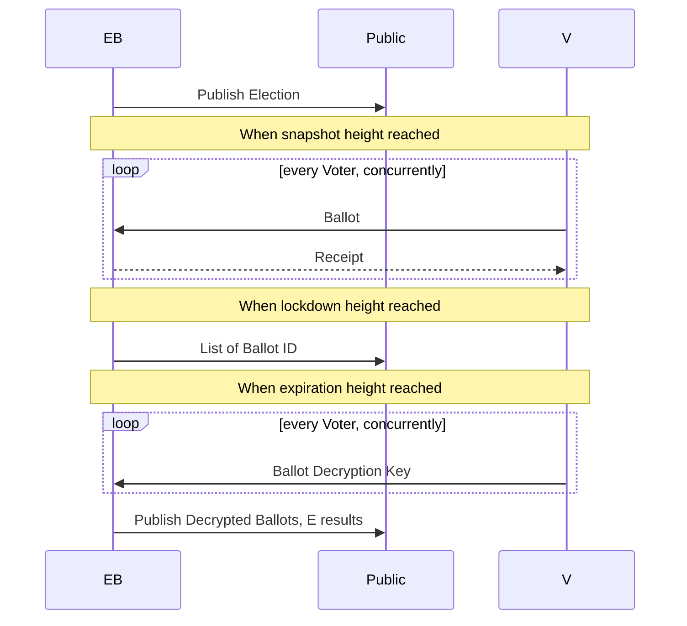

# Coin Voting

This ZIP describes a mechanism for the organization of
coin-weighted election. 

## Use Case

A person or organization, referred as the Election Board (EB)
decides to request the opinion of the zcash holders (ZH)
on a particular topic. The EB defines the parameters of the
referendum:
- when it starts (snapshot height) and stops (closing height)
- An optional lockdown period before it closes
- the question asked
- the criteria for aggregating the votes

They publically ask the ZH to participate by sending them ballots.
They verify and tally the votes following the aggregation method (typicall linear, but it could be quadratic or something else). Then they publish the outcome.

The final result of the election is a list of valid ballots that have:
- a value in ZEC
- a message

The content of the message depends on the type of referendum.
The acceptable options should be defined by EB. For example, for a 
yes/no question, it could simply be a value of 0 or 1.

The EB could decide to accept write-in votes too. The format of the 
message is not part of this ZIP.

The value of the ballot MUST be an amount of ZEC that the ZH
can spend at the snapshot height. 

The ZH is not obligated to vote with all the ZEC that they have.
But it MUST be impossible to use the same coins to vote
twice on the same election.

It MUST be possible to use the same ZEC on DIFFERENT elections.

**See Privacy section on important caveats regarding concurrent
voting.**

## Other Uses Cases

### Airdrop
This ZIP can be used to perform air-drops. An organization
that wants to give their tokens/coins based on an amount
of ZEC can organize an election. The ballots contain
the ZH's address where they want to receive the airdrop.

### Proof of Balance
In this case, the ZH sends an empty message because the
ballot value is all that matters.

# Requirements

## Participants / Actors

### Election Board

The Election Board (EB) is the entity in charge of organizing
the election (E). 
- The EB MUST have a website secured by https that clearly
reflects their identity. 
- They MUST make their announcements 
through their website. 
- The EB SHOULD have a forum for election related discussions
- The EB MUST set the election parameters described in a later
section
- The EB MUST publish the election parameters on their website
- The election parameters are immutable. If the EB
wants to make a modification, another election MUST be created

### Voter (ZH)

Anyone who has *spending authority* of ZEC 
(either transparent or shielded) can 
participate.

- Ballots MUST have a ZEC value
- Ballots MUST have a message in the format defined by the Election
- Ballots MUST include a proof of spending authority for the
amount specified, valid at the snapshot height
- Ballots MUST not prevent the ZH from spending the coins in a transaction
- Coins spent before the snapshot height MUST not be eligible for voting
- Voting MUST not disclose information that would allow someone 
to use the coins themselves (in a transaction or an election)
- Ballots MUST follow the format specified in the section Ballot
- ZEC held in transparent t3 addresses CANNOT be used. They introduce
most complexity and are not used much

Notes:
- Having coins on an exchange such as Binance, Bitfinex, etc.
does not allow you to vote because the coins are under their custody
- The EB MAY set special rules for the election. For example,
there MAY be a fee for casting a vote or a minimum ZEC requirement

## Privacy
:::danger
If the coins used for voting for a given election are not moved
before voting for another election, it is possible to link
the votes.
:::

1. Transparent inputs are in clear
1. Shielded inputs reveal their nullifier

The total value is also revealed since it is the weight
of the vote.

To mitigate this issue, the user SHOULD be offered to move
their coins after a vote. However, if multiple elections
are carried out concurrently with similar snapshot
heights, it will be impossible for a Voter to participate
in both without linking their votes.

A possible solution is suggested in 
[Air drops, Proof-of-Balance, and Stake-weighted Polling](https://hackmd.io/ujald5ElTMumppM7juk2WA?both)

Alternatively, homomorphic encryption could be used in
order to tally the votes without decrypting them individually.
However, this would be less flexible than the above.

## Workflow

The election E is carried in several sequential phases.

1. The EB publishes the E parameters and advertise the E
1. Each V prepares his/her ballot and send it to the EB
1. The EB returns a receipt to the V
1. The E enters a lockdown period
1. The E closes and the results are published



## Ballots

The message part of a Ballot is encrypted with the V key.
The decryption key is sent to the EB after the lockdown period.
The EB validates the ballot coin value and returns a receipt.
The Receipt contains a signature from the EB.

## Lockdown Period / Ballot List commitment
The lockdown period is optional but RECOMMENDED. 

It gives time for the Voters to check that their ballot is 
recorded by the EB publicly and that no additional ballots are
added after their opening.

If a V does not see their ballot on the list, they MUST
contact the EB and resolve the dispute. Their receipt
has the EB signature and proves the integrity of the ballot.
Failure to recognize a valid ballot is a serious breach
of trust.

## Counting

After the lockdown period, V MUST send their
decryption key to the EB. 

EB decrypts the vote and updates the tally.

Finally EB publishes the results for everyone to see.

The encrypted ballots and their decryption keys are published
for verification.

## Verification

- Check that the ballot hashes correspond to the ballot published
- For each ballot,
1. Check the validity of the signatures and the zkps
1. Compute the coin value
1. Decrypt the vote
1. Tally the vote weighted by the coin value

# Specifications

The communication uses binary messages in protobuf format.

## EB

- URL: 
    - MUST be https
    - MUST identify the organization
- Name
    - MUST be unique to organization
- start_height
- snapshot height
- lockdown height
- closing height
- the EB public key

Example:
```toml=
url = "https://election.methyl.cc"
name = "Test Election 2024"
start_height = 2397000
snapshot_height = 2462430
lockdown_height = 2460000
closing_height = 2460000
msg_size = 64
public= "788ff50468e2c095d97f8249e27eef3afe8a07712988a475583eb89494d64abe"
cmx_root = "063121a1fed23f154e18d9dfc70a13867f295207fd3c59d0e3f86615b857d332"
nf_root = "5341fe36634580cdf8862a106dab2cf7bd39f67d171a2877995babb435a5ee0e"
```

Only notes received and unspent between the start_height and the snapshot height
are eligible.

The start_height defaults to the Sapling activation height.

In addition, the EB MUST define a message in protobuf format.
The message MUST have a fixed size.

`public` is defined in the section Message Encryption

Example:
```proto
message BallotContent {
    uint8 candidate = 1;
}
```

From the E definition, the E domain is calculated as

`domain = Blake2b-256(b"Zcash_WCV_domain", E)`

The E domain is included in the ballot and ensures that 
ballots cannot be replayed.

## Ballot

```protobuf=
syntax = "proto3";
package proof_balance;
// Protobuf does not support fixed size arrays
// This type MUST be 32 byte-long
message b256 {
    bytes b = 1;
}

// A ballot is made of 2 parts, 
// the data part is non malleable and is used to calculate the sighash
// the witness part has the signatures and the zkp
message Ballot {
    BallotData data = 1;
    Witness witness = 2;
}

message Header {
    uint32 version = 1; // version = 1
    b256 domain = 2; // Election Domain
}

message BallotData {
    Header header = 1;
    TransparentData tdata = 2; // transparent inputs
    ShieldedData zdata = 3; // sapling inputs
    ShieldedData odata = 4; // orchard inputs
    EncMessage enc_message = 5; // encrypted vote
}

message EncMessage {
    bytes epk = 1;
    bytes data = 2;
    bytes tag = 3;
}

message Witness {
    TransparentWitness twitness = 1; // transparent sigs
    SaplingWitness zwitness = 2; // sapling sigs & zkp
    OrchardWitness owitness = 3; // orchard sigs & zkp
}

// Transparent Input, i.e UTXO
message TxIn {
    b256 txid = 1;    // prev txout
    uint32 vout = 2;  // index of the output
}

message TransparentData {
    repeated TxIn txin = 1;
}

// See section 7.3 and 7.5 of [protocol doc]
message Spend {
    b256 commitment_value = 1;
    b256 nullifier = 2;
    b256 rk = 3;
}

message ShieldedData {
    // b256 anchor = 1; // MUST be the anchor at snapshot height
    repeated Spend spends = 2;
    uint64 valuebalance = 3;
}

message Signature {
    bytes b = 1; // 64 bytes, r, s
}

message TransparentProof {
    b256 pk = 1;
    Signature signature = 2;
}

message TransparentWitness {
    repeated TransparentProof proofs = 1;
}

message SaplingSpendProof {
    bytes zkproof = 1; // 192 bytes
    Signature signature = 2;
}

message SaplingWitness {
    repeated SaplingSpendProof proofs = 1;
    Signature binding_signature = 2;
}

message OrchardWitness {
    repeated Signature signatures = 1;
    bytes zkproof = 2; // 2720 + 2272 * nOrchard
    Signature binding_signature = 3;
}

message ElectionId {
    string name = 1;
}

message ElectionInfo {
    string url = 1;
    string name = 2;
    uint32 start_height = 3;
    uint32 snapshot_height = 4;
    uint32 lockdown_height = 5;
    uint32 closing_height = 6;
    string pk = 7;
    uint32 msg_size = 8;
    bytes cmx_root = 9;
    bytes nf_root = 10;
}

message ProofDomain {
    bytes domain = 1;
}

message Proof {
    bytes cv = 1;
    bytes nullifier = 2;
    bytes rk = 3;
    bytes proof = 4;
}

```

### Ballot Hash / Sighash

For the signatures, the sighash is the blake2b-256
hash of the serialization of the ballot data (in protobuf 3)
with personalization string `Zcash_WCV___Hash`.

`hash = Blake2b-256("Zcash_WCVSigHash", BallotData)`.

## Message Encryption

The EB MUST sign the ballot sighash with a ed25519 signing key and return
a receipt as a bech32m encoded signature with hrp `pob-receipt-`

The Voter MUST add a message in the format specified by the EB.
The message is encrypted into EncMessage.
- epk is a 32 byte public key on x25519
- the Voter reveals his own ed25519 signing key after the vote closes
- the EB converts the key to a x25519 secret key
- the EB uses DH to calculate a shared key KA
- SymKey = Blake2b-256(KA, perso="Zcash_ProofBlnce")
- SymKey is used with Chacha20-Poly1305 to decrypt the message
- The tag MUST match the decrypted tag

Rationale: This design allows the use of ed25519 SSH keys for both Voter and EB.

:::warning
The Voter SHOULD not reuse the signing key!
:::


# POC

The POC is for a modified version specific to Orchard that uses
nullifiers scoped by elections.

## Poll/Election Setup

The EB (Election Board) generates an openssh ed25519 signing key

```bash=
openssl genpkey -algorithm ed25519 -out poller.pem
```

:::info
The key MAY be reused. It is used for signing ballot receipts.
It is RECOMMENDED to use a different key per election.
:::

The EB chooses a event properties

```toml=
url = "https://election.methyl.cc"
name = "Test Election 2024"
start_height = 2397000
snapshot_height = 2462430
lockdown_height = 2460000
closing_height = 2460000
msg_size = 64
public= "788ff50468e2c095d97f8249e27eef3afe8a07712988a475583eb89494d64abe"
cmx_root = "063121a1fed23f154e18d9dfc70a13867f295207fd3c59d0e3f86615b857d332"
nf_root = "5341fe36634580cdf8862a106dab2cf7bd39f67d171a2877995babb435a5ee0e"
```

The public key MUST match the EB signing key.

The `cmx_root` and `nf_root` are OPTIONAL but if present
MUST match the hashes calculated by building the reference data.

:::info
If the snapshot height is not in the past, it is impossible
to calculate the tree roots.
:::

The EB publishes the `election.toml` file so that voters can download it.

## Voter Send their Ballots

Once the snapshot height is reached and before the lockdown height,
voters can submit their vote.

They have to follow the steps:
- generate an openssh ed25519 key;
- download block data for the range from start height to snapshot height;
- build reference data, i.e. cmx and nf Merkle trees;
- copy their wallet file `zec.db` from Ywallet. The vote does not
have to use this wallet app as long as it has the note data:
    - d, pkd,
    - v,
    - rseed,
    - $\rho$, $\psi$
    - note position
- create the proof with a ballot message;
- submit the ballot to the EB;
- wait until the election reaches the closing height.

```
>> load-identity voter.pem
c76a89174ed64479c5f567b955ce27ce998568e72a044de80b0ebe748d826b3c
>> download https://lwd1.zcash-infra.com:9067
>> build-reference-data
Root cmxs: 5de18172c1c9d2a526a9c73067e75dfbe1ac4e774e1bfec9a31ee178db98a635
Root nfs: 12d4776996da7929255bccfcb21c99853d840c4008da547b113c4c857eec3d29
>> create-proof pob.bin 1 "Vote for BOB!"
5c70068567d0b8d52e4dcfc395a67dc83fd6bdf9c65a835b41d2bfeb776480fb
cmx anchor: 5de18172c1c9d2a526a9c73067e75dfbe1ac4e774e1bfec9a31ee178db98a635
nf  anchor: 12d4776996da7929255bccfcb21c99853d840c4008da547b113c4c857eec3d29
```

## EB Collects Votes

The EB collects votes and verifies the validity of the ZKP, spending
signatures and binding signature. It also checks that the root hashes
match and that the nullifiers are not used.

If everything is fine, the EB returns a receipt that is a 
signature on the sighash of the ballot.

```
>> load-identity poller.pem
3f8a41af400aa0197594a7b5c2e21bb6307753840a8513b28b816aad43fb30c0
>> init-db
>> verify-proof pob.bin
ZK Proof verified!
Spending Signature verified!
Binding Signature verified!
Verified 0.05000000 ZEC
Receipt: pob-receipt-1djsvezm3wep2ganwd4upzawxsgz60hq2e86cqkv4djmusut4fjzzvzu2ut5z3uda4eedvff6anlmzz3k48d7ugxsrs0gxfn36nscvqqzn4js8
```

At this point, the ballot is verified and its amount can be accounted
for but the vote payload is not revealed.

:::info
The EB publishes the ballot hashes and receipts on their website.
:::

## Opening Votes

Voters uploads their signing key to the EB.

```
>> load-identity voter.pem
c76a89174ed64479c5f567b955ce27ce998568e72a044de80b0ebe748d826b3c
>> open-proof pob.bin
5c70068567d0b8d52e4dcfc395a67dc83fd6bdf9c65a835b41d2bfeb776480fb
Decrypted message: Vote for BOB!
```

:::info
The EB counts the votes and publishes the results
:::

## Audit

:::info
The EB publishes all ballots and their opening keys for verification
by auditors.
:::
