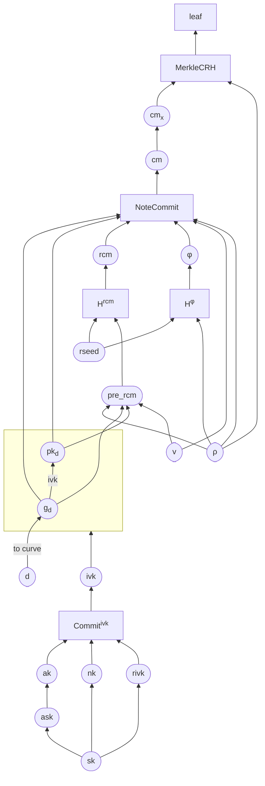

    ZIP: XXX
    Title: Post-quantum resilience for v6 notes
    Owners: Daira-Emma Hopwood <daira-emma@electriccoin.co>
            Jack Grigg <jack@electriccoin.co>
    Credits: Sean Bowe
    Status: Draft
    Category: Consensus
    Created: 2025-03-31
    License: MIT
    Pull-Request: <https://github.com/zcash/zips/pull/???>

# Terminology

The key words "MUST", "SHOULD", and "MAY" in this document are to be interpreted as described in BCP 14 [^BCP14]
when, and only when, they appear in all capitals.

The terms "Mainnet" and "Testnet" in this document are to be interpreted as defined in the Zcash protocol
specification [^protocol-networks].

# Abstract

This ZIP proposes a change to the construction of Sapling and Orchard notes that is intended to support
a smoother transition to future versions of Zcash designed to be secure against discrete-log-breaking
adversaries, including adversaries using quantum computers.

Specifically, if it were necessary to disable the Sapling and/or Orchard shielded protocols in order to
ensure balance preservation and prevent a discrete-log-breaking adversary from stealing funds, this
change would make it possible to spend existing notes via an alternative spending protocol. This
alternative protocol is expected to remain secure against discrete-log-breaking and quantum adversaries.

# Motivation

If quantum computers (or any other attack that allows finding discrete logarithms on the elliptic curves
used in Zcash) were to become practical in the near future, it would raise difficult issues for the Zcash
community. An adversary able to compute discrete logarithms could cause arbitrary inflation or steal
funds.

Critically, the note commitment algorithms used by the Sapling and Orchard shielded protocols are not
post-quantum binding. This means that even if the proof system were upgraded to one that is believed
to be secure against quantum computers, and even if the note commitment tree were to be reconstructed
(from public information) to use a post-quantum collision-resistant hash function, it would still be
possible for a quantum or discrete-log-breaking adversary to forge and spend notes that are not actually
in the commitment tree — thus breaking the Balance property.

This ZIP proposes a small change to the way notes are derived, to allow them to be spent safely in a
future protocol using post-quantum cryptography. This would not require any change to the Sapling,
Orchard, or proposed OrchardZSA circuits for the time being, and would not require deciding on the
particular proof system or note commitment tree hash used in the future protocol.

If this change is made well in advance of quantum computers becoming viable, then users' Sapling (if
still supported at the time) and/or Orchard funds could remain safe and potentially spendable after a
post-quantum transition. This would involve the post-quantum protocol checking a more expensive and
complicated statement in zero knowledge, but it is expected that this will be entirely practical for
future proof systems. The current privacy properties of Sapling and Orchard would be retained against
pre-quantum attackers, and also against post-quantum attackers without knowledge of the notes' addresses.

This proposal is implementable at low risk and with minimal changes to existing libraries and wallets.
It can be folded into other changes necessary to implement ZSAs [^zip-0226] and Memo Bundles [^zip-0231].

# Requirements

* Notes constructed according to this proposal should be spendable via an alternate protocol
  (to be introduced, potentially, in a future upgrade) that is expected to be secure against
  discrete-log-breaking and quantum adversaries.
* No particular choice of post-quantum proving system or commitment tree hash should be assumed for
  that alternate protocol.

# Non-requirements

* It is not required to address discrete-log-breaking or quantum attacks on *privacy* with this
  proposal, as long as it does not cause any regression in privacy properties.
* It is not required to add support for the alternate spending protocol to consensus rules now.

# Background

This section is written for cryptologists and protocol designers familiar with the Zcash shielded
protocols and having some background in post-quantum cryptography. It is recommended to first
read [^zcash-security-slides] and/or watch [^zcash-security-video] the author's presentation on
Understanding Zcash Security at Zcon3.

Let us consider the security of the Orchard protocol against a discrete-log-breaking adversary.

$\mathsf{NoteCommit^{Orchard}}$ is not binding against such an adversary: given the discrete log
relations between bases, we can easily write a linear equation in the scalar field with multiple solutions
of the inputs for a given commitment.

In particular, if ...

Similarly, $\mathsf{Commit^{ivk}}$ is not post-quantum binding.

# Specification

## ...

The idea is that, without changing the currently specified OrchardZSA protocol, we can make sure that notes created from now on will remain spendable after we switch off the pre-quantum Orchard protocol. (It might also be possible to do this for Sapling but I haven't looked at that yet.)

Problem: neither $\mathsf{NoteCommit}$ nor $\mathsf{Commit^{ivk}}$ are post-quantum binding.

However, we can work around this by modifying the definition of $\mathsf{pre\_rcm}$ for v6 transactions, so that $\mathsf{rcm}$ and $\mathsf{cm}$ become pq-{binding, hiding} commitments to $(\mathsf{g_d}, \mathsf{pk_d}, \mathsf{v}, [\mathsf{AssetBase},\!]\, \text{ρ})$ randomized by $\mathsf{rseed}$. Then we check the derivations of $\mathsf{rcm}$ and $\text{φ}$ in the circuit.

When we rehash the commitment tree using a pq-collision-resistant hash instead of Sinsemilla, we will include both $\text{ρ}$ and $\mathsf{cm}_x$ for each note (i.e. what is currently the leaf layer becomes $\mathsf{MerkleCRH}(\text{ρ}, \mathsf{cm}_x)$ where $\mathsf{MerkleCRH}$ is pq-collision-resistant). This change might not be necessary; it just removes potential complications due to duplicate commitments for the same note.

Define:

* $\mathsf{H^{rcm}}(\mathsf{rseed}, \text{ρ}, \mathsf{g_d}, \mathsf{pk_d}, \mathsf{v}) = \mathsf{ToScalar^{Orchard}}(\mathsf{PRF^{expand}_{rseed}}(\mathsf{pre\_rcm}))$ where $\mathsf{pre\_rcm} = [5] \,||\, \mathsf{I2LEOSP}_{256}(\text{ρ}) \,||\, \mathsf{LEBS2OSP}_{256}(\mathsf{repr}_{\mathbb{P}}(\mathsf{g_d})) \,||\, \mathsf{LEBS2OSP}_{256}(\mathsf{repr}_{\mathbb{P}}(\mathsf{pk_d})) \,||\, \mathsf{I2LEOSP}_{64}(\mathsf{v})$
* $\mathsf{H^{φ}}(\mathsf{rseed}, \text{ρ}) = \mathsf{ToBase^{Orchard}}(\mathsf{PRF^{expand}_{rseed}}([9] \,||\, \mathsf{I2LEOSP}_{256}(\text{ρ})))$
* $\mathcal{G}^{\mathsf{Orchard}} = \mathsf{GroupHash}^{\mathbb{P}}(\texttt{“z.cash:Orchard”}, \texttt{“G”})$

The post-quantum spending statement will be:

$$
\begin{array}{l}
\{\; (\mathsf{sk}, \mathsf{rpq}, \mathsf{g_d}, \mathsf{v}, \text{ρ}, \mathsf{path}) : \\
\hphantom{\wedge\;}
         \text{let } \mathsf{ask} = \mathsf{ToScalar^{Orchard}}(\mathsf{PRF^{expand}_{sk}}([6])) \\
\wedge\; \text{let } \mathsf{nk} = \mathsf{ToBase^{Orchard}}(\mathsf{PRF^{expand}_{sk}}([7])) \\
\wedge\; \text{let } \mathsf{rivk} = \mathsf{ToScalar^{Orchard}}(\mathsf{PRF^{expand}_{sk}}([8])) \\
\wedge\; \mathsf{ask} \neq 0 \\
\wedge\; \text{let } \mathsf{ak} = \mathsf{Extract}^{\mathbb{P}}([\mathsf{ask}]\, \mathcal{G}^{\mathsf{Orchard}}) \\
\wedge\; \text{let } \mathsf{ivk} = \mathsf{Commit^{ivk}_{rivk}}(\mathsf{ak}, \mathsf{nk}) \\
\wedge\; \mathsf{ivk} \not\in \{0, \bot\} \\
\wedge\; \text{let } \mathsf{pk_d} = [\mathsf{ivk}]\, \mathsf{g_d} \\
\wedge\; \text{let } \mathsf{rcm} = \mathsf{H^{rcm}}(\mathsf{rseed}, \text{ρ}, \mathsf{g_d}, \mathsf{pk_d}, \mathsf{v}) \\
\wedge\; \text{let } \text{φ} = \mathsf{H^{φ}}(\mathsf{rseed}, \text{ρ}) \\
\wedge\; \text{let } \mathsf{cm} = \mathsf{NoteCommit^{Orchard}_{rcm}}(\mathsf{repr}_{\mathbb{P}}(\mathsf{g_d}), \mathsf{repr}_{\mathbb{P}}(\mathsf{pk_d}), \mathsf{v}, \text{ρ}, \text{φ}) \\
\wedge\; \mathsf{cm} \neq \bot \\
\wedge\; \text{let } \mathsf{cm}_x = \mathsf{Extract}^{\mathbb{P}}(\mathsf{cm}) \\
\wedge\; \text{let } \mathsf{leaf} = \mathsf{MerkleCRH}(\mathsf{cm}_x, \text{ρ}) \\
\wedge\; \mathsf{path} \text{ is a path to } \mathsf{leaf} \text{ in the rehashed commitment tree} \\
\wedge\; \mathsf{nf} = \mathsf{DeriveNullifier_{nk}}(\text{ρ}, \text{φ}, \mathsf{cm}) \text{ is the revealed nullifier} \\
\}
\end{array}
$$

(We don't need to check the derivation of $\mathsf{g_d}$ from $\mathsf{d}$.)

### Cost

* 5 uses of $\mathsf{PRF^{expand}}$, with a total of 6 BLAKE2b-512 input blocks
  * It's slightly annoying that $\mathsf{H^{rcm}}$ requires two input blocks.
* 1 use of $\mathsf{Commit^{ivk}}$ ($\mathsf{SinsemillaShortCommit}$)
* 1 use of $\mathsf{NoteCommit^{Orchard}}$ ($\mathsf{SinsemillaCommit}$)
* 1 full-width fixed-base Pallas scalar multiplication, $[\mathsf{ask}]\, \mathcal{G}^{\mathsf{Orchard}}$
* 1 full-width variable-base Pallas scalar multiplication, $[\mathsf{ivk}]\, \mathsf{g_d}$
* 1 Merkle tree path check
* 1 additional use of $\mathsf{MerkleCRH}$ to compute $\mathsf{leaf}$.

The expensive parts of this are the 6 BLAKE2b compressions.

## Informal Security Argument

The argument is that if $\mathsf{H^rcm}$ and $\mathsf{H^{φ}}$ are random oracles, $\mathsf{rcm}$ is an unpredictable function of the note fields. There are two values of $\mathsf{cm}$ that match $\mathsf{cm}_x$ in their $x$-coordinate. Because the output of $\mathsf{NoteCommit^{Orchard}}$ is of the form $\mathsf{cm} = F(\mathsf{note}) + [\mathsf{rcm}]\, \mathcal{R}$, for any given note we have exactly two values of $\mathsf{rcm}$ that will pass the commitment check.

Suppose there are $N$ legitimate notes in the tree. In an attack where the adversary is trying to find a note that will pass the commitment check without actually being a note in the tree, they succeed with probability $2N/r_{\mathbb{P}}$ per attempt where $r_{\mathbb{P}}$ is the order of the Pallas curve, and that is negligible because $N \leq 2^{32} \ll r_{\mathbb{P}}$.

We're not finished yet because we also have to prove that the nullifier is computed deterministically for a given note.

All of the inputs to $\mathsf{DeriveNullifier}$ are things we committed to in the protocol so far *except* $\mathsf{nk}$. By the same argument used pre-quantumly, there is only one $\mathsf{ivk}$ for a given $(\mathsf{g_d}, \mathsf{pk_d})$. So in order to just use the existing protocol for this part, we would need to prove that there is only one $\mathsf{nk}$ such that $\mathsf{Commit^{ivk}_{rivk}}(\mathsf{ak}, \mathsf{nk}) = \mathsf{ivk}$. Unfortunately that's not true; $\mathsf{Commit^{ivk}}$ is instantiated by $\mathsf{SinsemillaShortCommit}$ which is not post-quantum binding.

Instead, the spender must prove knowledge of $\mathsf{sk}$, and that $\mathsf{ak}$, $\mathsf{nk}$, and $\mathsf{rivk}$ are derived correctly from $\mathsf{sk}$. This works because the derivations use post-quantum hashes (and $\mathsf{ask} \rightarrow \mathsf{ak}$ is deterministic). In particular, $\mathsf{ivk}$ is essentially a random function of $\mathsf{sk}$, and so we expect that an adversary has no better attack than to guess values of $\mathsf{sk}$ until they hit one that reproduces a given $\mathsf{ivk}$. Since $\mathsf{ivk}$ must be an $x$-coordinate of a Pallas curve point (see the note at the end of [§ 4.2.3 Orchard Key Components](https://zips.z.cash/protocol/protocol.pdf#orchardkeycomponents)), it can take on $(r_{\mathbb{P}}-1)/2$ values, so if there are $T$ targets the success probability for each attempt is $2T/(r_{\mathbb{P}}-1)$, which is negligible provided that $T \ll r_{\mathbb{P}}$.

## Deployment

As far as I'm aware, all existing Zcash wallets already derive $(\mathsf{ak}, \mathsf{nk}, \mathsf{rivk})$ from a spending key $\mathsf{sk}$ in the way specified in [§ 4.2.3 Orchard Key Components](https://zips.z.cash/protocol/protocol.pdf#orchardkeycomponents) and assumed by this protocol.

The part of the protocol that is new is the different input for $\mathsf{pre\_rcm}$. It would have been possible to use a separate pq-binding commitment, but $\mathsf{H^rcm}$ is already pq-binding and so doing it this way involves fewer components. This also allows us to avoid any security compromise and use 256-bit cryptovalues for both integrity and randomization, which would otherwise have been difficult.

I suggest to deploy this change with v6 transactions. That is, every shielded output of a v6-onward transaction will be a pq-resilient note. This implies that when we turn off the pre-quantum protocol, we burn v5 and earlier outputs. Since v6 already changes the note encryption (in order to support memo bundles), this approach to deployment reduces the risk of the kind of mess that happened with [ZIP 212](https://zips.z.cash/zip-0212), where some wallets were following the old protocol after the Canopy upgrade and sending non-conformant note plaintexts.

When a compliant wallet receives a note in a v5 transaction, the associated funds are not pq-resilient and need to be spent to v6 in order to make them so.

Note: if we prioritize spending non-pq-resilient notes, it is conceivable that an adversary could exploit this to improve [arity leakage attacks](https://github.com/zcash/zcash/issues/4332). On the other hand, adversaries can already choose note values to manipulate the note selection algorithm to some extent.

# References

[^BCP14]: [Information on BCP 14 — "RFC 2119: Key words for use in RFCs to Indicate Requirement Levels" and "RFC 8174: Ambiguity of Uppercase vs Lowercase in RFC 2119 Key Words"](https://www.rfc-editor.org/info/bcp14)

[^protocol]: [Zcash Protocol Specification, Version 2024.5.1 or later](protocol/protocol.pdf)

[^protocol-networks]: [Zcash Protocol Specification, Version 2024.5.1. Section 3.12: Mainnet and Testnet](protocol/protocol.pdf#networks)

[^zip-0226]: [ZIP 226: Transfer and Burn of Zcash Shielded Assets](zip-0226.rst)

[^zip-0230]: [ZIP 230: Version 6 Transaction Format](zip-0230.rst)

[^zip-0231]: [ZIP 231: Memo Bundles](zip-0231.rst)
