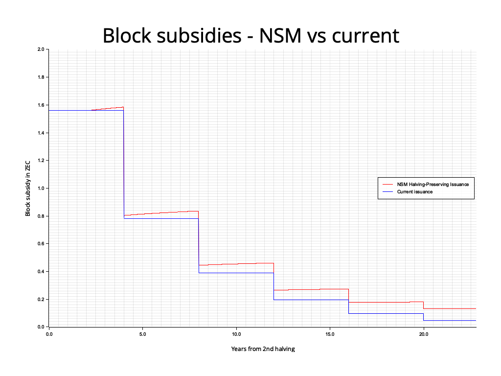
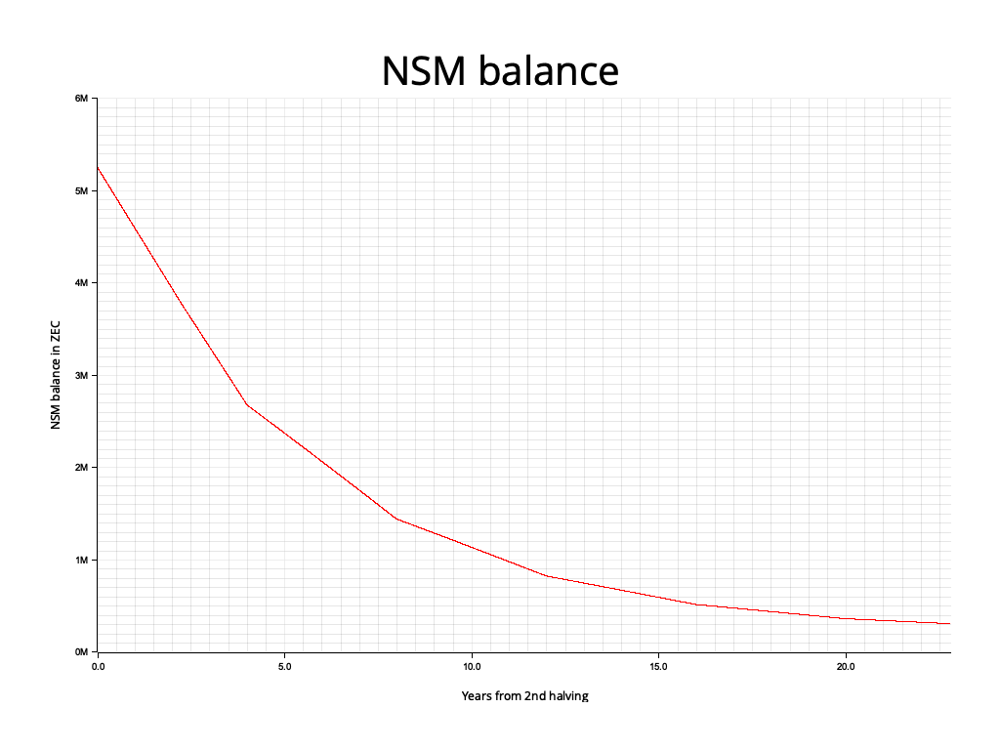

```
ZIP: unassigned
Title: Network Sustainability Mechanism: Halving-Preserving Issuance
Owners: Judah Caruso <judah@shieldedlabs.net>
Original-Authors: Nathan Wilcox
                  Jason McGee
                  Zooko Wilcox
                  Mark Henderson
                  Tomek Piotrowski
                  Mariusz Pilarek
                  Paul Dann
Credits: Conrado Gouvea
Status: Draft
Category: Consensus
Created: 2026-08-19
License: BSD-2-Clause
Discussions-To: <https://github.com/zcash/zips/issues/1353>
```


# Terminology

The key words "MUST" and "MUST NOT" in this document are to be interpreted as
described in BCP 14 [^BCP14] when, and only when, they appear in all capitals.

The term "network upgrade" in this document is to be interpreted as described
in ZIP 200. [^zip-0200]

The character § is used when referring to sections of the Zcash Protocol
Specification. [^protocol]

The terms "Mainnet" and "Testnet" are to be interpreted as described in
§ 3.12 ‘Mainnet and Testnet’. [^protocol-networks]

The symbol "$\,\cdot\,$" means multiplication, as described in § 2 ‘Notation’.
[^protocol-notation]

"ZEC/TAZ" refers to the native currency of Zcash on a given network, i.e.
ZEC on Mainnet and TAZ on Testnet.

The terms "Block Subsidy" and "Issuance" are to be interpreted as described in
ZIP 233. [^zip-0233]

Let $\mathsf{PostBlossomHalvingInterval}$ be as defined in [^protocol-diffadjustment].

$\mathsf{MAX\_MONEY}$, as defined in § 5.3 ‘Constants’ [^protocol-constants],
is the total ZEC/TAZ supply cap measured in zatoshi, corresponding to
21,000,000 ZEC. This is slightly larger than the supply cap for the current
issuance mechanism, but is the value used in existing critical consensus
checks.

"Issued Supply" - The Issued Supply at a given height of a block chain is
the total ZEC/TAZ value in all chain value pool balances at that height, as
calculated by $\mathsf{IssuedSupply}(\mathsf{height})$ defined in
§ 4.17 ‘Chain Value Pool Balances’. [^protocol-chainvaluepoolbalances]

"Money Reserve" - The Money Reserve at a given height of a block chain is
the total ZEC/TAZ value remaining to be issued, as calculated by
$\mathsf{MAX\_MONEY} - \mathsf{IssuedSupply}(\mathsf{height})$.

$\mathsf{LegacyBlockSubsidy}(\mathsf{height})$ is the block subsidy as calculated
by the rules in force before this ZIP, i.e. $\mathsf{BlockSubsidy}(\mathsf{height})$
as defined in § 7.8 ‘Calculating Block Subsidy, Funding Streams, Lockbox
Disbursement, and Founders' Reward’ [^protocol-subsidies] prior to this change.

"Expected Issued Supply" - The Issued Supply that the current rules would have
produced had every block subsidy been claimed in full and no ZEC/TAZ been
removed from circulation:
$\mathsf{ExpectedIssuedSupply}(\mathsf{height}) = \sum_{i=0}^{\mathsf{height}} \mathsf{LegacyBlockSubsidy}(i)$.

"Deficit" - The part of the Money Reserve that the current rules would already
have issued:
$\mathsf{Deficit}(\mathsf{height}) = \mathsf{max}(0,\ \mathsf{ExpectedIssuedSupply}(\mathsf{height}) - \mathsf{IssuedSupply}(\mathsf{height}))$.


# Abstract

This ZIP proposes a change to how nodes calculate the block subsidy.

The step function around the 4-year halving intervals inherited from Bitcoin
is retained unchanged. In addition, each block issues a fixed portion of the
current value of the Deficit — the ZEC/TAZ that the current rules would already
have issued but which has been removed from circulation — so that such funds
are reissued along a smooth curve on top of the existing schedule.

The new issuance scheme is identical to the current issuance whenever no
ZEC/TAZ has been removed from circulation or left unclaimed, and retains the
overall supply cap of `MAX_MONEY`. It is proposed as an alternative to ZIP 234 [^zip-0234], from
which its structure and much of its text are adapted.


# Motivation

The current block reward halving schedule is fixed and does not provide a way
to “recycle” funds removed from circulation via ZIP-233 into future issuance.
Once scheduled issuance ends, the network becomes reliant on transaction fees
for the security budget.

Key Objectives:

1. We want to introduce an automated mechanism that allows users of the network
   to contribute to the long-term sustainability of the network.
2. We want to enable ZEC that has been removed from circulation to be reissued
   in the future to benefit network sustainability.
3. We want to retain the existing ZEC supply cap of 21 million.
4. We want the issuance rate to remain identical to the historical rate for
   Zcash (and before that, Bitcoin), including the 4-year halving structure,
   whenever no ZEC/TAZ has been removed from circulation.
5. We want issuance to be easy for all network users to understand and predict.
6. We want the new issuance to activate at a block with as minimal a delta from
   the current issuance as possible.
7. We want to preserve Zcash's existing 4-year halving schedule; this ZIP is a
   variation of ZIP 234 [^zip-0234] that differs only in that respect.

This NSM-based issuance scheme preserves the core aspects of Zcash's issuance
policy, the halving schedule, and the 21-million-coin cap. Critically,
it establishes the intended path for ZEC that has been voluntarily removed from
circulation, as well as transaction fees that are deliberately redirected into
the reserve: these funds are automatically and algorithmically reissued over
future block subsidies, ensuring they benefit the network's long-term security.

# Requirements

Reissuing funds removed from circulation while preserving halvings is possible
using an exponential decay formula applied to the Deficit that satisfies the
following requirements:

1. The issuance can be summarized into a reasonably simple explanation.
2. If no ZEC is removed from circulation (and every subsidy is claimed in
   full), block subsidies are identical to the current issuance.
3. If the Deficit is greater than 0, then the additional block subsidy must be
   non-zero, so that funds removed from circulation are eventually fully
   reissued.
4. For any 4-year period, the additional block subsidies paid out are
   approximately equal to half of the Deficit at the beginning of that 4-year
   period, if no ZEC is removed from circulation during those 4 years.
5. Decrease the short-term impact of the deployment of this ZIP on block subsidy
   recipients, and minimize the potential reputation risk to Zcash of changing
   the block subsidy amount.
6. The immediate change in issuance when this mechanism activates should be
   minimal.

# Specification

## Parameters

$\mathsf{BLOCK\_SUBSIDY\_FRACTION} = 4126 / 10\_000\_000\_000 = 0.0000004126$

$\mathsf{DEPLOYMENT\_BLOCK\_HEIGHT} = \mathsf{TBD}$ (the NU7 activation height)

$\mathsf{DeficitAfter}(\mathsf{height}) =$ The value of the Deficit after the
specified block height.

## Issuance Calculation

At the $\mathsf{DEPLOYMENT\_BLOCK\_HEIGHT}$, nodes MUST switch from the current issuance
calculation, to the following:

$\mathsf{BlockSubsidy}(\mathsf{height}) = \mathsf{LegacyBlockSubsidy}(\mathsf{height}) + \mathsf{ceiling}(\mathsf{BLOCK\_SUBSIDY\_FRACTION} \cdot \mathsf{DeficitAfter}(\mathsf{height} - 1))$

## Applicability

All of these changes apply identically to Mainnet and Testnet.


# Rationale

* Leaving the current schedule in place and applying an exponential decay
  function only to the Deficit satisfies **Requirements 1**, **2** and **4**
  above.
* We round up to the next zatoshi to satisfy **Requirement 3** above. Since
  $\mathsf{BLOCK\_SUBSIDY\_FRACTION} < 1$, the additional subsidy never exceeds
  the Deficit, so the supply cap is preserved.
* The issuance formula depends only on `DeficitAfter(height - 1)` (derived from
  the Issued Supply and the height) and a single constant fraction, making it
  simple to implement, explain, and verify.

## Parameters

Because the formula reduces to the current subsidy whenever the Deficit is
zero, activation can occur at any height with no jump in issuance other than
the reissuance of funds removed from circulation before activation (Key
Objective 6), so no special activation height is needed. That jump equals the
amount removed times $\mathsf{BLOCK\_SUBSIDY\_FRACTION}$. For example, if a
total of 100,000 ZEC were removed from circulation prior to activation, then
at activation the issuance would be larger than BTC-style issuance by
$100\_000\textsf{ ZEC} \cdot \mathsf{BLOCK\_SUBSIDY\_FRACTION}$, which we
calculate equals $0.04126$ ZEC. This example is chosen to demonstrate that a
very large amount removed from circulation (much larger than expected) would
elevate issuance by a relatively small amount.

On Mainnet the Deficit also includes approximately 365 ZEC of historically
unclaimed block subsidy (TODO for ZIP owner: confirm from a full node), which
is reissued from activation at an initial rate of about 0.00015 ZEC per block.

## BLOCK_SUBSIDY_FRACTION

Let $\mathsf{IntendedMoneyReserveFractionRemainingAfterFourYears} = 0.5$.

The value $4126 / 10\_000\_000\_000$ satisfies the approximation within $\pm 0.002\%$:

$(1 - \mathsf{BLOCK\_SUBSIDY\_FRACTION})^\mathsf{PostBlossomHalvingInterval} \approx \mathsf{IntendedMoneyReserveFractionRemainingAfterFourYears}$

This implies that after a period of 4 years around half of the Deficit will
have been issued as additional block subsidies, thus satisfying **Requirement 4**.

The largest possible value of the Deficit is less than $\mathsf{MAX\_MONEY}$, in
the theoretically possible case that all issued funds are removed from
circulation. If this happened, the largest interim sum in the block subsidy
calculation would be less than $\mathsf{MAX\_MONEY} \cdot 4126 / 10\_000\_000\_000$.

This uses at most 62.91 bits, which is just under the 63-bit limit for signed
two's complement 64-bit integer amount types.

The numerator could be brought closer to the limit by using a larger
denominator, but the difference in the amount issued would be very small. So we
chose a power-of-10 denominator for simplicity.

## Visualization of the Halving-Preserving Curve

The following graph compares issuance for the current halving-based step
function vs this ZIP, assuming 100 ZEC per day is removed from circulation
from activation (assumed at height 3,687,123 for illustration). With no
removals (and every subsidy claimed in full) the two lines coincide.



The graph below shows the balance of the Money Reserve assuming this ZIP is
implemented, under the same removal schedule.




# Appendix: Simulation

A [fork](https://github.com/ShieldedLabs/zsf-simulator/tree/halving-preserving-issuance)
of the [NSM Simulator](https://github.com/eigerco/zsf-simulator) allows us to
simulate the effects of this ZIP on the Money Reserve and the block subsidy, as
well as generate plots like the ones above. Assuming that 100 ZEC per day is
removed from circulation from activation, this fragment of its output:

```
Halving  3 at block  4406400:
  NSM subsidies:    138028653049305 (~ 1380286.530 ZEC, 0.80365268 to 0.83585478 ZEC per block)
  legacy subsidies: 131250000000000 (~ 1312500.000 ZEC, 0.78125000 ZEC per block)
  difference:         6778653049305 (~   67786.530 ZEC),         NSM/legacy: 1.0516
  removed in period: 14583333333333 (~  145833.333 ZEC)
```

shows that the difference between this and the current issuance scheme during
the first full halving period after activation consists of the reissuance of
funds removed from circulation; with no ZEC removed (and every subsidy claimed in
full) the difference is exactly 0 at every height.


# Appendix: Considerations for the Future

Future protocol changes may not increase the payout rate of the Deficit to a
reasonable approximation beyond the four year half-life constraint.


# Deployment

This ZIP is proposed to activate with Network Upgrade 7. [^draft-arya-deploy-nu7]
It MUST be deployed at the same time or after ZIP 233 ("NSM: Removing Funds From
Circulation" [^zip-0233]), and MUST NOT be deployed together with ZIP 234.
[^zip-0234]


# References

[^BCP14]: [Information on BCP 14 — "RFC 2119: Key words for use in RFCs to Indicate Requirement Levels" and "RFC 8174: Ambiguity of Uppercase vs Lowercase in RFC 2119 Key Words"](https://www.rfc-editor.org/info/bcp14)

[^protocol]: [Zcash Protocol Specification, Version 2025.6.2 [NU6.1] or later](protocol/protocol.pdf)

[^protocol-notation]: [Zcash Protocol Specification, Version 2025.6.2 [NU6.1]. Section 2: Notation](protocol/protocol.pdf#notation)

[^protocol-networks]: [Zcash Protocol Specification, Version 2025.6.2 [NU6.1]. Section 3.12: Mainnet and Testnet](protocol/protocol.pdf#networks)

[^protocol-chainvaluepoolbalances]: [Zcash Protocol Specification, Version 2025.6.2 [NU6.1]. Section 4.17 Chain Value Pool Balances](protocol/protocol.pdf#chainvaluepoolbalances)

[^protocol-constants]: [Zcash Protocol Specification, Version 2025.6.2 [NU6.1]. Section 5.3: Constants](protocol/protocol.pdf#constants)

[^protocol-diffadjustment]: [Zcash Protocol Specification, Version 2025.6.2 [NU6.1]. Section 7.7.3 Difficulty Adjustment](protocol/protocol.pdf#diffadjustment)

[^protocol-subsidies]: [Zcash Protocol Specification, Version 2025.6.2 [NU6.1]. Section 7.8: Calculating Block Subsidy, Funding Streams, Lockbox Disbursement, and Founders' Reward](protocol/protocol.pdf#subsidies)

[^zip-0200]: [ZIP 200: Network Upgrade Mechanism](zip-0200.rst)

[^zip-0233]: [ZIP 233: Network Sustainability Mechanism: Removing Funds From Circulation](zip-0233.md)

[^zip-0234]: [ZIP 234: Network Sustainability Mechanism: Issuance Smoothing](zip-0234.md)

[^draft-arya-deploy-nu7]: [draft-arya-deploy-nu7: Deployment of the NU7 Network Upgrade](draft-arya-deploy-nu7.md)
