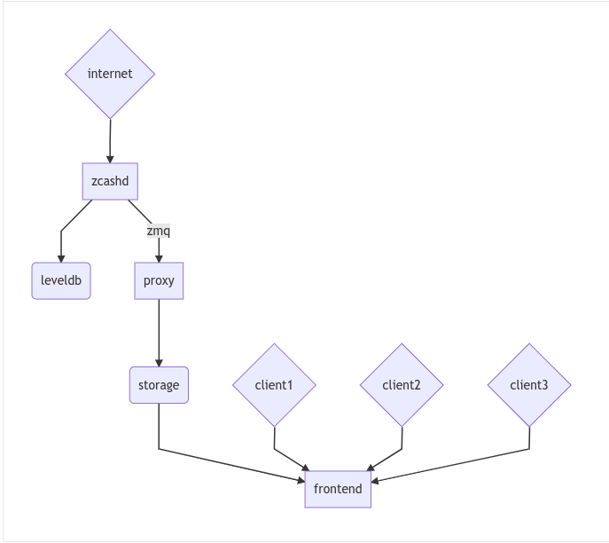

::

  ZIP: 307
  Title: Light Client Protocol for Payment Detection
  Owners: Jack Grigg <jack@electriccoin.co>
          Daira-Emma Hopwood <daira-emma@electriccoin.co>
  Original-Authors: George Tankersley
  Credits: Matthew Green
  Category: Standards / Ecosystem
  Status: Draft
  Created: 2018-09-17
  License: MIT


Terminology
===========

The key words "MUST", "SHOULD", and "MAY" in this document are to be interpreted as
described in BCP 14 [#BCP14]_ when, and only when, they appear in all capitals.

The terms below are to be interpreted as follows:

Light client
  A client that is not a full participant in the network of Zcash peers. It can send and
  receive payments, but does not store or validate a copy of the block chain.

Abstract
========

This proposal defines a protocol for a Zcash light client supporting Sapling shielded
transactions.

Motivation
==========

Currently a client that wishes to send or receive shielded payments must be a full node
participanting in the Zcash network. This requires an amount of available bandwidth,
space, and processing power that may be unsuitable for some classes of user. This light
client protocol addresses that need, and is appropriate for low-power,
bandwidth-conscious, or otherwise limited machines (such as mobile phones).

High-Level Design
=================

There are three logical components to a Zcash light client system:

- **Zcash node** that provides chain state and serves as a root of trust for the system.

- **Proxy server** that extracts block chain data from zcashd to store and serve it in a
  lower-bandwidth format.

- **Light client** that subscribes to the stream from a proxy server and uses that data to
  update its own view of the chain state. The light client MAY be attached to a wallet
  backend that will track particular Sapling notes.



    Outline of the light wallet architecture

Security Model
==============

In this model, we propose **payment detection privacy** as our main security goal. That
is, the proxy should not learn which transactions (received from the block chain) are
addressed to a given light wallet. If we further assume network privacy (via Tor or
similar), the proxy should not be able to link different connections or queries as
deriving from the the same wallet.

In particular, the underlying Zcash node / proxy combination is assumed to be "honest but
curious" and is trusted to provide a correct view of the current best chain state and to
faithfully transmit queries and responses.

This ZIP does not address how to spend notes privately.

Compact Stream Format
=====================

A key observation in this protocol is that the current zcashd encrypted field is several
hundred bytes long, due to the inclusion of a transaction “memo”. The need to download
this entire field imposes a substantial bandwidth cost on each light wallets, which may be
a limited mobile device on a restricted-bandwidth plan. While more efficient techniques
can be developed in the future, for the moment we propose ignoring the memo field during
payment detection. Futhermore, we can also ignore any information that is not directly
relevant to a Sapling shielded transaction.

A **compact block** is a packaging of ONLY the data from a block needed to:

1. Detect a payment to your shielded Sapling address
2. Detect a spend of your shielded Sapling notes
3. Update your witnesses to generate new Sapling spend proofs.

A compact block and its component compact transactions are encoded on the wire using the
following Protocol Buffers [#protocolbuffers]_ format:

.. code:: proto

    message BlockID {
         uint64 blockHeight = 1;
         bytes blockHash = 2;
    }

    message CompactBlock {
        BlockID id = 1;
        repeated CompactTx vtx = 3;
    }

    message CompactTx {
        uint64 txIndex = 1;
        bytes txHash = 2;

        repeated CompactSpend spends = 3;
        repeated CompactOutput outputs = 4;
    }

    message CompactSpend {
        bytes nf = 1;
    }

    message CompactOutput {
        bytes cmu = 1;
        bytes epk = 2;
        bytes ciphertext = 3;
    }

Encoding Details
----------------

``blockHash``, ``txHash``, ``nf``, ``cmu``, and ``epk`` are encoded as
specified in the Zcash Protocol Spec.

The output and spend descriptions are handled differently, as described in the following
sections.

Output Compression
------------------

In the normal Zcash protocol, the output ciphertext consists of the AEAD-encrypted form of
a *note plaintext* [#protocol-notept]_:

+------------+----------+----------+---------------+-----------------------------------+
| 8-bit 0x01 | 88-bit d | 64-bit v | 256-bit rseed | memo (512 bytes) + tag (16 bytes) |
+------------+----------+----------+---------------+-----------------------------------+

A recipient detects their transactions by trial-decrypting this ciphertext. On a full node
that has the entire block chain, the primary cost is computational. For light clients
however, there is an additional bandwidth cost: every ciphertext on the block chain must
be received from the server (or network node) the light client is connected to. This
results in a total of 580 bytes per output that must be streamed to the client (in addition
to the 32-byte ephemeral public key).

However, we don't need all of that just to detect payments. The first 52 bytes of the
ciphertext contain the contents and opening of the note commitment, which is all of the
data needed to spend the note and to verify that the note is spendable. If we ignore the
memo and the authentication tag, we're left with a 32-byte ephemeral public key, the 32-byte
note commitment, and only the first 52 bytes of the ciphertext for each output needed to
decrypt, verify, and spend a note. This totals to 116 bytes per output, for an 80%
reduction in bandwidth use.

However, skipping the full ciphertext means that we can no longer calculate the
authentication tag for the entire ciphertext and will need to do something else to
validate the integrity of the decrypted note plaintext.

Since the note commitment is sent outside the ciphertext and is authenticated by the
binding signature over the entire transaction, it serves as an adequate check on the
validity of the decrypted plaintext (assuming you trust the entity assembling
transactions). We therefore recalculate the note commitment from the decrypted plaintext.
If the recalculated commitment matches the one in the output, we accept the note as valid
and spendable.

Spend Compression
-----------------

Recall that a full Sapling Spend description is 384 bytes long [#protocol-spendencoding]_:

+-------+--------------+-----------+
| Bytes | Name         | Type      |
+=======+==============+===========+
| 32    | cv           | char[32]  |
+-------+--------------+-----------+
| 32    | anchor       | char[32]  |
+-------+--------------+-----------+
| 32    | nullifier    | char[32]  |
+-------+--------------+-----------+
| 32    | rk           | char[32]  |
+-------+--------------+-----------+
| 192   | zkproof      | char[192] |
+-------+--------------+-----------+
| 64    | spendAuthSig | char[64]  |
+-------+--------------+-----------+

The only part necessary for detection is the nullifier, which allows a light client to
detect when one of its own notes has been spent. This means we only need to take 32 bytes
of each Spend, for a 90% improvement in bandwidth use.

Proxy operation
===============

The proxy's purpose is to provide a scalable and bandwidth-efficient interface between a
Zcash node and any number of light clients. It accomplishes this by parsing a blockwise
stream of transactions from the node and converting them into the compact format described
above.

*The details of the API described below may differ from the implementation.*

The proxy offers the following API to clients:

.. code:: proto

    service CompactTxStreamer {
        rpc GetLatestBlock(ChainSpec) returns (BlockID) {}
        rpc GetBlock(BlockID) returns (CompactBlock) {}
        rpc GetBlockRange(RangeFilter) returns (stream CompactBlock) {}
        rpc GetTransaction(TxFilter) returns (FullTransaction) {}
    }

    // Remember that proto3 fields are all optional.

    // Someday we may want to specify e.g. a particular chain fork.
    message ChainSpec {}


    // A BlockID message contains identifiers to select a block: either a
    // height or a hash.
    message BlockID {
        uint64 blockHeight = 1;
        bytes blockHash = 2;
    }


    message RangeFilter {
        BlockID start = 1;
        BlockID end = 2;
    }

    // A TxFilter contains the information needed to identify a particular
    // transaction: either a block and an index, or a direct transaction hash.
    message TxFilter {
        BlockID blockID = 1;
        uint64 txIndex = 2;
        bytes txHash = 3;
    }


Client operation
================

Light clients obtain compact blocks from one or more proxy servers, which they then
process locally to update their view of the block chain. We consider only a single proxy
server here without loss of generality.

Local processing
----------------

Given a ``CompactBlock`` at block height $\mathsf{height}$ received in height-sequential
order from a proxy server, a light client can process it in four ways:

Scanning for relevant transactions
``````````````````````````````````
For every ``CompactOutput`` in the ``CompactBlock``, the light client can trial-decrypt it
against a set of Sapling incoming viewing keys. The procedure for trial-decrypting a
``CompactOutput`` $(\mathtt{cmu}, \mathtt{ephemeralKey}, \mathsf{ciphertext})$ with an incoming
viewing key $\mathsf{ivk}$ is a slight deviation from the standard decryption process
[#protocol-saplingdecryptivk]_ (all constants and algorithms are as defined there):

- let $\mathsf{epk} = \mathsf{abst}_{\mathbb{J}}(\mathtt{ephemeralKey})$
- if $\mathsf{epk} = \bot$, return $\bot$
- let $\mathsf{sharedSecret} = \mathsf{KA^{Sapling}.Agree}(\mathsf{ivk}, \mathsf{epk})$
- let $K^{\mathsf{enc}} = \mathsf{KDF^{Sapling}}(\mathsf{sharedSecret}, \mathtt{ephemeralKey})$
- let $P^{\mathsf{enc}} = \mathsf{ChaCha20.Decrypt}_{K^{\mathsf{enc}}}(\mathsf{ciphertext})$
- extract $\mathbf{np} = (\mathsf{leadByte}, \mathsf{d}, \mathsf{v}, \mathsf{rseed})$ from $P^{\mathsf{enc}}$
- [Pre-Canopy] if $\mathsf{leadByte} \neq 0x01$, return $\bot$
- [Pre-Canopy] let $\mathsf{\underline{rcm}} = \mathsf{rseed}$
- [Canopy onward] if $\mathsf{height} < \mathsf{CanopyActivationHeight} + \mathsf{ZIP212GracePeriod}$ and $\mathsf{leadByte} \not\in \{ \mathtt{0x01}, \mathtt{0x02} \}$, return $\bot$
- [Canopy onward] if $\mathsf{height} < \mathsf{CanopyActivationHeight} + \mathsf{ZIP212GracePeriod}$ and $\mathsf{leadByte} \neq \mathtt{0x02}$, return $\bot$
- [Canopy onward] let $\mathsf{\underline{rcm}} = \begin{cases}\mathsf{rseed}, &\text{if } \mathsf{leadByte} = \mathtt{0x01} \\ \mathsf{ToScalar}(\mathsf{PRF^{expand}_{rseed}}([5])), &\text{otherwise}\end{cases}$
- let $\mathsf{rcm} = \mathsf{LEOS2IP}_{256}(\mathsf{\underline{rcm}})$ and $\mathsf{g_d} = \mathsf{DiversifyHash}(\mathsf{d})$
- if $\mathsf{rcm} \geq r_{\mathbb{J}}$ or $\mathsf{g_d} = \bot$, return $\bot$
- [Canopy onward] if $\mathsf{leadByte} \neq \mathtt{0x01}$:

  * $\mathsf{esk} = \mathsf{ToScalar}(\mathsf{PRF^{expand}_{rseed}}([4]))$
  * if $\mathsf{repr}_{\mathbb{J}}(\mathsf{KA^{Sapling}.DerivePublic}(\mathsf{esk}, \mathsf{g_d})) \neq \mathtt{ephemeralKey}$, return $\bot$

- let $\mathsf{pk_d} = \mathsf{KA^{Sapling}.DerivePublic}(\mathsf{ivk}, \mathsf{g_d})$
- let $\mathsf{cm}_u' = \mathsf{Extract}_{\mathbb{J}^{(r)}}(\mathsf{NoteCommit^{Sapling}_{rcm}}(\mathsf{repr}_{\mathbb{J}}(\mathsf{g_d}), \mathsf{repr}_{\mathbb{J}}(\mathsf{pk_d}), \mathsf{v}))$.
- if $\mathsf{LEBS2OSP}_{256}(\mathsf{cm}_u') \neq \mathtt{cmu}$, return $\bot$
- return $\mathbf{np}$.

Creating and updating note witnesses
````````````````````````````````````
As ``CompactBlocks`` are received in height order, and the transactions within them have
their order preserved, the *cmu* values in each ``CompactOutput`` can be sequentially
appended to an incremental Merkle tree of depth 32 in order to maintain a local copy of
the Sapling note commitment tree. [#protocol-merkletree]_ This can then be used to
create incremental witnesses for each unspent note the light client is tracking.
[#incremental-witness]_ An incremental witness updated to height ``X`` corresponds to a
Merkle path from the note to the Sapling commitment tree anchor for block ``X``.
[#protocol-merklepath]_

Let ``tree`` be the Sapling note commitment tree at height ``X-1``, and ``note_witnesses``
be the incremental witnesses for unspent notes detected up to height ``X-1``. When the
``CompactBlock`` at height ``X`` is received:

- For each ``CompactTx`` in ``CompactBlock``:

  - For each ``CompactOutput`` (*cmu*, *epk*, *ciphertext*) in ``CompactBlock``:

    - Append ``cmu`` to ``tree``.
    - For ``witness`` in ``note_witnesses``:

      - Append ``cmu`` to ``witness``.

    - If ``ciphertext`` contains a relevant note, create an incremental witness from
      ``tree`` and append it to ``note_witnesses``.

Incremental Merkle trees cannot be rewound, so the light client should cache both the
Sapling note commitment tree and per-note incremental witnesses for recent block heights.
Cache management is implementation-dependent, but a cache size of 100 is reasonable, as no
full Zcash node will roll back the chain by more than 100 blocks.

Detecting spends
````````````````

The ``CompactSpend`` entries can be checked against known local nullifiers, to for example
ensure that a transaction has been received by the network and mined.

Block header validation
```````````````````````

*This section describes a proposed enhancement that has been only partially implemented:
currently only* ``prevHash`` *is checked.*

If the ``CompactBlock`` for height ``X`` contains a block header, the light client can
validate it in a similar way to SPV clients [#spv-clients]_ by performing the following
checks:

- ``version >= MIN_BLOCK_VERSION``
- ``prevHash == prevBlock.id.blockHash`` where ``prevBlock`` is the previous
  ``CompactBlock`` received (at height ``X-1``).
- ``finalSaplingRoot`` is equal to the root of the Sapling note commitment tree after
  appending every ``cmu`` in the ``CompactBlock`` in-order.
- The Equihash solution is valid.
- ``targetFromBits(bits) != 0 && targetFromBits(bits) <= powLimit``.
- If the last 27 ``CompactBlocks`` all have block headers, ``bits`` is set correctly
  according to the difficulty adjustment algorithm.
- ``toLittleEndian(blockHash) <= targetFromBits(bits)``.

A ``CompactBlock`` that fails any of these checks MUST be discarded. If it was received as
part of a ``GetBlockRange`` call, the call MUST be aborted.

Block header validation provides light clients with some assurance that the
``CompactOutputs`` being sent to them are indeed from valid blocks that have been mined.
The strongest-possible assurance is achieved when all block headers are synchronised; this
comes at the cost of bandwidth and storage.

By default, ``CompactBlocks`` only contain ``CompactTxs`` for transactions that contain
Sapling spends or outputs. Thus they do not contain sufficient information to validate
that the received transaction IDs correspond to the transaction tree root in the block
header. This does not have a significant effect on light client security: light clients
only directly depend on ``CompactOutputs``, which can be authenticated via block header
validation. If a txid is used in a ``GetTransaction`` call, the returned transaction
SHOULD be checked against the corresponding ``CompactOutputs``, in addition to verifying
the transaction signatures.

Potential extensions
````````````````````

A trivial extension (with corresponding bandwidth cost) would be to transmit empty
``CompactTxs`` corresponding to transactions that do not contain Sapling spends or
outputs. A more complex extension would send the inner nodes within the transaction
trees corresponding to non-Sapling-relevant subtrees; this would require strictly less
bandwidth that the trivial extension. These extensions are not currently defined.


Client-server interaction
-------------------------

We can divide the typical client-server interaction into four distinct phases:

.. code:: text

    Phase   Client                Server
    =====   ============================
      A     GetLatestBlock ------------>

            <---------------- BlockID(X)

            GetBlock(X) --------------->

            <----------- CompactBlock(X)

                ===

      B     GetLatestBlock ------------>

            <---------------- BlockID(Y)

            GetBlockRange(X, Y) ------->

            <--------- CompactBlock(X)
            <--------- CompactBlock(X+1)
            <--------- CompactBlock(X+2)
                            ...
            <--------- CompactBlock(Y-1)
            <--------- CompactBlock(Y)

                ===

      C     GetTransaction(X+4, 7) ---->

            <--- FullTransaction(X+4, 7)

            GetTransaction(X+9, 2) ---->

            <--- FullTransaction(X+9, 2)

                ===

      D     GetLatestBlock ------------>

            <---------------- BlockID(Z)

            GetBlockRange(Y, Z) ------->

            <--------- CompactBlock(Y)
            <--------- CompactBlock(Y+1)
            <--------- CompactBlock(Y+2)
                            ...
            <--------- CompactBlock(Z-1)
            <--------- CompactBlock(Z)

**Phase A:** The light client starts up for the first time.

- The light client queries the server to fetch the most recent block ``X``.
- The light client queries the commitment tree state for block ``X``.

  - Or, it has to set ``X`` to the block height at which Sapling activated, so as to be
    sent the entire commitment tree. [TODO: Decide which to specify.]

- Shielded addresses created by the light client will not have any relevant transactions
  in this or any prior block.

**Phase B:** The light client updates its local chain view for the first time.

- The light client queries the server to fetch the most recent block ``Y``.
- It then executes a block range query to fetch every block between ``X`` (inclusive) and
  ``Y`` (inclusive).
- The block at height ``X`` is checked to ensure the received ``blockHash`` matches the
  light client's cached copy, and then discards it without further processing.

  - An inconsistency would imply that block ``X`` was orphaned during a chain reorg.

- As each subsequent ``CompactBlock`` arrives, the light client:

  - Validates the block header if it is present.
  - Scans the ``CompactBlock`` to find any relevant transactions for addresses generated
    since ``X`` was fetched (likely the first transactions involving those addresses). If
    notes are detected, it:

    - Generates incremental witnesses for the notes, and updates them going forward.
    - Scans for their nullifiers from that block onwards.

**Phase C:** The light client has detected some notes and displayed them. User interaction
has indicated that the corresponding full transactions should be fetched.

- The light client queries the server for each transaction it wishes to fetch.

**Phase D:** The user has spent some notes. The light client updates its local chain view
some time later.

- The light client queries the server to fetch the most recent block ``Z``.
- It then executes a block range query to fetch every block between ``Y`` (inclusive) and
  ``Z`` (inclusive).
- The block at height ``Y`` is checked to ensure the received ``blockHash`` matches the
  light client's cached copy, and then discards it without further processing.

  - An inconsistency would imply that block ``Y`` was orphaned during a chain reorg.

- As each subsequent ``CompactBlock`` arrives, the light client:

  - Validates the block header if it is present.
  - Updates the incremental witnesses for known notes.
  - Scans for any known nullifiers. The corresponding notes are marked as spent at that
    height, and excluded from further witness updates.
  - Scans for any relevant transactions for addresses generated since ``Y`` was fetched.
    These are handled as in phase B.

Importing a pre-existing seed
`````````````````````````````
Phase A of the interaction assumes that shielded addresses created by the light client
will have never been used before. This is not a valid assumption if the light client is
being initialised with a seed that it did not generate (e.g. a previously backed-up seed).
In this case, phase A is modified as follows:

**Phase A:** The light client starts up for the first time.

- The light client sets ``X`` to the block height at which Sapling activated.

  - Shielded addresses created by any light client cannot have any relevant transactions
    prior to Sapling activation.

Block privacy via bucketing
---------------------------

*This section describes a proposed enhancement that has not been implemented.*

The above interaction reveals to the server at the start of each synchronisation phase (B
and D) the block height which the light client had previously synchronised to. This is an
information leak under our security model (assuming network privacy). We can reduce the
information leakage by "bucketing" the start point of each synchronisation. Doing so also
enables us to handle most chain reorgs simultaneously.

Let ``⌊X⌋ = X - (X % N)`` be the value of ``X`` rounded down to some multiple of the
bucket size ``N``. The synchronisation phases from the above interaction are modified as
follows:

.. code:: text

    Phase   Client                Server
    =====   ============================
      B     GetLatestBlock ------------>

            <---------------- BlockID(Y)

            GetBlockRange(⌊X⌋, Y) ----->

            <-------- CompactBlock(⌊X⌋)
            <-------- CompactBlock(⌊X⌋+1)
            <-------- CompactBlock(⌊X⌋+2)
                            ...
            <-------- CompactBlock(Y-1)
            <-------- CompactBlock(Y)

                ===

      D     GetLatestBlock ------------>

            <---------------- BlockID(Z)

            GetBlockRange(⌊Y⌋, Z) ----->

            <-------- CompactBlock(⌊Y⌋)
            <-------- CompactBlock(⌊Y⌋+1)
                            ...
            <-------- CompactBlock(Z-1)
            <-------- CompactBlock(Z)

**Phase B:** The light client updates its local chain view for the first time.

- The light client queries the server to fetch the most recent block ``Y``.
- It then executes a block range query to fetch every block between ``⌊X⌋`` (inclusive)
  and ``Y`` (inclusive).
- Blocks between ``⌊X⌋`` and ``X`` are checked to ensure that the received ``blockHash``
  matches the light client's chain view for each height, and are then discarded without
  further processing.

  - If an inconsistency is detected at height ``Q``, the light client sets ``X = Q-1``,
    discards all local blocks with height ``>= Q``, and rolls back the state of all local
    transactions to height ``Q-1`` (un-mining them as necessary).

- Blocks between ``X+1`` and ``Y`` are processed as before.

**Phase D:** The user has spent some notes. The light client updates its local chain view
some time later.

- The light client queries the server to fetch the most recent block ``Z``.
- It then executes a block range query to fetch every block between ``⌊Y⌋`` (inclusive)
  and ``Z`` (inclusive).
- Blocks between ``⌊Y⌋`` and ``Y`` are checked to ensure that the received ``blockHash``
  matches the light client's chain view for each height, and are then discarded without
  further processing.

  - If an inconsistency is detected at height ``R``, the light client sets ``Y = R-1``,
    discards all local blocks with height ``>= R``, and rolls back the following local
    state to height ``R-1``:

    - All local transactions (un-mining them as necessary).
    - All tracked nullifiers (unspending or discarding as necessary).
    - All incremental witnesses (caching strategies are not covered in this ZIP).

- Blocks between ``Y+1`` and ``Z`` are processed as before.

Transaction privacy
-------------------

The synchronisation phases give the light client sufficient information to determine
accurate address balances, show when funds were received or spent, and spend any unspent
notes. As synchronisation happens via a broadcast medium, it leaks no information about
which transactions the light client is interested in.

If, however, the light client needs access to other components of a transaction (such as
the memo fields for received notes, or the outgoing ciphertexts in order to recover spend
information when importing a wallet seed), it will need to download the full transaction.
The light client SHOULD obscure the exact transactions of interest by downloading numerous
uninteresting transactions as well, and SHOULD download all transactions in any block from
which a single full transaction is fetched (interesting or otherwise). It MUST convey to
the user that fetching full transactions will reduce their privacy.


Reference Implementation
========================

This proposal is supported by a set of libraries and reference code made available by the
Electric Coin Company.


References
==========

.. [#BCP14] `Information on BCP 14 — "RFC 2119: Key words for use in RFCs to Indicate Requirement Levels" and "RFC 8174: Ambiguity of Uppercase vs Lowercase in RFC 2119 Key Words" <https://www.rfc-editor.org/info/bcp14>`_
.. [#protocol-merkletree] `Zcash Protocol Specification, Version 2020.1.15. Section 3.7: Note Commitment Trees <protocol/protocol.pdf#merkletree>`_
.. [#protocol-merklepath] `Zcash Protocol Specification, Version 2020.1.15. Section 4.8: Merkle Path Validity <protocol/protocol.pdf#merklepath>`_
.. [#protocol-saplingdecryptivk] `Zcash Protocol Specification, Version 2020.1.15. Section 4.17.2: Decryption using an Incoming Viewing Key (Sapling) <protocol/protocol.pdf#saplingdecryptivk>`_
.. [#protocol-notept] `Zcash Protocol Specification, Version 2020.1.15. Section 5.5: Encodings of Note Plaintexts and Memo Fields <protocol/protocol.pdf#notept>`_
.. [#protocol-spendencoding] `Zcash Protocol Specification, Version 2020.1.15. Section 7.3: Encoding of Spend Descriptions <protocol/protocol.pdf#spendencoding>`_
.. [#protocol-outputencoding] `Zcash Protocol Specification, Version 2020.1.15. Section 7.4: Encoding of Output Descriptions <protocol/protocol.pdf#outputencoding>`_
.. [#zip-0212] `ZIP 212: Allow Recipient to Derive Sapling Ephemeral Secret from Note Plaintext <zip-0212.rst>`_
.. [#protocolbuffers] `Protocol Buffers documentation <https://developers.google.com/protocol-buffers/>`_
.. [#incremental-witness] `zcash_primitives Rust crate — merkle_tree.rs <https://github.com/zcash/librustzcash/blob/master/zcash_primitives/src/merkle_tree.rs>`_
.. [#spv-clients] `Bitcoin Wiki: Scalability — Simplified payment verification <https://en.bitcoin.it/wiki/Scalability#Simplified_payment_verification>`_
