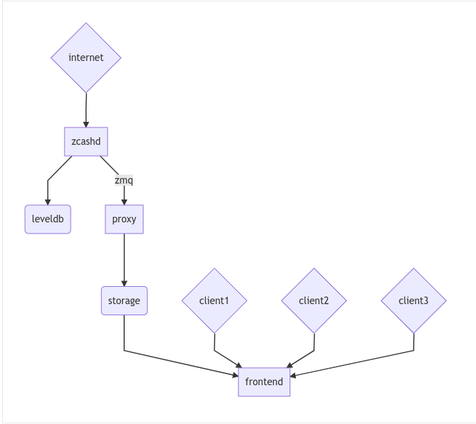

::

  ZIP: 307
  Title: Light Client Protocol for Payment Detection
  Owners: Jack Grigg <thestr4d@gmail.com>
          Daira-Emma Hopwood <daira@jacaranda.org>
  Original-Authors: George Tankersley
  Credits: Matthew Green
  Category: Standards / Ecosystem
  Status: Draft
  Created: 2018-09-17
  License: MIT


Terminology
===========

The key words "MUST", "SHOULD", and "MAY" in this document are to be interpreted as
described in BCP 14 [#BCP14]_ when, and only when, they appear in all capitals.

The terms below are to be interpreted as follows:

Light client
  A client that is not a full participant in the network of Zcash peers. It can send and
  receive payments, but does not store or validate a copy of the block chain.

Abstract
========

This ZIP defines a protocol for Zcash light clients that enables detection of incoming
payments, identification of spent notes, and maintenance of note commitment tree witnesses
for Sapling [#zip-0205]_ and Orchard [#zip-0224]_ shielded transactions, as well as
transparent balance tracking.

Motivation
==========

Prior to the introduction of this protocol, a client that wished to send or
receive shielded payments had to be a full node participating in the Zcash
network. This required an amount of available bandwidth, space, and processing
power that was unsuitable for some classes of user. This light client protocol
addresses that need, and is appropriate for low-power, bandwidth-conscious, or
otherwise limited machines (such as mobile phones).

High-Level Design
=================

There are three logical components to a Zcash light client system:

- **Zcash node** that provides chain state and serves as a root of trust for the system.

- **Proxy server** that extracts block chain data from zcashd to store and serve it in a
  lower-bandwidth format.

- **Light client** that subscribes to the stream from a proxy server and uses that data to
  update its own view of the chain state. The light client MAY be attached to a wallet
  backend that will track particular Sapling notes.



    Outline of the light wallet architecture

Security Model
==============

In this model, we propose **payment detection privacy** as our main security goal. That
is, the proxy should not learn which transactions (received from the block chain) are
addressed to a given light wallet. If we further assume network privacy (via Tor or
similar), the proxy should not be able to link different connections or queries as
deriving from the the same wallet.

In particular, the underlying Zcash node / proxy combination is assumed to be "honest but
curious" and is trusted to provide a correct view of the current best chain state and to
faithfully transmit queries and responses.

This ZIP does not address how to spend notes privately.

Compact Stream Format
=====================

A key observation in this protocol is that the encrypted ciphertext in each shielded output
is several hundred bytes long, due to the inclusion of a transaction memo. The need to
download the entire ciphertext imposes a substantial bandwidth cost on each light wallet,
which may be a limited mobile device on a restricted-bandwidth plan. The memo field can be
ignored during payment detection, as can any information that is not directly relevant to
shielded transaction processing.

A **compact block** is a packaging of ONLY the data from a block needed to:

1. Detect a payment to your shielded address (Sapling or Orchard).
2. Detect a spend of your shielded notes.
3. Update note commitment tree witnesses.

Compact blocks and their component compact transactions are encoded on the wire using
Protocol Buffers [#protocolbuffers]_. The normative definitions of the compact block format
are specified in the ``compact_formats.proto`` file of the Zcash Light Client Protocol
[#lightwallet-protocol]_.

The protocol has evolved through several major versions:

- **v0.3.x** (2021–2023): Added Orchard shielded protocol support via
  ``CompactOrchardAction`` and note commitment tree state queries
  (``GetTreeState``, ``GetLatestTreeState``) and subtree root retrieval
  (``GetSubtreeRoots``) to support efficient witness construction.

- **v0.4.x** (2025): Added transparent transaction data (``CompactTxIn``, ``TxOut``) to
  compact blocks, enabling transparent outputs to be discovered without revealing
  the client's addresses to the light wallet server. The update also added
  ``PoolType``-based filtering for selective retrieval by shielded protocol.

The following sections describe the rationale for the compact format design.

Output Compression
------------------

In the Zcash protocol, each shielded output contains an AEAD-encrypted *note
plaintext* [#protocol-notept]_. For both Sapling and Orchard, this encrypted
ciphertext (``encCiphertext``) is 580 bytes long and includes the memo field
and an authentication tag.

A recipient detects their transactions by trial-decrypting this ciphertext. On
a full node that has the entire block chain, the primary cost is computational.
For light clients however, there is an additional bandwidth cost: every
ciphertext on the block chain must be received from the server (or network
node) the light client is connected to.

However, payment detection does not require the full ciphertext. The first 52
bytes of ``encCiphertext`` contain the contents and opening of the note
commitment, which is sufficient to detect, verify, and spend the note. The
compact representation therefore includes only these 52 bytes along with the
note commitment and ephemeral public key.

For **Sapling**, a ``CompactSaplingOutput`` contains the 32-byte note commitment
($\mathsf{cmu}$), the 32-byte ephemeral public key, and the first 52 bytes of
the ciphertext, for a total of 116 bytes per output. A full Sapling Output
description [#protocol-outputencodingandconsensus]_ is 948 bytes in v4
transactions (756 bytes in v5), so the compact representation provides an
85–88% reduction in bandwidth.

For **Orchard**, a ``CompactOrchardAction`` contains the 32-byte nullifier, the
32-byte note commitment ($\mathsf{cmx}$), the 32-byte ephemeral public key, and
the first 52 bytes of the ciphertext, for a total of 148 bytes per action. A
full Orchard Action description [#protocol-actionencodingandconsensus]_ is 820
bytes, so the compact representation provides an 82% reduction in bandwidth.
Note that the Orchard compact representation includes the nullifier because the
Orchard Action structure combines a spend and an output into a single
description.

Since the compact representation omits the authentication tag, the integrity of
the decrypted note plaintext is instead validated by recalculating the note
commitment from the decrypted plaintext and checking it against the note
commitment sent outside the ciphertext, which is authenticated by the binding
signature over the entire transaction.

Spend Compression
-----------------

For **Sapling**, a full Spend description is 384 bytes long
[#protocol-spendencodingandconsensus]_. The only part necessary for spend
detection is the 32-byte nullifier, which allows a light client to detect when
one of its own notes has been spent. A ``CompactSaplingSpend`` therefore
contains only the nullifier, for a 92% reduction in bandwidth.

For **Orchard**, spend detection is handled by checking the nullifier included
in each ``CompactOrchardAction`` (as described in `Output Compression`_ above),
since the Orchard Action structure combines a spend and an output.

Proxy operation
===============

The proxy's purpose is to provide a scalable and bandwidth-efficient interface between a
Zcash node and any number of light clients. It accomplishes this by parsing a blockwise
stream of transactions from the node and converting them into the compact format described
above.

The proxy offers a gRPC API to clients, defined by the ``service.proto`` file of the
Zcash Light Client Protocol [#lightwallet-protocol]_. The ``CompactTxStreamer`` service
provides methods for retrieving compact blocks, submitting transactions, querying note
commitment tree state, and querying for transparent outputs by address.

Client operation
================

Light clients obtain compact blocks from one or more proxy servers, which they then
process locally to update their view of the block chain. We consider only a single proxy
server here without loss of generality.

Local processing
----------------

Given a ``CompactBlock`` at block height $\mathsf{height}$ received from a proxy server, a
light client processes it in the following ways:

Scanning for relevant transactions
``````````````````````````````````
For every ``CompactSaplingOutput`` and ``CompactOrchardAction`` in the ``CompactBlock``,
the light client attempts trial decryption against its set of incoming viewing keys. The
following subsections describe the compact trial decryption procedures for each protocol.

Sapling compact trial decryption
''''''''''''''''''''''''''''''''

For each ``CompactSaplingOutput`` $(\mathtt{cmu}, \mathtt{ephemeralKey}, \mathsf{ciphertext})$,
the light client trial-decrypts with each Sapling incoming viewing key $\mathsf{ivk}$. The
procedure is a slight deviation from the standard decryption process
[#protocol-saplingdecryptivk]_ (all constants and algorithms are as defined there):

- let $\mathsf{epk} = \mathsf{abst}_{\mathbb{J}}(\mathtt{ephemeralKey})$
- if $\mathsf{epk} = \bot$, return $\bot$
- let $\mathsf{sharedSecret} = \mathsf{KA^{Sapling}.Agree}(\mathsf{ivk}, \mathsf{epk})$
- let $K^{\mathsf{enc}} = \mathsf{KDF^{Sapling}}(\mathsf{sharedSecret}, \mathtt{ephemeralKey})$
- let $P^{\mathsf{enc}} = \mathsf{ChaCha20.Decrypt}_{K^{\mathsf{enc}}}(\mathsf{ciphertext})$
- extract $\mathbf{np} = (\mathsf{leadByte}, \mathsf{d}, \mathsf{v}, \mathsf{rseed})$ from $P^{\mathsf{enc}}$
- [Pre-Canopy] if $\mathsf{leadByte} \neq 0x01$, return $\bot$
- [Pre-Canopy] let $\mathsf{\underline{rcm}} = \mathsf{rseed}$
- [Canopy onward] if $\mathsf{height} < \mathsf{CanopyActivationHeight} + \mathsf{ZIP212GracePeriod}$ and $\mathsf{leadByte} \not\in \{ \mathtt{0x01}, \mathtt{0x02} \}$, return $\bot$
- [Canopy onward] if $\mathsf{height} < \mathsf{CanopyActivationHeight} + \mathsf{ZIP212GracePeriod}$ and $\mathsf{leadByte} \neq \mathtt{0x02}$, return $\bot$
- [Canopy onward] let $\mathsf{\underline{rcm}} = \begin{cases}\mathsf{rseed}, &\text{if } \mathsf{leadByte} = \mathtt{0x01} \\ \mathsf{ToScalar}(\mathsf{PRF^{expand}_{rseed}}([5])), &\text{otherwise}\end{cases}$
- let $\mathsf{rcm} = \mathsf{LEOS2IP}_{256}(\mathsf{\underline{rcm}})$ and $\mathsf{g_d} = \mathsf{DiversifyHash}(\mathsf{d})$
- if $\mathsf{rcm} \geq r_{\mathbb{J}}$ or $\mathsf{g_d} = \bot$, return $\bot$
- [Canopy onward] if $\mathsf{leadByte} \neq \mathtt{0x01}$:

  * $\mathsf{esk} = \mathsf{ToScalar}(\mathsf{PRF^{expand}_{rseed}}([4]))$
  * if $\mathsf{repr}_{\mathbb{J}}(\mathsf{KA^{Sapling}.DerivePublic}(\mathsf{esk}, \mathsf{g_d})) \neq \mathtt{ephemeralKey}$, return $\bot$

- let $\mathsf{pk_d} = \mathsf{KA^{Sapling}.DerivePublic}(\mathsf{ivk}, \mathsf{g_d})$
- let $\mathsf{cm}_u' = \mathsf{Extract}_{\mathbb{J}^{(r)}}(\mathsf{NoteCommit^{Sapling}_{rcm}}(\mathsf{repr}_{\mathbb{J}}(\mathsf{g_d}), \mathsf{repr}_{\mathbb{J}}(\mathsf{pk_d}), \mathsf{v}))$.
- if $\mathsf{LEBS2OSP}_{256}(\mathsf{cm}_u') \neq \mathtt{cmu}$, return $\bot$
- return $\mathbf{np}$.

Orchard compact trial decryption
'''''''''''''''''''''''''''''''''

For each ``CompactOrchardAction`` $(\mathtt{nullifier}, \mathtt{cmx}, \mathtt{ephemeralKey},
\mathsf{ciphertext})$, the light client trial-decrypts with each Orchard incoming viewing
key $\mathsf{ivk}$. The procedure is analogous to Sapling but uses Pallas-based key
agreement [#protocol-concreteorchardkeyagreement]_ and note commitment
[#protocol-decryptivk]_ (all constants and algorithms are as defined there):

- let $\mathsf{epk} = \mathsf{abst}_{\mathbb{P}}(\mathtt{ephemeralKey})$
- if $\mathsf{epk} = \bot$, return $\bot$
- let $\mathsf{sharedSecret} = \mathsf{KA^{Orchard}.Agree}(\mathsf{ivk}, \mathsf{epk})$
- let $K^{\mathsf{enc}} = \mathsf{KDF^{Orchard}}(\mathsf{sharedSecret}, \mathtt{ephemeralKey})$
- let $P^{\mathsf{enc}} = \mathsf{ChaCha20.Decrypt}_{K^{\mathsf{enc}}}(\mathsf{ciphertext})$
- extract $\mathbf{np} = (\mathsf{leadByte}, \mathsf{d}, \mathsf{v}, \mathsf{rseed})$ from $P^{\mathsf{enc}}$
- if $\mathsf{leadByte} \neq \mathtt{0x02}$, return $\bot$
- let $\rho = \mathsf{LEOS2IP}_{256}(\mathtt{nullifier})$
- let $\mathsf{rcm} = \mathsf{ToBase^{Orchard}}(\mathsf{PRF^{expand}_{rseed}}([5] \mathbin\Vert \mathsf{I2LEOSP}_{256}(\rho)))$
- let $\mathsf{g_d} = \mathsf{DiversifyHash^{Orchard}}(\mathsf{d})$
- let $\mathsf{esk} = \mathsf{ToScalar^{Orchard}}(\mathsf{PRF^{expand}_{rseed}}([4] \mathbin\Vert \mathsf{I2LEOSP}_{256}(\rho)))$
- if $\mathsf{repr}_{\mathbb{P}}(\mathsf{KA^{Orchard}.DerivePublic}(\mathsf{esk}, \mathsf{g_d})) \neq \mathtt{ephemeralKey}$, return $\bot$
- let $\mathsf{pk_d} = \mathsf{KA^{Orchard}.DerivePublic}(\mathsf{ivk}, \mathsf{g_d})$
- let $\psi = \mathsf{ToBase^{Orchard}}(\mathsf{PRF^{expand}_{rseed}}([9] \mathbin\Vert \mathsf{I2LEOSP}_{256}(\rho)))$
- let $\mathsf{cm}_x' = \mathsf{Extract}_{\mathbb{P}}(\mathsf{NoteCommit^{Orchard}_{rcm}}(\mathsf{repr}_{\mathbb{P}}(\mathsf{g_d}), \mathsf{repr}_{\mathbb{P}}(\mathsf{pk_d}), \mathsf{v}, \rho, \psi))$.
- if $\mathsf{cm}_x' = \bot$ or $\mathsf{LEBS2OSP}_{256}(\mathsf{cm}_x') \neq \mathtt{cmx}$, return $\bot$
- return $\mathbf{np}$.

Maintaining note commitment tree witnesses
``````````````````````````````````````````
In order to spend a shielded note, the spender must produce a Merkle path
(witness) from the note's commitment to an anchor (a root of the note commitment 
tree at some block height). [#protocol-merkletree]_ [#protocol-merklepath]_ 
A light client MUST therefore maintain sufficient note commitment tree state to
produce witnesses for its unspent notes.

The note commitments in each ``CompactBlock`` (the $\mathsf{cmu}$ values from
``CompactSaplingOutput`` entries and the $\mathsf{cmx}$ values from
``CompactOrchardAction`` entries) are inserted into the respective Sapling or
Orchard note commitment trees in the order they appear in the block.

A light client that has scanned a contiguous range of blocks can construct
witnesses from the note commitments it has observed. However, a light client
need not have scanned the entire chain in order to construct witnesses: the
``GetSubtreeRoots`` RPC method [#lightwallet-protocol]_ provides roots of
completed subtrees of the note commitment trees, which can be combined with
locally-scanned commitments to produce valid witnesses even when portions of
the chain have not been scanned.

Detecting spends
````````````````

The ``CompactSaplingSpend`` nullifier entries and the nullifier fields of
``CompactOrchardAction`` entries can be checked against the nullifiers
of notes known to the client to determine when those notes have been spent.

Block header validation
```````````````````````

*This section describes a proposed enhancement that has been only partially implemented:
currently only* ``prevHash`` *is checked.*

If the ``CompactBlock`` for height ``X`` contains a block header, the light client can
validate it in a similar way to SPV clients [#spv-clients]_ by performing the following
checks:

- ``version >= MIN_BLOCK_VERSION``
- ``prevHash == prevBlock.id.blockHash`` where ``prevBlock`` is the previous
  ``CompactBlock`` received (at height ``X-1``).
- ``finalSaplingRoot`` is equal to the root of the Sapling note commitment tree after
  appending every ``cmu`` in the ``CompactBlock`` in-order.
- The Equihash solution is valid.
- ``targetFromBits(bits) != 0 && targetFromBits(bits) <= powLimit``.
- If the last 27 ``CompactBlocks`` all have block headers, ``bits`` is set correctly
  according to the difficulty adjustment algorithm.
- ``toLittleEndian(blockHash) <= targetFromBits(bits)``.

A ``CompactBlock`` that fails any of these checks MUST be discarded. If it was received as
part of a ``GetBlockRange`` call, the call MUST be aborted.

Block header validation provides light clients with some assurance that the
``CompactOutputs`` being sent to them are indeed from valid blocks that have been mined.
The strongest-possible assurance is achieved when all block headers are synchronised; this
comes at the cost of bandwidth and storage.

By default, ``CompactBlocks`` only contain ``CompactTxs`` for transactions that contain
Sapling spends or outputs. Thus they do not contain sufficient information to validate
that the received transaction IDs correspond to the transaction tree root in the block
header. This does not have a significant effect on light client security: light clients
only directly depend on ``CompactOutputs``, which can be authenticated via block header
validation. If a txid is used in a ``GetTransaction`` call, the returned transaction
SHOULD be checked against the corresponding ``CompactOutputs``, in addition to verifying
the transaction signatures.

Client-server interaction
-------------------------

A light client MUST perform the following operations as part of synchronisation:

- **Trial decryption**: For each ``CompactSaplingOutput`` and ``CompactOrchardAction`` in
  the scanned ``CompactBlocks``, the light client attempts trial decryption against its
  set of incoming viewing keys. Successfully decrypted outputs represent received notes.
  See `Scanning for relevant transactions`_ for details.

- **Nullifier matching**: For each ``CompactSaplingSpend`` nullifier and
  ``CompactOrchardAction`` nullifier in the scanned ``CompactBlocks``, the light client
  checks against its set of known nullifiers for unspent notes. A match indicates that the
  corresponding note has been spent.

- **Note commitment tree maintenance**: The light client updates its local note commitment
  tree state as described in `Maintaining note commitment tree witnesses`_.

Retrieving full transactions
````````````````````````````

The compact block stream provides sufficient information for payment detection
and balance tracking, but does not include memo fields or other transaction
details. When a light client needs to access the memo field of a received note,
the outgoing ciphertexts for spend recovery, or other transaction components,
it retrieves the full transaction via the ``GetTransaction`` RPC method.

Since a ``GetTransaction`` request reveals to the proxy server that the light
client is interested in a specific transaction, full transaction retrieval
SHOULD be performed over a privacy-preserving network connection such as Tor
[#tor]_ or the Nym mixnet [#nym]_.

In addition, even when using a privacy-preserving network connection for these
operations, a client SHOULD NOT make transaction data requests to the proxy
server in a fashion that links the client's interest in that transaction to
other operations that the client may be performing in the clear. For example,
if a client uses an unprotected connection for compact block download, that
client SHOULD NOT retrieve full transaction data immediately upon transaction
discovery, but SHOULD defer it until a later time when the download will 
not be identifiably related to the download of the compact block range in 
which the transaction was discovered.

Importing a pre-existing key
`````````````````````````````
The light client's scanning start height (often called the "wallet birthday")
determines how far back the light client must scan to detect all relevant
transactions. When a light client is initialized with a newly generated key, it
can use the current chain tip as its wallet birthday, since no prior
transactions can be relevant.

When initialized with a pre-existing key —- whether a seed, a full viewing key,
or an incoming viewing key —- the light client MUST scan from the key's
birthday height, which is the earliest block height at which the key could have
been used. If the birthday height is unknown and cannot be estimated by the
user, the light client SHOULD scan from the activation height of the earliest
shielded protocol supported by the key (Sapling activation at block 419200 on
mainnet, or Orchard activation at block 1687104 on mainnet).

Block privacy via bucketing
---------------------------

*This section describes a proposed enhancement that has not been implemented.*

When a light client requests a range of compact blocks via ``GetBlockRange``, the start
height of the request reveals to the proxy server the block height to which the light
client had previously synchronised. This is an information leak under our security model
(assuming network privacy). The information leakage can be reduced by "bucketing" the
start point of each synchronisation request.

Let ``⌊X⌋ = X - (X % N)`` be the value of ``X`` rounded down to some multiple of the
bucket size ``N``. Instead of requesting blocks starting from the light client's last
synchronised height ``X``, the light client requests blocks starting from ``⌊X⌋``. Blocks
between ``⌊X⌋`` and ``X`` are checked against the light client's cached chain view for
consistency and then discarded without further processing. This also helps detect chain
reorganisations that occurred within the bucket window.

Transaction privacy
-------------------

The compact block stream gives the light client sufficient information to determine
accurate address balances, show when funds were received or spent, and spend any unspent
notes. Since synchronisation happens via a broadcast medium (the compact block stream), it
leaks no information about which transactions the light client is interested in.

However, other API methods reveal more specific interests to the proxy server:

- ``GetTransaction`` reveals interest in a specific transaction. See
  `Retrieving full transactions`_ for mitigation recommendations.
- ``SendTransaction`` reveals that the light client is the sender of a transaction.
  Transaction submission SHOULD be performed over a privacy-preserving network connection
  such as Tor [#tor]_ or the Nym mixnet [#nym]_.
- Transparent address queries (``GetTaddressTransactions``, ``GetTaddressBalance``,
  ``GetAddressUtxos``) reveal the transparent addresses held by the light client. These
  queries SHOULD be performed over a privacy-preserving network connection such as
  Tor [#tor]_ or the Nym mixnet [#nym]_.
- If a client queries for transactions related to multiple transparent addresses in
  a single request, this will leak the fact that those addresses are controlled by
  the same client. If the ``GetTaddressTransactions``, ``GetTaddressBalance`` 
  or ``GetAddressUtxos`` methods are used, even over a privacy-preserving network
  connect, the client SHOULD NOT request data for more than one address at a time
  and SHOULD make such requests in a fashion that is not temporally linkable to
  other operation of the wallet.
- ``GetMempoolTx`` and ``GetMempoolStream`` reveal the light client's interest in
  unconfirmed transactions.


Reference Implementation
========================

This proposal is supported by a set of libraries and reference code made available by the
Electric Coin Company.


References
==========

.. [#BCP14] `Information on BCP 14 — "RFC 2119: Key words for use in RFCs to Indicate Requirement Levels" and "RFC 8174: Ambiguity of Uppercase vs Lowercase in RFC 2119 Key Words" <https://www.rfc-editor.org/info/bcp14>`_
.. [#protocol-merkletree] `Zcash Protocol Specification, Version 2025.6.1 [NU6.1]. Section 3.8: Note Commitment Trees <protocol/protocol.pdf#merkletree>`_
.. [#protocol-merklepath] `Zcash Protocol Specification, Version 2025.6.1 [NU6.1]. Section 4.9: Merkle Path Validity <protocol/protocol.pdf#merklepath>`_
.. [#protocol-saplingdecryptivk] `Zcash Protocol Specification, Version 2025.6.1 [NU6.1]. Section 4.20.2: Decryption using an Incoming Viewing Key (Sapling and Orchard) <protocol/protocol.pdf#saplingdecryptivk>`_
.. [#protocol-decryptivk] `Zcash Protocol Specification, Version 2025.6.1 [NU6.1]. Section 4.20.2: Decryption using an Incoming Viewing Key (Sapling and Orchard) <protocol/protocol.pdf#decryptivk>`_
.. [#protocol-concreteorchardkeyagreement] `Zcash Protocol Specification, Version 2025.6.1 [NU6.1]. Section 5.4.6.4: Orchard Key Agreement <protocol/protocol.pdf#concreteorchardkeyagreement>`_
.. [#protocol-notept] `Zcash Protocol Specification, Version 2025.6.1 [NU6.1]. Section 5.5: Encodings of Note Plaintexts and Memo Fields <protocol/protocol.pdf#notept>`_
.. [#protocol-spendencodingandconsensus] `Zcash Protocol Specification, Version 2025.6.1 [NU6.1]. Section 7.3: Spend Description Encoding and Consensus <protocol/protocol.pdf#spendencodingandconsensus>`_
.. [#protocol-outputencodingandconsensus] `Zcash Protocol Specification, Version 2025.6.1 [NU6.1]. Section 7.4: Output Description Encoding and Consensus <protocol/protocol.pdf#outputencodingandconsensus>`_
.. [#protocol-actionencodingandconsensus] `Zcash Protocol Specification, Version 2025.6.1 [NU6.1]. Section 7.5: Action Description Encoding and Consensus <protocol/protocol.pdf#actionencodingandconsensus>`_
.. [#zip-0205] `ZIP 205: Deployment of the Sapling Network Upgrade <zip-0205.rst>`_
.. [#zip-0212] `ZIP 212: Allow Recipient to Derive Sapling Ephemeral Secret from Note Plaintext <zip-0212.rst>`_
.. [#zip-0224] `ZIP 224: Orchard Shielded Protocol <zip-0224.rst>`_
.. [#lightwallet-protocol] `Zcash Light Client Protocol <https://github.com/zcash/lightwallet-protocol>`_
.. [#protocolbuffers] `Protocol Buffers documentation <https://developers.google.com/protocol-buffers/>`_
.. [#incremental-witness] `zcash_primitives Rust crate — merkle_tree.rs <https://github.com/zcash/librustzcash/blob/master/zcash_primitives/src/merkle_tree.rs>`_
.. [#spv-clients] `Bitcoin Wiki: Scalability — Simplified payment verification <https://en.bitcoin.it/wiki/Scalability#Simplified_payment_verification>`_
.. [#tor] `Tor Project <https://www.torproject.org/>`_
.. [#nym] `Nym mixnet <https://nymtech.net/>`_
