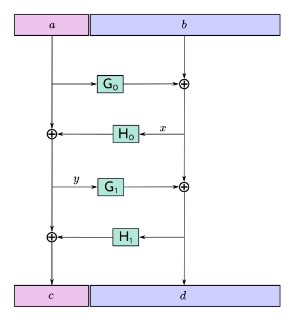
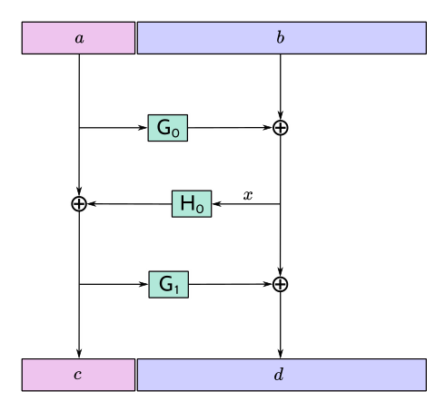

::

  ZIP: 316
  Title: Unified Addresses and Unified Viewing Keys
  Owners: Daira-Emma Hopwood <daira@jacaranda.org>
          Nathan Wilcox <nathan@shieldedlabs.net>
          Jack Grigg <thestr4d@gmail.com>
          Sean Bowe <ewillbefull@gmail.com>
          Kris Nuttycombe <kris@nutty.land>
  Original-Authors: Greg Pfeil
                    Ying Tong Lai
  Credits: Taylor Hornby
           Stephen Smith
  Status: [Revision 0] Active, [Revision 1] Withdrawn, [Revision 2] Draft
  Category: Standards / RPC / Wallet
  Created: 2021-04-07
  License: MIT
  Discussions-To: <https://github.com/zcash/zips/issues/482>

Terminology
===========

The key words "MUST", "MUST NOT", "SHOULD", "RECOMMENDED", and "MAY" in this
document are to be interpreted as described in BCP 14 [#BCP14]_ when, and only
when, they appear in all capitals.

The terms below are to be interpreted as follows:

Recipient
  A wallet or other software that can receive transfers of assets (such
  as ZEC) or in the future potentially other transaction-based state changes.
Producer
  A wallet or other software that can create an Address (in which case it is
  normally also a Recipient) or a Viewing Key.
Consumer
  A wallet or other software that can make use of an Address or Viewing Key
  that it is given.
Sender
  A wallet or other software that can send transfers of assets, or other
  side effects to consensus state that may be defined in future. Senders are a
  subset of Consumers.
Receiver
  The necessary information to transfer an asset to a Recipient that generated
  that Receiver using a specific Transfer Protocol. Each Receiver is associated
  unambiguously with a specific Receiver Type, identified by an integer Typecode.
Receiver Encoding
  An encoding of a Receiver as a byte sequence.
Viewing Key
  The necessary information to view information about payments to an Address,
  or (in the case of a Full Viewing Key) from an Address. An Incoming Viewing
  Key can be derived from a Full Viewing Key, and an Address can be derived
  from an Incoming Viewing Key.
Viewing Key Encoding
  An encoding of a Viewing Key as a byte sequence.
Metadata Encoding
  An encoding of metadata that is not a Receiver or Viewing Key, but may affect
  the interpretation of the overall Unified Address/Viewing Key.
Item
  An Receiver Encoding, Viewing Key Encoding, or Metadata Encoding.
Legacy Address
  A Transparent, Sprout, or Sapling Address.
Unified Address (or UA)
  A Unified Address combines multiple Receiver (and optionally Metadata) Items.
Unified Full Viewing Key (or UFVK)
  A Unified Full Viewing Key combines multiple Full Viewing Key (and optionally
  Metadata) Items.
Unified Incoming Viewing Key (or UIVK)
  A Unified Incoming Viewing Key combines multiple Incoming Viewing Key (and
  optionally Metadata) Items.
Unified Viewing Key (or UVK)
  Either a Unified Full Viewing Key or a Unified Incoming Viewing Key.
Address
  Either a Legacy Address or a Unified Address.
Transfer Protocol
  A specification of how a Sender can transfer assets to a Recipient.
  For example, the Transfer Protocol for a Sapling Receiver is the subset
  of the Zcash protocol required to successfully transfer ZEC using Sapling
  Spend/Output Transfers as specified in the Zcash Protocol Specification.
  (A single Zcash transaction can contain transfers of multiple
  Transfer Protocols. For example a t→z transaction that shields to the
  Sapling pool requires both Transparent and Sapling Transfer Protocols.)
Unified String Encoding
  An encoding of a UA/UVK as a US-ASCII string, intended either for display
  and transfer by Zcash end-users, or internal use by Zcash-related software.
Unified QR Encoding
  An encoding of a UA/UVK as a QR code, intended for display and transfer
  by Zcash end-users in situations where usability advantages of a 2D bar
  code may be relevant.
Address Encoding
  The externally visible encoding of an Address (e.g. as a string of
  characters or a QR code).
Unix Epoch Time
  An integer representing a UTC time in seconds relative to the Unix Epoch
  of 1970-01-01T00:00:00Z.

Notation for sequences, conversions, and arithmetic operations follows the
Zcash protocol specification [#protocol-notation]_.

Abstract
========

This proposal defines Unified Addresses, which bundle together Zcash Addresses
of different types in a way that can be presented as a single Address Encoding.
It also defines Unified Viewing Keys, which perform a similar function for
Zcash viewing keys.

Motivation
==========

Up to and including the Canopy network upgrade, Zcash supported the following
Payment Address types:

* Transparent Addresses (P2PKH and P2SH)
* Sprout Addresses
* Sapling Addresses

Each of these has its own Address Encodings, as a string and as a QR code.
(Since the QR code is derivable from the string encoding as described in
[#protocol-addressandkeyencoding]_, for many purposes it suffices to consider
the string encoding.)

The Orchard proposal [#zip-0224]_ adds a new Address type, Orchard Addresses.

The difficulty with defining new Address Encodings for each Address type, is
that end-users are forced to be aware of the various types, and in particular
which types are supported by a given Consumer or Recipient. In order to make
sure that transfers are completed successfully, users may be forced to
explicitly generate Addresses of different types and re-distribute encodings
of them, which adds significant friction and cognitive overhead to
understanding and using Zcash.

The goals for a Unified Address standard are as follows:

- Simplify coordination between Recipients and Consumers by removing complexity
  from negotiating Address types.
- Provide a “bridging mechanism” to allow shielded wallets to successfully
  interact with conformant Transparent-Only wallets.
- Allow older conformant wallets to interact seamlessly with newer wallets.
- Enable users of newer wallets to upgrade to newer transaction technologies
  and/or pools while maintaining seamless interactions with counterparties
  using older wallets.
- Facilitate wallets to assume more sophisticated responsibilities for
  shielding and/or migrating user funds.
- Allow wallets to potentially develop new transfer mechanisms without
  underlying protocol changes.
- Support abstractions corresponding to a Unified Address that provide the
  functionality of Full Viewing Keys and Incoming Viewing Keys.
- Provide forward compatibility that is standard for all wallets across a
  range of potential future features. Some examples might include Layer 2
  features, cross-chain interoperability and bridging, and decentralized
  exchange.
- Allow for Metadata Items to be included in Unified Addresses/Viewing Keys
  in order to provide future extensibility.
- The standard should work well for Zcash today and upcoming potential
  upgrades, and also anticipate even broader use cases down the road such
  as cross-chain functionality.

Requirements
============

Overview
--------

Unified Addresses specify multiple methods for payment to a Recipient's wallet.
The Sender's wallet can then non-interactively select the method of payment.

Importantly, any wallet can support Unified Addresses, even when that wallet
only supports a subset of payment methods for receiving and/or sending.

Despite having some similar characteristics, the Unified Address standard is
orthogonal to Payment Request URIs [#zip-0321]_ and similar schemes. Since
Payment Requests encode addresses as alphanumeric strings, no change to
ZIP 321 is required in order to use Unified Addresses in Payment Requests.

Concepts
--------

Wallets follow a model *Interaction Flow* as follows:

1. A Producer *generates* an Address.
2. The Producer *encodes* the Address.
3. The Producer wallet or human user *distributes* this Address Encoding.
   This ZIP leaves distribution mechanisms out of scope.
4. A Consumer wallet or user *imports* the Address Encoding through any of
   a variety of mechanisms (QR code scanning, Payment URIs, cut-and-paste,
   or “in-band” protocols like ``Reply-To`` memos).
5. A Consumer wallet *decodes* the Address Encoding and performs validity
   checks.
6. (Perhaps later in time) if the Consumer wallet is a Sender, it can execute
   a transfer of ZEC (or other assets or protocol state changes) to the
   Address.

Encodings of the same Address may be distributed zero or more times through
different means. Zero or more Consumers may import Addresses. Zero or more of
those (that are Senders) may execute a Transfer. A single Sender may execute
multiple Transfers over time from a single import.

Steps 1 to 5 inclusive also apply to Interaction Flows for Unified Full Viewing
Keys and Unified Incoming Viewing Keys.

Addresses
---------

A Unified Address (or UA for short) combines one or more Receivers.

When new Transport Protocols are introduced to the Zcash protocol after
Unified Addresses are standardized, those should introduce new Receiver Types
but *not* different Address types outside of the UA standard. There needs
to be a compelling reason to deviate from the standard, since the benefits
of UA come precisely from their applicability across all new protocol
upgrades.

For `Revision 2`_, users must be able to visually distinguish addresses
that risk information being leaked on-chain as a result of a transfer
from addresses that present no such risks.

Receivers
---------

Every wallet must properly *parse* encodings of a Unified Address or
Unified Viewing Key containing unrecognised Items.

A wallet may process unrecognised Items by indicating to the user their
presence or similar information for usability or diagnostic purposes.

Transport Encoding
------------------

The Unified String Encoding is “opaque” to human readers: it does *not*
allow visual identification of which Receivers or Receiver Types are
present.

The Unified String Encoding is resilient against typos, transcription
errors, cut-and-paste errors, truncation, or other likely UX hazards.

There is a well-defined Unified QR Encoding of a Unified Address (or
UFVK or UIVK) as a QR code, which produces QR codes that are reasonably
compact and robust.

There is a well-defined transformation between the Unified QR Encoding
and Unified String Encoding of a given UA/UVK in either direction.

The Unified String Encoding fits into ZIP-321 Payment URIs [#zip-0321]_
and general URIs without introducing parse ambiguities.

The encoding must support sufficiently many Recipient Types to allow
for reasonable future expansion.

The encoding must allow all wallets to safely and correctly parse out
unrecognised Receiver Types well enough to ignore them.

Transfers
---------

When executing a Transfer the Sender selects a Receiver via a Selection
process.

Given a valid UA, Selection must treat any unrecognised Item as though it were
absent (with the exception that Items with typecodes in the MUST-understand
range may not be ignored; the Sender must reject addresses containing
MUST-understand Items that they do not recognise).

- This property is crucial for forward compatibility to ensure users
  who upgrade to newer protocols / UAs don't lose the ability to smoothly
  interact with older wallets.

- This property is crucial for allowing wallets that support only older
  shielded protocols to interact with newer shielded wallets, removing a
  disincentive for adopting newer shielded wallets.

- This property also allows wallets to upgrade to newer shielded protocol
  support without re-acquiring counterparty UAs. If they are re-acquired,
  the user flow and usability will be minimally disrupted.

Experimental Usage
------------------

Unified Addresses and Unified Viewing Keys must be able to include
Receivers and Viewing Keys of experimental types, possibly alongside
non-experimental ones. These experimental Receivers or Viewing Keys
must be used only by wallets whose users have explicitly opted into
the corresponding experiment.

Viewing Keys
------------

A Unified Full Viewing Key (resp. Unified Incoming Viewing Key) can be
used in a similar way to a Full Viewing Key (resp. Incoming Viewing Key)
as described in the Zcash Protocol Specification [#protocol]_.

For a Transparent P2PKH Address that is derived according to BIP 32
[#bip-0032]_ and BIP 44 [#bip-0044]_, the nearest equivalent to a
Full Viewing Key or Incoming Viewing Key for a given BIP 44 account
is an extended public key, as defined in the section “Extended keys”
of BIP 32. Therefore, UFVKs and UIVKs should be able to include such
extended public keys.

A wallet should support deriving a UIVK from a UFVK, and a Unified
Address from a UIVK.

Open Issues and Known Concerns
------------------------------

Privacy impacts of transparent or cross-pool transactions, and the
associated UX issues, will be addressed in ZIP 315 (in preparation).

Specification
=============

Revisions
---------

.. _`Revision 0`:

* Revision 0: The initial version of this specification.

.. _`Revision 1` (Withdrawn):

* Revision 1 proposed a variant of this specification similar to that specified
  for `Revision 2`_ addresses having the `tu` Human-Readable Part. It faced
  [opposition from the community](https://forum.zcashcommunity.com/t/unified-addresses-composition/51024/7)
  due to it being difficult to discern the privacy implications of sharing an
  address as that specified, and has been withdrawn. See
  https://github.com/zcash/zips/blob/4acf32ac6db409d93041c463880dad6df83875e1/zips/zip-0316.rst
  for the specification that was proposed.

.. _`Revision 2`:

* Revision 2: This version adds support for `MUST-understand Typecodes`_ and
  `Address Expiration Metadata`_. It introduces two new variants of Unified
  Addresses; `zu` addresses, which are prohibited from containing transparent
  receivers, and `tu` addresses, which allow transparent receivers to be
  augmented with metadata items. For Unified Viewing Keys, this version adopts
  ``uvf`` and ``uvi`` encoding prefixes for Unified Full Viewing Keys and
  Unified Incoming Viewing Keys respectively, drops the restriction that a UVK
  must contain at least one shielded Item, and adds support for
  `P2SH Viewing Key Items`_ using BIP 388 wallet policies [#bip-0388]_.

A Revision 0 UA/UVK is distinguished from a Revision 2 UA/UVK by its
Human-Readable Part, as follows.

Let *addr_prefix* be:

* “``u``”, if this is a UA or UVK prior to `Revision 2`_;
* “``zu``”, if this is a shielded-only UA from `Revision 2`_ onward.
* “``tu``”, if this is a transparent-enabled UA from `Revision 2`_ onward.

The Human-Readable Parts (as defined in [#bip-0350]_) of Unified
Addresses are defined as:

* *addr_prefix*, for Unified Addresses on Mainnet;
* *addr_prefix* || “``test``”, for Unified Addresses on Testnet.

Let *ivk_prefix* be:

* “``uivk``” prior to `Revision 2`_;
* “``uvi``” from `Revision 2`_ onward.

Let *fvk_prefix* be:

* “``uview``” prior to `Revision 2`_;
* “``uvf``” from `Revision 2`_ onward.

The Human-Readable Parts of Unified Viewing Keys are defined as:

* *ivk_prefix* for Unified Incoming Viewing Keys on Mainnet;
* *ivk_prefix* || “``test``” for Unified Incoming Viewing Keys on Testnet;
* *fvk_prefix* for Unified Full Viewing Keys on Mainnet;
* *fvk_prefix* || “``test``” for Unified Full Viewing Keys on Testnet.

While support for Revision 2 UAs/UVKs is still being rolled out across
the Zcash ecosystem, a Producer can maximize interoperability by
generating a Revision 0 UA/UVK in cases where the conditions on its
use are met (i.e. there are no MUST-understand Metadata Items, and at
least one shielded item). At some point when Revision 2 UA/UVKs are
widely supported, this will be unnecessary and it will be sufficient
to always produce Revision 2 UA/UVKs.

Encoding of Unified Addresses
-----------------------------

Rather than defining a Bech32 string encoding of Orchard Shielded
Payment Addresses, we instead define a Unified Address format that
is able to encode a set of Receivers of different types. This enables
the Consumer of a Unified Address to choose the Receiver of the best
type it supports, providing a better user experience as new Receiver
Types are added in the future.

Assume that we are given a set of one or more Receiver Encodings
for distinct types. That is, the set may optionally contain one
Receiver of each of the Receiver Types in the following fixed
Priority List:

* Typecode $\mathtt{0x03}$ — an Orchard raw address as defined
  in [#protocol-orchardpaymentaddrencoding]_;

* Typecode $\mathtt{0x02}$ — a Sapling raw address as defined
  in [#protocol-saplingpaymentaddrencoding]_;

* Typecode $\mathtt{0x01}$ — a Transparent P2SH address, *or*
  Typecode $\mathtt{0x00}$ — a Transparent P2PKH address.

If, and only if, the user of a Producer or Consumer wallet explicitly
opts into an experiment as described in `Experimental Usage`_, the
specification of the experiment MAY include additions to the above
Priority List (such additions SHOULD maintain the intent of preferring
more recent shielded protocols).

We say that a Receiver Type is “preferred” over another when it appears
earlier in this Priority List (as potentially modified by experiments).

The Sender of a payment to a Unified Address MUST use the Receiver
of the most preferred Receiver Type that it supports from the set.

For example, consider a wallet that supports sending funds to Orchard
Receivers, and does not support sending to any Receiver Type that is
preferred over Orchard. If that wallet is given a UA that includes an
Orchard Receiver and possibly other Receivers, it MUST send to the
Orchard Receiver.

The raw encoding of a Unified Address is a concatenation of
$(\mathtt{typecode}, \mathtt{length}, \mathtt{addr})$ encodings
of the constituent Receivers, in ascending order of Typecode:

* $\mathtt{typecode} : \mathtt{compactSize}$ — the Typecode from the
  above Priority List;

* $\mathtt{length} : \mathtt{compactSize}$ — the length in bytes of
  $\mathtt{addr};$

* $\mathtt{addr} : \mathtt{byte[length]}$ — the Receiver Encoding.

The values of the $\mathtt{typecode}$ and $\mathtt{length}$
fields MUST be less than or equal to $\mathtt{0x2000000}.$
(The limitation on the total length of encodings described below imposes
a smaller limit for $\mathtt{length}$ in practice.)

A Receiver Encoding is the raw encoding of a Shielded Payment Address,
or the $160$-bit script hash of a P2SH address [#P2SH]_, or the
$160$-bit validating key hash of a P2PKH address [#P2PKH]_.

Let ``padding`` be the Human-Readable Part of the Unified Address in
US-ASCII, padded to 16 bytes with zero bytes. We append ``padding`` to
the concatenated encodings, and then apply the $\mathsf{F4Jumble}$
algorithm as described in `Jumbling`_. (In order for the limitation on
the $\mathsf{F4Jumble}$ input size to be met, the total length of
encodings MUST be at most $\ell^\mathsf{MAX}_M - 16$ bytes, where
$\ell^\mathsf{MAX}_M$ is defined in `Jumbling`_.)
The output is then encoded with Bech32m [#bip-0350]_, ignoring any length
restrictions. This is chosen over Bech32 in order to better handle
variable-length inputs.

To decode a Unified Address Encoding, a Consumer MUST use the following
procedure:

* Decode using Bech32m, rejecting any address with an incorrect checksum.
* Apply $\mathsf{F4Jumble}^{-1}$ (this can also reject if the input
  is not in the correct range of lengths).
* Let ``padding`` be the Human-Readable Part, padded to 16 bytes as for
  encoding. If the result ends in ``padding``, remove these 16 bytes;
  otherwise reject.
* Parse the result as a raw encoding as described above, rejecting the
  entire Unified Address if it does not parse correctly.

The Human-Readable Part is as specified for a Unified Address in
`Revisions`_.

A wallet MAY allow its user(s) to configure which Receiver Types it
can send to. It MUST NOT allow the user(s) to change the order of the
Priority List used to choose the Receiver Type, except by opting into
experiments.

Encoding of Unified Full/Incoming Viewing Keys
----------------------------------------------

Unified Full or Incoming Viewing Keys are encoded and decoded
analogously to Unified Addresses. A Consumer MUST use the decoding
procedure from the previous section. For Viewing Keys, a Consumer
will normally take the union of information provided by all contained
Receivers, and therefore the Priority List defined in the previous
section is not used.

For each FVK Type or IVK Type currently defined in this specification,
the same Typecode is used as for the corresponding Receiver Type in a
Unified Address. Additional FVK Types and IVK Types MAY be defined in
future, and these will not necessarily use the same Typecode as the
corresponding Unified Address.

The following FVK or IVK Encodings are used in place of the
$\mathtt{addr}$ field:

* An Orchard FVK or IVK Encoding, with Typecode $\mathtt{0x03},$ is
  the raw encoding of the Orchard Full Viewing Key or Orchard Incoming
  Viewing Key respectively.

* A Sapling FVK Encoding, with Typecode $\mathtt{0x02},$ is the
  encoding of $(\mathsf{ak}, \mathsf{nk}, \mathsf{ovk}, \mathsf{dk})$
  given by $\mathsf{EncodeExtFVKParts}(\mathsf{ak}, \mathsf{nk}, \mathsf{ovk}, \mathsf{dk})$,
  where $\mathsf{EncodeExtFVKParts}$ is defined in [#zip-0032-sapling-helper-functions]_.
  This SHOULD be derived from the Extended Full Viewing Key at the Account
  level of the ZIP 32 hierarchy.

* A Sapling IVK Encoding, also with Typecode $\mathtt{0x02},$
  is an encoding of $(\mathsf{dk}, \mathsf{ivk})$ given by
  $\mathsf{dk}\,||\,\mathsf{I2LEOSP}_{256}(\mathsf{ivk}).$ Note that
  a zero $\mathsf{ivk}$ is not valid [#protocol-2025.6.0]_.

.. _`P2SH Viewing Key Items`:

* For `Revision 0`_: Typecode $\mathtt{0x01}$ MUST NOT be included
  in a UFVK or UIVK by Producers, and MUST be treated as unrecognised
  by Consumers.

* For `Revision 2`_ onward, a P2SH Viewing Key Item with Typecode
  $\mathtt{0x01}$ MAY be included in a UFVK or UIVK by Producers. A P2SH
  Viewing Key Item encodes a BIP 388 wallet policy [#bip-0388]_ as follows:

  * $\mathtt{template\_len} : \mathtt{compactSize}$ — the length in
    bytes of the descriptor template.

  * $\mathtt{template} : \mathtt{byte[template\_len]}$ — a BIP 388
    descriptor template [#bip-0388]_, encoded as UTF-8.

  * $\mathtt{n\_keys} : \mathtt{compactSize}$ — the number of key
    information entries.

  * For each of the $\mathtt{n\_keys}$ entries:

    * $\mathtt{chaincode} : \mathtt{byte[32]}$ — the BIP 32 chain code.

    * $\mathtt{pubkey} : \mathtt{byte[33]}$ — the compressed public key
      in SEC1 encoding.

  Key placeholders in the descriptor template use the ``@N`` notation defined
  by BIP 388. In order to preserve the diversifiability properties of UVKs, in
  a UFVK, the template MUST use the ``/**`` multipath notation for each key
  placeholder (indicating derivation of both external and internal addresses).
  In a UIVK, the template MUST use the ``/*`` notation instead (indicating
  derivation of external addresses only). To produce the key information vector
  for a UIVK, it is necessary to perform an additional step of non-hardened
  derivation from the keys provided in the UFVK's key information vector
  using the external child path index (index 0).

  The number of ``@N`` key placeholders in the descriptor template MUST equal
  $\mathtt{n\_keys}.$ Consumers MUST reject P2SH Viewing Key Items for which
  this does not hold, or for which the descriptor template is not a valid BIP
  388 descriptor template, or does not satisfy the above requirements on the
  use of ``/**`` or ``/*`` multipath notation.

* For Transparent P2PKH Addresses that are derived according to BIP 32
  [#bip-0032]_ and BIP 44 [#bip-0044]_, the FVK and IVK Encodings have
  Typecode $\mathtt{0x00}.$ Both of these are encodings of the
  chain code and public key $(\mathsf{c}, \mathsf{pk})$ given by
  $\mathsf{c}\,||\,\mathsf{ser_P}(\mathsf{pk})$. (This is the
  same as the last 65 bytes of the extended public key format defined
  in section “Serialization format” of BIP 32 [#bip-0032-serialization-format]_.)
  However, the FVK uses the key at the Account level, i.e. at path
  $m / 44' / coin\_type' / account'$, while the IVK uses the
  external (non-change) child key at the Change level, i.e. at path
  $m / 44' / coin\_type' / account' / 0$.

The Human-Readable Part is as specified for a Unified Viewing Key in
`Revisions`_.

Rationale for address derivation
''''''''''''''''''''''''''''''''

.. raw:: html

   

   
Click to show/hide

The design of address derivation is designed to maintain unlinkability
between addresses derived from the same UIVK, to the extent possible.
(This is only partially achieved if the UA contains a Transparent P2PKH
Address, since the on-chain transaction graph can potentially be used to
link transparent addresses.)

Note that it may be difficult to retain this property for Metadata Items,
and this should be taken into account in the design of such Items.

.. raw:: html

   

Requirements for both Unified Addresses and Unified Viewing Keys
----------------------------------------------------------------

* A `Revision 0`_ Unified Address, or a `Revision 2`_ Unified Address encoded
  with the `zu` prefix MUST contain at least one shielded Item (Typecodes
  $\mathtt{0x02}$ and $\mathtt{0x03}$). Consumers MUST reject addresses
  that violate this restriction.

* A `Revision 2`_ Unified Address encoded with the ``zu`` prefix MUST NOT
  contain any transparent Items (Typecodes $\mathtt{0x00}$ and
  $\mathtt{0x01}$), and MUST only contain Item types listed in
  the `Typecode Registry`_.
  Consumers MUST reject addresses that violate this restriction.

* A `Revision 0`_ Unified Viewing Key MUST contain at least one shielded
  Item (Typecodes $\mathtt{0x02}$ and $\mathtt{0x03}$). This requirement
  is dropped for `Revision 2`_ UVKs; however, a `Revision 2`_ UVK MUST
  contain at least one non-Metadata Item. Consumers MUST reject any UVK
  that violates the restriction applying to its Revision.

* The $\mathtt{typecode}$ and $\mathtt{length}$ fields are
  encoded as $\mathtt{compactSize}.$ [#Bitcoin-CompactSize]_
  (Although existing Receiver Encodings and Viewing Key Encodings are
  all less than 256 bytes and so could use a one-byte length field,
  encodings for experimental types may be longer.)

* Within a single UA or UVK, all HD-derived Receivers, FVKs, and IVKs SHOULD
  represent an Address or Viewing Key for the same account (as used in
  derivation at the ZIP 32 or BIP 44 Account level, or, for ZIP 48 [#zip-0048]_
  and/or FROST [#zip-0312]_ UVKs, a single set of signers with the ability to
  generate independent addresses corresponding to that spending authority). In
  the case of FROST, key material MUST be derived according to the requirements
  of ZIPs 312 and 2005, in particular the "Usage with FROST" section of the
  latter [#zip-2005-usagewithfrost]_.

* For Transparent Addresses, the Receiver Encoding does not include
  the first two bytes of a raw encoding.

* There is intentionally no Typecode defined for a Sprout Shielded
  Payment Address or Sprout Incoming Viewing Key. Since it is no
  longer possible (since activation of ZIP 211 in the Canopy network
  upgrade [#zip-0211]_) to send funds into the Sprout chain value
  pool, this would not be generally useful.

* Producers MUST NOT generate UA/UVKs containing Items with typecodes
  that are Unassigned in the `Typecode Registry`_.

* With the exception of MUST-understand Metadata Items, Consumers
  MUST ignore constituent Items with Typecodes they do not recognise.

* Consumers MUST reject Unified Addresses/Viewing Keys in which the
  same Typecode appears more than once, or that include both P2SH and
  P2PKH Transparent Addresses, or that contain only Metadata Items.

* Consumers MUST reject Unified Addresses/Viewing Keys in which *any*
  constituent Item does not meet the validation requirements of its
  encoding, as specified in this ZIP and the Zcash Protocol Specification
  [#protocol]_.

* Consumers MUST reject Unified Addresses/Viewing Keys in which the
  constituent Items are not ordered in ascending Typecode order. Note
  that this is different to priority order, and does not affect which
  Receiver in a Unified Address should be used by a Sender.

* There MUST NOT be additional bytes at the end of the raw encoding
  that cannot be interpreted as specified above.

* If the encoding of a Unified Address/Viewing Key is shown to a user
  in an abridged form due to lack of space, at least the first 20 characters
  MUST be included. This helps the user to see enough of the UA/UVK to
  defend against partial matching attacks; see
  `Rationale for showing at least the first 20 characters`_ for additional
  commentary on how the cost of such attacks depends on the number of
  characters the user is able to check.

Rationale for dropping the "at least one shielded Item" restriction for UVKs
''''''''''''''''''''''''''''''''''''''''''''''''''''''''''''''''''''''''''''

.. raw:: html

   

   
Click to show/hide

The original rationale for this restriction was that the existing P2SH and
P2PKH transparent-only address formats, and the existing P2PKH extended public
key format, sufficed for representing viewing keys with transparent Items, and
were already supported by the existing ecosystem.

However, as of `Revision 2`_ there are uses for transparent-only UVKs that are
not covered by the existing formats. In particular, they allow the
representation of viewing keys for P2SH addresses, which is an important use
case with the advent of ZIP 48 [#zip-0048]_. In addition, transparent-only
viewing keys can use Metadata Items to represent expiration heights/dates as
described in `Address Expiration Metadata`_ that is useful in the generation of
`tu`-prefixed addresses.

.. raw:: html

   

.. _`Rationale for removing Transparent Receivers from zu Unified Addresses`:

Rationale for removing Transparent Receivers from `zu` Unified Addresses
''''''''''''''''''''''''''''''''''''''''''''''''''''''''''''''''''''''''

.. raw:: html

   

   
Click to show/hide

A common complaint about `Revision 0`_ Unified Addresses was that there was no
way for a user to visually distinguish a Unified Address that allowed the
receipt of transparent funds from one that did not; Transparent addresses do
not provide any privacy protection, and including them in UAs created a risk
that Senders would fall back to transparent transfers even when the Recipient
supports shielded protocols. Historically, the `z` address prefix indicated
to the user that no element of the recipient address would cause information
about the recipient to be leaked on-chain by transfers to that address.
`Revision 2`_ restores this property.

Transparent Items are still permitted in Unified Viewing Keys because
viewing keys serve a different purpose: they allow observation of
transaction activity across all pools, including transparent. A UFVK or
UIVK that includes a transparent component allows the holder to derive
transparent addresses for scanning purposes and to track transparent
funds associated with the same account.

.. raw:: html

   

Rationale for Item ordering
'''''''''''''''''''''''''''

.. raw:: html

   

   
Click to show/hide

The rationale for requiring Items to be canonically ordered by Typecode
is that it enables implementations to use an in-memory representation
that discards ordering, while retaining the same round-trip serialization
of a UA/UVK (provided that unrecognised Items are retained).

.. raw:: html

   

Rationale for showing at least the first 20 characters
''''''''''''''''''''''''''''''''''''''''''''''''''''''

.. raw:: html

   

   
Click to show/hide

Showing fewer than 20 characters of the String Encoding of a UA/UVK would
potentially allow practical attacks in which the adversary constructs another
UA/UVK that matches in the characters shown. When a UA/UVK is abridged it is
preferable to show a prefix rather than some other part, both for a more
consistent user experience across wallets, and because security analysis of the
cost of partial UA/UVK string matching attacks is more complicated if checksum
characters are included in the characters that are compared.

To analyze the difficulty of partial matching attacks, we must subtract the
length of the HRP and the "1" separator from the 20 characters. The longest HRP
defined for a Mainnet UA/UVK in this specification for is "uview" for Revision
0 UFVKs — and so in the worst case only 14 characters, corresponding to 70
bits, of the jumbled Mainnet UA/UVK data will be present. (We are not
particularly concerned about attacks on Testnet UA/UVKs.) This implies an
easier partial matching attack than Zcash's usual target security level against
classical attacks of $2^{125}$. Note also that multi-target attacks are
possible. 20 characters should therefore be considered an absolute minimum, and
wallet implementors may wish to show a larger number of initial characters for
abridged UA/UVKs to enable users to defend against partial matching attacks up
to a higher difficulty for the adversary.

'Note that if different sources show different substrings of a UA/UVK then users are
only able to compare the characters that are common to all of these substrings, and
so it is only *initial* characters that contribute to satisfying this requirement.

.. raw:: html

   

Adding new types
----------------

It is intended that new Receiver Types and Viewing Key Types SHOULD
be introduced either by a modification to this ZIP or by a new ZIP,
in accordance with the ZIP Process [#zip-0000]_.

For experimentation prior to proposing a ZIP, experimental types MAY
be added using the reserved Typecodes $\mathtt{0xFFFA}$ to
$\mathtt{0xFFFF}$ inclusive. This provides for six simultaneous
experiments, which can be referred to as experiments A to F. This
should be sufficient because experiments are expected to be reasonably
short-term, and should otherwise be either standardized in a ZIP (and
allocated a Typecode outside this reserved range) or discontinued.

New types SHOULD maintain the same distinction between FVK and IVK
authority as existing types, i.e. an FVK is intended to give access to
view all transactions to and from the address, while an IVK is intended
to give access only to view incoming payments (as opposed to change).

Metadata Items
--------------

Typecodes $\mathtt{0xC0}$ to $\mathtt{0xFC}$ inclusive
are reserved to indicate Metadata Items other than Receivers or
Viewing Keys. These Items MAY affect the overall interpretation of
the UA/UVK (for example, by specifying an expiration date).

.. _`MUST-understand Typecodes`:

As of `Revision 2`_ of this ZIP, the subset of Metadata Typecodes in
the range $\mathtt{0xE0}$ to $\mathtt{0xFC}$ inclusive are
designated as "MUST-understand": if a Consumer is unable to recognise
the meaning of a Metadata Item with a Typecode in this range, then it
MUST regard the entire UA/UVK as unsupported and not process it further.

A `Revision 0`_ UA/UVK (determined by its HRP as specified in
`Revisions`_) MUST NOT include any Metadata Items with a MUST-understand
Typecode; a Consumer MUST reject as invalid any UA/UVK that violates
this requirement.

Since Metadata Items are not Receivers, they MUST NOT be selected by
a Sender when choosing a Receiver to send to, and since they are not
Viewing Keys, they MUST NOT provide additional authority to view
information about transactions.

New Metadata Types SHOULD be introduced either by a modification to this
ZIP or by a new ZIP, in accordance with the ZIP Process [#zip-0000]_.

Rationale for making Revision 0 UA/UVKs with MUST-understand Typecodes invalid
''''''''''''''''''''''''''''''''''''''''''''''''''''''''''''''''''''''''''''''

.. raw:: html

   

   
Click to show/hide

A Consumer implementing this ZIP prior to `Revision 2`_ will not
recognise the Human-Readable Parts beginning with “``zu``” that mark a
`Revision 2`_ UA/UVK. So if a UA/UVK that includes MUST-understand
Typecodes is required to use these `Revision 2`_ HRPs, this will ensure
that the MUST-understand specification is correctly enforced even for
such implementations.

.. raw:: html

   

Address Expiration Metadata
---------------------------

As of `Revision 2`_, Typecodes $\mathtt{0xE0}$ and $\mathtt{0xE1}$
are reserved for optional address expiry metadata. A producer MAY choose to
generate Unified Addresses containing either or both of the following Metadata
Item Types, or none.

The value of a $\mathtt{0xE0}$ item MUST be an unsigned 32-bit integer in
little-endian order specifying the Address Expiry Height, a block height of the
Zcash chain associated with the UA/UVK. A Unified Address containing metadata
Typecode $\mathtt{0xE0}$ MUST be considered expired when the height of
the Zcash chain is greater than this value.

The value of a $\mathtt{0xE1}$ item MUST be an unsigned 64-bit integer in
little-endian order specifying a Unix Epoch Time, hereafter referred to as the
Address Expiry Time. A Unified Address containing Metadata Typecode
$\mathtt{0xE1}$ MUST be considered expired when the current time is
after the Address Expiry Time.

A Sender that supports `Revision 2`_ of this specification MUST set
a non-zero ``nExpiryHeight`` field in transactions it creates that are
sent to a Unified Address that defines an Address Expiry Height. If the
``nExpiryHeight`` normally constructed by the Sender would be greater than the
Address Expiry Height, then the transaction MUST NOT be sent. If only an
Address Expiry Time is specified, then the Sender SHOULD choose a value for
``nExpiryHeight`` such that the transaction will expire no more than 24 hours
after the current time. If both $\mathtt{0xE0}$ and $\mathtt{0xE1}$
Metadata Items are present, then both restrictions apply.

If a Sender sends to multiple Unified Addresses in the same transaction, then
all of the Address Expiry constraints imposed by the individual addresses apply.

If a wallet user attempts to send to an expired address, the error presented
to the user by the wallet SHOULD include a suggestion that the user should
attempt to obtain a currently-valid address for the intended recipient. A
wallet MUST NOT send to an address that it knows to have expired.

Address expiration imposes no constraints on the Producer of an address. A
Producer MAY generate multiple Unified Addresses with the same Receivers but
different expiration metadata and/or any number of distinct Diversified Unified
Addresses with the same or different expiry metadata, in any combination. Note
that although changes to metadata will result in a visually distinct address,
such updated addresses will be directly linkable to the original addresses
because they share the same Receivers.

When deriving a UIVK from a UFVK containing Typecodes $\mathtt{0xE0}$
and/or $\mathtt{0xE1}$, these Metadata Items MUST be retained unmodified
in the derived UIVK.

When deriving a Unified Address from a UFVK or UIVK containing a Metadata Item
having Typecode $\mathtt{0xE0}$, the derived Unified Address MUST contain
a Metadata Item having Typecode $\mathtt{0xE0}$ such that the Address
Expiry Height of the resulting address is less than or equal to the Expiry Height
of the viewing key.

When deriving a Unified Address from a UFVK or UIVK containing a Metadata Item
having Typecode $\mathtt{0xE1}$, the derived Unified Address MUST contain
a Metadata Item having Typecode $\mathtt{0xE1}$ such that the Address
Expiry Time of the resulting address is less than or equal to the Expiry Time
of the viewing key.

Producers of Diversified Unified Addresses should be aware that the expiration
metadata could potentially be used to link addresses from the same source.
Normally, if Diversified Unified Addresses derived from the same UIVK contain
only Sapling and/or Orchard Receivers and no Metadata Items, they will be
unlinkable as described in [#protocol-concretediversifyhash]_; this property
does not hold when Metadata Items are present. It is RECOMMENDED that when
deriving Unified Addresses from a UFVK or UIVK containing expiry metadata that
the Expiry Height and Expiry Time of each distinct address vary from one
another, so as to reduce the likelihood that addresses may be linked via their
expiry metadata.

Rationale
'''''''''

The intent of this specification is that Consumers of Unified Addresses must
not send to expired addresses. If only an Address Expiry Time is specified, a
transaction to the associated address could be mined after the Address Expiry
Time within a 24-hour window.

The reason that the transaction MUST NOT be sent when its ``nExpiryHeight`` as
normally constructed is greater than the Address Expiry Height is to avoid
unnecessary information leakage in that field about which address was used as
the destination. If a sender were to instead use the expiry height to directly
set the ``nExpiryHeight`` field, this would leak the expiry information of the
destination address, which may then be identifiable.

When honoring an Address Expiry Time, the reason that a sender SHOULD choose a
``nExpiryHeight`` that is expected to occur within 24 hours of the time of
transaction construction is to, when possible, ensure that the expiry time is
respected to within a day. Address Expiry Times are advisory and do not
represent hard bounds because computer clocks often disagree, but every effort
should be made to ensure that transactions expire instead of being mined more
than 24 hours after a recipient address's expiry time. When chain height
information is available to the Sender, it is both permissible and advisable to
set this bound more tightly; a common expiry delta used by many wallets is 40
blocks from the current chain tip, as suggested in ZIP 203
[#zip-0203-default-expiry]_.

.. _`Typecode Registry`:

Typecode Registry
-----------------

The following table specifies the full range of Typecodes and indicates which
address types permit each Typecode. Typecode range entries in the table below
are to be interpreted as end-inclusive.

Producers MUST NOT include Items with Typecodes not permitted for the address
type being produced, and MUST NOT generate UA/UVKs containing Items with
typecodes that are Unassigned.

The guiding principle for ``zu`` addresses is that a ``zu`` address MUST NOT
contain any Items whose interpretation in transaction construction could result
in an observer of the chain being able to distinguish transactions sent to
addresses containing such Items from transactions sent to addresses that do
not.

If a new Metadata Item type should not be allowed in ``zu`` addresses, it MUST
be assigned in the MUST-understand Metadata range.  It is permissible to change
an entry in the MUST-understand Metadata range to "only allowed in ``tu`` when
understood", i.e. the last two columns for such an entry in the table below can
change from "❌ | ❌" to "❌ | ✅" when it is assigned.

Experimental Typecodes ($\mathtt{0xFFFA}$ to $\mathtt{0xFFFF}$) are permitted
at the discretion of wallets that have opted into the corresponding experiment
as described in `Experimental Usage`_; for ``zu`` addresses, such wallets are
responsible for ensuring that the experiment does not compromise the privacy
properties of ``zu`` addresses.

::

  +-------------------+--------------------------------------+----+--------+--------+
  | Typecode          | Description                          | R0 | R2 zu  | R2 tu  |
  +===================+======================================+====+========+========+
  | 0x00              | Transparent P2PKH                    | ✅ | ❌     | ✅     |
  +-------------------+--------------------------------------+----+--------+--------+
  | 0x01              | Transparent P2SH                     | ✅ | ❌     | ✅     |
  +-------------------+--------------------------------------+----+--------+--------+
  | 0x02              | Sapling                              | ✅ | ✅     | ✅     |
  +-------------------+--------------------------------------+----+--------+--------+
  | 0x03              | Orchard                              | ✅ | ✅     | ✅     |
  +-------------------+--------------------------------------+----+--------+--------+
  | 0x04..=0xBF       | Unassigned                           | ❌ | ❌     | ❌     |
  +-------------------+--------------------------------------+----+--------+--------+
  | 0xC0..=0xDF       | Non-MUST-understand Metadata         | ❌ | ❌     | ❌     |
  +-------------------+--------------------------------------+----+--------+--------+
  | 0xE0              | Address Expiry Height                | ❌ | ✅     | ✅     |
  +-------------------+--------------------------------------+----+--------+--------+
  | 0xE1              | Address Expiry Time                  | ❌ | ✅     | ✅     |
  +-------------------+--------------------------------------+----+--------+--------+
  | 0xE2..=0xFC       | Unassigned MUST-understand Metadata  | ❌ | ❌     | ❌     |
  +-------------------+--------------------------------------+----+--------+--------+
  | 0xFD..=0xFFF9     | Unassigned                           | ❌ | ❌     | ❌     |
  +-------------------+--------------------------------------+----+--------+--------+
  | 0xFFFA..=0xFFFF   | Experimental                         | ✅ | [1]    | ✅     |
  +-------------------+--------------------------------------+----+--------+--------+

[1] See note above regarding experimental typecodes in ``zu`` addresses.

Additions to this registry are made via 2xxx-series ZIPs. This table will be
updated by the ZIP Editors when such a ZIP transitions to ``Proposed`` status.

Deriving Internal Keys
----------------------

In addition to external addresses suitable for giving out to Senders,
a wallet typically requires addresses for internal operations such as
change and auto-shielding.

We desire the following properties for viewing authority of both
shielded and transparent key trees:

- A holder of an FVK can derive external and internal IVKs, and
  external and internal $\mathsf{ovk}$ components.

- A holder of the external IVK cannot derive the internal IVK, or
  any of the $\mathsf{ovk}$ components.

- A holder of the external $\mathsf{ovk}$ component cannot derive
  the internal $\mathsf{ovk}$ component, or any of the IVKs.

For shielded keys, these properties are achieved by the one-wayness of
$\mathsf{PRF^{expand}}$ and of $\mathsf{CRH^{ivk}}$ or
$\mathsf{Commit^{ivk}}$ (for Sapling and Orchard respectively).
Derivation of an internal shielded FVK from an external shielded FVK
is specified in the
"Sapling internal key derivation" [#zip-0032-sapling-internal-key-derivation]_ and
"Orchard internal key derivation" [#zip-0032-orchard-internal-key-derivation]_
sections of ZIP 32.

To satisfy the above properties for transparent (P2PKH) keys, we derive
the external and internal $\mathsf{ovk}$ components from the
transparent FVK $(\mathsf{c}, \mathsf{pk})$ (described in
`Encoding of Unified Full/Incoming Viewing Keys`_) as follows:

- Let $I_\mathsf{ovk} = \mathsf{PRF^{expand}}_{\mathsf{LEOS2BSP}_{256}(\mathsf{c})}\big([\mathtt{0xd0}] \,||\, \mathsf{ser_P}(\mathsf{pk})\big)$
  where $\mathsf{ser_P}(pk)$ is $33$ bytes, as specified in [#bip-0032-conventions]_.
- Let $\mathsf{ovk_{external}}$ be the first $32$ bytes of
  $I_\mathsf{ovk}$ and let $\mathsf{ovk_{internal}}$ be the
  remaining $32$ bytes of $I_\mathsf{ovk}$.

Since an external P2PKH FVK encodes the chain code and public key at the
Account level, we can derive both external and internal child keys from
it, as described in BIP 44 [#bip-0044-path-change]_. It is possible to
derive an internal P2PKH FVK from the external P2PKH FVK (i.e. its parent)
without having the external spending key, because child derivation at the
Change level is non-hardened.

As of `Revision 2`_, to satisfy the above properties for transparent P2SH keys,
we derive the external and internal $\mathsf{ovk}$ components from the P2SH FVK
(described in `P2SH Viewing Key Items`_) as follows:

- Let $\mathsf{fvk\_ser}$ be the raw encoding of the P2SH Viewing Key
  Item (i.e. the concatenation of $\mathsf{template\_len}$,
  $\mathsf{template}$, $\mathsf{n\_keys}$, and the key information
  entries, as specified in `P2SH Viewing Key Items`_).
- Let $I_\mathsf{ovk} = \textsf{BLAKE2b-512}(\texttt{"ZIP316\_P2SH\_OVK\_"},\, \mathsf{fvk\_ser}).$
- Let $\mathsf{ovk_{external}}$ be the first $32$ bytes of
  $I_\mathsf{ovk}$ and let $\mathsf{ovk_{internal}}$ be the
  remaining $32$ bytes of $I_\mathsf{ovk}$.

Since a P2SH FVK encodes the keys at a level from which both external
and internal child keys can be derived (via the ``/**`` multipath
notation in the descriptor template), we can derive both external and
internal P2SH addresses without having any spending key, because child
derivation at the Change and Index levels is non-hardened.

Deriving a UIVK from a UFVK
---------------------------

As a consequence of the specification in `MUST-understand Typecodes`_,
as of `Revision 2`_ a Consumer of a UFVK MUST understand the meaning of
all "MUST-understand" Metadata Item Typecodes present in the UFVK in
order to derive a UIVK from it.

If the source UFVK is Revision 2 then the derived UIVK SHOULD be
Revision 2; if the source UFVK includes any Metadata Items then
the derived UIVK MUST be Revision 2.

For Metadata Items recognised by the Consumer, the processing of the
Item when deriving a UIVK is specified in the section or ZIP describing
that Item.

The following derivations are applied to each component FVK:

* For a Sapling FVK, the corresponding Sapling IVK is obtained as
  specified in [#protocol-saplingkeycomponents]_.

* For an Orchard FVK, the corresponding Orchard IVK is obtained as
  specified in [#protocol-orchardkeycomponents]_.

* For a Transparent P2PKH FVK, the corresponding Transparent P2PKH IVK
  is obtained by deriving the child key with non-hardened index $0$
  as described in [#bip-0032-public-to-public]_.

* For a P2SH FVK (as of `Revision 0.1`_), the corresponding P2SH IVK
  is obtained by:

  1. Replacing each occurrence of ``/**`` in the descriptor template
     with ``/*``.
  2. For each key in the key information vector, deriving the child key
     with non-hardened index $0$ (external chain) as described in
     [#bip-0032-public-to-public]_, and appending $0$ (non-hardened)
     to the key's derivation path.

In each case, the Typecode remains the same as in the FVK.

Items (including Metadata Items that are not "MUST-understand") that
are unrecognised by a given Consumer, or that are specified in experiments
that the user has not opted into (see `Experimental Usage`_), MUST be
dropped when the Consumer derives a UIVK from a UFVK.

Deriving a Unified Address from a UIVK
--------------------------------------

As a consequence of the specification in `MUST-understand Typecodes`_,
as of `Revision 2`_ a Consumer of a UIVK MUST understand the meaning of
all "MUST-understand" Metadata Item Typecodes present in the UIVK in
order to derive a Unified Address from it.

If the source UIVK is `Revision 2`_ then the derived Unified Address
SHOULD be Revision 2; if the source UIVK includes any Metadata Items
then the derived Unified Address MUST be Revision 2.

For Metadata Items recognised by the Consumer, the processing of the
Item when deriving a Unified Address is specified in the section or
ZIP describing that Item.

To derive a Unified Address from a UIVK we need to choose a diversifier
index, which MUST be valid for all of the Viewing Key Types in the
UIVK. That is,

* A Sapling diversifier index MUST generate a valid diversifier as
  defined in ZIP 32 section “Sapling diversifier derivation”
  [#zip-0032-sapling-diversifier-derivation]_.

* A Transparent diversifier index MUST be in the range $0$ to
  $2^{31} - 1$ inclusive.

* There are no additional constraints on an Orchard diversifier index.

Note: A diversifier index of 0 may not generate a valid Sapling
diversifier (with probability $1/2$). Some wallets (either prior
to the deployment of ZIP 316, in violation of the above requirement,
or because they do not include a Sapling component in their UAs) always
generate a Transparent P2PKH address at diversifier index 0. Therefore,
*all* Zcash wallets, whether or not they support Unified Addresses,
MUST assume that there may be transparent funds associated with
diversifier index 0 for each ZIP 32 account, even in cases where the
wallet implementation would not generate a Unified Address with that
index for a given account. This is necessary to ensure reliable recovery
of funds if key material is imported between wallets.

The following derivations are applied to each component IVK using the
diversifier index:

* For a Sapling IVK, the corresponding Sapling Receiver is obtained as
  specified in [#protocol-saplingkeycomponents]_.

* For an Orchard IVK, the corresponding Orchard Receiver is obtained as
  specified in [#protocol-orchardkeycomponents]_.

* For a Transparent P2PKH IVK, the diversifier index is used as a
  BIP 44 child key index at the Index level [#bip-0044-path-index]_
  to derive the corresponding Transparent P2PKH Receiver. As is usual
  for derivations below the BIP 44 Account level, non-hardened (public)
  derivation [#bip-0032-public-to-public]_ MUST be used. The IVK is
  assumed to correspond to the extended public key for the external
  (non-change) element of the path. That is, if the UIVK was constructed
  correctly then the BIP 44 path of the Transparent P2PKH Receiver will be
  $m / 44' / \mathit{coin\_type\kern0.05em'} / \mathit{account\kern0.1em'} / 0 / \mathit{diversifier\_index}.$

* As of `Revision 2`_, for a Transparent P2SH IVK, the corresponding P2SH
  Receiver is obtained by:

  1. For each key in the key information vector, deriving the child key
     at the diversifier index using non-hardened BIP 32 public derivation
     [#bip-0032-public-to-public]_.
  2. Instantiating the descriptor template by substituting each ``@N``
     placeholder with the corresponding derived public key, evaluating
     the resulting output descriptor [#bip-0380]_ to obtain the output
     script, and computing the HASH160 of the serialized script to
     produce the P2SH Receiver Encoding.

Items (including Metadata Items that are not "MUST-understand") that
are unrecognised by a given Consumer, or that are specified in experiments
that the user has not opted into (see `Experimental Usage`_), MUST be
dropped when the Consumer derives a Unified Address from a UIVK.

See `Address Expiration Metadata`_ for discussion of potential linking of
Diversified Unified Addresses via their metadata.

Usage of Outgoing Viewing Keys
------------------------------

When a Sender constructs a transaction that creates Sapling or
Orchard notes, it uses an outgoing viewing key, as described in
[#protocol-saplingsend]_ and [#protocol-orchardsend]_, to encrypt
an outgoing ciphertext. Decryption with the outgoing viewing key
allows recovering the sent note plaintext, including destination
address, amount, and memo. The intention is that this outgoing
viewing key should be associated with the source of the funds.

However, the specification of which outgoing viewing key should
be used is left somewhat open in [#protocol-saplingsend]_ and
[#protocol-orchardsend]_; in particular, it was unclear whether
transfers should be considered as being sent from an address, or
from a ZIP 32 account [#zip-0032-specification-wallet-usage]_.
The adoption of multiple shielded protocols that support outgoing
viewing keys (i.e. Sapling and Orchard) further complicates this
question, since from NU5 activation, nothing at the consensus level
prevents a wallet from spending both Sapling and Orchard notes
in the same transaction. (Recommendations about wallet usage of
multiple pools will be given in ZIP 315 [#zip-0315]_.)

Here we refine the protocol specification in order to allow more
precise determination of viewing authority for UFVKs.

A Sender will attempt to determine a "sending Account" for each
transfer. The preferred approach is for the API used to perform
a transfer to directly specify a sending Account. Otherwise, if
the Sender can ascertain that all funds used in the transfer are
from addresses associated with some Account, then it SHOULD treat
that as the sending Account. If not, then the sending Account is
undetermined.

The Sender also determines a "preferred sending protocol" —one of
"transparent", "Sapling", or "Orchard"— corresponding to the
most preferred Receiver Type (as given in `Encoding of Unified Addresses`_)
of any funds sent in the transaction.

If the sending Account has been determined, then the Sender
SHOULD use the external or internal $\mathsf{ovk}$
(according to the type of transfer), as specified by the
preferred sending protocol, of the full viewing key for that
Account (i.e. at the ZIP 32 Account level).

If the sending Account is undetermined, then the Sender SHOULD
choose one of the addresses, restricted to addresses for the
preferred sending protocol, from which funds are being sent
(for example, the first one for that protocol), and then use
the external or internal $\mathsf{ovk}$ (according to the
type of transfer) of the full viewing key for that address.

Jumbling
--------

Security goal (**near second preimage resistance**):

* An adversary is given $q$ Unified Addresses/Viewing Keys, generated
  honestly.
* The attack goal is to produce a “partially colliding” valid Unified
  Address/Viewing Key that:

  a) has a string encoding matching that of *one of* the input
     Addresses/Viewing Keys on some subset of characters (for concreteness,
     consider the first $n$ and last $m$ characters, up to some
     bound on $n+m$);
  b) is controlled by the adversary (for concreteness, the adversary
     knows *at least one* of the private keys of the constituent
     Addresses).

Security goal (**nonmalleability**):

* In this variant, part b) above is replaced by the meaning of the new
  Address/Viewing Key being “usefully” different than the one it is based on,
  even though the adversary does not know any of the private keys. For example,
  if it were possible to delete a shielded constituent Address from a UA
  leaving only a Transparent Address, that would be a significant malleability
  attack.

Discussion
''''''''''

There is a generic brute force attack against near second preimage resistance.
The adversary generates UAs / UVKs at random with known keys, until one has an
encoding that partially collides with one of the $q$ targets. It may be
possible to improve on this attack by making use of properties of checksums,
etc.

The generic attack puts an upper bound on the achievable security: if it takes
work $w$ to produce and verify a UA/UVK, and the size of the character
set is $c,$ then the generic attack costs $\sim \frac{w \cdot c^{n+m}}{q}.$

There is also a generic brute force attack against nonmalleability. The
adversary modifies the target UA/UVK slightly and computes the corresponding
decoding, then repeats until the decoding is valid and also useful to the
adversary (e.g. it would lead to the Sender using a Transparent Address).
With $w$ defined as above, the cost is $w/p$ where $p$ is
the probability that a random decoding is of the required form.

Solution
''''''''

We use an unkeyed 4-round Feistel construction to approximate a random
permutation. (As explained below, 3 rounds would not be sufficient.)

Let $H_i$ be a hash personalized by $i,$ with maximum output
length $\ell_H$ bytes. Let $G_i$ be a XOF (a hash function with
extendable output length) based on $H,$ personalized by $i.$

Define $\ell^\mathsf{MAX}_M = (2^{16} + 1) \cdot \ell_H.$
For the instantiation using BLAKE2b defined below,
$\ell^\mathsf{MAX}_M = 4194368.$

Given input $M$ of length $\ell_M$ bytes such that
$38 \leq \ell_M \leq \ell^\mathsf{MAX}_M,$ define
$\mathsf{F4Jumble}(M)$ by:

* let $\ell_L = \mathsf{min}(\ell_H, \mathsf{floor}(\ell_M/2))$
* let $\ell_R = \ell_M - \ell_L$
* split $M$ into $a$ of length $\ell_L$ bytes and $b$ of length $\ell_R$ bytes
* let $x = b \oplus G_0(a)$
* let $y = a \oplus H_0(x)$
* let $d = x \oplus G_1(y)$
* let $c = y \oplus H_1(d)$
* return $c \,||\, d.$

The inverse function $\mathsf{F4Jumble}^{-1}$ is obtained in the usual
way for a Feistel construction, by observing that $r = p \oplus q$ implies $p = r \oplus q.$

The first argument to BLAKE2b below is the personalization.

We instantiate $H_i(u)$ by
$\mathsf{BLAKE2b‐}(8\ell_L)(\texttt{“UA\_F4Jumble\_H”} \,||\,$
$[i, 0, 0], u),$ with $\ell_H = 64.$

We instantiate $G_i(u)$ as the first $\ell_R$ bytes of the
concatenation of
$[\mathsf{BLAKE2b‐}512(\texttt{“UA\_F4Jumble\_G”} \,||\, [i] \,||\,$
$\mathsf{I2LEOSP}_{16}(j), u) \text{ for } j \text{ from}$
$0 \text{ up to } \mathsf{ceiling}(\ell_R/\ell_H)-1].$

    Diagram of 4-round unkeyed Feistel construction

(In practice the lengths $\ell_L$ and $\ell_R$ will be roughly
the same until $\ell_M$ is larger than $128$ bytes.)

Usage for Unified Addresses, UFVKs, and UIVKs
'''''''''''''''''''''''''''''''''''''''''''''

In order to prevent the generic attack against nonmalleability, there
needs to be some redundancy in the encoding. Therefore, the Producer of
a Unified Address, UFVK, or UIVK appends the HRP, padded to 16 bytes with
zero bytes, to the raw encoding, then applies $\mathsf{F4Jumble}$
before encoding the result with Bech32m.

The Consumer rejects any Bech32m-decoded byte sequence that is less than
38 bytes or greater than $\ell^\mathsf{MAX}_M$ bytes; otherwise it
applies $\mathsf{F4Jumble}^{-1}.$ It rejects any result that does
not end in the expected 16-byte padding, before stripping these 16 bytes
and parsing the result.

Rationale for length restrictions
'''''''''''''''''''''''''''''''''

.. raw:: html

   

   
Click to show/hide

A minimum input length to $\mathsf{F4Jumble}^{-1}$ of 38 bytes
allows for the minimum size of a UA/UVK Item encoding to be 22 bytes
including the typecode and length, taking into account 16 bytes of padding.
This allows for a UA containing only a Transparent P2PKH Receiver:

* Transparent P2PKH Receiver Item:

  * 1-byte typecode
  * 1-byte encoding of length
  * 20-byte transparent address hash

$\ell^\mathsf{MAX}_M$ bytes is the largest input/output size
supported by $\mathsf{F4Jumble}.$

Allowing only a Transparent P2PKH Receiver is consistent with dropping
the requirement to have at least one shielded Item in Revision 2 UA/UVKs
(`see rationale <#rationale-for-dropping-the-at-least-one-shielded-item-restriction>`_).

Note that Revision 0 of this ZIP specified a minimum input length to
$\mathsf{F4Jumble}^{-1}$ of 48 bytes. Since there were no sets
of UA/UVK Item Encodings valid in Revision 0 to which a byte sequence
(after removal of the 16-byte padding) of length between 22 and 31 bytes
inclusive could be parsed, the difference between the 38 and 48-byte
restrictions is not observable, other than potentially affecting which
error is reported. A Consumer supporting Revision 2 of this specification
MAY therefore apply either the 48-byte or 38-byte minimum to Revision 0
UA/UVKs.

.. raw:: html

   

Heuristic analysis
''''''''''''''''''

A 3-round unkeyed Feistel, as shown, is not sufficient:

    Diagram of 3-round unkeyed Feistel construction

Suppose that an adversary has a target input/output pair
$(a \,||\, b, c \,||\, d),$ and that the input to $H_0$ is
$x.$ By fixing $x,$ we can obtain another pair
$((a \oplus t) \,||\, b', (c \oplus t) \,||\, d')$ such that
$a \oplus t$ is close to $a$ and $c \oplus t$ is close
to $c.$
($\!b'$ and $d'$ will not be close to $b$ and $d,$
but that isn't necessarily required for a valid attack.)

A 4-round Feistel thwarts this and similar attacks. Defining $x$ and
$y$ as the intermediate values in the first diagram above:

* if $(x', y')$ are fixed to the same values as $(x, y),$ then
  $(a', b', c', d') = (a, b, c, d);$

* if $x' = x$ but $y' \neq y,$ then the adversary is able to
  introduce a controlled $\oplus$-difference
  $a \oplus a' = y \oplus y',$ but the other three pieces
  $(b, c, d)$ are all randomized, which is sufficient;

* if $y' = y$ but $x' \neq x,$ then the adversary is able to
  introduce a controlled $\oplus$-difference
  $d \oplus d' = x \oplus x',$ but the other three pieces
  $(a, b, c)$ are all randomized, which is sufficient;

* if $x' \neq x$ and $y' \neq y,$ all four pieces are
  randomized.

Note that the size of each piece is at least 19 bytes.

It would be possible to make an attack more expensive by making the work
done by a Producer more expensive. (This wouldn't necessarily have to
increase the work done by the Consumer.) However, given that Unified Addresses
may need to be produced on constrained computing platforms, this was not
considered to be beneficial overall.

The padding contains the HRP so that the HRP has the same protection against
malleation as the rest of the address. This may help against cross-network
attacks, or attacks that confuse addresses with viewing keys.

Efficiency
''''''''''

The cost is dominated by 4 BLAKE2b compressions for $\ell_M \leq 128$
bytes. A Revision 0 UA containing a Transparent Address, a Sapling
Address, and an Orchard Address, would have $\ell_M = 128$ bytes.
As of `Revision 2`_, a UA containing a Sapling Address and an Orchard
Address would have $\ell_M = 106$ bytes.

For longer UAs (when other Receiver Types are added) or UVKs, the cost
increases to 6 BLAKE2b compressions for $128 < \ell_M \leq 192,$ and
10 BLAKE2b compressions for $192 < \ell_M \leq 256,$ for example. The
maximum cost for which the algorithm is defined would be 196608 BLAKE2b
compressions at $\ell_M = \ell^\mathsf{MAX}_M$ bytes.

A naïve implementation of the $\mathsf{F4Jumble}^{-1}$ function would
require roughly $\ell_M$ bytes plus the size of a BLAKE2b hash state.
However, it is possible to reduce this by streaming the $d$ part of
the jumbled encoding three times from a less memory-constrained device. It
is essential that the streamed value of $d$ is the same on each pass,
which can be verified using a Message Authentication Code (with key held
only by the Consumer) or collision-resistant hash function. After the first
pass of $d$, the implementation is able to compute $y;$ after
the second pass it is able to compute $a;$ and the third allows it to
compute and incrementally parse $b.$ The maximum memory usage during
this process would be 128 bytes plus two BLAKE2b hash states.

Since this streaming implementation of $\mathsf{F4Jumble}^{-1}$ is
quite complicated, we do not require all Consumers to support streaming. If a
Consumer implementation cannot support UAs / UVKs up to the maximum length,
it MUST nevertheless support UAs / UVKs with $\ell_M$ of at least
$256$ bytes. Note that this effectively defines two conformance levels
to this specification. A full implementation will support UAs / UVKs up to
the maximum length.

Dependencies
''''''''''''

BLAKE2b, with personalization and variable output length, is the only
external dependency.

Related work
''''''''''''

`Eliminating Random Permutation Oracles in the Even–Mansour Cipher <https://www.iacr.org/cryptodb/data/paper.php?pubkey=218>`_

* This paper argues that a 4-round unkeyed Feistel is sufficient to
  replace a random permutation in the Even–Mansour cipher construction.

`On the Round Security of Symmetric-Key Cryptographic Primitives <https://www.iacr.org/archive/crypto2000/18800377/18800377.pdf>`_

`LIONESS <https://www.cl.cam.ac.uk/~rja14/Papers/bear-lion.pdf>`_ is a
similarly structured 4-round unbalanced Feistel cipher.

Reference implementation
========================

Revision 0:

* https://github.com/zcash/librustzcash/pull/352
* https://github.com/zcash/librustzcash/pull/416

Revision 1 (Withdrawn):

* https://github.com/zcash/librustzcash/pull/1135

Revision 2 (Draft):

* https://github.com/zcash/librustzcash/pull/2199

Acknowledgements
================

The authors would like to thank Benjamin Winston, Zooko Wilcox, Francisco Gindre,
Marshall Gaucher, Joseph Van Geffen, Brad Miller, Deirdre Connolly, Teor,
Eran Tromer, Conrado Gouvêa, and Marek Bielik for discussions on the subject of
Unified Addresses and Unified Viewing Keys.

References
==========

.. [#BCP14] `Information on BCP 14 — "RFC 2119: Key words for use in RFCs to Indicate Requirement Levels" and "RFC 8174: Ambiguity of Uppercase vs Lowercase in RFC 2119 Key Words" <https://www.rfc-editor.org/info/bcp14>`_
.. [#protocol] `Zcash Protocol Specification, Version 2023.4.0 or later <protocol/protocol.pdf>`_
.. [#protocol-notation] `Zcash Protocol Specification, Version 2023.4.0. Section 2: Notation <protocol/protocol.pdf#notation>`_
.. [#protocol-saplingkeycomponents] `Zcash Protocol Specification, Version 2023.4.0. Section 4.2.2: Sapling Key Components <protocol/protocol.pdf#saplingkeycomponents>`_
.. [#protocol-orchardkeycomponents] `Zcash Protocol Specification, Version 2023.4.0. Section 4.2.3: Orchard Key Components <protocol/protocol.pdf#orchardkeycomponents>`_
.. [#protocol-saplingsend] `Zcash Protocol Specification, Version 2023.4.0. Section 4.7.2: Sending Notes (Sapling) <protocol/protocol.pdf#saplingsend>`_
.. [#protocol-orchardsend] `Zcash Protocol Specification, Version 2023.4.0. Section 4.7.3: Sending Notes (Orchard) <protocol/protocol.pdf#orchardsend>`_
.. [#protocol-concretediversifyhash] `Zcash Protocol Specification, Version 2023.4.0. Section 5.4.1.6: DiversifyHash^Sapling and DiversifyHash^Orchard Hash Functions <protocol/protocol.pdf#concretediversifyhash>`_
.. [#protocol-addressandkeyencoding] `Zcash Protocol Specification, Version 2023.4.0. Section 5.6: Encodings of Addresses and Keys <protocol/protocol.pdf#addressandkeyencoding>`_
.. [#protocol-saplingpaymentaddrencoding] `Zcash Protocol Specification, Version 2023.4.0. Section 5.6.3.1: Sapling Payment Addresses <protocol/protocol.pdf#saplingpaymentaddrencoding>`_
.. [#protocol-orchardpaymentaddrencoding] `Zcash Protocol Specification, Version 2023.4.0. Section 5.6.4.2: Orchard Raw Payment Addresses <protocol/protocol.pdf#orchardpaymentaddrencoding>`_
.. [#protocol-orchardinviewingkeyencoding] `Zcash Protocol Specification, Version 2023.4.0. Section 5.6.4.3: Orchard Raw Incoming Viewing Keys <protocol/protocol.pdf#orchardinviewingkeyencoding>`_
.. [#protocol-orchardfullviewingkeyencoding] `Zcash Protocol Specification, Version 2023.4.0. Section 5.6.4.4: Orchard Raw Full Viewing Keys <protocol/protocol.pdf#orchardfullviewingkeyencoding>`_
.. [#protocol-2025.6.0] `Zcash Protocol Specification, Version 2025.6.0 [NU6.1 proposal]. Section 10: Change History — 2025.6.0 <protocol/protocol.pdf#2025.6.0>`_
.. [#zip-0000] `ZIP 0: ZIP Process <zip-0000.rst>`_
.. [#zip-0032-sapling-helper-functions] `ZIP 32: Shielded Hierarchical Deterministic Wallets — Sapling helper functions <zip-0032.rst#sapling-helper-functions>`_
.. [#zip-0032-sapling-extfvk] `ZIP 32: Shielded Hierarchical Deterministic Wallets — Sapling extended full viewing keys <zip-0032.rst#sapling-extended-full-viewing-keys>`_
.. [#zip-0032-sapling-diversifier-derivation] `ZIP 32: Shielded Hierarchical Deterministic Wallets — Sapling diversifier derivation <zip-0032.rst#sapling-diversifier-derivation>`_
.. [#zip-0032-sapling-internal-key-derivation] `ZIP 32: Shielded Hierarchical Deterministic Wallets — Sapling internal key derivation <zip-0032.rst#sapling-internal-key-derivation>`_
.. [#zip-0032-orchard-child-key-derivation] `ZIP 32: Shielded Hierarchical Deterministic Wallets — Orchard child key derivation <zip-0032.rst#orchard-child-key-derivation>`_
.. [#zip-0032-orchard-internal-key-derivation] `ZIP 32: Shielded Hierarchical Deterministic Wallets — Orchard internal key derivation <zip-0032.rst#orchard-internal-key-derivation>`_
.. [#zip-0032-specification-wallet-usage] `ZIP 32: Shielded Hierarchical Deterministic Wallets — Specification: Wallet usage <zip-0032.rst#specification-wallet-usage>`_
.. [#zip-0032-sapling-key-path] `ZIP 32: Shielded Hierarchical Deterministic Wallets — Sapling key path <zip-0032.rst#sapling-key-path>`_
.. [#zip-0032-orchard-key-path] `ZIP 32: Shielded Hierarchical Deterministic Wallets — Orchard key path <zip-0032.rst#orchard-key-path>`_
.. [#zip-0048] `ZIP 48: Transparent Multisig Wallets <zip-0048.md>`_
.. [#zip-0203-default-expiry] `ZIP 203: Transaction Expiry — Changes for Blossom <zip-0203.rst#changes-for-blossom>`_
.. [#zip-0211] `ZIP 211: Disabling Addition of New Value to the Sprout Chain Value Pool <zip-0211.rst>`_
.. [#zip-0224] `ZIP 224: Orchard Shielded Protocol <zip-0224.rst>`_
.. [#zip-0312] `ZIP 312: FROST for Spend Authorization Multisignatures <zip-0312.rst>`_
.. [#zip-0315] `ZIP 315: Best Practices for Wallet Handling of Multiple Pools <zip-0315.rst>`_
.. [#zip-0321] `ZIP 321: Payment Request URIs <zip-0321.rst>`_
.. [#zip-2005-usagewithfrost] `ZIP 2005: Orchard Quantum Recoverability — Usage with FROST <zip-2005.md#usagewithfrost>`_
.. [#bip-0032] `BIP 32: Hierarchical Deterministic Wallets <https://github.com/bitcoin/bips/blob/master/bip-0032.mediawiki>`_
.. [#bip-0032-conventions] `BIP 32: Hierarchical Deterministic Wallets — Conventions <https://github.com/bitcoin/bips/blob/master/bip-0032.mediawiki#conventions>`_
.. [#bip-0032-key-identifiers] `BIP 32: Hierarchical Deterministic Wallets — Key identifiers <https://github.com/bitcoin/bips/blob/master/bip-0032.mediawiki#key-identifiers>`_
.. [#bip-0032-serialization-format] `BIP 32: Hierarchical Deterministic Wallets — Serialization Format <https://github.com/bitcoin/bips/blob/master/bip-0032.mediawiki#serialization-format>`_
.. [#bip-0032-public-to-public] `BIP 32: Hierarchical Deterministic Wallets — Child key derivation (CKD) functions: Public parent key → public child key <https://github.com/bitcoin/bips/blob/master/bip-0032.mediawiki#public-parent-key--public-child-key>`_
.. [#bip-0044] `BIP 44: Multi-Account Hierarchy for Deterministic Wallets <https://github.com/bitcoin/bips/blob/master/bip-0044.mediawiki>`_
.. [#bip-0044-path-change] `BIP 44: Multi-Account Hierarchy for Deterministic Wallets — Path levels: Change <https://github.com/bitcoin/bips/blob/master/bip-0044.mediawiki#change>`_
.. [#bip-0044-path-index] `BIP 44: Multi-Account Hierarchy for Deterministic Wallets — Path levels: Index <https://github.com/bitcoin/bips/blob/master/bip-0044.mediawiki#index>`_
.. [#bip-0350] `BIP 350: Bech32m format for v1+ witness addresses <https://github.com/bitcoin/bips/blob/master/bip-0350.mediawiki>`_
.. [#bip-0380] `BIP 380: Output Script Descriptors General Operation <https://github.com/bitcoin/bips/blob/master/bip-0380.mediawiki>`_
.. [#bip-0388] `BIP 388: Wallet Policies for Descriptor Wallets <https://github.com/bitcoin/bips/blob/master/bip-0388.mediawiki>`_
.. [#P2PKH] `Transactions: P2PKH Script Validation — Bitcoin Developer Guide <https://developer.bitcoin.org/devguide/transactions.html#p2pkh-script-validation>`_
.. [#P2SH] `Transactions: P2SH Scripts — Bitcoin Developer Guide <https://developer.bitcoin.org/devguide/transactions.html#pay-to-script-hash-p2sh>`_
.. [#Bitcoin-CompactSize] `Variable length integer. Bitcoin Wiki <https://en.bitcoin.it/wiki/Protocol_documentation#Variable_length_integer>`_
