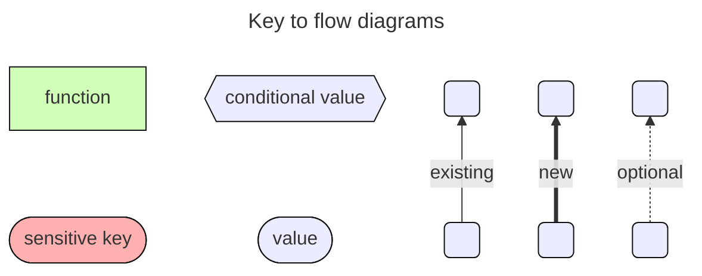
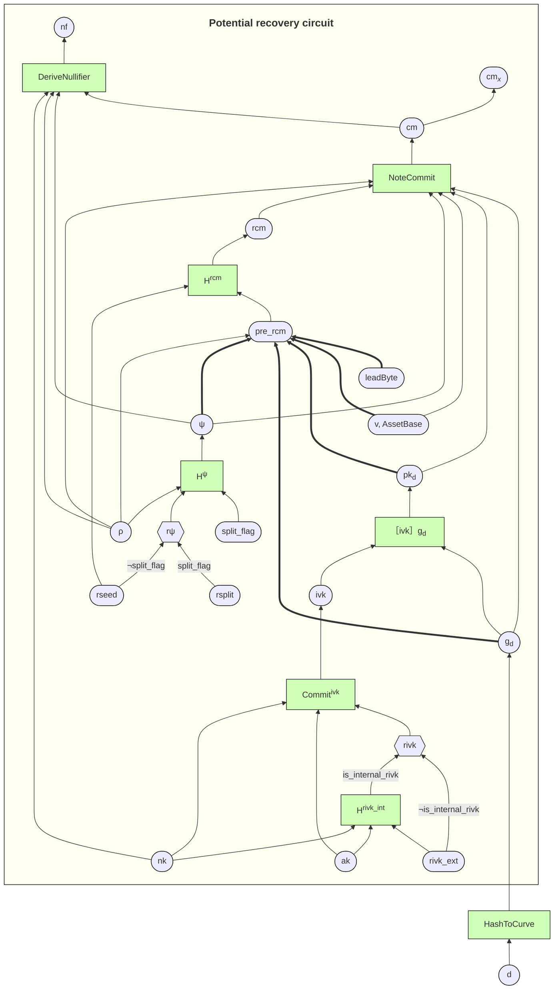
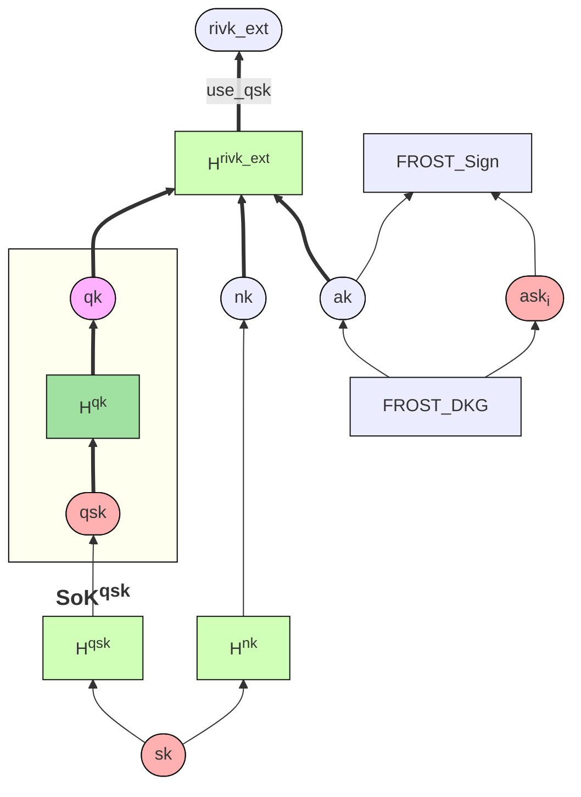
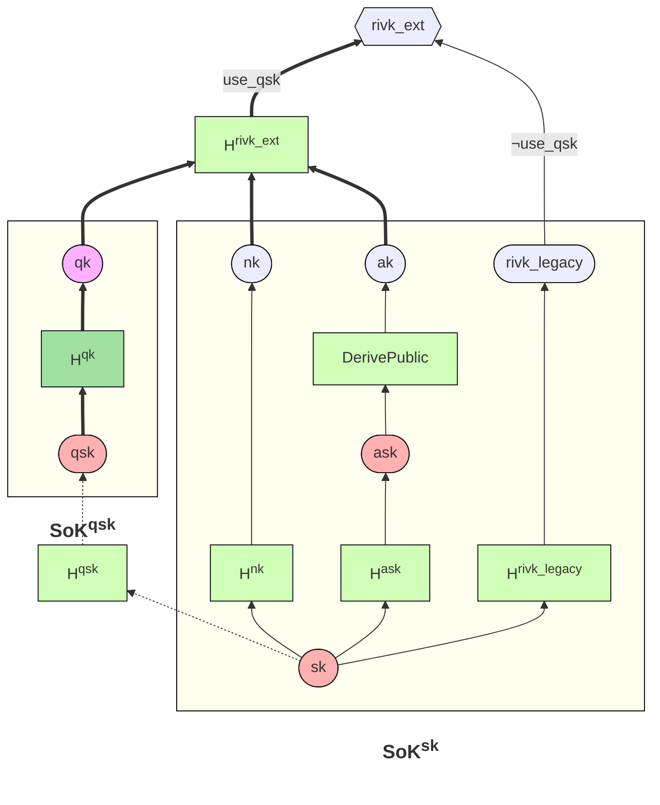

    ZIP: 2005
    Title: Quantum Recoverability
    Owners: Daira-Emma Hopwood <daira@jacaranda.org>
            Jack Grigg <thestr4d@gmail.com>
    Credits: Sean Bowe
    Status: Draft
    Category: Consensus
    Created: 2025-03-31
    License: MIT
    Discussions-To: <https://github.com/zcash/zips/issues/1135>
    Pull-Request: <https://github.com/zcash/zips/pull/1126>

# Terminology

The key words "MUST", "SHOULD", and "MAY" in this document are to be
interpreted as described in BCP 14 [^BCP14] when, and only when, they
appear in all capitals.

The term "network upgrade" in this document is to be interpreted as
described in ZIP 200. [^zip-0200]

The character § is used when referring to sections of the Zcash Protocol
Specification. [^protocol]

The terms "Mainnet" and "Testnet" are to be interpreted as described in
§ 3.12 ‘Mainnet and Testnet’. [^protocol-networks]

We use the convention followed in the protocol specification that an
$\underline{\mathsf{underlined}}$ variable indicates a byte sequence,
and a variable suffixed with $\star$ indicates a bit-sequence encoding of
an elliptic curve point.

The term "Zcash Shielded Assets" or "ZSAs" refers to the extension to
the Orchard shielded protocol described in ZIPs 226 and 227 [^zip-0226] [^zip-0227].

The term "Orchard[ZSA]" in this document refers to the Orchard shielded
protocol before the deployment of ZSAs, and to the OrchardZSA shielded
protocol after the deployment of ZSAs.

The term "recoverable Orchard[ZSA] note" refers to an Orchard or OrchardZSA
note that was created according to this proposal.

The term "Recovery Protocol" refers to a potential new shielded protocol
that would allow recovery of funds held in recoverable Orchard[ZSA] notes.
This ZIP describes the Recovery Protocol in outline but not in detail:
many of its design decisions are intentionally left open.

# Abstract

This ZIP proposes a change to the construction of Orchard[ZSA] notes
starting with v6 transactions, designed to improve Zcash's long-term
resilience against a significant potential threat to its security from
quantum computers. It does not by itself make the protocol secure against
quantum adversaries, but is intended to support a smoother transition to
future versions of Zcash designed to be so.

Specifically, if it were necessary to disable the current Orchard[ZSA]
shielded protocol in order to prevent a discrete-log-breaking adversary
from stealing or forging funds, this change would make it possible to use
a Recovery Protocol to recover existing Orchard funds. This Recovery Protocol
is expected to remain secure against discrete-log-breaking and quantum
adversaries.

If the Orchard[ZSA] protocol needed to be disabled for this reason, the
Sapling protocol would need to be disabled as well, which would make all
Sapling funds inaccessible. Sapling funds should be migrated to Orchard in
order to take advantage of this change.

# Motivation

If quantum computers —or any other attack that allows finding discrete
logarithms on the elliptic curves used in Zcash— were to become practical,
it would raise difficult issues for the Zcash community. An adversary able
to compute discrete logarithms could cause arbitrary inflation or steal
users' funds.

Critically, the note commitment algorithms used by the Sapling and Orchard
shielded protocols are not post-quantum binding. This means that even if
the proof system were upgraded to one that is believed to be secure against
quantum computers, and even if the note commitment tree were to be
reconstructed (from public information) to use a suitable hash function,
it would still be possible for a quantum or discrete-log-breaking adversary
to forge and spend notes that are not actually in the commitment tree —
thus breaking the Balance property.

This ZIP proposes a small change to the way Orchard[ZSA] notes are derived.
If this change is made in advance of quantum computers becoming viable,
then users' Orchard[ZSA] funds could remain safe and recoverable after a
post-quantum transition. This would not require any change to the Orchard
or proposed OrchardZSA *circuits* for the time being, and would not require
deciding on the particular proof system or note commitment tree hash used
in the future protocol.

Recovering Orchard[ZSA] funds after the post-quantum transition would
involve checking a more expensive and complicated statement in zero
knowledge, but it is expected that this will be entirely practical for the
intended usage of recovering funds into another shielded pool. The current
privacy properties of Orchard would be retained against pre-quantum
adversaries, and also against post-quantum adversaries without knowledge
of the notes' addresses. [^pq-zcash]

To reduce overall protocol complexity and analysis effort, we do *not*
propose a similar change for Sapling. Instead, Sapling funds can be
migrated to Orchard in order to make them quantum-recoverable. (Note
that this analysis effort needs to include the child and internal key
derivations defined in ZIP 32, which differ significantly between
Sapling [^zip-0032-sapling-child-key-derivation] [^zip-0032-sapling-internal-key-derivation]
and Orchard [^zip-0032-orchard-child-key-derivation] [^zip-0032-orchard-internal-key-derivation].)

This proposal is implementable at low risk, and required changes to existing
libraries and wallets are small. It can be folded into other changes
necessary to implement ZSAs [^zip-0226] and Memo Bundles [^zip-0231].

# Requirements

* Orchard[ZSA] notes constructed according to this proposal should be
  spendable via a Recovery Protocol (to be introduced, potentially,
  in a future upgrade) that is expected to be secure against
  discrete-log-breaking and quantum adversaries.
* No particular choice of post-quantum proving system or commitment
  tree hash should be assumed for that alternate protocol.
* The proposed scheme should be fully compatible with FROST
  multisignatures [^zip-0312], hardware wallets, and the combination
  of both.
* The proposed scheme should not require regeneration of existing
  non-multisignature keys or addresses.
* The changes made to the pre-quantum protocol should not cause a
  significant regression in performance, applicability, or security
  against any given adversary class, or require significant re-analysis
  of that protocol's pre-quantum security.
* The Recovery Protocol should ensure no loss of security against
  pre-quantum adversaries — including when FROST multisignatures and/or
  hardware wallets are used. (This is motivated by the fact that there
  is likely to be a period during which quantum attacks may be possible
  but very difficult.)
* Recovery of funds from hardware wallets that support this protocol
  should not require exposing the pre-quantum spend authorizing key
  $\mathsf{ask}$ to theft.
* The proposal should be compatible with Zcash Shielded Assets with
  minimal additional complexity [^zip-0226] [^zip-0227].

# Non-requirements

* It is not required to address discrete-log-breaking or quantum
  attacks on *privacy* with this proposal, as long as it does not
  cause any regression in privacy properties.
* It is not required to add support for the Recovery Protocol to
  consensus rules now.
* It is not required for spends using the Recovery Protocol to be
  as efficient as spends using the Orchard, OrchardZSA, or Sapling
  protocols.
* It is not anticipated that spends using the Recovery Protocol will
  need to be indistinguishable from non-Recovery spends.

# High-level summary of changes

This subsection and the flow diagram below are non-normative.

In order to support ZSAs [^zip-0226] [^zip-0227] and memo bundles
[^zip-0231], v6 transactions require in any case a new note plaintext
format, with lead byte $\mathtt{0x03}.$ This gives us an opportunity
to change the way that the $\mathsf{pre\_rcm}$ value is computed for
this new format, by including all of the note fields in $\mathsf{pre\_rcm}$.
The resulting $\mathsf{rcm}$ is essentially a random function of the
note fields — this allows us to argue that the overall commitment
scheme is post-quantum binding, as long as the new derivation of
$\mathsf{rcm}$ is checked in the Recovery Protocol.

Essentially the same technique also needs to be applied to the
function $\mathsf{Commit^{ivk}}$ that is used to derive Orchard
incoming viewing keys. In order to support existing keys, we have
the Recovery Protocol check the derivations of $\mathsf{nk}$,
$\mathsf{ak}$, and $\mathsf{rivk}$ from the secret key $\mathsf{sk}$.

Since this derivation of (at least) $\mathsf{ak}$ from $\mathsf{sk}$
cannot be used in the case of FROST key generation, we also provide an
alternative way to derive $\mathsf{rivk}$ which is to be used in that
case. This alternative derivation, using a new "quantum spending key"
$\mathsf{qsk}$ and "quantum intermediate key" $\mathsf{qk}$, also
supports more efficient use of hardware wallets in the Recovery Protocol.
It is described in sections [Usage with FROST] and [Usage with Hardware Wallets].

## Flow diagram for the Orchard and OrchardZSA protocols

This diagram shows, approximately, the derivation of Orchard keys,
addresses, notes, note commitments, and nullifiers. All of the flow
diagrams in this ZIP omit type conversions between curve points, field
elements, byte sequences, and bit sequences, and so are not sufficiently
precise to be used directly as a guide for implementation.

The bold lines are changes introduced by this ZIP, which all take the form
of additional inputs to derivation functions or alternative derivations.
The derivations shown in the box labelled "Potential recovery circuit" are,
roughly speaking, those enforced by the [Proposed Recovery Protocol].

# Specification

## Usage with FROST

When generating Orchard keys for FROST, $\mathsf{ak}$ will be derived jointly
from the participants' shares of $\mathsf{ask}$ according to the FROST
Distributed Key Generation (DKG) protocol.

This ZIP further constrains FROST key generation for Orchard as follows:
participants MUST privately agree on a value $\mathsf{sk}$, and then use it
with $\mathsf{use\_qsk} = \mathsf{true}$ to derive $\mathsf{nk}$, $\mathsf{qsk}$,
$\mathsf{qk}$, and (using the $\mathsf{ak}$ output by the DKG protocol)
$\mathsf{rivk\_ext}$, as specified in § 4.2.3 ‘Orchard Key Components’.

The protocol MUST ensure that all participants obtain the same values for
$\mathsf{ak}$, $\mathsf{nk}$, and $\mathsf{rivk\_ext}$. (Provided that the
participants have followed § 4.2.3, this implies that they have the same
$\mathsf{qsk}$ and $\mathsf{qk}$, by collision resistance of $\mathsf{H^{qk}}$
and $\mathsf{H^{rivk\_ext}}$.)

Each participant MUST treat $\mathsf{qsk}$ as a secret held at least as
securely and reliably as $\mathsf{ask}$. Note that $\mathsf{qsk}$ will
not be needed to sign unless and until the Recovery Protocol is needed,
but it is essential that it be retained, otherwise funds could be lost if
and when the current Orchard protocol is disabled.

The Recovery Protocol will still require a RedDSA signature verifiable by
the Spend validating key $\mathsf{ak}$, in addition to knowledge of
$\mathsf{qsk}$. Although RedDSA is not secure in the long term against a
quantum or discrete-log-breaking adversary, the most likely eventuality is
that attacks against it will be difficult for some years after the current
Orchard protocol is disabled. During this period, checking this RedDSA
signature in the Recovery Protocol will ensure that spend authorization by
a $t$-of-$n$ threshold of participants continues to be needed against
classical adversaries. This retains the usual advantage of FROST that the
parties can sign using their shares *without* reconstructing the Spend
authorizing key $\mathsf{ask}$. Coalitions of fewer than $t$ of the
participants will be unable to authorize spends as long as they do not
have access to a sufficiently powerful quantum computer.

Note that a quantum adversary may be able to steal the funds with only
access to $\mathsf{qsk}$, which is held by every participant. Therefore,
it is RECOMMENDED that as soon as a fully post-quantum protocol that
supports multisignatures is available, all funds held under FROST keys
be transferred into that protocol's shielded pool.

## Usage with hardware wallets

The same $\mathsf{use\_qsk}$ option can help to improve the efficiency of
using the Recovery Protocol with hardware wallets. If the keys
$\mathsf{rivk\_ext},$ $\mathsf{nk},$ and $\mathsf{ak}$ are generated from
$\mathsf{sk},$ then the circuit for the Recovery Protocol will need to
prove their correct derivation using $\mathsf{H^{rivk\_legacy}},$
$\mathsf{H^{nk}},$ $\mathsf{H^{ask}},$ and $\mathsf{DerivePublic}$ as
shown in the $\mathsf{SoK^{sk}}$ box of the diagram below.

When $\mathsf{use\_qsk}$ is used, on the other hand, it is possible for
the Recovery Protocol to support spend authorization using a much smaller
circuit that only uses $\mathsf{H^{qk}}$ and a commitment scheme.
For example, for some hiding and collapse binding commitment
$c = \mathsf{LinkCommit}_r(\mathsf{qk}, \mathsf{sighash}),$
the hardware wallet could prove knowledge of $(\mathsf{qsk}, r)$ such that
$c = \mathsf{LinkCommit}_r(\mathsf{H^{qk}}(\mathsf{qsk}), \mathsf{sighash}).$
This circuit is relatively small and it might be feasible to do the proof in
quite constrained hardware.

The host wallet would be given $\mathsf{nk},$ $\mathsf{ak},$ and $\mathsf{qk}$
for use in the main Recovery circuit (discussed later). The commitment $c$ would
be a public input opened to $(\mathsf{qk}, \mathsf{sighash})$ in that circuit,
ensuring that the hardware wallet has authorized the spend for the correct key.
Because $\mathsf{LinkCommit}$ is hiding and the proofs are zero knowledge, no
information is leaked about which $\mathsf{qk}$ is being used.

Alternatively, if the hardware wallet is unable to support making proofs at
all, it could be updated to permit exporting $\mathsf{qsk}$. This is less
secure against a quantum adversary that is able to obtain $\mathsf{qsk}$, but
it allows the funds to be transferred to another key or protocol. A quantum
adversary would have to break RedDSA in order to steal funds even if it were
to obtain $\mathsf{qsk}$, since $\mathsf{ask}$ would remain on the hardware
wallet.

## Specification Updates

This is written as a set of changes to version 2025.6.2 of the protocol
specification, and to the contents of ZIPs at the time of writing in
October 2025 (as proposed for the NU6.1 upgrade). It will need to be merged
with other changes for v6 transactions (memo bundles [^zip-0231] and
ZSAs [^zip-0226] [^zip-0227]).

### Changes to the Protocol Specification

#### § 3.2.1 ‘Note Plaintexts and Memo Fields’

Replace the paragraph

> Define $\mathsf{allowedLeadBytes^{protocol}}(\mathsf{height}, \mathsf{txVersion}) =$
> $\hspace{2em} \begin{cases}
>   \{ \mathtt{0x01} \},&\!\!\!\text{if } \mathsf{height} < \mathsf{CanopyActivationHeight} \\
>   \{ \mathtt{0x01}, \mathtt{0x02} \},&\!\!\!\text{if } \mathsf{CanopyActivationHeight} \leq \mathsf{height} < \mathsf{CanopyActivationHeight} + \mathsf{ZIP212GracePeriod} \\
>   \{ \mathtt{0x02} \},&\!\!\!\text{otherwise.}
> \end{cases}$

with

> Define $\mathsf{allowedLeadBytes^{protocol}}(\mathsf{height}, \mathsf{txVersion}) =$
> $\hspace{2em} \begin{cases}
>   \{ \mathtt{0x01} \},&\!\!\!\text{if } \mathsf{height} < \mathsf{CanopyActivationHeight} \\
>   \{ \mathtt{0x01}, \mathtt{0x02} \},&\!\!\!\text{if } \mathsf{CanopyActivationHeight} \leq \mathsf{height} < \mathsf{CanopyActivationHeight} + \mathsf{ZIP212GracePeriod} \\
>   \{ \mathtt{0x02} \},&\!\!\!\text{if } \mathsf{CanopyActivationHeight} + \mathsf{ZIP212GracePeriod} \leq \mathsf{height} \text{ and } \mathsf{txVersion} < 6 \\
>   \{ \mathtt{0x03} \},&\!\!\!\text{otherwise.}
> \end{cases}$

and delete "or $\mathsf{txVersion}$" from "It is intentional that the
definition of $\mathsf{allowedLeadBytes}$ does not currently depend on
$\mathsf{protocol}$ or $\mathsf{txVersion}$."

#### § 4.1.2 ‘Pseudo Random Functions’

In the list of places where $\mathsf{PRF^{expand}}$ is used:

Replace

> * [**NU5** onward] in § 4.2.3 ‘Orchard Key Components’, with inputs
>   $[\mathtt{0x06}]$, $[\mathtt{0x07}]$, $[\mathtt{0x08}]$, and with
>   first byte $\mathtt{0x82}$ (the last of these is also specified in
>   [[ZIP-32]](https://zips.z.cash/zip-0032));
> * in the processes of sending (§ 4.7.2 ‘Sending Notes (Sapling)’ and
>   § 4.7.3 ‘Sending Notes (Orchard)’) and of receiving
>   (§ 4.20 ‘In-band secret distribution (Sapling and Orchard)’) notes,
>   for Sapling with inputs $[\mathtt{0x04}]$ and $[\mathtt{0x05}]$,
>   and for Orchard $[t] || \underline{\text{ρ}}$ with
>   $t \in \{ \mathtt{0x05}, \mathtt{0x04}, \mathtt{0x09} \}$;

with

> * [**NU5** onward] in § 4.2.3 ‘Orchard Key Components’, with inputs
>   $[\mathtt{0x06}]$, $[\mathtt{0x07}]$, $[\mathtt{0x08}]$, with first
>   byte in $\{ \mathtt{0x0C}, \mathtt{0x0D} \}$ (also specified in
>   {{ reference to this ZIP }}), and with first byte $\mathtt{0x82}$
>   (also specified in [[ZIP-32]](https://zips.z.cash/zip-0032));
> * in the processes of sending (§ 4.7.2 ‘Sending Notes (Sapling)’ and
>   § 4.7.3 ‘Sending Notes (Orchard)’) and of receiving
>   (§ 4.20 ‘In-band secret distribution (Sapling and Orchard)’) notes,
>   for Sapling with inputs $[\mathtt{0x04}]$ and $[\mathtt{0x05}]$,
>   and for Orchard with first byte in
>   $\{ \mathtt{0x05}, \mathtt{0x04}, \mathtt{0x09}, \mathtt{0x0A}, \mathtt{0x0B} \}$
>   ($\mathtt{0x0A}$ and $\mathtt{0x0B}$ are also specified in
>   {{ reference to this ZIP }});

Add

> * in {{ reference to this ZIP }}, with first byte in
>   $\{ \mathtt{0x0A}, \mathtt{0x0B}, \mathtt{0x0C}, \mathtt{0x0D} \}$.

#### § 4.2.3 ‘Orchard Key Components’

Add $\ell_{\mathsf{qsk}}$ and $\ell_{\mathsf{qk}}$ to the constants obtained
from § 5.3 ‘Constants’.

Insert after the definition of $\mathsf{ToScalar^{Orchard}}$:

> Define $\mathsf{H}^{\mathsf{rivk\_ext}}_{\mathsf{qk}}(\mathsf{ak}, \mathsf{nk}) = \mathsf{ToScalar^{Orchard}}(\mathsf{PRF^{expand}_{qk}}([\mathtt{0x0D}] \,||\, \mathsf{I2LEOSP}_{256}(\mathsf{ak})$
> $\hspace{23.9em} ||\, \mathsf{I2LEOSP}_{256}(\mathsf{nk})))$.

Replace from "From this spending key" up to and including the line
"let $\mathsf{ak} = \mathsf{Extract}_{\mathbb{P}}(\mathsf{ak}^{\mathbb{P}})$"
in the algorithm with:

> Under normal circumstances, the Spend authorizing key
> $\mathsf{ask} \;{\small ⦂}\; \mathbb{F}^{*}_{r_{\mathbb{P}}}$ is derived
> directly from $\mathsf{sk}$. However, this might not be the case for
> protocols that require distributed generation of shares of $\mathsf{ask}$,
> such as FROST's Distributed Key Generation [^zip-0312-key-generation]
> (see {{ reference to the [Usage with FROST] section of this ZIP }} for
> further discussion). To support this we define an alternative derivation
> method using an additional "quantum spending key", $\mathsf{qsk}$, and
> "quantum intermediate key", $\mathsf{qk}$.
>
> There can also be advantages to not deriving $\mathsf{ask}$ directly from
> $\mathsf{sk}$ for hardware wallets, in order to separate the authority to
> make proofs for the Recovery Protocol from the spend authorization key
> that is kept on the device (see {{ reference to the [Usage with hardware wallets]
> section of this ZIP }}). The derivation from $\mathsf{qsk}$ can also be
> used in that case.
>
> Let $\mathsf{use\_qsk} \;{\small ⦂}\; \mathbb{B}$ be a flag that is set
> to true when the derivation from $\mathsf{qsk}$ is used, or false if
> $\mathsf{ask}$ is derived directly from $\mathsf{sk}$. (In cases where
> it is desired for the generation of key components to match versions of
> this specification prior to {{ fill in version }}, $\mathsf{use\_qsk}$
> needs to be set to false.)
>
> Define:
> * $\mathsf{H^{ask}}(\mathsf{sk}) = \mathsf{ToScalar^{Orchard}}\big(\mathsf{PRF^{expand}_{sk}}([\mathtt{0x06}])\kern-0.1em\big)$
> * $\mathsf{H^{nk}}(\mathsf{sk}) = \mathsf{ToBase^{Orchard}}\big(\mathsf{PRF^{expand}_{sk}}([\mathtt{0x07}])\kern-0.1em\big)$
> * $\mathsf{H^{rivk}}(\mathsf{sk}) = \mathsf{ToScalar^{Orchard}}\big(\mathsf{PRF^{expand}_{sk}}([\mathtt{0x08}])\kern-0.1em\big)$
> * $\mathsf{H^{qsk}}(\mathsf{sk}) = \mathsf{truncate}_{32}\big(\mathsf{PRF^{expand}_{sk}}([\mathtt{0x0C}])\kern-0.1em\big)$
> * $\mathsf{H^{qk}}(\mathsf{qsk}) = \textsf{BLAKE2s\kern0.1em-256}(\texttt{“Zcash\_qk”}, \mathsf{qsk})$.
> 
> $\mathsf{ask} \;{\small ⦂}\; \mathbb{F}^{*}_{r_{\mathbb{P}}}$,
> the Spend validating key $\mathsf{ak} \;{\small ⦂}\; \{ 1\,..\,q_{\mathbb{P}}-1 \}$,
> the nullifier deriving key $\mathsf{nk} \;{\small ⦂}\; \mathbb{F}_{q_{\mathbb{P}}}$,
> the optional quantum spending key $\mathsf{qsk} \;{\small ⦂}\; \mathbb{B}^{{\kern-0.1em\tiny\mathbb{Y}}[\ell_{\mathsf{qsk}}/8]} \cup \{\bot\}$
> and quantum intermediate key $\mathsf{qk} \;{\small ⦂}\; \mathbb{B}^{{\kern-0.1em\tiny\mathbb{Y}}[\ell_{\mathsf{qk}}/8]} \cup \{\bot\}$
> the $\mathsf{Commit^{ivk}}$ randomness $\mathsf{rivk} \;{\small ⦂}\; \mathbb{F}_{r_{\mathbb{P}}}$,
> the diversifier key $\mathsf{dk} \;{\small ⦂}\; \mathbb{B}^{{\kern-0.1em\tiny\mathbb{Y}}[\ell_{\mathsf{dk}}/8]}$,
> the $\mathsf{KA^{Orchard}}$ private key $\mathsf{ivk} \;{\small ⦂}\; \{ 1\,..\,q_{\mathbb{P}}-1 \}$,
> the outgoing viewing key $\mathsf{ovk} \;{\small ⦂}\; \mathbb{B}^{{\kern-0.1em\tiny\mathbb{Y}}[\ell_{\mathsf{ovk}}/8]}$,
> and corresponding “internal” keys MUST be derived as follows:
>
> $\hspace{1.0em}$ let $\mathsf{nk} = \mathsf{H^{nk}}(\mathsf{sk})$  
> $\hspace{1.0em}$ if $\mathsf{use\_qsk}$:  
> $\hspace{2.5em}$     generate $\mathsf{ask} \;{\small ⦂}\; \mathbb{F}^{*}_{r_{\mathbb{P}}}$ and corresponding $\mathsf{SpendAuthSig^{Orchard}}$ public key $\mathsf{ak}^{\mathbb{P}} \;{\small ⦂}\; \mathbb{P}^*$  
> $\hspace{3.5em}$     using any suitably secure method that ensures the last bit of $\mathsf{repr}_{\mathbb{P}}(\mathsf{ak}_{\mathbb{P}})$ is $0$.  
> $\hspace{2.5em}$     let $\mathsf{ak} = \mathsf{Extract}_{\mathbb{P}}(\mathsf{ak}_{\mathbb{P}})$  
> $\hspace{2.5em}$     let $\mathsf{qsk} = \mathsf{H^{qsk}}(\mathsf{sk})$  
> $\hspace{2.5em}$     let $\mathsf{qk} = \mathsf{H^{qk}}(\mathsf{qsk})$  
> $\hspace{2.5em}$     let $\mathsf{rivk} = \mathsf{H}^{\mathsf{rivk\_ext}}_{\mathsf{qk}}(\mathsf{ak}, \mathsf{nk})$  
> $\hspace{1.0em}$ else:  
> $\hspace{2.5em}$     let mutable $\mathsf{ask} \leftarrow \mathsf{H^{ask}}(\mathsf{sk})$  
> $\hspace{2.5em}$     let $\mathsf{ak}_{\mathbb{P}} = \mathsf{SpendAuthSig^{Orchard}.DerivePublic}(\mathsf{ask})$  
> $\hspace{2.5em}$     if the last bit (that is, the $\tilde{y}$ bit) of $\mathsf{repr}_{\mathbb{P}}(\mathsf{ak}_{\mathbb{P}})$ is $1$:  
> $\hspace{4.0em}$           set $\mathsf{ask} \leftarrow -\mathsf{ask}$
> 
> $\hspace{2.5em}$     let $\mathsf{ak} = \mathsf{Extract}_{\mathbb{P}}(\mathsf{ak}_{\mathbb{P}})$  
> $\hspace{2.5em}$     let $\mathsf{qsk} = \mathsf{qk} = \bot$ (there are no quantum spending/intermediate keys in this case)  
> $\hspace{2.5em}$     let $\mathsf{rivk} = \mathsf{H^{rivk}}(\mathsf{sk})$

Add the following notes:

> * If $\mathsf{ask}$, $\mathsf{ak}$, $\mathsf{nk}$, $\mathsf{rivk}$, and
>   $\mathsf{rivk_{internal}}$ are not generated as specified in this
>   section, then it may not be possible to recover the resulting notes as
>   specified in {{ reference to this ZIP }} in the event that attacks
>   using quantum computers become practical. In addition, to recover
>   notes it is necessary to retain, or be able to rederive the following
>   information.
>   * When $\mathsf{use\_qsk}$ is $\mathsf{false}$: the secret key $\mathsf{sk}$.
>     This will be the case when $\mathsf{sk}$ is generated according to
>     [[ZIP-32]](https://zips.z.cash/zip-0032), and the master seed *or*
>     any secret key and chain code above $\mathsf{sk}$ in the derivation
>     hierarchy is retained.
>   * When $\mathsf{use\_qsk}$ is $\mathsf{true}$: the combination of the
>     full viewing key $(\mathsf{ak}, \mathsf{nk}, \mathsf{rivk})$, the
>     quantum spending key $\mathsf{qsk}$, and the ability to make spend
>     authorization signatures with $\mathsf{ask}$.
>
>   When the latter option is used, see {{ reference to the
>   [Usage with hardware wallets] section of this ZIP }} for
>   recommendations on the storage of, and access to $\mathsf{qsk}$
>   and $\mathsf{qk}$.

#### § 4.7.2 ‘Sending Notes (Sapling)’

Add after the definition of $\mathsf{leadByte}$:

> Define $\mathsf{H^{rcm,Sapling}_{rseed}}(\_, \_) = \mathsf{ToScalar^{Sapling}}\big(\mathsf{PRF^{expand}_{rseed}}([\mathtt{0x04}])\kern-0.1em\big)$
>
> Define $\mathsf{H^{esk,Sapling}_{rseed}}(\_, \_) = \mathsf{ToScalar^{Sapling}}\big(\mathsf{PRF^{expand}_{rseed}}([\mathtt{0x05}])\kern-0.1em\big)$.
>
> ($\mathsf{H^{rcm,Sapling}}$ and $\mathsf{H^{esk,Sapling}}$ intentionally
> take arguments that are unused.)

Replace the lines deriving $\mathsf{rcm}$ and $\mathsf{esk}$ with

> Derive $\mathsf{rcm} = \mathsf{H^{rcm,Sapling}_{rseed}}(\bot, \bot)$
> 
> Derive $\mathsf{esk} = \mathsf{H^{esk,Sapling}_{rseed}}(\bot, \bot)$

#### § 4.7.3 ‘Sending Notes (Orchard)’

Add after the definition of $\mathsf{leadByte}$:

> Define $\mathsf{H^{rcm,Orchard}_{rseed}}\big(\mathsf{leadByte}, (\mathsf{g}\star_{\mathsf{d}}, \mathsf{pk}\star_{\mathsf{d}}, \mathsf{v}, \underline{\text{ρ}}, \text{ψ}[, \mathsf{AssetBase}\kern0.08em\star])\kern-0.1em\big) =$
>   $\mathsf{ToScalar^{Orchard}}\big(\mathsf{PRF^{expand}_{rseed}}(\mathsf{pre\_rcm})\kern-0.1em\big)$
>
> where $\mathsf{pre\_rcm} = \begin{cases}
>   [\mathtt{0x05}] \,||\, \underline{\text{ρ}},&\!\!\!\text{if } \mathsf{leadByte} = \mathtt{0x02} \\
>   [\mathtt{0x0B}, \mathsf{leadByte}] \,||\, \mathsf{LEBS2OSP}_{256}(\mathsf{g}\star_{\mathsf{d}}) \,||\, \mathsf{LEBS2OSP}_{256}(\mathsf{pk}\star_{\mathsf{d}}) \\
>   \hphantom{[\mathtt{0x0B}, \mathsf{leadByte}]} \,||\, \mathsf{I2LEOSP}_{64}(\mathsf{v}) \,||\, \underline{\text{ρ}} \,||\, \mathsf{I2LEOSP}_{256}(\text{ψ}) \\
>   \hphantom{[\mathtt{0x0B}, \mathsf{leadByte}]}\,[\,||\, \mathsf{LEBS2OSP}_{256}(\mathsf{AssetBase}\kern0.08em\star)],&\!\!\!\text{if } \mathsf{leadByte} = \mathtt{0x03}
> \end{cases}$
>
> Define $\mathsf{H^{esk,Orchard}_{rseed}}(\underline{\text{ρ}}) = \mathsf{ToScalar^{Orchard}}\big(\mathsf{PRF^{expand}_{rseed}}([\mathtt{0x04}] \,||\, \underline{\text{ρ}})\kern-0.1em\big)$.
>
> Define $\mathsf{H^{\text{ψ},Orchard}_{rseed}}(\underline{\text{ρ}}, \mathsf{split\_flag}) = \mathsf{ToBase^{Orchard}}\big(\mathsf{PRF^{expand}_{rseed}}([\mathsf{split\_domain}] \,||\, \underline{\text{ρ}})\kern-0.1em\big)$.
> where $\mathsf{split\_domain} = \begin{cases}
>   \mathtt{0x09}&\text{if } \mathsf{split\_flag} = 0 \\
>   \mathtt{0x0A}&\text{if } \mathsf{split\_flag} = 1\text{.}
> \end{cases}$

Insert before the derivation of $\mathsf{esk}$:

> Let $\mathsf{g}\star_{\mathsf{d}} = \mathsf{repr}_{\mathbb{P}}(\mathsf{g_d})$,
> $\mathsf{pk}\star_{\mathsf{d}} = \mathsf{repr}_{\mathbb{P}}(\mathsf{pk_d}) [$,
> and $\mathsf{AssetBase}\kern0.08em\star = \mathsf{repr}_{\mathbb{P}}(\mathsf{AssetBase})]$.

and use these in the inputs to $\mathsf{NoteCommit^{Orchard}}$.

Replace the lines deriving $\mathsf{esk}$, $\mathsf{rcm}$, and $\text{ψ}$
with

> Derive $\mathsf{esk} = \mathsf{H^{esk,Orchard}_{rseed}}(\underline{\text{ρ}})$

> Derive $\mathsf{rcm} = \mathsf{H^{rcm,Orchard}_{rseed}}(\mathsf{leadByte}, (\mathsf{g}\star_{\mathsf{d}}, \mathsf{pk}\star_{\mathsf{d}}, \mathsf{v}, \underline{\text{ρ}}, \text{ψ}[, \mathsf{AssetBase}\kern0.08em\star]))$

> Derive $\text{ψ} = \mathsf{H^{\text{ψ},Orchard}_{rseed}}(\underline{\text{ρ}}, \mathsf{split\_flag})$

#### § 4.8.2 ‘Dummy Notes (Sapling)’

Add

> Let $\mathsf{H^{rcm,Sapling}}$ be as defined in
> § 4.7.2 ‘Sending Notes (Sapling)’.

Replace the line deriving $\mathsf{rcm}$ with

> Derive $\mathsf{rcm} = \mathsf{H^{rcm,Sapling}_{rseed}}(\bot, \bot)$

#### § 4.8.3 ‘Dummy Notes (Orchard)’

Insert before "The spend-related fields ...":

> Let $\mathsf{H^{rcm,Orchard}}$ and $\mathsf{H^{\text{ψ},Orchard}}$ be
> as defined in § 4.7.3 ‘Sending Notes (Orchard)’.

Replace the lines deriving $\mathsf{rcm}$ and $\text{ψ}$ with

> Let $\mathsf{g}\star_{\mathsf{d}} = \mathsf{repr}_{\mathbb{P}}(\mathsf{g_d})$,
> $\mathsf{pk}\star_{\mathsf{d}} = \mathsf{repr}_{\mathbb{P}}(\mathsf{pk_d}) [$,
> and $\mathsf{AssetBase}\kern0.08em\star = \mathsf{repr}_{\mathbb{P}}(\mathsf{AssetBase})]$.
>
> Derive $\mathsf{rcm} = \mathsf{H^{rcm,Orchard}_{rseed}}(\mathsf{leadByte}, (\mathsf{g}\star_{\mathsf{d}}, \mathsf{pk}\star_{\mathsf{d}}, \mathsf{v}, \underline{\text{ρ}}, \text{ψ}[, \mathsf{AssetBase}\kern0.08em\star]))$
>
> Derive $\text{ψ} = \mathsf{H^{\text{ψ},Orchard}_{rseed}}(\underline{\text{ρ}}, 0)$

and use $\mathsf{g}\star_{\mathsf{d}}$, $\mathsf{pk}\star_{\mathsf{d}}$,
and $\mathsf{AssetBase}\kern0.08em\star$ in the inputs to
$\mathsf{NoteCommit^{Orchard}}$.

#### § 4.20.2 and § 4.20.3 ‘Decryption using an Incoming/Full Viewing Key (Sapling and Orchard)’

For both § 4.20.2 and § 4.20.3, add before the decryption procedure:

> Let $\mathsf{H^{rcm,Sapling}}$ and $\mathsf{H^{\text{esk},Sapling}}$
> be as defined in § 4.7.2 ‘Sending Notes (Sapling)’.
>
> Let $\mathsf{H^{rcm,Orchard}}$, $\mathsf{H^{\text{esk},Orchard}}$,
> and $\mathsf{H^{\text{ψ},Orchard}}$ be as defined in
> § 4.7.3 ‘Sending Notes (Orchard)’.

For § 4.20.3, replace

> $\hspace{1.0em}$ if $\mathsf{esk} \geq r_{\mathbb{G}}$ or $\mathsf{pk_d} = \bot$, return $\bot$

with

> $\hspace{1.0em}$ if $\mathsf{esk} \geq r_{\mathbb{G}}$ or $\mathsf{pk_d} = \bot$ or (for Sapling) $\mathsf{pk_d} \not\in \mathbb{J}^{(r)*}$
> (see note below), return $\bot$

and in the note containing "However, this is technically redundant with the
later check that returns $\bot$ if $\mathsf{pk_d} \not\in \mathbb{J}^{(r)*}$",
delete the word "later".

For both § 4.20.2 and § 4.20.3, replace

> $\hspace{1.0em}$ for Sapling, let $\mathsf{pre\_rcm} = [4]$ and $\mathsf{pre\_esk} = [5]$  
> $\hspace{1.0em}$ for Orchard, let $\underline{\text{ρ}} = \mathsf{I2LEOSP}_{256}(\mathsf{nf^{old}}$ from the same Action description $\!)$, $\mathsf{pre\_rcm} = [5] \,||\, \underline{\text{ρ}}$, and $\mathsf{pre\_esk} = [4] \,||\, \underline{\text{ρ}}$

with

> $\hspace{1.0em}$ let $\underline{\text{ρ}} = \mathsf{I2LEOSP}_{256}(\mathsf{nf^{old}}$ from the same Action description $\!)$

For § 4.20.2, replace

> $\hspace{1.0em}$ let $\mathsf{rcm} = \begin{cases}
>                    \mathsf{LEOS2IP}_{256}(\mathsf{rseed}),&\!\!\!\text{if } \mathsf{leadByte} = \mathtt{0x01} \\
>                    \mathsf{ToScalar}(\mathsf{PRF^{expand}_{rseed}}(\mathsf{pre\_rcm})),&\!\!\!\text{otherwise}
>                  \end{cases}$  
> $\hspace{1.0em}$ if $\mathsf{rcm} \geq r_{\mathbb{G}}$, return $\bot$  
> $\hspace{1.0em}$ let $\mathsf{g_d} = \mathsf{DiversifyHash}(\mathsf{d})$. if (for Sapling) $\mathsf{g_d} = \bot$, return $\bot$  
> $\hspace{1.0em}$ [**Canopy** onward] if $\mathsf{leadByte} \neq \mathtt{0x01}$:  
> $\hspace{2.5em}$     $\mathsf{esk} = \mathsf{ToScalar^{protocol}}(\mathsf{PRF^{expand}_{rseed}}(\mathsf{pre\_esk}))$  
> $\hspace{2.5em}$     if $\mathsf{repr}_{\mathbb{G}}(\mathsf{KA.DerivePublic}(\mathsf{esk}, \mathsf{g_d})) \neq \mathtt{ephemeralKey}$, return $\bot$
> 
> $\hspace{1.0em}$ let $\mathsf{pk_d} = \mathsf{KA.DerivePublic}(\mathsf{ivk}, \mathsf{g_d})$

with

> $\hspace{1.0em}$ let $\mathsf{g_d} = \mathsf{DiversifyHash}(\mathsf{d})$. if (for Sapling) $\mathsf{g_d} = \bot$, return $\bot$  
> $\hspace{1.0em}$ [**Canopy** onward] if $\mathsf{leadByte} \neq \mathtt{0x01}$:  
> $\hspace{2.5em}$     let $\mathsf{esk} = \mathsf{H^{esk,protocol}_{rseed}}(\underline{\text{ρ}})$  
> $\hspace{2.5em}$     if $\mathsf{repr}_{\mathbb{G}}(\mathsf{KA.DerivePublic}(\mathsf{esk}, \mathsf{g_d})) \neq \mathtt{ephemeralKey}$, return $\bot$  
> 
> $\hspace{1.0em}$ let $\mathsf{pk_d} = \mathsf{KA.DerivePublic}(\mathsf{ivk}, \mathsf{g_d})$  
> $\hspace{1.0em}$ let $\mathsf{g}\star_{\mathsf{d}} = \mathsf{repr}_{\mathbb{P}}(\mathsf{g_d})$, $\mathsf{pk}\star_{\mathsf{d}} = \mathsf{repr}_{\mathbb{P}}(\mathsf{pk_d}) [$, and $\mathsf{AssetBase}\kern0.08em\star = \mathsf{repr}_{\mathbb{P}}(\mathsf{AssetBase})]$  
> $\hspace{1.0em}$ let $\text{ψ} = \mathsf{H^{\text{ψ},Orchard}_{rseed}}(\underline{\text{ρ}}, 0)$ for Orchard or $\bot$ for Sapling  
> $\hspace{1.0em}$ let $\mathsf{rcm} = \begin{cases}
>                    \mathsf{LEOS2IP}_{256}(\mathsf{rseed}),&\!\!\!\text{if } \mathsf{leadByte} = \mathtt{0x01} \\
>                    \mathsf{H^{rcm,protocol}_{rseed}}(\mathsf{leadByte}, (\mathsf{g}\star_{\mathsf{d}}, \mathsf{pk}\star_{\mathsf{d}}, \mathsf{v}, \underline{\text{ρ}}, \text{ψ}[, \mathsf{AssetBase}\kern0.08em\star])),&\!\!\!\text{otherwise}
>                  \end{cases}$  
> $\hspace{1.0em}$ if $\mathsf{rcm} \geq r_{\mathbb{G}}$, return $\bot$

The order of operations has to be altered because the derivation of
$\mathsf{rcm}$ can depend on $\mathsf{g_d}$ and $\mathsf{pk_d}$.
The definitions of $\mathsf{pre\_rcm}$ and $\mathsf{pre\_esk}$ are moved into
§ 4.7.2 ‘Sending Notes (Sapling)’ and § 4.7.3 ‘Sending Notes (Orchard)’ which
define $\mathsf{H^{rcm,protocol}}$.

For § 4.20.3, replace

> $\hspace{1.0em}$ let $\mathsf{rcm} = \begin{cases}
>                    \mathsf{LEOS2IP}_{256}(\mathsf{rseed}),&\!\!\!\text{if } \mathsf{leadByte} = \mathtt{0x01} \\
>                    \mathsf{ToScalar}(\mathsf{PRF^{expand}_{rseed}}(\mathsf{pre\_rcm})),&\!\!\!\text{otherwise}
>                  \end{cases}$  
> $\hspace{1.0em}$ if $\mathsf{rcm} \geq r_{\mathbb{G}}$, return $\bot$  
> $\hspace{1.0em}$ let $\mathsf{g_d} = \mathsf{DiversifyHash}(\mathsf{d})$. if (for Sapling) $\mathsf{g_d} = \bot$ or $\mathsf{pk_d} \not\in \mathbb{J}^{(r)*}$ (see note below), return $\bot$

with

> $\hspace{1.0em}$ let $\mathsf{g_d} = \mathsf{DiversifyHash}(\mathsf{d})$. if (for Sapling) $\mathsf{g_d} = \bot$, return $\bot$  
> $\hspace{1.0em}$ let $\mathsf{g}\star_{\mathsf{d}} = \mathsf{repr}_{\mathbb{P}}(\mathsf{g_d})$, $\mathsf{pk}\star_{\mathsf{d}} = \mathsf{repr}_{\mathbb{P}}(\mathsf{pk_d}) [$, and $\mathsf{AssetBase}\kern0.08em\star = \mathsf{repr}_{\mathbb{P}}(\mathsf{AssetBase})]$  
> $\hspace{1.0em}$ let $\text{ψ} = \mathsf{H^{\text{ψ},Orchard}_{rseed}}(\underline{\text{ρ}}, 0)$ for Orchard or $\bot$ for Sapling  
> $\hspace{1.0em}$ let $\mathsf{rcm} = \begin{cases}
>                    \mathsf{LEOS2IP}_{256}(\mathsf{rseed}),&\!\!\!\text{if } \mathsf{leadByte} = \mathtt{0x01} \\
>                    \mathsf{H^{rcm,protocol}_{rseed}}(\mathsf{leadByte}, (\mathsf{g}\star_{\mathsf{d}}, \mathsf{pk}\star_{\mathsf{d}}, \mathsf{v}, \underline{\text{ρ}}, \text{ψ}[, \mathsf{AssetBase}\kern0.08em\star])),&\!\!\!\text{otherwise}
>                  \end{cases}$  
> $\hspace{1.0em}$ if $\mathsf{rcm} \geq r_{\mathbb{G}}$, return $\bot$

and delete "where $\text{ψ} = \mathsf{ToBase^{Orchard}}(\mathsf{PRF^{expand}_{rseed}}([9] \,||\, \underline{\text{ρ}}))$".

#### § 5.3 ‘Constants’

Add the definitions

> $\ell_{\mathsf{qsk}} \;{\small ⦂}\; \mathbb{N} := 256$  
> $\ell_{\mathsf{qk}} \;{\small ⦂}\; \mathbb{N} := 256$

### Changes to ZIPs

#### ZIP 32

Add a $\ast$ to the arrows leading to $\mathsf{ask}$ and $\mathsf{rivk}$
in the diagram in section ‘Orchard internal key derivation’
[^zip-0032-orchard-internal-key-derivation], with the following note:

> $\ast$ The derivations of $\mathsf{ask}$ and $\mathsf{rivk}$ shown in
> the diagram are not the only possibility. For further detail see
> § 4.2.3 ‘Orchard Key Components’ in the protocol specification.
> However, if $\mathsf{ask}$, $\mathsf{ak}$, $\mathsf{nk}$, $\mathsf{rivk}$,
> and $\mathsf{rivk_{internal}}$ are not generated as in the diagram, then
> it may not be possible to recover the resulting notes as specified in
> {{ reference to this ZIP }} in the event that attacks using quantum
> computers become practical.

#### ZIP 212

Add a note before the Abstract:

This ZIP reflects the changes made to note encryption for the Canopy upgrade.
It does not include subsequent changes in {{ reference to this ZIP }}.

#### ZIP 226

Add the following to the section [Note Structure and Commitment](https://zips.z.cash/zip-0226#note-structure-and-commitment):

> When § 4.7.3 ‘Sending Notes (Orchard)’ or § 4.8.3 ‘Dummy Notes (Orchard)’
> are invoked directly or indirectly in the computation of $\text{ρ}$ and
> $\text{ψ}$ for an OrchardZSA note, $\mathsf{leadByte}$ MUST be set to
> $\mathtt{0x03}$.

In section [Split Notes](https://zips.z.cash/zip-0226#split-notes), change:

> where $\text{ψ}^{\mathsf{nf}}$ is sampled uniformly at random on
> $\mathbb{F}_{q_{\mathbb{P}}}$, ...

to

> where $\text{ψ}^{\mathsf{nf}}$ is computed as
> $\mathsf{H^{\text{ψ},Orchard}_{rseed\_nf}}(\underline{\text{ρ}}, 1) = \mathsf{ToBase^{Orchard}}\big(\mathsf{PRF^{expand}_{rseed\_nf}}([\mathtt{0x0A}] \,||\, \underline{\text{ρ}})\kern-0.1em\big)$
> for $\mathsf{rseed\_nf}$ sampled uniformly at random on $\mathbb{B}^{{\kern-0.1em\tiny\mathbb{Y}}[32]}$, ...

# Rationale

## Cryptographic background

This rationale is written primarily for cryptologists and protocol
designers familiar with the Zcash shielded protocols. It is recommended
to first read the slides of, and/or watch the following presentations:

* *Understanding Zcash Security* at Zcon3 [^zcash-security]
* *Post-Quantum Zcash* at ZconVI [^pq-zcash]

To understand the modelling of hash function and commitment security
against a quantum adversary we also recommend [^Unruh2015] and [^Unruh2016].

## Proposed Recovery Protocol

The details of the protocol in this section are subject to change. This
description is meant to facilitate analysis of whether the specification
changes to be adopted now are likely to be sufficient to securely support
a Recovery Protocol.

The proposed Recovery Protocol works, roughly speaking, by enforcing the
derivations given in the [Flow diagram for the Orchard and OrchardZSA protocols],
and we suggest having that diagram open in another window to refer to it.

Import this definition from § 4.7.3 ‘Sending Notes (Orchard)’:

> Let $\mathsf{leadByte}$ be the note plaintext lead byte, chosen
> according to § 3.2.1 ‘Note Plaintexts and Memo Fields’ with
> $\mathsf{protocol} = \mathsf{Orchard}$.
>
> Define $\mathsf{H^{rcm,Orchard}_{rseed}}\big(\mathsf{leadByte}, (\mathsf{g}\star_{\mathsf{d}}, \mathsf{pk}\star_{\mathsf{d}}, \mathsf{v}, \underline{\text{ρ}}, \text{ψ}[, \mathsf{AssetBase}\kern0.08em\star])\kern-0.1em\big) =$
> $\mathsf{ToScalar^{Orchard}}\big(\mathsf{PRF^{expand}_{rseed}}(\mathsf{pre\_rcm})\kern-0.1em\big)$
>
> where $\mathsf{pre\_rcm} = \begin{cases}
>   [\mathtt{0x05}] \,||\, \underline{\text{ρ}},&\!\!\!\text{if } \mathsf{leadByte} = \mathtt{0x02} \\
>   [\mathtt{0x0B}, \mathsf{leadByte}] \,||\, \mathsf{LEBS2OSP}_{256}(\mathsf{g}\star_{\mathsf{d}}) \,||\, \mathsf{LEBS2OSP}_{256}(\mathsf{pk}\star_{\mathsf{d}}) \\
>   \hphantom{[\mathtt{0x0B}, \mathsf{leadByte}]} \,||\, \mathsf{I2LEOSP}_{64}(\mathsf{v}) \,||\, \underline{\text{ρ}} \,||\, \mathsf{I2LEOSP}_{256}(\text{ψ}) \\
>   \hphantom{[\mathtt{0x0B}, \mathsf{leadByte}]}\,[\,||\, \mathsf{LEBS2OSP}_{256}(\mathsf{AssetBase}\kern0.08em\star)],&\!\!\!\text{if } \mathsf{leadByte} = \mathtt{0x03}\text{.} \\
> \end{cases}$

Define:

* $\mathsf{H}^{\text{ψ},\mathsf{Orchard}}_{\mathsf{r}\text{ψ}}(\underline{\text{ρ}}, \mathsf{split\_flag}) = \mathsf{ToBase^{Orchard}}(\mathsf{PRF}^{\mathsf{expand}}_{\mathsf{r}\text{ψ}}([\mathsf{split\_domain}] \,||\, \underline{\text{ρ}}))$  
  where $\mathsf{split\_domain} = \begin{cases}
    \mathtt{0x09},&\!\!\!\text{if } \mathsf{split\_flag} = 0 \\
    \mathtt{0x0A},&\!\!\!\text{if } \mathsf{split\_flag} = 1\text{.}
  \end{cases}$
* $\mathsf{H^{rivk\_int}_{rivk\_ext}}(\mathsf{ak}, \mathsf{nk}) = \mathsf{ToScalar^{Orchard}}(\mathsf{PRF^{expand}_{rivk\_ext}}([\mathtt{0x83}] \,||\, \mathsf{I2LEOSP}_{256}(\mathsf{ak})$
  $\hspace{21.58em} ||\, \mathsf{I2LEOSP}_{256}(\mathsf{nk})))$
* $\mathsf{H}^{\mathsf{rivk\_ext}}_{\mathsf{qk}}(\mathsf{ak}, \mathsf{nk}) = \mathsf{ToScalar^{Orchard}}(\mathsf{PRF^{expand}_{\rlap{qk}{\hphantom{rivk\_ext}}}}([\mathtt{0x84}] \,||\, \mathsf{I2LEOSP}_{256}(\mathsf{ak})$
  $\hspace{21.58em} ||\, \mathsf{I2LEOSP}_{256}(\mathsf{nk})))$
* $\mathcal{G}^{\mathsf{Orchard}} = \mathsf{GroupHash}^{\mathbb{P}}(\texttt{“z.cash:Orchard”}, \texttt{“G”})$

A valid instance of a Recovery statement assures that given a primary input:

$\begin{array}{rl}
  \hspace{4.1em} ( \mathsf{rt^{Orchard}} \!\!\!\!&{\small ⦂}\; \{ 0\,..\,q_{\mathbb{P}}-1 \}, \\
                             \mathsf{rk} \!\!\!\!&{\small ⦂}\; \mathsf{SpendAuthSig^{Orchard}.Public} ), \\
                             \mathsf{nf} \!\!\!\!&{\small ⦂}\; \mathbb{F}_{q_{\mathbb{P}}}, \\
                        \mathsf{SigHash} \!\!\!\!&{\small ⦂}\; \mathsf{MessageHash} )
\end{array}$

the prover knows an auxiliary input:

$\begin{array}{rl}
  \hspace{4em}       ( \mathsf{use\_qsk} \!\!\!\!&{\small ⦂}\; \mathbb{B}, \\
             \mathsf{is\_internal\_rivk} \!\!\!\!&{\small ⦂}\; \mathbb{B}, \\
                           \mathsf{path} \!\!\!\!&{\small ⦂}\; \{ 0\,..\,q_{\mathbb{P}}-1 \}^{[\mathsf{MerkleDepth^{Orchard}}]}, \\
                            \mathsf{pos} \!\!\!\!&{\small ⦂}\; \{ 0\,..\,2^{\mathsf{MerkleDepth^{Orchard}}}-1 \}, \\
                                       K \!\!\!\!&{\small ⦂}\; \mathbb{B}^{[\ell_{\mathsf{sk}}]}, \\
                         \mathsf{\alpha} \!\!\!\!&{\small ⦂}\; \mathbb{F}_{r_{\mathbb{P}}}, \\
                \mathsf{ak}^{\mathbb{P}} \!\!\!\!&{\small ⦂}\; \mathbb{P}^*, \\
                             \mathsf{nk} \!\!\!\!&{\small ⦂}\; \mathbb{F}_{q_{\mathbb{P}}}, \\
                             \mathsf{qk} \!\!\!\!&{\small ⦂}\; \mathbb{B}^{{\kern-0.1em\tiny\mathbb{Y}}[\ell_{\mathsf{qk}}/8]}, \\
                   \sigma_{\mathsf{qsk}} \!\!\!\!&{\small ⦂}\; \mathsf{SoK^{qsk}}\big((\mathsf{qk}), \mathsf{SigHash}\big), \\
                           \mathsf{rivk} \!\!\!\!&{\small ⦂}\; \mathbb{F}_{r_{\mathbb{P}}}, \\
                    \sigma_{\mathsf{sk}} \!\!\!\!&{\small ⦂}\; \mathsf{SoK^{sk}}\big((\mathsf{ak}^{\mathbb{P}}, \mathsf{nk}, \mathsf{rivk\_ext}), \mathsf{SigHash}\big), \\
                          \mathsf{rseed} \!\!\!\!&{\small ⦂}\; \mathbb{B}^{{\kern-0.1em\tiny\mathbb{Y}}[32]}, \\
                            \mathsf{g_d} \!\!\!\!&{\small ⦂}\; \mathbb{P}^*, \\
                              \mathsf{v} \!\!\!\!&{\small ⦂}\; \{ 0\,..\,2^{\ell_{\mathsf{value}}}-1 \}, \\
                                \text{ρ} \!\!\!\!&{\small ⦂}\; \mathbb{F}_{q_{\mathbb{P}}} )
\end{array}$

where

$\begin{array}{rll}
  \hspace{1em}\mathsf{SoK^{qsk}.Statement} \!\!\!\!&=\, \big\{\,\mathsf{qsk} \;{\small ⦂}\; \mathbb{B}^{{\kern-0.1em\tiny\mathbb{Y}}[\ell_{\mathsf{qsk}}/8]} &\!\!\!\!|\;\, \mathsf{qk} = \mathsf{H^{qk}}(\mathsf{qsk})\,\big\} \\
  \hspace{1em}\mathsf{SoK^{sk}.Statement}  \!\!\!\!&=\, \big\{\,\mathsf{sk} \;{\small ⦂}\; \mathbb{B}^{[\ell_{\mathsf{sk}}]} &\!\!\!\!|\;\, \mathsf{ak}^{\mathbb{P}} = [\mathsf{H^{ask}}(\mathsf{sk})]\, \mathcal{G}^{\mathsf{Orchard}} \\
                && \;\wedge\; \mathsf{nk} = \mathsf{H^{nk}} \\
                && \;\wedge\; \mathsf{rivk\_ext} = \mathsf{H^{rivk\_legacy}}(\mathsf{sk})\,\big\}
\end{array}$

such that the following conditions hold:

$\begin{array}{l}
\{\;\, \mathsf{use\_qsk} \Rightarrow \big(\;\, \mathsf{rk} = \mathsf{SpendAuthSig^{Orchard}.RandomizePublic}(\alpha, \mathsf{ak}^{\mathbb{P}}) \\
\hspace{6.7em} \wedge\; \mathsf{SoK^{qsk}.Validate}\big((\mathsf{qk}), \mathsf{SigHash}, \sigma_{\mathsf{qsk}}\big) \\
\hspace{6.7em} \wedge\; \mathsf{rivk\_ext} = \mathsf{H^{rivk\_ext}_qk}(\mathsf{ak}, \mathsf{nk})\,\big) \\
\wedge\; \text{not } \mathsf{use\_qsk} \Rightarrow \mathsf{SoK^{sk}.Validate}\big((\mathsf{ak}^{\mathbb{P}}, \mathsf{nk}, \mathsf{rivk\_ext}), \mathsf{SigHash}, \sigma_{\mathsf{sk}}\big) \\
\wedge\; \mathsf{rivk} = \begin{cases}
\mathsf{rivk\_ext}&\text{if } \mathsf{is\_rivk\_internal} = 0 \\
\mathsf{H^{rivk\_int}_{rivk\_ext}}(\mathsf{ak}, \mathsf{nk})&\text{if } \mathsf{is\_rivk\_internal} = 1 \end{cases} \\
\wedge\; \mathsf{ak} = \mathsf{Extract}_{\mathbb{P}}(\mathsf{ak}^{\mathbb{P}}) \\
\wedge\; \text{let } \mathsf{ivk} = \mathsf{Commit^{ivk}_{rivk}}(\mathsf{ak}, \mathsf{nk}) \\
\wedge\; \mathsf{ivk} \not\in \{0, \bot\} \\
\wedge\; \text{let } \mathsf{pk_d} = [\mathsf{ivk}]\, \mathsf{g_d} \\
\wedge\; \text{let } \text{ψ} = \mathsf{H}^{\text{ψ}}_{\mathsf{r}\text{ψ}}(\underline{\text{ρ}}, \mathsf{split\_flag}) \\
\wedge\; \text{let } \mathsf{note\_repr} = \big(\mathsf{repr}_{\mathbb{P}}(\mathsf{g_d}), \mathsf{repr}_{\mathbb{P}}(\mathsf{pk_d}), \mathsf{v}, \underline{\text{ρ}}, \text{ψ}[, \mathsf{AssetBase}\kern0.08em\star]\big) \\
\wedge\; \text{let } \mathsf{rcm} = \mathsf{H^{rcm,Orchard}_{rseed}}\big(\mathtt{0x03}, \mathsf{note\_repr}\big) \\
\wedge\; \text{let } \mathsf{cm} = \mathsf{NoteCommit^{Orchard}_{rcm}}(\mathsf{note\_repr}) \\
\wedge\; \mathsf{cm} \neq \bot \\
\wedge\; \text{let } \mathsf{cm}_x = \mathsf{Extract}_{\mathbb{P}}(\mathsf{cm}) \\
\wedge\; \text{let } \mathsf{leaf} = \mathsf{MerkleCRH}(\mathsf{cm}_x, \text{ρ}) \\
\wedge\; \mathsf{path} \text{ is a path to } \mathsf{leaf} \text{ in the rehashed commitment tree} \\
\wedge\; \mathsf{nf} = \mathsf{DeriveNullifier_{nk}}(\text{ρ}, \text{ψ}, \mathsf{cm}) \\
\}
\end{array}$

and $\mathsf{nf}$ is the revealed nullifier.

TODO: finish extending this to ZSAs. We need to add $\text{ψ}^{\mathsf{nf}}$,
and enforce $\mathsf{rseed\_nf} = \mathsf{rseed\_old}$ only if this is a
non-split note.

(We don't need to check the derivation of $\mathsf{g_d}$ from $\mathsf{d}$.)

### Cost

Note that in the "$\mathsf{use\_qsk}$" case, two BLAKE2b compressions
are required to compute $\mathsf{rivk\_ext}$, and in the
"not $\mathsf{use\_qsk}$" cases, three BLAKE2b compressions in total
are required to compute $\mathsf{H^{ask}}$, $\mathsf{H^{nk}}$, and
$\mathsf{H^{rivk\_legacy}}$. Since these cases are mutually exclusive,
it is possible to multiplex the same three compression function instances.
So, supporting "$\mathsf{use\_qsk}$" in addition to
"not $\mathsf{use\_qsk}$" costs very little extra.

All of the operations below need to be implemented with complete additions,
even if they are incomplete in the current Orchard[ZSA] circuit.

* 9 BLAKE2b-512 compressions:
  * 3 to compute $\mathsf{rivk\_ext}$
  * 2 to compute $\mathsf{H^{rivk\_int}}$
  * 2 to compute $\mathsf{H^{\text{ψ}}}$
  * 2 to compute $\mathsf{H^{rcm}}$
    * we could potentially save these two by using Poseidon to implement $\mathsf{H^{rcm}}$, but it seems not worth it.
* 1 use of $\mathsf{H^{qk}}$
* 1 use of $\mathsf{Commit^{ivk}}$ ($\mathsf{SinsemillaShortCommit}$)
* 1 use of $\mathsf{NoteCommit^{Orchard}}$ ($\mathsf{SinsemillaCommit}$)
* 1 full-width fixed-base Pallas scalar multiplication, $[\mathsf{ask}]\, \mathcal{G}^{\mathsf{Orchard}}$
* 1 full-width variable-base Pallas scalar multiplication, $[\mathsf{ivk}]\, \mathsf{g_d}$
* 1 Merkle tree path check
* 1 additional use of $\mathsf{MerkleCRH}$ to compute $\mathsf{leaf}$.

The expensive parts of this are the 9 BLAKE2b compressions.

## Security analysis

Let us consider the security of the Orchard protocol against a
discrete-log-breaking adversary — which by definition includes quantum
adversaries. Similar attacks apply to the Sapling protocol.

Suppose that the proof system has been replaced by one that is
post-quantum knowledge-sound.

### Repairing the note commitment Merkle tree

$\mathsf{MerkleCRH^{Orchard}}$ is instantiated using
$\mathsf{SinsimillaHash}$ [^protocol-concretesinsemillahash].
Its collision resistance depends on the discrete log relation problem
on the Pallas curve [^protocol-sinsemillasecurity], and so it is not
post-quantum collision-resistant or collapsing. However, because the note
commitment tree is public, it is possible to re-hash all of its leaves to
construct a new Merkle tree using a collapsing hash function.
Suppose this has been done.

> The post-quantum security of Merkle trees —considered as position-binding
> vector commitments which is the property required by Zcash [^zcash-security]—
> is proven under reasonable assumptions in [^CMSZ2021] and [^CDDGS2025].

Note: when we rehash the commitment tree, we could include both $\text{ρ}$ and
$\mathsf{cm}_x$ for each note (i.e. what is currently the leaf layer becomes
$\mathsf{MerkleCRH}(\text{ρ}, \mathsf{cm}_x)$ where $\mathsf{MerkleCRH}$
is pq-collision-resistant). This change might not be necessary; it just
removes potential complications due to duplicate commitments for the same
note.

### Attacks against binding of note commitments

We still face the problem that $\mathsf{NoteCommit^{Orchard}}$ is not
binding against a discrete-log-breaking adversary: given the discrete log
relations between bases, we can easily write a linear equation in the
scalar field with multiple solutions of the inputs for a given commitment.

This allows an adversary to find two distinct notes corresponding to
openings of $\mathsf{NoteCommit^{Orchard}}$ on the same commitment.
They create one note as an output and spend the other note — which may
have a greater value, or a value in a different ZSA asset, breaking the
Balance property.

### Repairing note commitments

We prefer to fix this without changing $\mathsf{NoteCommit^{Orchard}}$ itself.
Instead we change how $\mathsf{rcm}$ is computed to be a hash of $\mathsf{rseed}$ and
$\mathsf{noterepr} = (\mathsf{g}\star_{\mathsf{d}}, \mathsf{pk}\star_{\mathsf{d}}, \mathsf{v}, \underline{\text{ρ}}, \text{ψ}[, \mathsf{AssetBase}\kern0.08em\star])$,
as detailed in the [Specification] section.
Specifically, when $\mathsf{leadByte} = \mathtt{0x03}$ we have:

$\mathsf{rcm} = \mathsf{H^{rcm,Orchard}_{rseed}}(\mathsf{leadByte}, \mathsf{noterepr}) = \mathsf{ToScalar^{Orchard}}(\mathsf{PRF^{expand}_{rseed}}(\mathsf{pre\_rcm}))$

$\text{where } \mathsf{pre\_rcm} = [\mathtt{0x0B}, \mathsf{leadByte}] \,||\, \mathsf{encode}(\mathsf{noterepr})$

Then we view the output of
$\mathsf{NoteCommit^{Orchard}_{rcm}}(\mathsf{noterepr})$
as the point addition of a randomization term
$[\mathsf{H^{rcm,Orchard}_{rseed}}(\mathsf{leadByte}, \mathsf{noterepr})]\, \mathcal{R}$,
and some other function of $\mathsf{rseed}$, $\mathsf{leadByte}$, and
$\mathsf{noterepr}$.

Without loss of generality, we can write that function as
$[f(\mathsf{rseed}, \mathsf{leadByte}, \mathsf{noterepr})]\, \mathcal{R}$,
by expanding each of the Sinemilla bases
$\mathcal{C}_j = \mathcal{Q}(D) \text{ or } \mathcal{S}(j)$ used by
[$\mathsf{HashToSinsimillaPoint}$](https://zips.z.cash/protocol/protocol.pdf#concretesinsemillahash)
as $\mathcal{C}_j = [c_j]\, \mathcal{R}$ for some $c_j$. That is,
$$\mathsf{NoteCommit^{Orchard}_{rcm}}(\mathsf{noterepr}) = [\mathsf{H^{rcm,Orchard}_{rseed}}(\mathsf{leadByte}, \mathsf{noterepr}) + f(\mathsf{rseed}, \mathsf{leadByte}, \mathsf{noterepr})]\, \mathcal{R}.$$

First we informally argue security in the classical ROM. We will model
$\mathsf{H^{rcm}}$ as a random oracle independent of $f$ with uniform
output on $\mathbb{F}_{r_{\mathbb{P}}}$. This is reasonable because
$\mathsf{H^{rcm}}$ cannot depend on any of the $c_j$, and in any case it is
likely to be a conventional hash function not related to the Pallas curve.

> The fact that $\mathsf{NoteCommit^{Orchard}}$ has
> $\text{ψ} = \mathsf{H}^{\text{ψ}}(\mathsf{rseed}, \text{ρ})$ as an
> input does not affect the analysis provided that $\mathsf{H^{rcm}}$ and
> $\mathsf{H}^{\text{ψ}}$ can be treated as independent. In practice both
> are defined in terms of $\mathsf{PRF^{expand}}$, but with strict domain
> separation, and so the assumption of independence is reasonable as long
> as BLAKE2b-512 can be modelled as a random oracle. Note that since the
> input to $\mathsf{H^{rcm}}$ needs more than one BLAKE2b input block, we
> require that a HAIFA sponge can be modelled as a random oracle which is
> justified by [^ACMT2025].

For each $\mathsf{H^{rcm}}$ oracle query the adversary chooses
$\mathsf{rseed}, \mathsf{leadByte}, \mathsf{noterepr}$
and obtains a "random"
$\mathsf{rcm} = \mathsf{H^{rcm,Orchard}_{rseed}}(\mathsf{leadByte}, \mathsf{noterepr})$,
such that the distribution of
$\mathsf{rcm} + [f(\mathsf{rseed}, \mathsf{leadByte}, \mathsf{noterepr})]\, \mathcal{R}$
is computationally indistinguishable from the uniform distribution on
$\mathbb{F}_{r_\mathbb{P}}$.
Therefore $\mathsf{cm}_x = \mathsf{Extract}_{\mathbb{P}}([\mathsf{H^{rcm,Orchard}_{rseed}}(\mathsf{leadByte}, \mathsf{noterepr}) + f(\mathsf{rseed}, \mathsf{leadByte}, \mathsf{noterepr})]\, \mathcal{R})$
is computationally indistinguishable from an output of
$\mathsf{Extract}_{\mathbb{P}}$ applied to uniformly distributed
Pallas curve points. The number of such outputs is
$(\mathbb{F}_{r_\mathbb{P}} + 1)/2$ (one for each possible
$x$-coordinate of Pallas curve points, plus one for the zero point
$\mathcal{O}_{\mathbb{P}}$ which is mapped to $0$).

> Only one point maps to $0$, as opposed to two points mapping to every
> other possible output of $\mathsf{Extract}_{\mathbb{P}}$, but that has
> negligible effect.

The number of queries needed to find a collision therefore follows a
distribution negligibly far from that expected for a collision attack on
an ideal hash function mapping from the input domain to a set of size
$(\mathbb{F}_{r_\mathbb{P}} + 1)/2 \approx 2^{253}$.

In order to adapt this argument to the quantum setting, we need to consider
*collapsing* hash functions as defined in [^Unruh2015] [^Unruh2016].

TODO: $\mathsf{Extract}_{\mathbb{P}}$ is not collapsing.
Is $\mathsf{Extract}_{\mathbb{P}}([\mathsf{H^{rcm,Orchard}_{rseed}}(\mathsf{leadByte}, \mathsf{noterepr}) + f(\mathsf{rseed}, \mathsf{leadByte}, \mathsf{noterepr})]\, \mathcal{R})$ collapsing?

By the argument in [^Bernstein2009], the best known *generic* quantum
attack on a hash function is simply the classical attack of [^vOW1999].
(In particular, the Brassard–Høyer–Tapp algorithm [^BHT1997] is entirely
unimplementable for a 253-bit output size: to achieve the claimed speed-up,
it would require running Grover's algorithm with a quantum circuit that
does random accesses to a $2^{92.3}$-bit quantum memory.) Therefore, an
output size of 253 bits does not exclude a hash function from being
post-quantum collision-resistant. It is possible that there could be
better-than-generic quantum attacks against BLAKE2b, but none have been
published to our knowledge. In practice, we consider it reasonable to
assume that BLAKE2b-512 has the properties needed for $\mathsf{H^{rcm}}$
to be post-quantum collision-resistant.

TODO: discuss [^CBHSU2017] (sponge security), [^Unruh2015] [^Unruh2016]
(collapse-binding property).

The above security argument means that provided we also check the uses of
$\mathsf{H^{rcm}}$ and $\mathsf{H}^{\text{ψ}}$ in the post-quantum recovery
circuit, Orchard note commitments can be considered binding on all of the
note fields.

Note that the argument associated with
[Theorem 5.4.4](https://zips.z.cash/protocol/protocol.pdf#thmsinsemillaex)
in the protocol specification ("A $\bot$ output from
$\mathsf{SinsemillaHashToPoint}$ yields a nontrivial discrete log relation."
and "Since by assumption it is hard to find a nontrivial discrete logarithm
relation, we can argue that it is safe to use incomplete additions when
computing Sinsemilla inside a circuit.") is not applicable when it is
necessary to defend against a discrete-log-breaking or quantum adversary.
Therefore, the post-quantum recovery circuit will need to use complete
curve additions to implement Sinsemilla.

### Attacks against binding of ivk

The security of Orchard against double-spending also depends on the binding
property of $\mathsf{Commit^{ivk}}$. Informally, the security argument is
that there is only one value of $\mathsf{ivk}$ corresponding to a given
$(\mathsf{g_d}, \mathsf{pk_d})$ (which are committed to by the note
commitment), and so this binds $\mathsf{nk}$ and $\mathsf{ak}$ to the
correct values for the committed note.

If the binding property of $\mathsf{Commit^{ivk}}$ fails, then so do
the security arguments for the Balance and Spend Authorization properties,
because we can no longer infer that $\mathsf{nk}$ and $\mathsf{ak}$ are the
correct values.

Fortunately, the Orchard protocol specified $\mathsf{rivk}$ to be
derived from $\mathsf{sk}$.

(There is a complication in that $\mathsf{rivk}$ is derived differently
for an "internal IVK".)

We use essentially the same fix as for $\mathsf{NoteCommit^{Orchard}}$,
with $\mathsf{rivk}$ in place of $\mathsf{rcm}$.

There is a complication: contrary to the situation with note commitments,
addresses may be used over the long term and it may not be feasible or
desirable to switch to new addresses.

## Informal Security Argument

The argument is that if $\mathsf{H^{rcm}}$ and $\mathsf{H^{\text{φ}}}$ are
random oracles, $\mathsf{rcm}$ is an unpredictable function of the note fields.
There are two values of $\mathsf{cm}$ that match $\mathsf{cm}_x$ in their
$x$-coordinate. Because the output of $\mathsf{NoteCommit^{Orchard}}$ is of
the form $\mathsf{cm} = F(\mathsf{note}) + [\mathsf{rcm}]\, \mathcal{R}$,
for any given note we have exactly two values of $\mathsf{rcm}$ that will
pass the commitment check.

Suppose there are $N$ legitimate notes in the tree. The adversary is trying
to find (possibly using a Grover search) a note that will pass the commitment
check without actually being a note in the tree. The success probability for
each attempt in a classical search is $2N/r_{\mathbb{P}}$ where $r_{\mathbb{P}}$
is the order of the Pallas curve, and that is negligible because
$N \leq 2^{32} \ll r_{\mathbb{P}}$. This is also infeasible for a quantum
adversary using a Grover search.

We're not finished yet because we also have to prove that the nullifier is
computed deterministically for a given note.

All of the inputs to $\mathsf{DeriveNullifier}$ are things we committed to
in the protocol so far *except* $\mathsf{nk}$. By the same argument used
pre-quantumly, there is only one $\mathsf{ivk}$ for a given
$(\mathsf{g_d}, \mathsf{pk_d})$. So in order to just use the existing
protocol for this part, we would need to prove that there is only one
$\mathsf{nk}$ (that is feasible to find) such that
$\mathsf{Commit^{ivk}_{rivk}}(\mathsf{ak}, \mathsf{nk}) = \mathsf{ivk}$.
Unfortunately that's not true; $\mathsf{Commit^{ivk}}$ is instantiated by
$\mathsf{SinsemillaShortCommit}$ which is not post-quantum binding.

There are two cases depending on $\mathsf{use\_qsk}$ (the adversary can
choose to attack either):

* Case $\mathsf{use\_qsk} = 0$: The spender must prove knowledge of
  $\mathsf{sk}$, and that $\mathsf{ak}$, $\mathsf{nk}$, and $\mathsf{rivk}$
  are derived correctly from $\mathsf{sk}$. This works because the
  derivations use post-quantum hashes (and $\mathsf{ask} \rightarrow \mathsf{ak}$
  is deterministic).    
  In particular, $\mathsf{ivk}$ is an essentially random function of
  $\mathsf{sk}$, and so we expect that an adversary has no better attack
  than to search for values of $\mathsf{sk}$ (possibly using a Grover search)
  to find one that reproduces a given $\mathsf{ivk}$. Since $\mathsf{ivk}$
  must be an $x$-coordinate of a Pallas curve point (see the note at the end of
  [§ 4.2.3 Orchard Key Components](https://zips.z.cash/protocol/protocol.pdf#orchardkeycomponents)),
  it can take on $(r_{\mathbb{P}}-1)/2$ values. So if there are $T$ targets
  the success probability for each attempt in a classical search is
  $2T/(r_{\mathbb{P}}-1)$, which is negligible provided that
  $T \ll r_{\mathbb{P}}$. This is also infeasible for a quantum adversary
  using a Grover search for reasonable values of $T$.

* Case $\mathsf{use\_qsk} = 0$: This case is almost the same except that
  $\mathsf{ivk}$ is now an essentially random function of
  $(\mathsf{nk}, \mathsf{ak}, \mathsf{qk})$. The success probability
  in terms of $T$ is also the same as for $\mathsf{use\_qsk} = 0$.

## Security argument for Spendability

DeriveNullifier is based on a Pedersen hash. In the current Orchard
protocol, the property that it is infeasible to find two distinct
Orchard notes with the same nullifier (including possible nullfiers
of split OrchardZSA notes), depends on the collision-resistance of
that hash, which would not hold against a discrete-log-breaking
adversary.

Does this mean it is possible to break Spendability for the given
Recovery circuit? As it turns out, no, but the argument is somewhat
involved.

TODO: this argument is too handwavy and depends on the ROM; it needs
further work for a quantum adversary. Also it is incomplete because
it does not consider split notes.

Since each function in the Recovery circuit is deterministic, the
free variables that the adversary can control are the sources of the
derivation digraph within that circuit and either $\mathsf{SoK^{sk}}$
or $\mathsf{SoK^{qk}}$. That is, the adversary can control:

* $(\text{ρ}, \mathsf{g_d}, \mathsf{split\_flag}, \mathsf{rseed}, \mathsf{rsplit}, \mathsf{is\_internal\_rivk}, \mathsf{use\_qsk})$ and
    * $\mathsf{sk}$, when $\mathsf{use\_qsk} = \mathsf{false}$;
    * $(\mathsf{nk}, \mathsf{ak}, \mathsf{qsk})$, when $\mathsf{use\_qsk} = \mathsf{true}$.

As we argued earlier in section [Repairing note commitments],
$\mathsf{rcm}$ binds $\mathsf{rseed}$ and $\mathsf{pre\_rcm}$, and all
of the other inputs to $\mathsf{NoteCommit}$ are also included in
$\mathsf{pre\_rcm}$. Therefore, given the independence assumption between
$\mathsf{H^{rcm}}$ and $f$ described earlier, $\mathsf{cm}$ binds all
of the values in the Recovery circuit that the adversary can control.

We can then analyze $\mathsf{DeriveNullifier}$ in essentially the same
way we analyzed $\mathsf{NoteCommit}$.

First consider $\mathsf{split\_flag} = \mathsf{false}$.

Recall that $\mathsf{DeriveNullifier}$ is defined in
§ 4.16 ‘Computing ρ values and Nullifiers’ as:

$$\mathsf{DeriveNullifier_{nk}}(\text{ρ}, \text{ψ}, \mathsf{cm}) = \mathsf{Extract}_{\mathbb{P}}\big(\big[\mathsf{PRF^{nfOrchard}_{nk}}(\text{ρ}) + \text{ψ}) \bmod q_{\mathbb{P}}\big]\, \mathcal{K}^{\mathsf{Orchard}} + \mathsf{cm}\big)$$

Also recall from [Repairing note commitments] that we have

$$\mathsf{cm} = [\mathsf{H^{rcm,Orchard}_{rseed}}(\mathsf{leadByte}, \mathsf{noterepr}) + f(\mathsf{rseed}, \mathsf{leadByte}, \mathsf{noterepr})]\, \mathcal{R}.$$

When $\mathsf{split\_flag} = \mathsf{false}$, $\text{ψ}$ is determined
by $\mathsf{rseed}$. The nullifier corresponding to
$(\mathsf{nk}, \text{ρ}, \mathsf{rseed}, \mathsf{leadByte}, \mathsf{noterepr})$ is
then
$$\mathsf{Extract}_{\mathbb{P}}\big([\mathsf{H^{rcm,Orchard}_{rseed}}(\mathsf{leadByte}, \mathsf{noterepr}) + f(\mathsf{rseed}, \mathsf{leadByte}, \mathsf{noterepr}) + g(\mathsf{nk}, \text{ρ}, \mathsf{rseed})]\, \mathcal{R}\big)$$

for some $g$ depending on the discrete logarithm of $\mathcal{K}^{\mathsf{Orchard}}$ wrt $\mathcal{R}$.

The intuition is that an adversary cannot vary any of the inputs it controls without causing an
unpredictable change to both $\mathsf{cm}$ and $\mathsf{nf}$. This is because every such input
goes through a function that can be modelled as a random oracle on the way to deriving
$\mathsf{cm}$ and $\mathsf{nf}$:

* $\text{ρ}$ goes through $\mathsf{H}^{\text{ψ}}$ to derive $\text{ψ}$, and through
  $\mathsf{PRF^{nfOrchard}_{nk}}$ which is instantiated as Poseidon to derive $\mathsf{nf}$;
* $\mathsf{g_d}$ goes through $\mathsf{H^{rcm}}$;
* because $\mathsf{g_d} \mapsto \mathsf{pk_d} = [\mathsf{ivk}]\, \mathsf{g_d}$ is 1-1, any
  change to $\mathsf{ivk}$ for a given $\mathsf{g_d}$ results in a change to $\mathsf{pk_d}$,
  which goes through $\mathsf{H^{rcm}}$;
* when $\mathsf{split\_flag} = \mathsf{false}$, $\mathsf{rseed}$ goes through $\mathsf{H}^{\text{ψ}}$
  and then $\mathsf{H^{rcm}}$;
* $\mathsf{use\_qsk}$ only has two possible values, and therefore can't increase the adversary's
  advantage by more than a factor of $2$ provided that both alternatives are otherwise secure;
* when $\mathsf{use\_qsk} = \mathsf{false}$:
    * $\mathsf{sk}$ goes through $\mathsf{H^{rivk\_legacy}}$;
    * $\mathsf{nk}$ goes through $\mathsf{H^{nk}}$;
    * $\mathsf{ak}$ goes through $\mathsf{H^{ask}}$;
* when $\mathsf{use\_qsk} = \mathsf{true}$:
    * $\mathsf{qsk}$ goes through $\mathsf{H^{qk}}$ and $\mathsf{H^{rivk\_ext}}$;
    * $\mathsf{nk}$ goes through $\mathsf{H^{rivk\_ext}}$;
    * $\mathsf{ak}$ goes through $\mathsf{H^{rivk\_ext}}$;

Note that while $f$ and $g$ are individually random oracles on their inputs, their
sum modulo $q_{\mathbb{P}}$ could potentially be subject to a meet-in-the-middle attack.
This might be possible if the inputs that the adversary can control could be split so
that some affect only $\mathsf{H^{rcm,Orchard}}$ and $f$, and others affect only $g$.
(Note that $\mathsf{H^{rcm,Orchard}}$ and $f$ have the same inputs and are each random
oracles on all of their inputs.) But $\mathsf{noterepr}$ includes $\text{ρ}$, and we have
already established that $\mathsf{nk}$ cannot be varied without affecting $\mathsf{pk_d}$.
So with a little work we can see that such splitting is not possible.

TODO $\mathsf{split\_flag} = \mathsf{true}$.

An adversary could also attempt to cause a collision in $\mathsf{nf}$ by causing a
collision on $\mathsf{Extract}_{\mathbb{P}}$, but this is also not feasible if
$\mathsf{H^{rcm,Orchard}}$ can be modelled as a random oracle.

## Effects of discrete-log-breaking attacks before the switch to the Recovery Protocol

TBD: explain that such attacks can break Balance and Spendability, including
Spendability for transactions after switching to the Recovery Protocol.

Note that we can identify the precise set of note commitments for
recoverable (lead byte $\mathtt{0x03}$) Orchard notes, since they are
the commitments for Orchard outputs of v6 transactions.
However, we cannot identify the precise set of nullifiers for
recoverable notes: an Orchard action in a v6 transaction could be
spending either a recoverable or non-recoverable note, and their
nullifier sets are indistinguishable.

On the other hand, within the recovery circuit we know that the
note being spent is recoverable.

# Deployment

As far as I'm aware, all existing Zcash wallets already derive
$(\mathsf{ak}, \mathsf{nk}, \mathsf{rivk})$ from a spending key
$\mathsf{sk}$ in the way specified for the
$\mathsf{use\_qsk} = \mathsf{false}$ case in
[§ 4.2.3 Orchard Key Components](https://zips.z.cash/protocol/protocol.pdf#orchardkeycomponents).

FROST distributed key generation requires the $\mathsf{use\_qsk} = \mathsf{true}$ case.
There is no significant existing deployment of FROST, so we can
[write this into ZIP 312](https://github.com/zcash/zips/pull/883/files)
from the start.

The part of the protocol that is new is the different input for
$\mathsf{pre\_rcm}$. It would have been possible to use a separate
pq-binding commitment, but $\mathsf{H^rcm}$ is already pq-binding and so
doing it this way involves fewer components. This also allows us to avoid
any security compromise and use 256-bit cryptovalues for both integrity
and randomization, which would otherwise have been difficult.

It is suggested to deploy this change with v6 transactions. That is,
every Orchard output of a v6-onward transaction will be a pq-recoverable
note. This implies that when the pre-quantum protocol is turned off,
v5 and earlier outputs will no longer be spendable. Since v6 already
changes the note encryption in order to support memo bundles and ZSAs,
this approach to deployment reduces the risk of the kind of difficulties
that occurred with [ZIP 212](https://zips.z.cash/zip-0212), where some
wallets were following the old protocol after the Canopy upgrade and
sending non-conformant note plaintexts.

When a compliant wallet receives an Orchard note in a v5 or earlier
transaction, the associated funds are not pq-recoverable and need to be
spent to v6 in order to make them so.

Note: if we prioritize spending non-pq-recoverable notes, it is
conceivable that an adversary could exploit this to improve
[arity leakage attacks](https://github.com/zcash/zcash/issues/4332).
On the other hand, adversaries can already choose note values to
manipulate the note selection algorithm to some extent.

# References

[^BCP14]: [Information on BCP 14 — "RFC 2119: Key words for use in RFCs to Indicate Requirement Levels" and "RFC 8174: Ambiguity of Uppercase vs Lowercase in RFC 2119 Key Words"](https://www.rfc-editor.org/info/bcp14)

[^protocol]: [Zcash Protocol Specification, Version 2025.6.2 [NU6.1] or later](protocol/protocol.pdf)

[^protocol-networks]: [Zcash Protocol Specification, Version 2025.6.2 [NU6.1]. Section 3.12: Mainnet and Testnet](protocol/protocol.pdf#networks)

[^protocol-concretesinsemillahash]: [Zcash Protocol Specification, Version 2025.6.2 [NU6.1]. Section 5.4.1.9: Sinsemilla Hash Function](protocol/protocol.pdf#concretesinsemillahash)

[^protocol-sinsemillasecurity]: [Zcash Protocol Specification, Version 2025.6.2 [NU6.1]. Section 5.4.1.9: Sinsemilla Hash Function — Security argument](protocol/protocol.pdf#sinsemillasecurity)

[^zip-0032-sapling-child-key-derivation]: [ZIP 32: Shielded Hierarchical Deterministic Wallets — Sapling child key derivation](zip-0032.rst#sapling-child-key-derivation)

[^zip-0032-sapling-internal-key-derivation]: [ZIP 32: Shielded Hierarchical Deterministic Wallets — Sapling internal key derivation](zip-0032.rst#sapling-internal-key-derivation)

[^zip-0032-orchard-child-key-derivation]: [ZIP 32: Shielded Hierarchical Deterministic Wallets — Orchard child key derivation](zip-0032.rst#orchard-child-key-derivation)

[^zip-0032-orchard-internal-key-derivation]: [ZIP 32: Shielded Hierarchical Deterministic Wallets — Orchard internal key derivation](zip-0032.rst#orchard-internal-key-derivation)

[^zip-0200]: [ZIP 200: Network Upgrade Mechanism](zip-0200.rst)

[^zip-0226]: [ZIP 226: Transfer and Burn of Zcash Shielded Assets](zip-0226.rst)

[^zip-0227]: [ZIP 227: Issuance of Zcash Shielded Assets](zip-0227.rst)

[^zip-0230]: [ZIP 230: Version 6 Transaction Format](zip-0230.rst)

[^zip-0231]: [ZIP 231: Memo Bundles](zip-0231.rst)

[^zip-0312]: [ZIP 312: FROST for Spend Authorization Multisignatures](zip-0312.rst)

[^zip-0312-key-generation]: [ZIP 312: FROST for Spend Authorization Multisignatures — Key Generation](zip-0312.rst#key-generation)

[^zcash-security]: Understanding Zcash Security ([video](https://www.youtube.com/watch?v=f6UToqiIdeY), [slides](https://raw.githubusercontent.com/daira/zcash-security/main/zcash-security.pdf)). Presentation by Daira-Emma Hopwood at Zcon3.

[^pq-zcash]: Post-Quantum Zcash ([video](https://www.youtube.com/watch?v=T2B5f297d-Y), [slides](https://docs.google.com/presentation/d/1BHBiSOEO5zt40KWBbRXVMGIIuAcT2hfPWZQ3pT_8tm8/edit?slide=id.g335164f3026_0_113#slide=id.g335164f3026_0_113)). Presentation by Daira-Emma Hopwood at ZconVI.

[^BHT1997]: [Quantum Algorithm for the Collision Problem. Gilles Brassard, Peter Høyer, and Alain Tapp.](https://arxiv.org/abs/quant-ph/9705002)

[^vOW1999]: [Parallel collision search with cryptanalytic applications. Paul C. van Oorschot and Michael Wiener.](https://link.springer.com/article/10.1007/PL00003816)

[^Bernstein2009]: [Cost analysis of hash collisions: Will quantum computers make SHARCS obsolete? Daniel J. Bernstein.](https://cr.yp.to/hash/collisioncost-20090517.pdf)

[^Unruh2015]: [Computationally binding quantum commitments. Dominique Unruh.](https://eprint.iacr.org/2015/361)

[^Unruh2016]: [Collapse-binding quantum commitments without random oracles. Dominique Unruh.](https://eprint.iacr.org/2016/508)

[^CBHSU2017]: [Post-quantum security of the sponge construction. Jan Czajkowski, Leon Groot Bruinderink, Andreas Hülsing, Christian Schaffner, and Dominique Unruh.](https://eprint.iacr.org/2017/771)

[^CMSZ2021]: [Post-Quantum Succinct Arguments: Breaking the Quantum Rewinding Barrier. Alessandro Chiesa, Fermi Ma, Nicholas Spooner, and Mark Zhandr.](https://eprint.iacr.org/2021/334)

[^CDDGS2025]: [Quantum Rewinding for IOP-Based Succinct Arguments. Alessandro Chiesa, Marcel Dall'Agnol, Zijing Di, Ziyi Guan, and Nicholas Spooner.](https://eprint.iacr.org/2025/947)

[^ACMT2025]: [The Sponge is Quantum Indifferentiable. Gorjan Alagic, Joseph Carolan, Christian Majenz, and Saliha Tokat.](https://eprint.iacr.org/2025/731)
