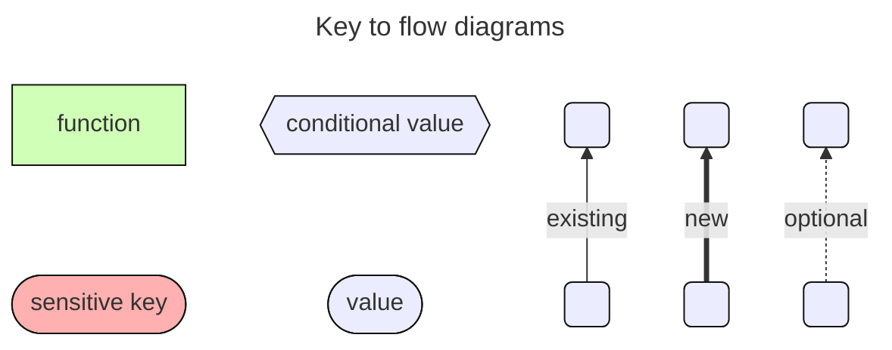
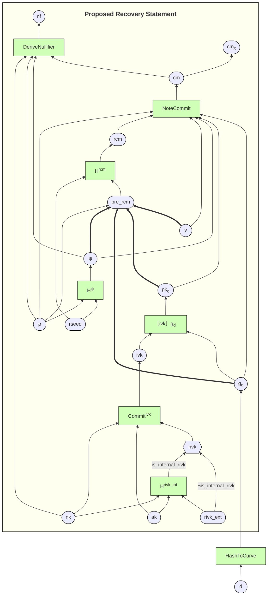
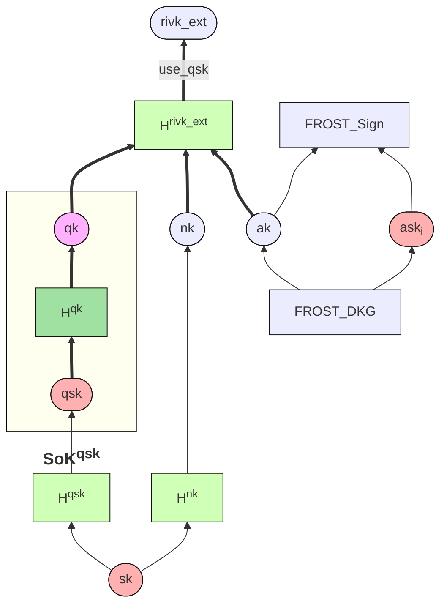
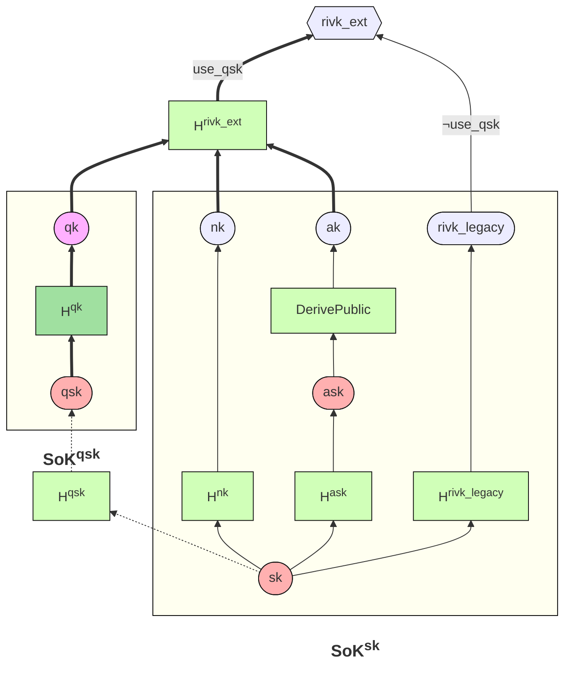

    ZIP: 2005
    Title: Orchard Quantum Recoverability
    Owners: Daira-Emma Hopwood <daira@jacaranda.org>
            Jack Grigg <thestr4d@gmail.com>
    Credits: Sean Bowe
             Dev Ojha
             Kris Nuttycombe
    Status: Proposed
    Category: Consensus
    Created: 2025-03-31
    License: MIT
    Discussions-To: <https://github.com/zcash/zips/issues/1135>
    Pull-Request: <https://github.com/zcash/zips/pull/1126>
                  <https://github.com/zcash/zips/pull/1184>
                  <https://github.com/zcash/zips/pull/1275>

# Terminology

The key words "MUST", "SHOULD", and "MAY" in this document are to be
interpreted as described in BCP 14 [^BCP14] when, and only when, they
appear in all capitals.

The term "network upgrade" in this document is to be interpreted as
described in ZIP 200. [^zip-0200]

The character § is used when referring to sections of the Zcash Protocol
Specification. [^protocol]

The terms "Mainnet" and "Testnet" are to be interpreted as described in
§ 3.12 ‘Mainnet and Testnet’. [^protocol-networks]

We use the convention followed in the protocol specification that an
$\underline{\mathsf{underlined}}$ variable indicates a byte sequence,
and a variable suffixed with $\star$ indicates a bit-sequence encoding of
an elliptic curve point.

The notation ${k \choose n}$ denotes the binomial coefficient — the
number of ways of choosing $n$ items from a set of $k$, equal to
$\frac{k!}{n!(k-n)!}$ for $0 \leq n \leq k$.

For brevity, in the discussion sections of this ZIP we abbreviate
$\mathsf{H^{rcm,Orchard}}$ as $\mathsf{H^{rcm}}$,
$\mathsf{PRF^{nfOrchard}}$ as $\mathsf{PRF^{nf}}$,
$\mathcal{K}^{\mathsf{Orchard}}$ as $\mathcal{K}$,
and similarly for other Orchard-specific hash function names. The changes
to the protocol specification and to other ZIPs use the full forms.

The term "Zcash Shielded Assets" or "ZSAs" refers to the extension to
the Orchard shielded protocol described in ZIPs 226 and 227 [^zip-0226] [^zip-0227].

The term "Orchard[ZSA]" in this document refers to the Orchard shielded
protocol before the deployment of ZSAs, and to the OrchardZSA shielded
protocol after the deployment of ZSAs.

The terms "recoverable note" and "recoverable note plaintext" refer to a
note or note plaintext that was created according to this proposal. As
initially deployed, these are necessarily Orchard notes or note plaintexts.

The term "Recovery Protocol" refers to a potential new shielded protocol
that would allow recovery of funds held in recoverable Orchard[ZSA] notes.
This ZIP describes the Recovery Protocol in outline but not in detail:
many of its design decisions are intentionally left open.

# Abstract

This ZIP proposes a change to the construction of Orchard[ZSA] notes,
designed to improve Zcash's long-term resilience against a significant
potential threat to its security from quantum computers. It does not
by itself make the protocol secure against quantum adversaries, but is
intended to support a smoother transition to future versions of Zcash
designed to be so.

Specifically, if it were necessary to disable the current Orchard[ZSA]
shielded protocol in order to prevent a discrete-log-breaking adversary
from stealing or forging funds, this change would make it possible to use
a Recovery Protocol to recover existing Orchard funds. This Recovery Protocol
is expected to remain secure against discrete-log-breaking and quantum
adversaries.

If the Orchard[ZSA] protocol needed to be disabled for this reason, the
Sapling protocol would need to be disabled as well, which would make all
Sapling funds inaccessible. Sapling funds should be migrated to Orchard in
order to take advantage of this change.

# Motivation

If quantum computers —or any other attack that allows finding discrete
logarithms on the elliptic curves used in Zcash— were to become practical,
it would raise difficult issues for the Zcash community. An adversary able
to compute discrete logarithms could cause arbitrary inflation or steal
users' funds.

Critically, the note commitment algorithms used by the Sapling and Orchard
shielded protocols are not post-quantum binding. This means that even if
the proof system were upgraded to one that is believed to be secure against
quantum computers, and even if the note commitment tree were to be
reconstructed (from public information) to use a suitable hash function,
it would still be possible for a quantum or discrete-log-breaking adversary
to forge and spend notes that are not actually in the commitment tree —
thus breaking the Balance property.

This ZIP proposes a small change to the way Orchard[ZSA] notes are derived.
If this change is made in advance of quantum computers becoming viable,
then users' Orchard[ZSA] funds could remain safe and recoverable after a
post-quantum transition. This would not require any change to the Orchard
or proposed OrchardZSA *circuits* for the time being, and would not require
deciding on the particular proof system or note commitment tree hash used
in the future protocol.

Recovering Orchard[ZSA] funds after the post-quantum transition would
involve checking a more expensive and complicated statement in zero
knowledge, but it is expected that this will be entirely practical for the
intended usage of recovering funds into another shielded pool. The current
privacy properties of Orchard would be retained against pre-quantum
adversaries, and also against post-quantum adversaries without knowledge
of the notes' addresses. [^pq-zcash]

To reduce overall protocol complexity and analysis effort, we do *not*
propose a similar change for Sapling. Instead, Sapling funds can be
migrated to Orchard in order to make them quantum-recoverable. (Note
that this analysis effort needs to include the child and internal key
derivations defined in ZIP 32, which differ significantly between
Sapling [^zip-0032-sapling-child-key-derivation] [^zip-0032-sapling-internal-key-derivation]
and Orchard [^zip-0032-orchard-child-key-derivation] [^zip-0032-orchard-internal-key-derivation].)

This proposal is implementable at low risk, and required changes to existing
libraries and wallets are small. It is compatible with Memo Bundles [^zip-0231]
and/or ZSAs [^zip-0226].

# Requirements

* Orchard[ZSA] notes constructed according to this proposal should be
  spendable via a Recovery Protocol (to be introduced, potentially,
  in a future upgrade) that is expected to be secure against
  discrete-log-breaking and quantum adversaries.
* No particular choice of post-quantum proving system or commitment
  tree hash should be assumed for that alternate protocol.
* The proposed scheme should be fully compatible with FROST threshold
  multisignatures [^zip-0312], hardware wallets, and the combination of
  both.
* The proposed scheme should not require regeneration of existing
  non-multisignature keys or addresses.
* The changes made to the pre-quantum protocol should not cause a
  significant regression in performance, applicability, or security
  against any given adversary class, or require significant re-analysis
  of that protocol's pre-quantum security.
* The Recovery Protocol should ensure no loss of security against
  pre-quantum adversaries — including when FROST threshold multisignatures
  and/or hardware wallets are used.
* Recovery of funds from hardware wallets that support this protocol
  should not require exposing the pre-quantum spend authorizing key
  $\mathsf{ask}$ to theft.
* The proposal should be compatible with Zcash Shielded Assets with
  minimal additional complexity [^zip-0226] [^zip-0227].

# Non-requirements

* It is not required to address discrete-log-breaking or quantum
  attacks on *privacy* with this proposal, as long as it does not
  cause any regression in privacy properties.
* It is not required to add support for the Recovery Protocol to
  consensus rules now.
* It is not required for spends using the Recovery Protocol to be
  as efficient as spends using the Orchard, OrchardZSA, or Sapling
  protocols.
* It is not anticipated that spends using the Recovery Protocol will
  need to be indistinguishable from non-Recovery spends.

# High-level summary of changes

This subsection and the flow diagram below are non-normative.

This proposal defines a new note plaintext format for Orchard notes,
with lead byte $\mathtt{0x03}.$ The $\mathsf{pre\_rcm}$ value is computed
differently for this new format, by including all of the note fields in
$\mathsf{pre\_rcm}$. This means that an adversary constrained to treat
the PRF used to derive $\mathsf{rcm}$ from $\mathsf{pre\_rcm}$ as a
random oracle, could not vary any note field without producing a
different $\mathsf{rcm}$. This lets us argue that the overall
commitment scheme is post-quantum binding, as long as the new
derivation of $\mathsf{rcm}$ is checked in the Recovery Protocol.

Essentially the same technique also needs to be applied to the
function $\mathsf{Commit^{ivk}}$ that is used to derive Orchard
incoming viewing keys. The randomness $\mathsf{rivk}$ in
$\mathsf{Commit^{ivk}}$ is derived directly or indirectly from
$\mathsf{rivk\_ext}$, which is in turn derived from one of two random
oracles, depending on which key material the user holds:

* For existing Orchard keys, $\mathsf{rivk\_ext}$ is derived from
  the secret key $\mathsf{sk}$ via $\mathsf{H^{rivk\_legacy}}(\mathsf{sk})$,
  with $\mathsf{ak}$ and $\mathsf{nk}$ also derived from $\mathsf{sk}$.
  The Recovery Protocol checks all three derivations.
* For keys generated via FROST distributed key generation, or for
  hardware wallets where exporting $\mathsf{sk}$ is undesirable, an
  alternative "quantum spending key" $\mathsf{qsk}$ and "quantum
  intermediate key" $\mathsf{qk}$ are used, with
  $\mathsf{rivk\_ext} = \mathsf{H^{rivk\_ext}_{qk}}(\mathsf{ak}, \mathsf{nk})$.
  The Recovery Protocol checks this derivation together with a
  $\mathsf{SoK^{qsk}}$ proof of knowledge of $\mathsf{qsk}$ such that
  $\mathsf{H^{qk}}(\mathsf{qsk}) = \mathsf{qk}$.

Both branches (and both cases
$\mathsf{rivk} \in \big\{ \mathsf{rivk\_ext},\, \mathsf{H^{rivk\_int}_{rivk\_ext}}(\mathsf{ak}, \mathsf{nk}) \big\}$)
are covered uniformly by the
[Security argument for key binding](#securityargumentforkeybinding):
each binds the keys $(\mathsf{ak}, \mathsf{nk}, \mathsf{rivk})$ — and,
when in use, $\mathsf{qk}$ — to the incoming-viewing key $\mathsf{ivk}$
post-quantumly, up to a small advantage against collision-finding in
the random oracles used for $\mathsf{rivk}$ derivation. The FROST and
hardware-wallet use cases are described in
[Usage with FROST](#usagewithfrost) and
[Usage with hardware wallets](#usagewithhardwarewallets).

## Flow diagram for the Orchard protocol

This diagram shows, approximately, the derivation of Orchard keys,
addresses, notes, note commitments, and nullifiers. All of the flow
diagrams in this ZIP omit type conversions between curve points, field
elements, byte sequences, and bit sequences, and so are not sufficiently
precise to be used directly as a guide for implementation.

```mermaid
---
title: "Key to flow diagrams"
---
graph BT
  classDef default stroke:#111111;
  classDef func fill:#d0ffb8;
  classDef cefunc fill:#a0e0a0;
  classDef sensitive fill:#ffb0b0;
  classDef semi_sensitive fill:#ffb0ff;
  classDef keybox stroke:#808080, fill:#ffffff;
  classDef spacer opacity:0;

  key([sensitive key]):::sensitive ~~~ function:::func
  value([value]) ~~~ cond{{conditional value}}
  dummyA( ) -->|existing| dummyB( )
  dummyC( ) ==>|new| dummyD( )
  dummyE( ) -.->|optional| dummyF( )
```

The bold lines are changes introduced by this ZIP, which all take the form
of additional inputs to derivation functions or alternative derivations.
The derivations shown in the box labelled [Proposed Recovery Statement](#proposedrecoverystatement)
are, roughly speaking, those enforced by the section of that name. The
diagram shows the recoverable-note case ($\mathsf{leadByte} = \mathtt{0x03}$);
for $\mathsf{leadByte} = \mathtt{0x02}$ the existing Orchard derivation
$\mathsf{rcm} = \mathsf{ToScalar^{Orchard}}\big(\mathsf{PRF^{expand}_{rseed}}([\mathtt{0x05}] \,||\, \underline{\text{ρ}})\kern-0.1em\big)$
applies, and the additional fields feeding into $\mathsf{pre\_rcm}$
are absent.

```mermaid
graph BT
  classDef default stroke:#111111;
  classDef func fill:#d0ffb8;
  classDef cefunc fill:#a0e0a0;
  classDef sensitive fill:#ffb0b0;
  classDef semi_sensitive fill:#ffb0ff;
  classDef circuit stroke:#000000, fill:#fffff0;
  classDef spacer opacity:0;

  PostQC:::circuit
  subgraph PostQC[<div style="margin:1.1em;font-size:20px"><b>Proposed Recovery Statement</b></div>]
    direction BT
    rivk_ext([rivk_ext]) --> Hrivk_int[H<sup>rivk_int</sup>]:::func
    ak([ak]) --> Hrivk_int[H<sup>rivk_int</sup>]:::func
    nk --> Hrivk_int
    rivk_ext -->|¬is_internal_rivk| rivk
    Hrivk_int -->|is_internal_rivk| rivk{{rivk}}
    rivk --> Commitivk[Commit<sup>ivk</sup>]:::func
    ak([ak]) ----> Commitivk
    nk([nk]) ----> Commitivk
    Commitivk ---> ivk([ivk])
    gd ---> ivkmul[［ivk］g<sub>d</sub>&nbsp;]:::func
    ivk --> ivkmul
    rseed --> Hpsi[H<sup>ψ</sup>]:::func
    rho --> Hpsi
    v([#8239;v#8239;]) ==> pre_rcm([pre_rcm])
    pkd ====> pre_rcm
    gd ==> pre_rcm
    psi ===> pre_rcm
    rho([#8239;ρ#8239;]) --> pre_rcm
    v ~~~~ rcm
    ivkmul --> pkd([pk<sub>d</sub>])
    pre_rcm --> Hrcm[H<sup>rcm</sup>]:::func
    rseed([rseed]) --> Hrcm
    Hrcm --> rcm([rcm])
    Hpsi --> psi([#8239;ψ#8239;])
    gd --> NoteCommit:::func
    pkd --> NoteCommit
    psi --> NoteCommit
    v --> NoteCommit
    rcm --> NoteCommit
    rho --> NoteCommit
    cm --> DeriveNullifier:::func
    psi --> DeriveNullifier
    rho --> DeriveNullifier
    nk --> DeriveNullifier
    NoteCommit --> cm([cm])
    DeriveNullifier --> nf([nf])
    cm --> cmx([cm<sub><i>x</i></sub>])
  end

  d([#8239;d#8239;]) --> HashToCurve:::func ------> gd([g<sub>d</sub>])
```

# Specification

## Proactive movement of funds to recoverable notes

Once this proposal is deployed, wallets SHOULD move all of the funds they
control (including transparent, Sprout, and Sapling funds) into recoverable
Orchard notes as soon as practically possible. This does not depend on support
from other wallets for receiving recoverable notes, because wallet-internal
addresses can be used.

Non-recoverable funds may be received after existing funds have been made
recoverable. Wallets SHOULD therefore treat the movement of funds to
recoverable notes as an ongoing process.

## Usage with FROST

When generating Orchard keys for FROST, $\mathsf{ak}$ will be derived jointly
from the participants' shares of $\mathsf{ask}$ according to the FROST
Distributed Key Generation (DKG) protocol.

This ZIP further constrains FROST key generation for Orchard as follows:
participants MUST privately agree on a value $\mathsf{sk}$, and then use it
with $\mathsf{use\_qsk} = \mathsf{true}$ to derive $\mathsf{nk}$, $\mathsf{qsk}$,
$\mathsf{qk}$, and (using the $\mathsf{ak}$ output by the DKG protocol)
$\mathsf{rivk\_ext}$, as specified in § 4.2.3 ‘Orchard Key Components’ [^protocol-orchardkeycomponents].

```mermaid
graph BT
  classDef default stroke:#111111;
  classDef func fill:#d0ffb8;
  classDef cefunc fill:#a0e0a0;
  classDef sensitive fill:#ffb0b0;
  classDef semi_sensitive fill:#ffb0ff;
  classDef circuit stroke:#000000, fill:#fffff0;
  classDef spacer opacity:0;

  sk([sk]):::sensitive --> Hnk[H<sup>nk</sup>]:::func ----> nk([nk])
  sk --> Hqsk[H<sup>qsk</sup>]:::func --> qsk([qsk]):::sensitive
  qk ==> Hrivk_ext
  nk ==> Hrivk_ext
  FROST_DKG --> ak([ak]) --> FROST_Sign
  FROST_DKG ~~~ s( ):::spacer ~~~ FROST_Sign
  FROST_DKG --> ask([ask<sub>i</sub>]):::sensitive --> FROST_Sign
  ak ==> Hrivk_ext[H<sup>rivk_ext</sup>]:::func
  Hrivk_ext ==>|use_qsk| rivk_ext([rivk_ext])

  HWW1:::circuit
  subgraph HWW1[<div style="margin:1.6em;font-size:20px"><br><br><br><br><br><br><br><br><br><b>SoK<sup>qsk</sup></b></div>]
    qsk([qsk]):::sensitive ==> Hqk[H<sup>qk</sup>]:::cefunc
    Hqk ==> qk([qk]):::semi_sensitive
  end
```

The protocol MUST ensure that all participants obtain the same values for
$\mathsf{ak}$, $\mathsf{nk}$, and $\mathsf{rivk\_ext}$. (Provided that the
participants have followed § 4.2.3, this implies that they have the same
$\mathsf{qsk}$ and $\mathsf{qk}$, by collision resistance of $\mathsf{H^{qk}}$
and $\mathsf{H^{rivk\_ext}}$.)

Each participant MUST treat $\mathsf{qsk}$ as a secret held at least as
securely and reliably as $\mathsf{ask}$. Note that $\mathsf{qsk}$ will
not be needed to sign unless and until the Recovery Protocol is needed,
but it is essential that it be retained, otherwise funds could be lost if
and when the current Orchard protocol is disabled.

The Recovery Protocol will still require a RedDSA signature verifiable by
the Spend validating key $\mathsf{ak}$, in addition to knowledge of
$\mathsf{qsk}$. RedDSA is not secure in the long term against a quantum
or discrete-log-breaking adversary. However, during any period in which
the adversary cannot find discrete logarithms on the Pallas curve,
checking this RedDSA signature will ensure that spend authorization
continues to require a $t$-of-$n$ threshold of participants.
An important advantage of FROST —that the parties can sign using their
shares *without* reconstructing $\mathsf{ask}$, the Spend authorizing
key— is retained.

Note that a quantum adversary may be able to steal the funds with only
access to $\mathsf{qsk}$, which is held by every participant (see below
for more detail on [Key storage options](#keystorageoptionsandanalysis)).
Therefore, it is RECOMMENDED that as soon as a fully post-quantum protocol
that supports threshold multisignatures is available, all funds held under
FROST keys be transferred into that protocol's shielded pool.

## Usage with hardware wallets

The same $\mathsf{use\_qsk}$ option can help to improve the efficiency of
using the [Recovery Protocol](#proposedrecoveryprotocol) with hardware
wallets. If the keys $\mathsf{rivk\_ext},$ $\mathsf{nk},$ and $\mathsf{ak}$
are generated from $\mathsf{sk},$ then the circuit for the Recovery Protocol
will need to prove their correct derivation using $\mathsf{H^{rivk\_legacy}},$
$\mathsf{H^{nk}},$ $\mathsf{H^{ask}},$ and $\mathsf{DerivePublic}$ as shown
in the $\mathsf{SoK^{sk}}$ box of the diagram below.

```mermaid
graph BT
  classDef default stroke:#111111;
  classDef func fill:#d0ffb8;
  classDef cefunc fill:#a0e0a0;
  classDef sensitive fill:#ffb0b0;
  classDef semi_sensitive fill:#ffb0ff;
  classDef circuit stroke:#000000, fill:#fffff0;
  classDef spacer opacity:0;

  HWW1:::circuit
  subgraph HWW1[<div style="margin:1.1em;font-size:20px"><br><br><br><br><br><br><br><br><br><br><br><br><br><br><br><br><br><b>SoK<sup>sk</sup></b></div>]
    sk --> Hrivk_legacy[H<sup>rivk_legacy</sup>]:::func ----> rivk_legacy
    DerivePublic --> ak([ak])
    sk([sk]):::sensitive --> Hnk[H<sup>nk</sup>]:::func ----> nk([nk])
    sk --> Hask[H<sup>ask</sup>]:::func --> ask([ask]):::sensitive
    ask --> DerivePublic:::func
  end

  HWW2:::circuit
  subgraph HWW2[<div style="margin:1.6em;font-size:20px"><br><br><br><br><br><br><br><br><br><b>SoK<sup>qsk</sup></b></div>]
    qsk([qsk]):::sensitive ==> Hqk[H<sup>qk</sup>]:::cefunc
    Hqk ==> qk([qk]):::semi_sensitive
  end

  sk -.-> Hqsk[H<sup>qsk</sup>]:::func -.-> qsk
  qk ==> Hrivk_ext[H<sup>rivk_ext</sup>]:::func
  nk([nk]) ==> Hrivk_ext
  ak ==> Hrivk_ext
  Hrivk_ext ==>|use_qsk| rivk_ext{{rivk_ext}}
  rivk_legacy([rivk_legacy]) -->|¬use_qsk| rivk_ext
```

When $\mathsf{use\_qsk}$ is used, on the other hand, it is possible for
the Recovery Protocol to support spend authorization using a simpler
statement that only uses $\mathsf{H^{qk}}$ and a commitment scheme.
For example, for some hiding and collapse-binding commitment
$$\mathsf{c_{link}} = \mathsf{LinkCommit}_r(\mathsf{qk}, \mathsf{sighash})$$
the hardware wallet could prove knowledge of $(\mathsf{qsk}, r)$ such that
$$\mathsf{c_{link}} = \mathsf{LinkCommit}_r(\mathsf{H^{qk}}(\mathsf{qsk}), \mathsf{sighash}).$$
This statement, labelled as $\mathsf{SoK^{qsk}}$ in the diagram, can be
implemented in a much smaller circuit, so it might be feasible to do the
proof in quite constrained hardware.

The commitment $\mathsf{c_{link}}$ would be a public input opened to
$(\mathsf{qk}, \mathsf{sighash})$ in the [Recovery Statement](#proposedrecoverystatement),
ensuring that the hardware wallet has authorized the spend for the correct
key. Because $\mathsf{LinkCommit}$ is hiding and the proofs are zero knowledge,
no information is leaked about which $\mathsf{qk}$ is being used.

### Key storage options and analysis

By *host wallet*, we mean the device that builds the spend transaction and
produces the rest of the Recovery Statement proof. In a multi-signer FROST
setup, this would be the Coordinator [^zip-0312-threat-model]. The host wallet
is given $\mathsf{nk},$ $\mathsf{ak},$ and (assuming $\mathsf{use\_qsk}$ is true)
$\mathsf{qk}$, for use in the Recovery Statement. Then two options are possible
for storage of $\mathsf{qsk}$:

**Option A** — The $\mathsf{SoK^{qsk}}$ proof is produced inside the hardware
wallet, and $\mathsf{qsk}$ is retained there.

**Option B** — Alternatively, if the hardware wallet is unable to support
proving $\mathsf{SoK^{qsk}}$, it could be updated to permit exporting
$\mathsf{qsk}$ to the host wallet, and the $\mathsf{SoK^{qsk}}$ proof would be
produced there.

In either option, $\mathsf{ask}$ would remain on the hardware wallet which
would continue to produce RedDSA spend authorization signatures (or perform
its part of the FROST multi-signing protocol).

#### Threat model

The [Recovery Statement](#proposedrecoverystatement) is assumed below to
require both of:

* an $\mathsf{SoK^{qsk}}$ proof verifying knowledge of $\mathsf{qsk}$
  such that $\mathsf{H^{qk}}(\mathsf{qsk}) = \mathsf{qk}$ for the
  spent note's $\mathsf{qk}$; and
* a RedDSA signature on $\mathsf{ak}$, which under FROST is
  constructed by cooperation of $t$-of-$n$ hardware-wallet signers,
  each contributing using its share of $\mathsf{ask}$.

Under this assumed structure, with FROST + hardware-wallet deployment,
spend authorization is broken only by either:

1. **$\mathsf{qsk}$ possession + finding discrete logarithms on the
   Pallas curve.** The variants differ only in *how* $\mathsf{qsk}$
   is obtained:

    <!-- rendered as a., b., c. -->
    1. the adversary is an authorized FROST signer — they hold a copy
       of $\mathsf{qsk}$ by construction;
    2. $\mathsf{qsk}$ is extracted from a hardware wallet, defeating
       Option A by a physical-device or side-channel attack;
    3. $\mathsf{qsk}$ is obtained after export to the host wallet, by
       compromising the host wallet or intercepting it during export.

2. **Breaking a primitive or scheme.** RedDSA, FROST, the DKG, or the
   proving system has a cryptographic weakness or implementation flaw.

#### Choosing between Options A and B

Option A is preferred where the target hardware wallet is capable of
proving $\mathsf{SoK^{qsk}}$ on-device. Option B is a fallback for
cases where it cannot — for instance, due to memory or secure-element
constraints, uncertainty about the proof system that will be chosen
and what will be tractable on small devices, or the device having been
obsoleted before firmware support could be added.

Under Option A, the host wallet holds only the full viewing key
($\mathsf{ak}$, $\mathsf{nk}$) —which the pre-Quantum-Recoverability
protocol already entrusted to it— plus $\mathsf{qk}$. The $\mathsf{qsk}$
attack surface is then 1.a. or 1.b. only.

Option B additionally places $\mathsf{qsk}$ on the host wallet, admitting
case 1.c. as well. This has the disadvantage that host-wallet compromise
is a substantially larger attack surface than hardware-wallet extraction.
However, even with $\mathsf{qsk}$ in hand, an adversary would still need
to break RedDSA or find discrete logarithms on the Pallas curve to steal
funds.

Note: with ZIP 32 hierarchical derivation, $\mathsf{qsk}$ need not be
backed up separately from the seed phrase. When $\mathsf{use\_qsk}$ is
true, $\mathsf{qsk} = \mathsf{H^{qsk}}(\mathsf{sk})$ where $\mathsf{sk}$
is the HD-derived spending key, and so $\mathsf{qsk}$ can be re-derived
from the seed phrase (with or without SLIP 39 Shamir backup [^slip-0039]).
A deployment that does not use ZIP 32 is responsible for the security of
its own backup arrangements.

## Usage with other proposals requiring note plaintext format changes

This proposal was originally designed to be deployed alongside ZSAs [^zip-0226]
[^zip-0227] and memo bundles [^zip-0231], which also defined a new note
plaintext format. Since this proposal now defines lead byte $\mathtt{0x03}$,
those proposals will need to use a new lead byte value or values.

## Specification Updates

This is written as a set of changes to version 2025.6.2 of the protocol
specification, and to the contents of ZIPs as of May 2026.

### Changes to the Protocol Specification

#### § 3.2.1 ‘Note Plaintexts and Memo Fields’

Replace the paragraph

> Define $\mathsf{allowedLeadBytes^{protocol}}(\mathsf{height}, \mathsf{txVersion}) =$
> $\hspace{2em} \begin{cases}
>   \{ \mathtt{0x01} \},&\!\!\!\text{if } \mathsf{height} < \mathsf{CanopyActivationHeight} \\
>   \{ \mathtt{0x01}, \mathtt{0x02} \},&\!\!\!\text{if } \mathsf{CanopyActivationHeight} \leq \mathsf{height} < \mathsf{CanopyActivationHeight} + \mathsf{ZIP212GracePeriod} \\
>   \{ \mathtt{0x02} \},&\!\!\!\text{otherwise.}
> \end{cases}$

with

> Let the constant $\mathsf{ZIP2005ActivationHeight}$ be as defined in
> [[ZIP 2005, Deployment]](#deployment).
>
> Define $\mathsf{allowedLeadBytes^{protocol}}(\mathsf{height}, \mathsf{txVersion}) =$
> $\hspace{2em} \begin{cases}
>   \{ \mathtt{0x01} \},&\!\!\!\text{if } \mathsf{height} < \mathsf{CanopyActivationHeight} \\
>   \{ \mathtt{0x01}, \mathtt{0x02} \},&\!\!\!\text{if } \mathsf{CanopyActivationHeight} \leq \mathsf{height} < \mathsf{CanopyActivationHeight} + \mathsf{ZIP212GracePeriod} \\
>   \{ \mathtt{0x02} \},&\!\!\!\text{if } \mathsf{CanopyActivationHeight} + \mathsf{ZIP212GracePeriod} \leq \mathsf{height} \text{ and } \\
>                       &\;\; (\mathsf{height} < \mathsf{ZIP2005ActivationHeight} \text{ or } \mathsf{protocol} \neq \mathsf{Orchard}) \\
>   \{ \mathtt{0x02}, \mathtt{0x03} \},&\!\!\!\text{if } \mathsf{ZIP2005ActivationHeight} \leq \mathsf{height} \text{ and } \mathsf{protocol} = \mathsf{Orchard} \text{ and } \mathsf{txVersion} < 6 \\
>   \{ \mathtt{0x03} \},&\!\!\!\text{otherwise.}
> \end{cases}$

Replace

> Senders SHOULD choose the highest note plaintext lead byte allowed under this
> condition.

with

> $\mathsf{ZIP2005ActivationHeight}$ specifies the first block height at which
> recoverable note plaintexts with lead byte $\mathtt{0x03}$ are allowed to
> occur in Orchard outputs. Orchard note plaintexts sent to *wallet-internal*
> addresses SHOULD use lead byte $\mathtt{0x03}$ starting from this height.
> Orchard note plaintexts in v5 transactions sent to *external* addresses
> SHOULD use lead byte $\mathtt{0x02}$ until wallet support for receiving note
> plaintexts with lead byte $\mathtt{0x03}$ is widespread in the Zcash ecosystem.
>
> In other cases, senders of non-dummy note plaintexts SHOULD choose the
> highest note plaintext lead byte allowed according to $\mathsf{allowedLeadBytes}.$
> For dummy note plaintexts, any of the allowed lead bytes MAY be used (it does
> not matter which).

Delete the non-normative note:

> * It is intentional that the definition of $\mathsf{allowedLeadBytes}$ does
>   not currently depend on $\mathsf{protocol}$ or $\mathsf{txVersion}.$ It
>   might do so in future.

Add the non-normative note:

> * For Orchard note plaintexts sent in v6 transactions [^zip-0248], the only
>   allowed lead byte value is $\mathtt{0x03}.$

It is assumed for these changes that v6 transactions will not activate before
$\mathsf{ZIP2005ActivationHeight}$.

#### § 4.1.2 ‘Pseudo Random Functions’

In the list of places where $\mathsf{PRF^{expand}}$ is used:

Replace

> * [**NU5** onward] in § 4.2.3 ‘Orchard Key Components’ [^protocol-orchardkeycomponents],
>   with inputs $[\mathtt{0x06}]$, $[\mathtt{0x07}]$, $[\mathtt{0x08}]$, and with
>   first byte $\mathtt{0x82}$;
> * in the processes of sending (§ 4.7.2 ‘Sending Notes (Sapling)’ [^protocol-saplingsend]
>   and § 4.7.3 ‘Sending Notes (Orchard)’ [^protocol-orchardsend]) and of receiving
>   (§ 4.20 ‘In-band secret distribution (Sapling and Orchard)’ [^protocol-saplingandorchardinband])
>   notes, for Sapling with inputs $[\mathtt{0x04}]$ and $[\mathtt{0x05}]$,
>   and for Orchard $[t] || \underline{\text{ρ}}$ with
>   $t \in \{ \mathtt{0x05}, \mathtt{0x04}, \mathtt{0x09} \}$;

with

> * [**NU5** onward] in § 4.2.3 ‘Orchard Key Components’ [^protocol-orchardkeycomponents],
>   with inputs $[\mathtt{0x06}]$, $[\mathtt{0x07}]$, $[\mathtt{0x08}]$, and with
>   first byte in $\{ \mathtt{0x0C}, \mathtt{0x0D}, \mathtt{0x82} \}$
>   ($\mathtt{0x0C}$ and $\mathtt{0x0D}$ are also specified in [ZIP 2005]);
> * in the processes of sending (§ 4.7.2 ‘Sending Notes (Sapling)’ [^protocol-saplingsend]
>   and § 4.7.3 ‘Sending Notes (Orchard)’ [^protocol-orchardsend]) and of receiving
>   (§ 4.20 ‘In-band secret distribution (Sapling and Orchard)’ [^protocol-saplingandorchardinband])
>   notes, for Sapling with inputs $[\mathtt{0x04}]$ and $[\mathtt{0x05}]$,
>   and for Orchard with first byte in
>   $\{ \mathtt{0x05}, \mathtt{0x04}, \mathtt{0x09}, \mathtt{0x0A}, \mathtt{0x0B} \}$
>   ($\mathtt{0x0A}$ and $\mathtt{0x0B}$ are also specified in [ZIP 2005]);

Add

> * in [ZIP 2005], with first byte in
>   $\{ \mathtt{0x0A}, \mathtt{0x0B}, \mathtt{0x0C}, \mathtt{0x0D} \}$.

#### § 4.2.3 ‘Orchard Key Components’

Add $\ell_{\mathsf{qsk}}$ and $\ell_{\mathsf{qk}}$ to the constants obtained
from § 5.3 ‘Constants’ [^protocol-constants].

Replace from "From this spending key" up to and including the line
"let $\mathsf{ak} = \mathsf{Extract}_{\mathbb{P}}(\mathsf{ak}^{\mathbb{P}})$"
in the algorithm with:

> Under normal circumstances, the Spend authorizing key
> $\mathsf{ask} \;{\small ⦂}\; \mathbb{F}^{*}_{r_{\mathbb{P}}}$ is derived
> directly from $\mathsf{sk}$. However, this might not be the case for
> protocols that require distributed generation of shares of $\mathsf{ask}$,
> such as FROST's Distributed Key Generation [^zip-0312-key-generation]
> (see [[ZIP 2005, Usage with Frost]](#usagewithfrost) for further
> discussion). To support this we define an alternative derivation method
> using an additional "quantum spending key", $\mathsf{qsk}$, and
> "quantum intermediate key", $\mathsf{qk}$.
>
> There can also be advantages to not deriving $\mathsf{ask}$ directly from
> $\mathsf{sk}$ for hardware wallets, in order to separate the authority to
> make proofs for the Recovery Protocol from the spend authorization key
> that is kept on the device (see
> [[ZIP 2005, Usage with hardware wallets]](#usagewithhardwarewallets)).
> The derivation from $\mathsf{qsk}$ can also be used in that case.
>
> Let $\mathsf{use\_qsk} \;{\small ⦂}\; \mathbb{B}$ be a flag indicating
> whether $\mathsf{qsk}$ and $\mathsf{qk}$ are generated and used in the
> derivation of $\mathsf{rivk}$. (In cases where it is desired for the
> generation of key components to match versions of this specification
> prior to {{ fill in version }}, $\mathsf{use\_qsk}$ needs to be set to
> false.)
>
> Define:
> * $\mathsf{H^{ask}}(\mathsf{sk}) = \mathsf{ToScalar^{Orchard}}\big(\mathsf{PRF^{expand}_{sk}}([\mathtt{0x06}])\kern-0.1em\big)$
> * $\mathsf{H^{nk}}(\mathsf{sk}) = \mathsf{ToBase^{Orchard}}\big(\mathsf{PRF^{expand}_{sk}}([\mathtt{0x07}])\kern-0.1em\big)$
> * $\mathsf{H^{rivk}}(\mathsf{sk}) = \mathsf{ToScalar^{Orchard}}\big(\mathsf{PRF^{expand}_{sk}}([\mathtt{0x08}])\kern-0.1em\big)$
> * $\mathsf{H^{qsk}}(\mathsf{sk}) = \mathsf{truncate}_{32}\big(\mathsf{PRF^{expand}_{sk}}([\mathtt{0x0C}])\kern-0.1em\big)$
> * $\mathsf{H^{qk}}(\mathsf{qsk}) = \mathsf{BLAKE3.derive\_key}(\texttt{“Zcash ZIP 2005 qk-derivation v1”}, \mathsf{qsk}, 32)$ [^BLAKE3].
> * $\mathsf{H}^{\mathsf{rivk\_ext}}_{\mathsf{qk}}(\mathsf{ak}, \mathsf{nk}) = \mathsf{ToScalar^{Orchard}}\big(\mathsf{PRF^{expand}_{qk}}\big([\mathtt{0x0D}] \,||\, \mathsf{I2LEOSP}_{256}(\mathsf{ak}) \,||\, \mathsf{I2LEOSP}_{256}(\mathsf{nk})\kern-0.1em\big)\kern-0.15em\big)$.
> 
> $\mathsf{ask} \;{\small ⦂}\; \mathbb{F}^{*}_{r_{\mathbb{P}}}$,
> the Spend validating key $\mathsf{ak} \;{\small ⦂}\; \{ 1\,..\,q_{\mathbb{P}}-1 \}$,
> the nullifier deriving key $\mathsf{nk} \;{\small ⦂}\; \mathbb{F}_{q_{\mathbb{P}}}$,
> the optional quantum spending key $\mathsf{qsk} \;{\small ⦂}\; \mathbb{B}^{{\kern-0.1em\tiny\mathbb{Y}}[\ell_{\mathsf{qsk}}/8]} \cup \{\bot\}$
> and quantum intermediate key $\mathsf{qk} \;{\small ⦂}\; \mathbb{B}^{{\kern-0.1em\tiny\mathbb{Y}}[\ell_{\mathsf{qk}}/8]} \cup \{\bot\}$
> the $\mathsf{Commit^{ivk}}$ randomness $\mathsf{rivk} \;{\small ⦂}\; \mathbb{F}_{r_{\mathbb{P}}}$,
> the diversifier key $\mathsf{dk} \;{\small ⦂}\; \mathbb{B}^{{\kern-0.1em\tiny\mathbb{Y}}[\ell_{\mathsf{dk}}/8]}$,
> the $\mathsf{KA^{Orchard}}$ private key $\mathsf{ivk} \;{\small ⦂}\; \{ 1\,..\,q_{\mathbb{P}}-1 \}$,
> the outgoing viewing key $\mathsf{ovk} \;{\small ⦂}\; \mathbb{B}^{{\kern-0.1em\tiny\mathbb{Y}}[\ell_{\mathsf{ovk}}/8]}$,
> and corresponding “internal” keys MUST be derived as follows:
>
> $\hspace{1.0em}$ let $\mathsf{nk} = \mathsf{H^{nk}}(\mathsf{sk})$  
> $\hspace{1.0em}$ if $\mathsf{use\_qsk}$:  
> $\hspace{2.5em}$     obtain a $\mathsf{SpendAuthSig^{Orchard}}$ public key $\mathsf{ak}^{\mathbb{P}} \;{\small ⦂}\; \mathbb{P}^*$ by any suitably secure  
> $\hspace{3.5em}$       method that ensures the last bit of $\mathsf{repr}_{\mathbb{P}}(\mathsf{ak}^{\mathbb{P}})$ is $0$ (see below).  
> $\hspace{2.5em}$     let $\mathsf{ak} = \mathsf{Extract}_{\mathbb{P}}(\mathsf{ak}^{\mathbb{P}})$  
> $\hspace{2.5em}$     let $\mathsf{qsk} = \mathsf{H^{qsk}}(\mathsf{sk})$  
> $\hspace{2.5em}$     let $\mathsf{qk} = \mathsf{H^{qk}}(\mathsf{qsk})$  
> $\hspace{2.5em}$     let $\mathsf{rivk} = \mathsf{H}^{\mathsf{rivk\_ext}}_{\mathsf{qk}}(\mathsf{ak}, \mathsf{nk})$  
> $\hspace{1.0em}$ else:  
> $\hspace{2.5em}$     let mutable $\mathsf{ask} \leftarrow \mathsf{H^{ask}}(\mathsf{sk})$  
> $\hspace{2.5em}$     let $\mathsf{ak}_{\mathbb{P}} = \mathsf{SpendAuthSig^{Orchard}.DerivePublic}(\mathsf{ask})$  
> $\hspace{2.5em}$     if the last bit (that is, the $\tilde{y}$ bit) of $\mathsf{repr}_{\mathbb{P}}(\mathsf{ak}_{\mathbb{P}})$ is $1$:  
> $\hspace{4.0em}$           set $\mathsf{ask} \leftarrow -\mathsf{ask}$
> 
> $\hspace{2.5em}$     let $\mathsf{ak} = \mathsf{Extract}_{\mathbb{P}}(\mathsf{ak}_{\mathbb{P}})$  
> $\hspace{2.5em}$     let $\mathsf{qsk} = \mathsf{qk} = \bot$ (there are no quantum spending/intermediate keys in this case)  
> $\hspace{2.5em}$     let $\mathsf{rivk} = \mathsf{H^{rivk}}(\mathsf{sk})$

Add before "As explained in § 3.1":

> When $\mathsf{use\_qsk}$ is true, possible methods of generating
> $\mathsf{ak}^{\mathbb{P}}$ include direct generation of an Orchard Spend
> authorizing key $\mathsf{ask} \;{\small ⦂}\; \mathbb{F}^{*}_{r_{\mathbb{P}}}$ followed by
> $\mathsf{ak}^{\mathbb{P}} = \mathsf{SpendAuthSig^{Orchard}.DerivePublic}(\mathsf{ask})$,
> or FROST distributed key generation [^zip-0312-key-generation] in which the
> corresponding spend-authorization material is $t$-of-$n$ shared among the
> participants.

Add the following notes:

> * If $\mathsf{ask}$, $\mathsf{ak}$, $\mathsf{nk}$, $\mathsf{rivk}$, and
>   $\mathsf{rivk\_internal}$ are not generated as specified in this section,
>   then it may not be possible to recover the resulting notes as specified in
>   [ZIP 2005] in the event that attacks using quantum computers become
>   practical. In addition, to recover notes it is necessary to retain, or be
>   able to rederive $\mathsf{sk}$, and also to know whether $\mathsf{use\_qsk}$
>   was used to derive the $\mathsf{ivk}$ and addresses. When FROST is being
>   used, it is also necessary to retain the group verifying key $\mathsf{ak}$
>   and (collectively among the signers) the key material needed to make
>   spend authorization signatures that can be verified using $\mathsf{ak}$.
>
>   See [[ZIP 2005, Key storage options and analysis]](#keystorageoptionsandanalysis)
>   for further discussion of storage requirements for $\mathsf{sk}$ and
>   $\mathsf{qsk}$.

#### § 4.7.2 ‘Sending Notes (Sapling)’

Add after the definition of $\mathsf{leadByte}$:

> Define $\mathsf{Derive\_rcm^{Sapling}_{rseed}}(\mathsf{leadByte}) = \begin{cases}
>   \mathsf{LEOS2IP}_{256}(\mathsf{rseed}),&\!\!\!\text{if } \mathsf{leadByte} = \mathtt{0x01} \\
>   \mathsf{ToScalar^{Sapling}}\big(\mathsf{PRF^{expand}_{rseed}}([\mathtt{0x04}])\kern-0.1em\big),&\!\!\!\text{if } \mathsf{leadByte} = \mathtt{0x02}
> \end{cases}$
>
> Define $\mathsf{H^{esk,Sapling}_{rseed}}(\_) = \mathsf{ToScalar^{Sapling}}\big(\mathsf{PRF^{expand}_{rseed}}([\mathtt{0x05}])\kern-0.1em\big)$.
>
> ($\mathsf{H^{esk,Sapling}}$ intentionally takes an argument that is unused.)

Replace the lines deriving $\mathsf{rcm}$ and $\mathsf{esk}$ with

> Derive $\mathsf{rcm} = \mathsf{Derive\_rcm^{Sapling}_{rseed}}(\mathsf{leadByte})$
> 
> Derive $\mathsf{esk} = \mathsf{H^{esk,Sapling}_{rseed}}(\bot)$

#### § 4.7.3 ‘Sending Notes (Orchard)’

Add before "For each Action description":

> Define $\mathsf{H^{rcm,Orchard}_{rseed}}(\mathsf{g}\star_{\mathsf{d}}, \mathsf{pk}\star_{\mathsf{d}}, \mathsf{v}, \underline{\text{ρ}}, \text{ψ}) =$
>   $\mathsf{ToScalar^{Orchard}}\big(\mathsf{PRF^{expand}_{rseed}}(\mathsf{pre\_rcm})\kern-0.1em\big)$
>
> where $\mathsf{pre\_rcm} = [\mathtt{0x0B}] \,||\, \mathsf{LEBS2OSP}_{256}(\mathsf{g}\star_{\mathsf{d}}) \,||\, \mathsf{LEBS2OSP}_{256}(\mathsf{pk}\star_{\mathsf{d}}) \,||\, \mathsf{I2LEOSP}_{64}(\mathsf{v}) \,||\, \underline{\text{ρ}} \,||\, \mathsf{I2LEOSP}_{256}(\text{ψ})$.
>
> Define $\mathsf{Derive\_rcm^{Orchard}_{rseed}}(\mathsf{leadByte}, \mathsf{g}\star_{\mathsf{d}}, \mathsf{pk}\star_{\mathsf{d}}, \mathsf{v}, \underline{\text{ρ}}, \text{ψ}) = \begin{cases}
>   \mathsf{ToScalar^{Orchard}}\big(\mathsf{PRF^{expand}_{rseed}}([\mathtt{0x05}] \,||\, \underline{\text{ρ}})\kern-0.1em\big),&\!\!\!\text{if } \mathsf{leadByte} = \mathtt{0x02} \\
>   \mathsf{H^{rcm,Orchard}_{rseed}}(\mathsf{g}\star_{\mathsf{d}}, \mathsf{pk}\star_{\mathsf{d}}, \mathsf{v}, \underline{\text{ρ}}, \text{ψ}),&\!\!\!\text{if } \mathsf{leadByte} = \mathtt{0x03}
> \end{cases}$
>
> Define $\mathsf{H^{esk,Orchard}_{rseed}}(\underline{\text{ρ}}) = \mathsf{ToScalar^{Orchard}}\big(\mathsf{PRF^{expand}_{rseed}}([\mathtt{0x04}] \,||\, \underline{\text{ρ}})\kern-0.1em\big)$.
>
> Define $\mathsf{H^{\text{ψ},Orchard}_{rseed}}(\underline{\text{ρ}}) = \mathsf{ToBase^{Orchard}}\big(\mathsf{PRF^{expand}_{rseed}}([\mathtt{0x09}] \,||\, \underline{\text{ρ}})\kern-0.1em\big)$.

The first-byte domain separator $\mathtt{0x0A}$ for $\mathsf{PRF^{expand}}$ is reserved by this ZIP for use by split notes in ZIP 226 [^zip-0226-split-notes].

Insert before the derivation of $\mathsf{esk}$:

> Let $\mathsf{g}\star_{\mathsf{d}} = \mathsf{repr}_{\mathbb{P}}(\mathsf{g_d})$,
> and $\mathsf{pk}\star_{\mathsf{d}} = \mathsf{repr}_{\mathbb{P}}(\mathsf{pk_d})$.

and use these in the inputs to $\mathsf{NoteCommit^{Orchard}}$.

Replace the lines deriving $\mathsf{esk}$, $\mathsf{rcm}$, and $\text{ψ}$
with

> Derive $\mathsf{esk} = \mathsf{H^{esk,Orchard}_{rseed}}(\underline{\text{ρ}})$

> Derive $\mathsf{rcm} = \mathsf{Derive\_rcm^{Orchard}_{rseed}}(\mathsf{leadByte}, \mathsf{g}\star_{\mathsf{d}}, \mathsf{pk}\star_{\mathsf{d}}, \mathsf{v}, \underline{\text{ρ}}, \text{ψ})$

> Derive $\text{ψ} = \mathsf{H^{\text{ψ},Orchard}_{rseed}}(\underline{\text{ρ}})$

#### § 4.8.2 ‘Dummy Notes (Sapling)’

Add

> Let $\mathsf{Derive\_rcm^{Sapling}}$ be as defined in
> § 4.7.2 ‘Sending Notes (Sapling)’.

Replace the line deriving $\mathsf{rcm}$ with

> Derive $\mathsf{rcm} = \mathsf{Derive\_rcm^{Sapling}_{rseed}}(\mathsf{leadByte})$

#### § 4.8.3 ‘Dummy Notes (Orchard)’

Insert before "The spend-related fields ...":

> Let $\mathsf{Derive\_rcm^{Orchard}}$ and $\mathsf{H^{\text{ψ},Orchard}}$ be
> as defined in § 4.7.3 ‘Sending Notes (Orchard)’.

Replace the lines deriving $\mathsf{rcm}$ and $\text{ψ}$ with

> Let $\mathsf{g}\star_{\mathsf{d}} = \mathsf{repr}_{\mathbb{P}}(\mathsf{g_d})$,
> and $\mathsf{pk}\star_{\mathsf{d}} = \mathsf{repr}_{\mathbb{P}}(\mathsf{pk_d})$.
>
> Derive $\mathsf{rcm} = \mathsf{Derive\_rcm^{Orchard}_{rseed}}(\mathsf{leadByte}, \mathsf{g}\star_{\mathsf{d}}, \mathsf{pk}\star_{\mathsf{d}}, \mathsf{v}, \underline{\text{ρ}}, \text{ψ})$
>
> Derive $\text{ψ} = \mathsf{H^{\text{ψ},Orchard}_{rseed}}(\underline{\text{ρ}})$

and use $\mathsf{g}\star_{\mathsf{d}}$, $\mathsf{pk}\star_{\mathsf{d}}$,
in the inputs to $\mathsf{NoteCommit^{Orchard}}$.

Per § 3.2.1, use $\mathsf{leadByte} = \mathtt{0x03}$ starting from
$\mathsf{ZIP2005ActivationHeight}$. The choice is operationally irrelevant
for dummy notes, since their plaintexts cannot be decrypted.

#### § 4.20.2 and § 4.20.3 ‘Decryption using an Incoming/Full Viewing Key (Sapling and Orchard)’

For both § 4.20.2 and § 4.20.3, add before the decryption procedure:

> Let $\mathsf{Derive\_rcm^{Sapling}}$ and $\mathsf{H^{esk,Sapling}}$ be
> as defined in § 4.7.2 ‘Sending Notes (Sapling)’.
>
> Let $\mathsf{Derive\_rcm^{Orchard}}$, $\mathsf{H^{esk,Orchard}}$,
> and $\mathsf{H^{\text{ψ},Orchard}}$ be as defined in
> § 4.7.3 ‘Sending Notes (Orchard)’.

For § 4.20.3, replace

> $\hspace{1.0em}$ if $\mathsf{esk} \geq r_{\mathbb{G}}$ or $\mathsf{pk_d} = \bot$, return $\bot$

with

> $\hspace{1.0em}$ if $\mathsf{esk} \geq r_{\mathbb{G}}$ or $\mathsf{pk_d} = \bot$ or (for Sapling) $\mathsf{pk_d} \not\in \mathbb{J}^{(r)*}$
> (see note below), return $\bot$

and in the note containing "However, this is technically redundant with the
later check that returns $\bot$ if $\mathsf{pk_d} \not\in \mathbb{J}^{(r)*}$",
delete the word "later".

For both § 4.20.2 and § 4.20.3, replace

> $\hspace{1.0em}$ for Sapling, let $\mathsf{pre\_rcm} = [4]$ and $\mathsf{pre\_esk} = [5]$  
> $\hspace{1.0em}$ for Orchard, let $\underline{\text{ρ}} = \mathsf{I2LEOSP}_{256}(\mathsf{nf^{old}}$ from the same Action description $\!)$, $\mathsf{pre\_rcm} = [5] \,||\, \underline{\text{ρ}}$, and $\mathsf{pre\_esk} = [4] \,||\, \underline{\text{ρ}}$

with

> $\hspace{1.0em}$ let $\underline{\text{ρ}} = \mathsf{I2LEOSP}_{256}(\mathsf{nf^{old}}$ from the same Action description $\!)$

For § 4.20.2, replace

> $\hspace{1.0em}$ let $\mathsf{rcm} = \begin{cases}
>                    \mathsf{LEOS2IP}_{256}(\mathsf{rseed}),&\!\!\!\text{if } \mathsf{leadByte} = \mathtt{0x01} \\
>                    \mathsf{ToScalar}\big(\mathsf{PRF^{expand}_{rseed}}(\mathsf{pre\_rcm})\kern-0.1em\big),&\!\!\!\text{otherwise}
>                  \end{cases}$  
> $\hspace{1.0em}$ if $\mathsf{rcm} \geq r_{\mathbb{G}}$, return $\bot$  
> $\hspace{1.0em}$ let $\mathsf{g_d} = \mathsf{DiversifyHash}(\mathsf{d})$. if (for Sapling) $\mathsf{g_d} = \bot$, return $\bot$  
> $\hspace{1.0em}$ [**Canopy** onward] if $\mathsf{leadByte} \neq \mathtt{0x01}$:  
> $\hspace{2.5em}$     $\mathsf{esk} = \mathsf{ToScalar^{protocol}}\big(\mathsf{PRF^{expand}_{rseed}}(\mathsf{pre\_esk})\kern-0.1em\big)$  
> $\hspace{2.5em}$     if $\mathsf{repr}_{\mathbb{G}}\big(\mathsf{KA.DerivePublic}(\mathsf{esk}, \mathsf{g_d})\kern-0.1em\big) \neq \mathtt{ephemeralKey}$, return $\bot$
> 
> $\hspace{1.0em}$ let $\mathsf{pk_d} = \mathsf{KA.DerivePublic}(\mathsf{ivk}, \mathsf{g_d})$

with

> $\hspace{1.0em}$ let $\mathsf{g_d} = \mathsf{DiversifyHash}(\mathsf{d})$. if (for Sapling) $\mathsf{g_d} = \bot$, return $\bot$  
> $\hspace{1.0em}$ [**Canopy** onward] if $\mathsf{leadByte} \neq \mathtt{0x01}$:  
> $\hspace{2.5em}$     let $\mathsf{esk} = \mathsf{H^{esk,protocol}_{rseed}}(\underline{\text{ρ}})$  
> $\hspace{2.5em}$     if $\mathsf{repr}_{\mathbb{G}}\big(\mathsf{KA.DerivePublic}(\mathsf{esk}, \mathsf{g_d})\kern-0.1em\big) \neq \mathtt{ephemeralKey}$, return $\bot$  
> 
> $\hspace{1.0em}$ let $\mathsf{pk_d} = \mathsf{KA.DerivePublic}(\mathsf{ivk}, \mathsf{g_d})$  
> $\hspace{1.0em}$ let $\mathsf{g}\star_{\mathsf{d}} = \mathsf{repr}_{\mathbb{P}}(\mathsf{g_d})$, $\mathsf{pk}\star_{\mathsf{d}} = \mathsf{repr}_{\mathbb{P}}(\mathsf{pk_d})$  
> $\hspace{1.0em}$ let $\text{ψ} = \mathsf{H^{\text{ψ},Orchard}_{rseed}}(\underline{\text{ρ}})$ for Orchard or $\bot$ for Sapling  
> $\hspace{1.0em}$ let $\mathsf{rcm} = \begin{cases}
>                    \mathsf{Derive\_rcm^{Sapling}_{rseed}}(\mathsf{leadByte}),&\!\!\!\text{if } \mathsf{protocol} = \mathsf{Sapling} \\
>                    \mathsf{Derive\_rcm^{Orchard}_{rseed}}(\mathsf{leadByte}, \mathsf{g}\star_{\mathsf{d}}, \mathsf{pk}\star_{\mathsf{d}}, \mathsf{v}, \underline{\text{ρ}}, \text{ψ}),&\!\!\!\text{if } \mathsf{protocol} = \mathsf{Orchard}
>                  \end{cases}$  
> $\hspace{1.0em}$ if $\mathsf{rcm} \geq r_{\mathbb{G}}$, return $\bot$

The order of operations has to be altered because the derivation of
$\mathsf{rcm}$ can depend on $\mathsf{g_d}$ and $\mathsf{pk_d}$.
The definitions of $\mathsf{pre\_rcm}$ and $\mathsf{pre\_esk}$ are moved or inlined
into § 4.7.2 ‘Sending Notes (Sapling)’ and § 4.7.3 ‘Sending Notes (Orchard)’ which
define $\mathsf{Derive\_rcm^{\{Sapling,Orchard\}}}$ and $\mathsf{H^{esk,\{Sapling,Orchard\}}}$.

For § 4.20.3, replace

> $\hspace{1.0em}$ let $\mathsf{rcm} = \begin{cases}
>                    \mathsf{LEOS2IP}_{256}(\mathsf{rseed}),&\!\!\!\text{if } \mathsf{leadByte} = \mathtt{0x01} \\
>                    \mathsf{ToScalar}\big(\mathsf{PRF^{expand}_{rseed}}(\mathsf{pre\_rcm})\kern-0.1em\big),&\!\!\!\text{otherwise}
>                  \end{cases}$  
> $\hspace{1.0em}$ if $\mathsf{rcm} \geq r_{\mathbb{G}}$, return $\bot$  
> $\hspace{1.0em}$ let $\mathsf{g_d} = \mathsf{DiversifyHash}(\mathsf{d})$. if (for Sapling) $\mathsf{g_d} = \bot$ or $\mathsf{pk_d} \not\in \mathbb{J}^{(r)*}$ (see note below), return $\bot$

with

> $\hspace{1.0em}$ let $\mathsf{g_d} = \mathsf{DiversifyHash}(\mathsf{d})$. if (for Sapling) $\mathsf{g_d} = \bot$, return $\bot$  
> $\hspace{1.0em}$ let $\mathsf{g}\star_{\mathsf{d}} = \mathsf{repr}_{\mathbb{P}}(\mathsf{g_d})$, $\mathsf{pk}\star_{\mathsf{d}} = \mathsf{repr}_{\mathbb{P}}(\mathsf{pk_d})$  
> $\hspace{1.0em}$ let $\text{ψ} = \mathsf{H^{\text{ψ},Orchard}_{rseed}}(\underline{\text{ρ}})$ for Orchard or $\bot$ for Sapling  
> $\hspace{1.0em}$ let $\mathsf{rcm} = \begin{cases}
>                    \mathsf{Derive\_rcm^{Sapling}_{rseed}}(\mathsf{leadByte}),&\!\!\!\text{if } \mathsf{protocol} = \mathsf{Sapling} \\
>                    \mathsf{Derive\_rcm^{Orchard}_{rseed}}(\mathsf{leadByte}, \mathsf{g}\star_{\mathsf{d}}, \mathsf{pk}\star_{\mathsf{d}}, \mathsf{v}, \underline{\text{ρ}}, \text{ψ}),&\!\!\!\text{if } \mathsf{protocol} = \mathsf{Orchard}
>                  \end{cases}$  
> $\hspace{1.0em}$ if $\mathsf{rcm} \geq r_{\mathbb{G}}$, return $\bot$

and delete "where $\text{ψ} = \mathsf{ToBase^{Orchard}}\big(\mathsf{PRF^{expand}_{rseed}}([9] \,||\, \underline{\text{ρ}})\kern-0.1em\big)$".

#### § 5.3 ‘Constants’

Add the definitions

> $\ell_{\mathsf{qsk}} \;{\small ⦂}\; \mathbb{N} := 256$  
> $\ell_{\mathsf{qk}} \;{\small ⦂}\; \mathbb{N} := 256$

### Changes to ZIPs

#### ZIP 32

Add a $\ast$ to the arrows leading to $\mathsf{ask}$ and $\mathsf{rivk}$
in the diagram in section ‘Orchard internal key derivation’
[^zip-0032-orchard-internal-key-derivation], with the following note:

> $\ast$ The derivations of $\mathsf{ask}$ and $\mathsf{rivk}$ shown in
> the diagram are not the only possibility. For further detail see
> § 4.2.3 ‘Orchard Key Components’ in the protocol specification.
> However, if $\mathsf{ask}$, $\mathsf{ak}$, $\mathsf{nk}$, $\mathsf{rivk}$,
> and $\mathsf{rivk\_internal}$ are not generated as in the diagram, then
> it may not be possible to recover the resulting notes as specified in
> [ZIP 2005] in the event that attacks using quantum computers become
> practical.

#### ZIP 212

Add a note before the Abstract:

This ZIP reflects the changes made to note encryption for the Canopy upgrade.
It does not include subsequent changes in [ZIP 2005].

# Rationale

## Cryptographic background

This rationale is written primarily for cryptologists and protocol
designers familiar with the Zcash shielded protocols. It is recommended
to first read the slides of, and/or watch the following presentations:

* *Understanding Zcash Security* at Zcon3 [^zcash-security]
* *Post-Quantum Zcash* at ZconVI [^pq-zcash]

To understand the modelling of hash function and commitment security
against a quantum adversary we also recommend [^Unruh2015] and [^Unruh2016].

## Proposed Recovery Protocol

The details of the protocol in this section are subject to change. This
description is meant to facilitate analysis of whether the specification
changes to be adopted now are likely to be sufficient to securely support
a Recovery Protocol.

The proposed Recovery Protocol works, roughly speaking, by enforcing the
derivations given in the [Flow diagram for the Orchard protocol], and we
suggest having that diagram open in another window to refer to it.

### Proposed Recovery Statement

Import this definition from § 4.2.3 ‘Orchard Key Components’ [^protocol-orchardkeycomponents]:

> Define $\mathsf{H}^{\mathsf{rivk\_ext}}_{\mathsf{qk}}(\mathsf{ak}, \mathsf{nk}) = \mathsf{ToScalar^{Orchard}}\big(\mathsf{PRF^{expand}_{qk}}\big([\mathtt{0x0D}] \,||\, \mathsf{I2LEOSP}_{256}(\mathsf{ak}) \,||\, \mathsf{I2LEOSP}_{256}(\mathsf{nk})\kern-0.1em\big)\kern-0.15em\big)$.

Import this definition from ZIP 32 [^zip-0032-orchard-internal-key-derivation]:

> $\mathsf{H^{rivk\_int}_{rivk\_ext}}(\mathsf{ak}, \mathsf{nk}) = \mathsf{ToScalar^{Orchard}}\big(\mathsf{PRF^{expand}_{rivk\_ext}}\big([\mathtt{0x83}] \,||\, \mathsf{I2LEOSP}_{256}(\mathsf{ak}) \,||\, \mathsf{I2LEOSP}_{256}(\mathsf{nk})\kern-0.1em\big)\kern-0.15em\big)$

Import these definitions from § 4.7.3 ‘Sending Notes (Orchard)’ [^protocol-orchardsend]:

> Define $\mathsf{H^{rcm,Orchard}_{rseed}}(\mathsf{g}\star_{\mathsf{d}}, \mathsf{pk}\star_{\mathsf{d}}, \mathsf{v}, \underline{\text{ρ}}, \text{ψ}) =$
>   $\mathsf{ToScalar^{Orchard}}\big(\mathsf{PRF^{expand}_{rseed}}(\mathsf{pre\_rcm})\kern-0.1em\big)$
>
> where $\mathsf{pre\_rcm} = [\mathtt{0x0B}] \,||\, \mathsf{LEBS2OSP}_{256}(\mathsf{g}\star_{\mathsf{d}}) \,||\, \mathsf{LEBS2OSP}_{256}(\mathsf{pk}\star_{\mathsf{d}}) \,||\, \mathsf{I2LEOSP}_{64}(\mathsf{v}) \,||\, \underline{\text{ρ}} \,||\, \mathsf{I2LEOSP}_{256}(\text{ψ})$.
>
> Define $\mathsf{H^{\text{ψ},Orchard}_{rseed}}(\underline{\text{ρ}}) = \mathsf{ToBase^{Orchard}}\big(\mathsf{PRF^{expand}_{rseed}}([\mathtt{0x09}] \,||\, \underline{\text{ρ}})\kern-0.1em\big)$.

Import this definition from § 5.4.7.1 ‘Spend Authorization Signature (Sapling and Orchard)’ [^protocol-concretespendauthsig]:

> Define $\mathcal{G}^{\mathsf{Orchard}} = \mathsf{GroupHash}^{\mathbb{P}}(\texttt{“z.cash:Orchard”}, \texttt{“G”})$.

A valid instance of a Recovery Statement assures that given a primary input:

$\begin{array}{rl}
  \hspace{4.1em} ( \mathsf{rt^{Orchard}} \!\!\!\!&{\small ⦂}\; \{ 0\,..\,q_{\mathbb{P}}-1 \}, \\
                             \mathsf{rk} \!\!\!\!&{\small ⦂}\; \mathsf{SpendAuthSig^{Orchard}.Public} ), \\
                             \mathsf{nf} \!\!\!\!&{\small ⦂}\; \mathbb{F}_{q_{\mathbb{P}}}, \\
                        \mathsf{SigHash} \!\!\!\!&{\small ⦂}\; \mathsf{MessageHash} )
\end{array}$

the prover knows an auxiliary input:

$\begin{array}{rl}
  \hspace{4em}           ( \mathsf{path} \!\!\!\!&{\small ⦂}\; \{ 0\,..\,q_{\mathbb{P}}-1 \}^{[\mathsf{MerkleDepth^{Orchard}}]}, \\
                            \mathsf{pos} \!\!\!\!&{\small ⦂}\; \{ 0\,..\,2^{\mathsf{MerkleDepth^{Orchard}}}-1 \}, \\
                                       K \!\!\!\!&{\small ⦂}\; \mathbb{B}^{[\ell_{\mathsf{sk}}]}, \\
                         \mathsf{\alpha} \!\!\!\!&{\small ⦂}\; \mathbb{F}_{r_{\mathbb{P}}}, \\
                \mathsf{ak}^{\mathbb{P}} \!\!\!\!&{\small ⦂}\; \mathbb{P}^*, \\
                             \mathsf{nk} \!\!\!\!&{\small ⦂}\; \mathbb{F}_{q_{\mathbb{P}}}, \\
                      \mathsf{rivk\_ext} \!\!\!\!&{\small ⦂}\; \mathbb{F}_{r_{\mathbb{P}}}, \\
                           \mathsf{rivk} \!\!\!\!&{\small ⦂}\; \mathbb{F}_{r_{\mathbb{P}}}, \\
    (\mathsf{qk}, \sigma_{\mathsf{qsk}}) \!\!\!\!&{\small ⦂}\; \big(\mathbb{B}^{{\kern-0.1em\tiny\mathbb{Y}}[\ell_{\mathsf{qk}}/8]} \times \mathsf{SoK^{qsk}}\big((\mathsf{qk}), \mathsf{SigHash}\big)\big) \cup \{(\bot, \bot)\}, \\
                    \sigma_{\mathsf{sk}} \!\!\!\!&{\small ⦂}\; \mathsf{SoK^{sk}}\big((\mathsf{ak}^{\mathbb{P}}, \mathsf{nk}, \mathsf{rivk\_ext}), \mathsf{SigHash}\big) \cup \{\bot\}, \\
                          \mathsf{rseed} \!\!\!\!&{\small ⦂}\; \mathbb{B}^{{\kern-0.1em\tiny\mathbb{Y}}[32]}, \\
                            \mathsf{g_d} \!\!\!\!&{\small ⦂}\; \mathbb{P}^*, \\
                              \mathsf{v} \!\!\!\!&{\small ⦂}\; \{ 0\,..\,2^{\ell_{\mathsf{value}}}-1 \}, \\
                                \text{ρ} \!\!\!\!&{\small ⦂}\; \mathbb{F}_{q_{\mathbb{P}}} )
\end{array}$

where

$\begin{array}{rll}
  \hspace{1em}\mathsf{BindKeys^{sk}}(\mathsf{sk}, \mathsf{ak}^{\mathbb{P}}, \mathsf{nk}, \mathsf{rivk\_ext}) =
    \big(&\!\!\!\! \mathsf{ak}^{\mathbb{P}} = [\mathsf{H^{ask}}(\mathsf{sk})]\, \mathcal{G}^{\mathsf{Orchard}} \\
         &\!\!\!\! \wedge\; \mathsf{nk} = \mathsf{H^{nk}}(\mathsf{sk}) \\
         &\!\!\!\! \wedge\; \mathsf{rivk\_ext} = \mathsf{H^{rivk\_legacy}}(\mathsf{sk}) \,\big)
\end{array}$

and

$\begin{array}{rll}
  \hspace{1em}\mathsf{SoK^{qsk}.Statement} \!\!\!&=\, \big\{\,\mathsf{qsk} \;{\small ⦂}\; \mathbb{B}^{{\kern-0.1em\tiny\mathbb{Y}}[\ell_{\mathsf{qsk}}/8]} &\!\!\!\!|\;\, \mathsf{qk} = \mathsf{H^{qk}}(\mathsf{qsk}) \,\big\} \\
  \hspace{1em}\mathsf{SoK^{sk}.Statement}  \!\!\!&=\, \big\{\,\mathsf{sk} \;{\small ⦂}\; \mathbb{B}^{[\ell_{\mathsf{sk}}]} &\!\!\!\!|\;\, \mathsf{BindKeys^{sk}}(\mathsf{sk}, \mathsf{ak}^{\mathbb{P}}, \mathsf{nk}, \mathsf{rivk\_ext}) \,\big\}
\end{array}$

such that the following conditions hold:

$\begin{array}{l}
\{\;\,   \mathsf{rk} = \mathsf{SpendAuthSig^{Orchard}.RandomizePublic}(\alpha, \mathsf{ak}^{\mathbb{P}}) \vphantom{\big(}\\
\wedge\; \mathsf{ak} = \mathsf{Extract}_{\mathbb{P}}(\mathsf{ak}^{\mathbb{P}}) \vphantom{\Big(}\\
\wedge\; \big((\mathsf{qk}, \sigma_{\mathsf{qsk}}) = (\bot, \bot)\big) \neq \big(\sigma_{\mathsf{sk}} = \bot\big) \vphantom{\big(}\\
\wedge\; (\mathsf{qk}, \sigma_{\mathsf{qsk}}) \neq (\bot, \bot) \Rightarrow \big(\, \mathsf{SoK^{qsk}.Validate}\big((\mathsf{qk}), \mathsf{SigHash}, \sigma_{\mathsf{qsk}}\big) \kern0.05em\wedge\, \mathsf{rivk\_ext} = \mathsf{H^{rivk\_ext}_{qk}}(\mathsf{ak}, \mathsf{nk})\kern0.05em\big) \vphantom{\Big(}\\
\wedge\; \sigma_{\mathsf{sk}} \neq \bot \Rightarrow \mathsf{SoK^{sk}.Validate}\big((\mathsf{ak}^{\mathbb{P}}, \mathsf{nk}, \mathsf{rivk\_ext}), \mathsf{SigHash}, \sigma_{\mathsf{sk}}\big) \vphantom{\big(}\\
\wedge\; \mathsf{rivk} \in \big\{\, \mathsf{rivk\_ext},\, \mathsf{H^{rivk\_int}_{rivk\_ext}}(\mathsf{ak}, \mathsf{nk}) \,\big\} \vphantom{\Big(}\\
\wedge\; \text{let } \mathsf{ivk} = \mathsf{Commit^{ivk}_{rivk}}(\mathsf{ak}, \mathsf{nk}) \vphantom{\big(}\\
\wedge\; \mathsf{ivk} \not\in \{0, \bot\} \vphantom{\Big(}\\
\wedge\; \text{let } \mathsf{pk_d} = [\mathsf{ivk}]\, \mathsf{g_d} \vphantom{\big(}\\
\wedge\; \text{let } \text{ψ} = \mathsf{H^{\text{ψ},Orchard}_{rseed}}(\underline{\text{ρ}}) \vphantom{\Big(}\\
\wedge\; \text{let } \mathsf{noterepr} = \big(\mathsf{repr}_{\mathbb{P}}(\mathsf{g_d}), \mathsf{repr}_{\mathbb{P}}(\mathsf{pk_d}), \mathsf{v}, \underline{\text{ρ}}, \text{ψ}\big) \vphantom{\big(}\\
\wedge\; \text{let } \mathsf{rcm} = \mathsf{H^{rcm,Orchard}_{rseed}}\big(\mathtt{0x03}, \mathsf{noterepr}\big) \vphantom{\Big(}\\
\wedge\; \text{let } \mathsf{cm} = \mathsf{NoteCommit^{Orchard}_{rcm}}(\mathsf{noterepr}) \vphantom{\big(}\\
\wedge\; \mathsf{cm} \neq \bot \vphantom{\Big(}\\
\wedge\; \text{let } \mathsf{cm}_x = \mathsf{Extract}_{\mathbb{P}}(\mathsf{cm}) \vphantom{\big(}\\
\wedge\; \text{let } \mathsf{leaf} = \mathsf{MerkleCRH}(\mathsf{cm}_x, \text{ρ}) \vphantom{\Big(}\\
\wedge\; \mathsf{path} \text{ is a path to } \mathsf{leaf} \text{ in the rehashed commitment tree} \vphantom{\big(}\\
\wedge\; \mathsf{nf} = \mathsf{DeriveNullifier_{nk}}(\text{ρ}, \text{ψ}, \mathsf{cm}) \vphantom{\Big(}\\
\}
\end{array}$

and $\mathsf{nf}$ is the revealed nullifier.

(We don't need to check the derivation of $\mathsf{g_d}$ from $\mathsf{d}$.)

### Cost

Note that in the "$\mathsf{use\_qsk}$" case, one BLAKE2b compression is required
to compute $\mathsf{rivk\_ext}$ (provided $\ell_{\mathsf{qk}} \leq 504$ bits, so
that the input $\mathsf{qk} \,||\, [\mathtt{0x0D}] \,||\, \mathsf{ak} \,||\, \mathsf{nk}$
fits in a single 128-byte BLAKE2b block), and in the "not $\mathsf{use\_qsk}$"
case, three BLAKE2b compressions in total are required to compute $\mathsf{H^{ask}}$,
$\mathsf{H^{nk}}$, and $\mathsf{H^{rivk\_legacy}}$. Since these cases are mutually
exclusive, it is possible to multiplex the same three compression function instances.
So, supporting "$\mathsf{use\_qsk}$" in addition to "not $\mathsf{use\_qsk}$" costs
very little extra.

All of the operations below need to be implemented with complete additions,
even if they are incomplete in the current Orchard[ZSA] statement/circuit.

In $\mathsf{SoK^{sk}}$ and the main circuit:
* 7 BLAKE2b-512 compressions:
    * 3 multiplexed between $\mathsf{H^{rivk\_ext}}$ when $\mathsf{use\_qsk}$ is true (1 compression),
    and $\mathsf{H^{ask}}$ + $\mathsf{H^{nk}}$ + $\mathsf{H^{rivk\_legacy}}$ when $\mathsf{use\_qsk}$ is false (3 compressions)
    * 1 to compute $\mathsf{H^{rivk\_int}}$
    * 1 to compute $\mathsf{H^{\text{ψ}}}$
    * 2 to compute $\mathsf{H^{rcm}}$
* 1 use of $\mathsf{Commit^{ivk}}$ ($\mathsf{SinsemillaShortCommit}$)
* 1 use of $\mathsf{NoteCommit}$ ($\mathsf{SinsemillaCommit}$)
* 1 full-width fixed-base Pallas scalar multiplication, $[\mathsf{ask}]\, \mathcal{G}^{\mathsf{Orchard}}$
* 1 full-width variable-base Pallas scalar multiplication, $[\mathsf{ivk}]\, \mathsf{g_d}$
* 1 Merkle tree path check
* 1 additional use of $\mathsf{MerkleCRH}$ to compute $\mathsf{leaf}$.

In $\mathsf{SoK^{qsk}}$:
* 1 BLAKE3 compression for $\mathsf{H^{qk}}$ (with the $\mathsf{derive\_key}$ context key precomputed as a constant)

plus, potentially, [linking commitments](#linking-commitments) between
the circuits.

The expensive parts of this are the 7 BLAKE2b compressions.

## Security analysis

Let us consider the security of the Orchard protocol against a
discrete-log-breaking adversary — which by definition includes quantum
adversaries. Similar attacks apply to the Sapling protocol.

Suppose that the proof system has been replaced by one that is
post-quantum knowledge-sound.

### Repairing the note commitment Merkle tree

$\mathsf{MerkleCRH}$ is instantiated using
$\mathsf{SinsimillaHash}$ [^protocol-concretesinsemillahash].
Its collision resistance depends on the Discrete Logarithm Relation Problem
on the Pallas curve [^protocol-sinsemillasecurity], and so it is not
post-quantum collision-resistant or collapsing. However, because the note
commitment tree is public, it is possible to re-hash all of its leaves to
construct a new Merkle tree using a collapsing hash function.
Suppose this has been done.

> The post-quantum security of Merkle trees —considered as position-binding
> vector commitments which is the property required by Zcash [^zcash-security]—
> is proven under reasonable assumptions in [^CMSZ2021], [^GM2022], and
> [^CDDGS2025].

Note: when we rehash the commitment tree, we could include both $\text{ρ}$ and
$\mathsf{cm}_x$ for each note (i.e. what is currently the leaf layer becomes
$\mathsf{MerkleCRH}(\text{ρ}, \mathsf{cm}_x)$ where $\mathsf{MerkleCRH}$
is collapsing). This change might not be necessary; it just removes potential
complications due to duplicate commitments for the same note.

### Attacks against binding of note commitments

We still face the problem that $\mathsf{NoteCommit}$ is not
binding against a discrete-log-breaking adversary: given the discrete
logarithm relations between bases, we can easily write a linear equation
in the scalar field with multiple solutions of the inputs for a given
commitment.

This allows an adversary to find two distinct notes corresponding to
openings of $\mathsf{NoteCommit}$ on the same commitment.
They create one note as an output and spend the other note — which may
have a greater value, or a value in a different ZSA asset, breaking the
Balance property.

### Repairing note commitments

We prefer to fix this without changing $\mathsf{NoteCommit}$ itself.
Instead we change how $\mathsf{rcm}$ is computed to be a hash of $\mathsf{rseed}$ and
$\mathsf{noterepr} = (\mathsf{g}\star_{\mathsf{d}}, \mathsf{pk}\star_{\mathsf{d}}, \mathsf{v}, \underline{\text{ρ}}, \text{ψ})$,
as detailed in the [Specification] section.
Specifically, when $\mathsf{leadByte} = \mathtt{0x03}$ we have:

$\hspace{2em}\mathsf{rcm} = \mathsf{H^{rcm}_{rseed}}(\mathsf{noterepr}) = \mathsf{ToScalar}(\mathsf{PRF^{expand}_{rseed}}(\mathsf{pre\_rcm}))$

$\text{where } \mathsf{pre\_rcm} = [\mathtt{0x0B}] \,||\, \mathsf{encode}(\mathsf{noterepr})$

### Informal security argument for binding of note commitments

For the formal versions of these arguments and their adaptation to the
post-quantum setting, see the [key-binding](#thm-key-binding-rom) and
[Spendability](#thm-spendability-collide) theorems below, and
[§ Adaptation to the quantum setting](#adaptationtothequantumsetting).

We can view the output of $\mathsf{NoteCommit_{rcm}}$ for
$\mathsf{notetuple} = (\mathsf{rseed}, \mathsf{noterepr})$
as the point addition of a randomization term
$[\mathsf{H^{rcm}_{rseed}}(\mathsf{noterepr})]\, \mathcal{R}$,
and some other function of $\mathsf{notetuple}$.

Without loss of generality, we can write that function as
$[\mathsf{f}(\mathsf{notetuple})]\, \mathcal{R}$,
by expanding each of the Sinemilla bases
$\mathcal{C}_j = \mathcal{Q}(D) \text{ or } \mathcal{S}(j)$ used by
[$\mathsf{HashToSinsimillaPoint}$](https://zips.z.cash/protocol/protocol.pdf#concretesinsemillahash)
as $\mathcal{C}_j = [c_j]\, \mathcal{R}$ for some $c_j$. That is,
the note commitment for $\mathsf{notetuple}$ is
$$[\mathsf{H^{rcm}_{rseed}}(\mathsf{noterepr}) + \mathsf{f}(\mathsf{notetuple})]\, \mathcal{R}.$$

We will model $\mathsf{H^{rcm}}$ as a random oracle independent of $\mathsf{f}$ with
uniform output on $\mathbb{F}_{r_{\mathbb{P}}}.$ This is reasonable because
$\mathsf{H^{rcm}}$ cannot depend on any of the $c_j$, and in any case it is
instantiated using BLAKE2b, a conventional hash function not related to the
Pallas curve.

> The fact that $\mathsf{NoteCommit}$ has
> $\text{ψ} = \mathsf{H}^{\text{ψ}}_{\mathsf{rseed}}(\text{ρ})$ as an
> input does not affect the analysis provided that $\mathsf{H^{rcm}}$ and
> $\mathsf{H}^{\text{ψ}}$ can be treated as independent. In practice both
> are defined in terms of $\mathsf{PRF^{expand}}$, but with strict domain
> separation, and so the assumption of independence is reasonable as long
> as BLAKE2b-512 can be modelled as a random oracle. Note that since the
> input to $\mathsf{H^{rcm}}$ needs more than one BLAKE2b input block, we
> require that a HAIFA sponge can be modelled as a random oracle which is
> justified by [^ACMT2025]. It is possible that there could be
> better-than-generic quantum attacks against BLAKE2b-512, but none have
> been published to our knowledge. In practice, we consider it reasonable to
> assume that BLAKE2b-512 has the properties needed for $\mathsf{H^{rcm}}$
> to be collapsing. Taking the 512-bit BLAKE2b output modulo
> $r_{\mathbb{P}} \approx 2^{254}$ cannot introduce a problem.

For each $\mathsf{H^{rcm}}$ oracle query the adversary chooses
$\mathsf{notetuple} = (\mathsf{rseed}, \mathsf{noterepr})$
and obtains a "random"
$\mathsf{rcm} = \mathsf{H^{rcm}_{rseed}}(\mathsf{noterepr})$.

We have $\mathsf{cm}_x = \mathsf{Extract}_{\mathbb{P}}([\mathsf{H^{rcm}_{rseed}}(\mathsf{noterepr}) + \mathsf{f}(\mathsf{notetuple})]\, \mathcal{R})$.

Over all Pallas curve points $P$, the number of outputs of
$\mathsf{Extract}_{\mathbb{P}}(P)$ is $(\mathbb{F}_{r_\mathbb{P}} + 1)/2 \approx 2^{253}$ —
one for each possible $x$-coordinate of Pallas curve points, plus one for the
zero point $\mathcal{O}_{\mathbb{P}}$ which is mapped to $0$.

> Only one point maps to $0$, as opposed to two points mapping to every
> other possible output of $\mathsf{Extract}_{\mathbb{P}}$, but that has
> negligible effect.

There are two values of $\mathsf{cm}$ that match $\mathsf{cm}_x$ in their $x$-coordinate.
Because the output of $\mathsf{NoteCommit_{rcm}}$ for $\mathsf{notetuple}$ is
of the form $\mathsf{cm} = [\mathsf{f}(\mathsf{notetuple}) + \mathsf{rcm}]\, \mathcal{R}$,
for any given note we have exactly two values of $\mathsf{rcm}$ that will pass
the commitment check.

Suppose there are $N$ legitimate notes in the tree. The adversary is trying
to find a note that will pass the commitment check without actually being a
note in the tree. As argued above, the distribution of $\mathsf{rcm}$ is
indistinguishable from uniform-random on $\mathbb{F}_{r_\mathbb{P}}$. The
success probability for each attempt in a classical search is therefore
$2N/r_{\mathbb{P}}$ where $r_{\mathbb{P}}$ is the order of the Pallas curve,
and that is negligible because $N \leq 2^{32} \ll r_{\mathbb{P}}$.

We're not finished yet because we also have to prove that the nullifier is
computed deterministically for a given note.

All of the inputs to $\mathsf{DeriveNullifier}$ are things we committed to
in the protocol so far *except* $\mathsf{nk}$. By the same argument used
pre-quantumly, there is only one $\mathsf{ivk}$ for a given
$(\mathsf{g_d}, \mathsf{pk_d})$. So in order to just use the existing
protocol for this part, we would need to prove that there is only one
$\mathsf{nk}$ (that is feasible to find) such that
$\mathsf{Commit^{ivk}_{rivk}}(\mathsf{ak}, \mathsf{nk}) = \mathsf{ivk}$.
Unfortunately that's not true; $\mathsf{Commit^{ivk}}$ is instantiated by
$\mathsf{SinsemillaShortCommit}$ which is not post-quantum binding.

There are two cases depending on which witness branch the adversary
uses (they can choose to attack either, or both simultaneously):

* Case $\mathsf{sk} \neq \bot$: The spender must prove knowledge of
  $\mathsf{sk}$, and that $\mathsf{ak}$, $\mathsf{nk}$, and $\mathsf{rivk}$
  are derived correctly from $\mathsf{sk}$. This works because the
  derivations use post-quantum hashes (and $\mathsf{ask} \mapsto \mathsf{ak}$
  is deterministic).  
  In particular, $\mathsf{ivk}$ is an essentially random function of
  $\mathsf{sk}$, and so we expect that an adversary has no better attack
  than to search for values of $\mathsf{sk}$
  to find one that reproduces a given $\mathsf{ivk}$. Since $\mathsf{ivk}$
  must be an $x$-coordinate of a Pallas curve point (see the note at the end of
  [§ 4.2.3 Orchard Key Components](https://zips.z.cash/protocol/protocol.pdf#orchardkeycomponents)),
  it can take on $(r_{\mathbb{P}}-1)/2$ values. So if there are $T$ targets
  the success probability for each attempt in a classical search is
  $2T/(r_{\mathbb{P}}-1)$, which is negligible provided that
  $T \ll r_{\mathbb{P}}$.

* Case $\mathsf{qk} \neq \bot$: This case is almost the same except that
  $\mathsf{ivk}$ is now an essentially random function of
  $(\mathsf{nk}, \mathsf{ak}, \mathsf{qk})$. The success probability
  in terms of $T$ is also the same as for the $\mathsf{sk} \neq \bot$
  case.

The above security argument means that provided we also check the uses of
$\mathsf{H^{rcm}}$ and $\mathsf{H}^{\text{ψ}}$ in the post-quantum
[Recovery Statement](#proposedrecoverystatement), Orchard note commitments
can be considered binding on the note tuple
$(\mathsf{rseed}, \mathsf{noterepr})$.

Note that the argument associated with
[Theorem 5.4.4](https://zips.z.cash/protocol/protocol.pdf#thmsinsemillaex)
in the protocol specification ("$\mathsf{SinsemillaHashToPoint}(\ldots) = \bot$
yields a nontrivial discrete logarithm relation." and
"Since by assumption it is hard to find a nontrivial discrete logarithm
relation, we can argue that it is safe to use incomplete additions when
computing Sinsemilla inside a circuit.") is not applicable when it is
necessary to defend against a discrete-log-breaking or quantum adversary.
Therefore, the post-quantum [Recovery Statement](#proposedrecoverystatement)
will need to use complete curve additions to implement Sinsemilla.

### Security argument for key binding

The security of Orchard against several attacks depends on cryptographic
keys being bound to a recoverable note's $\mathsf{ivk}$. Different
Orchard properties need different components of the key witness pinned:

* **Nullifier-binding** (used by the Balance argument and by the
  [Spendability argument](#securityargumentforspendability) below
  — the latter via the
  [$\mathsf{PRF^{nf}}$-pinning lemma](#lemma-prf-nf-pinning)):
  $\mathsf{nk}$ uniquely determined by $\mathsf{ivk}$.
* **Spend Authorization**: $\mathsf{ak}$ (up to $y$-sign of
  $\mathsf{ak}^{\mathbb{P}}$) uniquely determined by $\mathsf{ivk}$;
  and $\mathsf{qk}$ uniquely determined by $\mathsf{ivk}$ when
  $\mathsf{qk} \neq \bot$ (i.e., when $\mathsf{use\_qsk} = \mathsf{true}$).

The formal key-binding condition stated below covers both of these
uniformly: a key-binding break is a pair of distinct witnesses sharing
the same $\mathsf{ivk}$, where each witness carries the full key tuple
— $(\mathsf{ak}, \mathsf{nk}, \mathsf{rivk})$ plus whichever of
$\mathsf{qk}$ or $\mathsf{sk}$ is in use. If key binding fails, the
Balance, Spendability, and Spend Authorization arguments each lose
their corresponding pinning step.

Relative to the situation with note commitments where it was reasonable
to only obtain quantum recoverability for newly output Orchard notes,
there is a complication. Addresses may be used over the long term and
it may not be desirable to switch to new addresses, or to avoid funds
being sent to old ones. Fortunately, the Orchard protocol specified each
of $\mathsf{ak}$, $\mathsf{nk}$, and $\mathsf{rivk}$ to be derived from
$\mathsf{sk}$ via $\mathsf{PRF^{expand}}$, which is assumed collapsing.
($\mathsf{rivk}$ is derived differently for an "internal IVK", but that
is also via $\mathsf{PRF^{expand}}$.)

Classically, the binding of $\mathsf{Commit^{ivk}}$ —instantiated via
Sinsemilla— fails against a discrete-log-breaking adversary, similarly
to $\mathsf{NoteCommit}$. We use essentially the same fix as for
$\mathsf{NoteCommit}$, with the $\mathsf{rivk}$-derivation hashes
playing the role of $\mathsf{H^{rcm}}$. The Recovery Statement checks
the derivation of $\mathsf{rivk}$:

* When $\mathsf{qk} \neq \bot$,
  $\mathsf{rivk\_ext} = \mathsf{H^{rivk\_ext}_{qk}}(\mathsf{ak}, \mathsf{nk})$.
* When $\mathsf{sk} \neq \bot$,
  $\mathsf{rivk\_ext} = \mathsf{H^{rivk\_legacy}}(\mathsf{sk})$, with
  $\mathsf{ak}$ and $\mathsf{nk}$ also derived from $\mathsf{sk}$ via
  $\mathsf{H^{ask}}$ and $\mathsf{H^{nk}}$.

Exactly one of $\mathsf{qk}$ and $\mathsf{sk}$ is non-$\bot$ per
witness; this is equivalent to case-splitting by $\mathsf{use\_qsk}$.

In either case, $\mathsf{rivk}$ is then either $\mathsf{rivk\_ext}$
directly (external IVK) or
$\mathsf{H^{rivk\_int}_{rivk\_ext}}(\mathsf{ak}, \mathsf{nk})$ (internal
IVK). All of these hashes are modelled as independent random oracles for
the key-binding argument.

As in the [Recovery Statement](#proposedrecoverystatement), we have:

$\begin{array}{rll}
  \hspace{1em}\mathsf{BindKeys^{sk}}(\mathsf{sk}, \mathsf{ak}^{\mathbb{P}}, \mathsf{nk}, \mathsf{rivk\_ext}) =
    \big(&\!\!\!\! \mathsf{ak}^{\mathbb{P}} = [\mathsf{H^{ask}}(\mathsf{sk})]\, \mathcal{G}^{\mathsf{Orchard}} \\
         &\!\!\!\! \wedge\; \mathsf{nk} = \mathsf{H^{nk}}(\mathsf{sk}) \\
         &\!\!\!\! \wedge\; \mathsf{rivk\_ext} = \mathsf{H^{rivk\_legacy}}(\mathsf{sk}) \,\big)
\end{array}$

Let the key-binding condition on a witness
$w = (\mathsf{ivk}, \mathsf{qk}, \mathsf{sk}, \mathsf{ak}^{\mathbb{P}}, \mathsf{nk}, \mathsf{rivk\_ext}, \mathsf{rivk})$ be:

$\begin{array}{l}
\;\;\;   (\mathsf{sk} = \bot) \neq (\mathsf{qk} = \bot) \\
\wedge\; \mathsf{qk} \neq \bot \Rightarrow \big(\; \mathsf{rivk\_ext} = \mathsf{H^{rivk\_ext}_{qk}}(\mathsf{ak}, \mathsf{nk}) \,\big) \\
\wedge\; \mathsf{sk} \neq \bot \Rightarrow \mathsf{BindKeys^{sk}}(\mathsf{sk}, \mathsf{ak}^{\mathbb{P}}, \mathsf{nk}, \mathsf{rivk\_ext}) \\
\wedge\; \mathsf{rivk} \in \big\{\, \mathsf{rivk\_ext},\, \mathsf{H^{rivk\_int}_{rivk\_ext}}(\mathsf{ak}, \mathsf{nk}) \,\big\} \\
\wedge\; \mathsf{ivk} = \mathsf{Commit^{ivk}_{rivk}}(\mathsf{ak}, \mathsf{nk}) \\
\wedge\; \mathsf{ivk} \not\in \{0, \bot\}
\end{array}$

where $\mathsf{ak} = \mathsf{Extract}_{\mathbb{P}}(\mathsf{ak}^{\mathbb{P}}).$

The predicate intentionally does not constrain the $y$-sign of
$\mathsf{ak}^{\mathbb{P}}$. This is consistent with Orchard's design
choice to use $\mathsf{ak}$ as a single $\mathbb{F}_{q_{\mathbb{P}}}$
element (the $x$-coordinate $\mathsf{Extract}_{\mathbb{P}}(\mathsf{ak}^{\mathbb{P}})$),
which avoids point-decompression in places that consume $\mathsf{ak}$,
in exchange for a factor-of-2 reduction in concrete binding security.
Accordingly, the break event below identifies witnesses up to the
$y$-sign of $\mathsf{ak}^{\mathbb{P}}$.

The flags $\mathsf{use\_qsk}$ and $\mathsf{is\_internal\_rivk}$ that
appear in the protocol diagram do not appear in this witness — nor in
the formal Recovery Statement above. Their roles are absorbed into the
witness's structural form:

* $\mathsf{use\_qsk}$ is encoded in
  $(\mathsf{sk} = \bot) \neq (\mathsf{qk} = \bot)$: exactly one of
  $\mathsf{sk}$ and $\mathsf{qk}$ is non-$\bot$, and the branch-specific
  constraints apply to whichever is present.
* $\mathsf{is\_internal\_rivk}$ is encoded in
  $\mathsf{rivk} \in \big\{\mathsf{rivk\_ext},\, \mathsf{H^{rivk\_int}_{rivk\_ext}}(\mathsf{ak}, \mathsf{nk})\big\}$:
  both $\mathsf{rivk}$ derivations are admitted simultaneously.

This formulation is strictly stronger than a flag-conditioned one: a
key-binding break can have $w_1$ and $w_2$ in different branches across
either flag (e.g., $w_1$ with $\mathsf{qk} \neq \bot$ and $w_2$ with
$\mathsf{sk} \neq \bot$, or $w_1$ with external $\mathsf{rivk}$ and
$w_2$ with internal $\mathsf{rivk}$), provided both produce the same
$\mathsf{ivk}$. A flag-based formulation would forbid only same-branch
breaks.

A **key-binding break** is a pair of witnesses $(w_1, w_2)$ with
shared $\mathsf{ivk}$ satisfying the key-binding condition, whose
$(\mathsf{qk}, \mathsf{sk}, \mathsf{ak}, \mathsf{nk}, \mathsf{rivk})$
projections differ — i.e., $w_1$ and $w_2$ differ in some component
other than the $y$-sign of $\mathsf{ak}^{\mathbb{P}}$.

The random oracles used in the key-binding condition are $\mathsf{H^{rivk\_ext}}$,
$\mathsf{H^{rivk\_legacy}}$, $\mathsf{H^{rivk\_int}}$, $\mathsf{H^{ask}}$, and
$\mathsf{H^{nk}}$.

Let $\varepsilon_{\mathsf{kb}}(\mathcal{A}, q_{\mathsf{kb}})$
be the probability, over $\mathcal{A}$'s randomness and at most $q_{\mathsf{kb}}$
queries in total to these random oracles, that $\mathcal{A}$ outputs a
key-binding break.

**Theorem (key-binding, classical ROM).** 
Let $\mathcal{A}$ be a classical adversary making at most $q_{\mathsf{kb}}$
total queries to the random oracles used in the key-binding condition. Then
$\varepsilon_{\mathsf{kb}}(\mathcal{A}, q_{\mathsf{kb}}) \leq \frac{3\, q_{\mathsf{kb}}(q_{\mathsf{kb}}-1)}{2\, r_{\mathbb{P}}}$.

**Proof sketch.**

*Algebraic setup.*
By § 5.4.1.10 “Sinsemilla commitments”,
$$\mathsf{Commit^{ivk}_{rivk}}(\mathsf{ak}, \mathsf{nk}) =
\mathsf{Extract}_{\mathbb{P}}\big(M' + [\mathsf{rivk}]\, \mathcal{S}\big),$$
where $\mathcal{S}$ is the rivk-randomization base
$$\mathcal{S} := \mathsf{GroupHash}^{\mathbb{P}}(\texttt{“z.cash:Orchard-CommitIvk-r”}, \texttt{“”}),$$
and
$$M' := \mathsf{SinsemillaHashToPoint}\big(\texttt{“z.cash:Orchard-CommitIvk-M”},\;
\mathsf{I2LEBSP}_{\ell^{\mathsf{Orchard}}_{\mathsf{base}}}(\mathsf{ak}) \,\Vert\,
\mathsf{I2LEBSP}_{\ell^{\mathsf{Orchard}}_{\mathsf{base}}}(\mathsf{nk})\big).$$
By expanding the Sinsemilla bases used inside $\mathsf{SinsemillaHashToPoint}$
as scalar multiples of $\mathcal{S}$, without loss of generality we have
$M' = [h(\mathsf{ak}, \mathsf{nk})]\, \mathcal{S}$ for a Pedersen-like
deterministic scalar hash $h$, so
$$\mathsf{Commit^{ivk}_{rivk}}(\mathsf{ak}, \mathsf{nk}) =
\mathsf{Extract}_{\mathbb{P}}\big([h(\mathsf{ak}, \mathsf{nk}) + \mathsf{rivk}]\, \mathcal{S}\big).$$
Domain separation in
the protocol's BLAKE2b instantiations ensures $h$ does not query
$\mathsf{H^{rivk\_ext}}$, $\mathsf{H^{rivk\_legacy}}$,
$\mathsf{H^{rivk\_int}}$, $\mathsf{H^{ask}}$, or $\mathsf{H^{nk}}$:
$h$ depends only on fixed Sinsemilla bases and on $(\mathsf{ak}, \mathsf{nk})$.

By the same $y^2 = Y(x)$ argument used in the Spendability proof
(using § 5.4.9.7 for the $\mathsf{Extract}_{\mathbb{P}}$-style
$x$-coordinate convention), a key-binding break implies
$$h(\mathsf{ak}, \mathsf{nk}) + \mathsf{rivk} \equiv \pm\big(h(\mathsf{ak}', \mathsf{nk}') + \mathsf{rivk}'\big) \pmod{r_{\mathbb{P}}}.$$
Define $\mathsf{G}(w) := h(\mathsf{ak}, \mathsf{nk}) + \mathsf{rivk} \pmod{r_{\mathbb{P}}}$
for a witness $w$, and let $G_i := \mathsf{G}(w_i)$ for $i \in \{1, 2\}$.
The break condition is
$G_1 \equiv \pm G_2 \pmod{r_{\mathbb{P}}}$.

*Final-random-oracle structure.*
For each witness $w_i$ satisfying the key-binding condition,
$\mathsf{rivk}_i$ is the output of a *final random oracle*
$O_i \in \{\mathsf{H^{rivk\_ext}}, \mathsf{H^{rivk\_legacy}}, \mathsf{H^{rivk\_int}}\}$
at a *final input* $x_i$, determined by the witness's branch and
IVK choice:

* qk-branch, external IVK: $O_i = \mathsf{H^{rivk\_ext}}$,
  $x_i = (\mathsf{qk}_i, \mathsf{ak}_i, \mathsf{nk}_i)$.
* sk-branch, external IVK: $O_i = \mathsf{H^{rivk\_legacy}}$,
  $x_i = \mathsf{sk}_i$.
* qk-branch, internal IVK: $O_i = \mathsf{H^{rivk\_int}}$,
  $x_i = (\mathsf{rivk\_ext}_i, \mathsf{ak}_i, \mathsf{nk}_i)$ where
  $\mathsf{rivk\_ext}_i = \mathsf{H^{rivk\_ext}_{qk_i}}(\mathsf{ak}_i, \mathsf{nk}_i)$.
* sk-branch, internal IVK: $O_i = \mathsf{H^{rivk\_int}}$,
  $x_i = (\mathsf{rivk\_ext}_i, \mathsf{ak}_i, \mathsf{nk}_i)$ where
  $\mathsf{rivk\_ext}_i = \mathsf{H^{rivk\_legacy}}(\mathsf{sk}_i)$.

In each case
$G_i = h(\mathsf{ak}_i, \mathsf{nk}_i) + O_i(x_i) \pmod{r_{\mathbb{P}}}$,
with the deterministic shift $h$ independent of $O_i$'s responses
(by non-querying).

*Independence claim per pair.*
For distinct witnesses $w_1, w_2$ both satisfying the key-binding
condition, $G_1$ and $G_2$ are independent uniform on
$\mathbb{F}_{r_{\mathbb{P}}}$, except for a residual event of
probability at most $1/r_{\mathbb{P}}$ per pair (accounting for
upstream-RO collisions in the both-internal sub-case). By case on
$(O_1, O_2)$:

**$O_1 \neq O_2$.** The two random oracles are domain-separated
(independent BLAKE2b instantiations), so $O_1$'s outputs are
independent of $O_2$'s outputs. Each $G_i$ is uniform on
$\mathbb{F}_{r_{\mathbb{P}}}$ marginally; the pair is independent.

**$O_1 = O_2 \in \{\mathsf{H^{rivk\_ext}}, \mathsf{H^{rivk\_legacy}}\}$.**
Both witnesses are in the same branch and external IVK. If
$x_1 = x_2$, the predicate's functional determinations
($\mathsf{rivk\_ext}_i$ from $x_i$; $\mathsf{rivk}_i = \mathsf{rivk\_ext}_i$;
$\mathsf{ivk}_i = \mathsf{Commit^{ivk}}(\mathsf{ak}_i, \mathsf{nk}_i, \mathsf{rivk}_i)$;
in the sk-branch additionally $\mathsf{ak}_i, \mathsf{nk}_i$ from
$\mathsf{sk}_i$ via $\mathsf{H^{ask}}, \mathsf{H^{nk}}$) force the
witnesses to coincide on all fields constrained by the key-binding
condition, contradicting distinctness. Hence WLOG $x_1 \neq x_2$, so
the two RO outputs at $x_1, x_2$ are independent uniform.

**$O_1 = O_2 = \mathsf{H^{rivk\_int}}$.** Both witnesses are
internal IVK. If $x_1 = x_2$ as $\mathsf{H^{rivk\_int}}$ inputs, then
$\mathsf{rivk}_1 = \mathsf{rivk}_2$ and $\mathsf{ivk}_1 = \mathsf{ivk}_2$.
Sub-cases on the upstream branches:

* same upstream branch (qk×qk or sk×sk):
  $\mathsf{rivk\_ext}_1 = \mathsf{rivk\_ext}_2$ either forces upstream
  input coincidence (and hence witness coincidence on all constrained
  fields, contradicting distinctness) or requires an upstream-RO
  collision — probability at most $1/r_{\mathbb{P}}$ per pair of
  upstream queries.
* cross upstream branch (qk×sk):
  $\mathsf{rivk\_ext}_1 = \mathsf{rivk\_ext}_2$ requires a cross-RO
  collision between $\mathsf{H^{rivk\_ext}}$ and
  $\mathsf{H^{rivk\_legacy}}$, which by domain separation is
  probability at most $1/r_{\mathbb{P}}$ per pair of upstream queries.

In every sub-case the residual $x_1 = x_2$ event has probability at
most $1/r_{\mathbb{P}}$ per pair. Conditional on $x_1 \neq x_2$,
$\mathsf{H^{rivk\_int}}$'s outputs at $x_1, x_2$ are independent
uniform.

*Bounding the break probability.*
For any pair of distinct witnesses, the break condition
$G_1 \equiv \pm G_2 \pmod{r_{\mathbb{P}}}$ holds with probability
at most $2/r_{\mathbb{P}}$ when $G_1, G_2$ are independent uniform
(one per sign), plus at most $1/r_{\mathbb{P}}$ residual for
upstream collisions in the both-internal sub-case — total at most
$3/r_{\mathbb{P}}$ per pair.

Treating the five rivk-derivation random oracles
($\mathsf{H^{rivk\_ext}}$, $\mathsf{H^{rivk\_legacy}}$,
$\mathsf{H^{rivk\_int}}$, $\mathsf{H^{ask}}$, $\mathsf{H^{nk}}$) as a
single combined uniform random oracle on the joint query domain (each
RO contributes its outputs independently of the others), and
union-bounding over the at most ${q_{\mathsf{kb}} \choose 2}$ pairs
of distinct witnesses,
$$\varepsilon_{\mathsf{kb}}(\mathcal{A}, q_{\mathsf{kb}}) \leq \frac{3 q_{\mathsf{kb}}(q_{\mathsf{kb}}-1)}{2 r_{\mathbb{P}}}.$$

## Security argument for Spendability

DeriveNullifier is based on a Pedersen hash. In the current Orchard
protocol, the property that it is infeasible to find two distinct
Orchard notes with the same nullifier (including possible nullifiers
of split OrchardZSA notes), depends on the collision resistance of
that hash, which would not hold against a discrete-log-breaking
adversary.

Does this mean it is possible to break Spendability for the given
Recovery Statement? As it turns out, no, but the argument is somewhat
involved.

Since each function in the Recovery Statement is deterministic, the
free variables that the adversary can control are the sources of the
derivation digraph within that statement and either $\mathsf{SoK^{sk}}$
or $\mathsf{SoK^{qk}}$. That is, the adversary can control all of
$$(\text{ρ}, \mathsf{g_d}, \mathsf{rseed}, \mathsf{sk}, \mathsf{nk}, \mathsf{ak}, \mathsf{qk}, \mathsf{qsk}, \mathsf{rivk})$$
subject to $(\mathsf{sk} = \bot) \neq (\mathsf{qk} = \bot)$. The
choice between external and internal IVK is encoded in
$\mathsf{rivk}$'s value (either $\mathsf{rivk\_ext}$ or
$\mathsf{H^{rivk\_int}_{rivk\_ext}}(\mathsf{ak}, \mathsf{nk})$).

We analyze $\mathsf{DeriveNullifier}$ as a function of these
controllable inputs. Recall that $\mathsf{DeriveNullifier}$ is defined
in § 4.16 ‘Computing ρ values and Nullifiers’ as:

$$\mathsf{DeriveNullifier_{nk}}(\text{ρ}, \text{ψ}, \mathsf{cm}) :=
    \mathsf{Extract}_{\mathbb{P}}\Big(
      \big[(\mathsf{PRF^{nf}_{nk}}(\text{ρ}) + \text{ψ}) \bmod q_{\mathbb{P}}\big]\, \mathcal{K}
      + \mathsf{cm}
    \Big)$$

Also recall from [Repairing note commitments] that we have

$$\mathsf{cm} = [\mathsf{H^{rcm}_{rseed}}(\mathsf{noterepr})
     + \mathsf{f}(\mathsf{rseed}, \mathsf{noterepr})]\, \mathcal{R}.$$

Let $K_{\kern-.08em\mathcal{R}}$ denote the discrete logarithm of
$\mathcal{K}$ with respect to $\mathcal{R}$. This is well-defined and
nonzero: $\mathcal{R}$ generates the prime-order Pallas group, so any
non-identity Pallas point has a unique nonzero discrete logarithm with
respect to it; and $\mathcal{K}$ is non-identity by construction.

Recall that $\text{ψ}$ is determined by $\mathsf{rseed}$ via
$\text{ψ} = \mathsf{H}^{\text{ψ}}_{\mathsf{rseed}}(\text{ρ})$.
The nullifier corresponding to
$(\mathsf{nk}, \text{ρ}, \mathsf{rseed}, \mathsf{noterepr})$
is then
$$\mathsf{Extract}_{\mathbb{P}}\Big(
    \big[
      \big((\mathsf{PRF^{nf}_{nk}}(\text{ρ}) + \text{ψ}) \bmod q_{\mathbb{P}}\big) \cdot K_{\kern-.08em\mathcal{R}}
      + \mathsf{H^{rcm}_{rseed}}(\mathsf{noterepr}) + \mathsf{f}(\mathsf{rseed}, \mathsf{noterepr})
    \big]\, \mathcal{R}
  \Big).$$

We model $\mathsf{H^{rcm}}$ as a random oracle with output uniform on
$\mathbb{F}_{r_{\mathbb{P}}}$. The functions $\mathsf{f}$,
$\mathsf{H}^{\text{ψ}}$, and $\mathsf{PRF^{nf}}$ are deterministic
functions of $\mathsf{notetuple} = (\mathsf{rseed}, \mathsf{noterepr})$
that **do not query $\mathsf{H^{rcm}}$**: $\mathsf{f}(\mathsf{notetuple})$
is the Sinsemilla-base lift; $\mathsf{H}^{\text{ψ}}$ and $\mathsf{PRF^{nf}}$ are
conventional hash functions.

> The non-querying constraint rules out trivializing instantiations such
> as $\mathsf{f}({\small •}) = -\mathsf{H^{rcm}}({\small •})$.
> In the concrete protocol, it reflects that $\mathsf{f}$ depends only on
> fixed Sinsemilla bases; and that the hashes $\mathsf{H}^{\text{ψ}}$,
> $\mathsf{PRF^{nf}}$, and $\mathsf{H^{rcm}}$ use distinct domain
> separators, so can be considered unrelated to each other.

A key-binding break is as defined above in the
[Security argument for key binding](#securityargumentforkeybinding).

Let $\varepsilon_{\mathsf{kb}}(\mathcal{A}, q_{\mathsf{kb}})$
be the probability, over $\mathcal{A}$'s randomness and at most
$q_{\mathsf{kb}}$ queries to the random oracles used in the
key-binding argument, that $\mathcal{A}$ outputs a key-binding break.
$\varepsilon_{\mathsf{kb}}(\mathcal{A}, q_{\mathsf{kb}})$ is
bounded separately by that argument; the bound below is unconditional,
but is only useful to the extent that
$\varepsilon_{\mathsf{kb}}(\mathcal{A}, q_{\mathsf{kb}})$ is
small.

We give a reduction-based argument that any classical adversary
$\mathcal{A}$ in the Random Oracle Model attempting to find two valid
[Recovery Statement](#proposedrecoverystatement) witnesses with distinct
note tuples that have colliding nullifiers, succeeds with probability at most
$\frac{q_{\mathsf{rcm}}(q_{\mathsf{rcm}}-1)}{r_{\mathbb{P}}} + \varepsilon_{\mathsf{kb}}(\mathcal{A}, q_{\mathsf{kb}})$,
where $q_{\mathsf{rcm}}$ is the number of queries $\mathcal{A}$ makes
to $\mathsf{H^{rcm}}$, and $q_{\mathsf{kb}}$ is as defined above.
The bound depends only on $q_{\mathsf{rcm}}$ and on
$\varepsilon_{\mathsf{kb}}(\mathcal{A}, q_{\mathsf{kb}})$,
not on running time.

The components $\mathsf{rseed}, \mathsf{noterepr}$
are fields of $\mathsf{notetuple}$ by definition; and $\text{ρ}$,
$\mathsf{g_d}$, $\mathsf{pk_d}$, and $\text{ψ}$ are fields of
$\mathsf{noterepr}$, hence of $\mathsf{notetuple}$.

**$\mathsf{ivk}$-pinning lemma.** 
For any valid Recovery Statement witness $w$ with
$\mathsf{notetuple} = (\mathsf{rseed}, \mathsf{noterepr})$,
the value $\mathsf{ivk} = \log_{\mathsf{g_d}}(\mathsf{pk_d})$ is
well-defined, since $\mathsf{g_d} \neq \mathcal{O}_{\mathbb{P}}$ on the
prime-order Pallas curve and
$\mathsf{ivk} \in [0, q_{\mathbb{P}}) \subseteq [0, r_{\mathbb{P}})$;
$\mathsf{ivk}$ is therefore uniquely determined by $\mathsf{notetuple}$.

**$\mathsf{PRF^{nf}}$-pinning lemma.** 
Suppose $\mathcal{A}$'s output $(w_1, w_2)$ does not contain a
key-binding break. Then for each $i \in \{1, 2\}$,
$\mathsf{PRF^{nf}_{\mathsf{nk}_i}}(\text{ρ}_i)$ is uniquely determined
by $\mathsf{notetuple}_i$: by the conditioning,
$(\mathsf{ak}_i, \mathsf{nk}_i, \mathsf{rivk}_i)$ is the only opening of
$\mathsf{ivk}_i$ appearing in $\mathcal{A}$'s output, so $\mathsf{nk}_i$
is a function of $\mathsf{ivk}_i$, which is in turn a function of
$\mathsf{notetuple}_i$ by the $\mathsf{ivk}$-pinning lemma; and
$\text{ρ}_i$ is a field of $\mathsf{notetuple}_i$.

The argument here covers nullifier-binding — it argues that $\mathsf{nf}$
binds the note tuple $(\mathsf{rseed}, \mathsf{noterepr})$
under $\mathsf{H^{rcm}}$ modelled as a random oracle
and the [key-binding theorem](#thm-key-binding-rom).

**Theorem (distinct-notetuple Spendability, classical ROM).** 
Let $\mathcal{A}$ be a classical adversary with oracle access to
$\mathsf{H^{rcm}}$ having output uniform on $\mathbb{F}_{r_{\mathbb{P}}}$,
making at most $q_{\mathsf{rcm}}$ oracle queries. The *Spendability-collision*
game has $\mathcal{A}$ output two Recovery Statement witnesses $w_1, w_2$
satisfying:

**Validity of witnesses**
:   both witnesses satisfy the
    [Proposed Recovery Statement](#proposedrecoverystatement).

**Distinct note tuples**
:   the $\mathsf{H^{rcm}}$-input tuples
    $\mathsf{notetuple}_i := (\mathsf{rseed}_i, \mathsf{noterepr}_i)$
    satisfy $\mathsf{notetuple}_1 \neq \mathsf{notetuple}_2$.

**Colliding nullifiers**
:   $\mathsf{nf}_1 = \mathsf{nf}_2$.

Then $\mathcal{A}$ wins this game with probability at most
$$\Big({\textstyle{q_{\mathsf{rcm}}} \atop \textstyle{2}}\Big) \cdot \frac{2}{r_{\mathbb{P}}}
    + \varepsilon_{\mathsf{kb}}(\mathcal{A}, q_{\mathsf{kb}})
  = \frac{q_{\mathsf{rcm}}(q_{\mathsf{rcm}}-1)}{r_{\mathbb{P}}} + \varepsilon_{\mathsf{kb}}(\mathcal{A}, q_{\mathsf{kb}}),$$
taken over the random oracle's responses and any internal randomness of
$\mathcal{A}$.

This bound is essentially tight against classical generic adversaries.
Maurer [^Maurer2002] (Section 2, p. 5) establishes a matching upper
bound of ${k \choose 2}/N$ on the success probability of any
classical algorithm in finding a collision against a random oracle with
an $N$-element output space using $k$ queries. Maurer's bound applies
to the *equality* event $F_i = F_j$; our win condition allows
$F_i = \pm F_j$ (two winning configurations per pair instead of one).
Applying Maurer with $N = r_{\mathbb{P}}$ (the $\mathsf{H^{rcm}}$
output space) gives ${q_{\mathsf{rcm}} \choose 2}/r_{\mathbb{P}}$ for
the equality event; doubling for the sign relaxation gives our
$\frac{q_{\mathsf{rcm}}(q_{\mathsf{rcm}}-1)}{r_{\mathbb{P}}}$ bound.
Classical parallel collision search [^Bernstein2009] (top of p. 8)
achieves the equality-event regime up to a constant factor; the same
adversaries achieve a constant fraction of the doubled bound for the
$\pm$-equivalence event.

**Proof sketch.**
$\mathcal{A}$ makes at most $q_{\mathsf{rcm}}$ queries to
$\mathsf{H^{rcm}}$ before outputting $(w_1, w_2)$ satisfying
[**Validity of witnesses**](#thm-spendability-validity),
[**Distinct note tuples**](#thm-spendability-distinct), and
[**Colliding nullifiers**](#thm-spendability-collide). The probability
that $(w_1, w_2)$ contains a key-binding break is at most
$\varepsilon_{\mathsf{kb}}(\mathcal{A}, q_{\mathsf{kb}})$; condition on
the complement.

*Algebraic setup.*
Under this conditioning, define
$$\mathsf{F}(\mathsf{notetuple}) := \mathsf{H^{rcm}}(\mathsf{notetuple}) +
\mathsf{f}(\mathsf{notetuple}) + \big((\mathsf{PRF^{nf}_{nk}}(\text{ρ}) +
\text{ψ}) \bmod q_{\mathbb{P}}\big) \cdot K_{\kern-.08em\mathcal{R}}
\pmod{r_{\mathbb{P}}},$$
where $\mathsf{rseed}, \text{ρ}, \text{ψ}$ are fields of
$\mathsf{notetuple}$ and $\mathsf{PRF^{nf}_{nk}}(\text{ρ})$ is
determined by $\mathsf{notetuple}$ via the
[$\mathsf{PRF^{nf}}$-pinning lemma](#lemma-prf-nf-pinning), and let
$F_i := \mathsf{F}(\mathsf{notetuple}_i)$ for $i \in \{1, 2\}$.

$\mathsf{Extract}_{\mathbb{P}}$ (§ 5.4.9.7 'Coordinate Extractor for
Pallas' [^protocol-concreteextractorpallas]) is the $x$-coordinate of
its argument for non-identity points, with the identity mapping to $0$.
Since Pallas has the form $y^2 = Y(x)$ and no Pallas point has
$x$-coordinate $0$, the collision $\mathsf{nf}_1 = \mathsf{nf}_2$
holds iff $F_1 \equiv \pm F_2 \pmod{r_{\mathbb{P}}}$.

*Independence claim per pair.*
By [**Distinct note tuples**](#thm-spendability-distinct),
$\mathsf{notetuple}_1 \neq \mathsf{notetuple}_2$, so the
$\mathsf{H^{rcm}}$ outputs at $\mathsf{notetuple}_1, \mathsf{notetuple}_2$
are independent uniform on $\mathbb{F}_{r_{\mathbb{P}}}$. The
deterministic shifts ($\mathsf{f}$ and the $\mathsf{PRF^{nf}}$
contribution scaled by $K_{\kern-.08em\mathcal{R}}$) do not query
$\mathsf{H^{rcm}}$, so they are independent of its responses. Hence
$F_1$ and $F_2$ are independent uniform on $\mathbb{F}_{r_{\mathbb{P}}}$.

*Bounding the win probability.*
The win condition $F_1 \equiv \pm F_2$ is a linear constraint on a
pair of independent uniform variables, satisfied with probability at
most $2/r_{\mathbb{P}}$ (one per sign). Union-bounding over the at
most ${q_{\mathsf{rcm}} \choose 2}$ pairs of distinct
$\mathsf{H^{rcm}}$ queries:
$$\Pr[\text{win} \mid \neg\,\text{break}] \leq \frac{q_{\mathsf{rcm}}(q_{\mathsf{rcm}}-1)}{r_{\mathbb{P}}}.$$
Decomposing on whether a key-binding break occurs and applying
$\Pr[\text{win}] \leq \Pr[\text{win} \mid \neg\,\text{break}] + \Pr[\text{break}]$:
$$\Pr[\text{win}] \leq \frac{q_{\mathsf{rcm}}(q_{\mathsf{rcm}}-1)}{r_{\mathbb{P}}} + \varepsilon_{\mathsf{kb}}(\mathcal{A}, q_{\mathsf{kb}}).$$
This completes the classical-ROM proof.

The [key-binding theorem](#thm-key-binding-rom) bounds
$\varepsilon_{\mathsf{kb}}(\mathcal{A}, q_{\mathsf{kb}}) \leq \frac{3\, q_{\mathsf{kb}}(q_{\mathsf{kb}}-1)}{2\, r_{\mathbb{P}}}$.
Substituting, an adversary $\mathcal{A}$ that makes at most
$q_{\mathsf{rcm}}$ queries to $\mathsf{H^{rcm}}$ and at most
$q_{\mathsf{kb}}$ queries to the key-binding random oracles
wins the Spendability-collision game with probability at most
$\frac{q_{\mathsf{rcm}}(q_{\mathsf{rcm}}-1)}{r_{\mathbb{P}}} \;+\; \frac{3\, q_{\mathsf{kb}}(q_{\mathsf{kb}}-1)}{2\, r_{\mathbb{P}}}$.

For the post-quantum lift of this bound and of the
[key-binding bound](#thm-key-binding-rom) above, see the next section.

## Adaptation to the quantum setting

The classical-ROM proofs above (for [key binding](#thm-key-binding-rom)
and [Spendability](#thm-spendability-collide)) rely on
$\mathsf{H^{rcm}}$ and the various $\mathsf{rivk}$-derivation hashes
being collision-resistant. The natural quantum analog is called the
*collapsing* property, introduced by Unruh [^Unruh2015] [^Unruh2016].
It says that even a quantum adversary holding a *superposition* over
several preimages of a fixed output cannot tell —by any subsequent
measurement— which preimage it now has. This is the right property
for our reductions. Each proof above splits cases based on which oracle
query produced the colliding output; that case analysis works the same
classically and quantumly only if the underlying hash "collapses" the
adversary's superposition to a single classical preimage.

Subsequent work has analyzed whether standard hash-function
constructions inherit collapsing from their compression function. Unruh
[^Unruh2016] proved this for Merkle–Damgård (with a padding
restriction); Czajkowski et al. [^CBHSU2017] for the *sponge*
construction (the absorb-then-squeeze paradigm used by SHA-3 / Keccak),
with [^ACMT2025] strengthening the sponge result via the related notion
of quantum indifferentiability. Fehr [^Fehr2018] gave a unified
algebraic framework that recovers these results and proves the
collapsing property of HAIFA, a Merkle–Damgård variant with a
per-iteration salt and counter. Gunsing and Mennink [^GM2022] extended
this kind of analysis to tree-hash constructions, relevant for the
Recovery Protocol's note-commitment tree.

BLAKE2b uses HAIFA, so by Fehr's theorem modelling $\mathsf{H^{rcm}}$
as collapsing reduces to modelling BLAKE2b's compression function as
collapsing. The "iv-preimage resistance" side condition Fehr's theorem
requires for arbitrary-length inputs is automatically satisfied if the
compression function is modelled as a random oracle — which is also
the modelling assumption underlying the classical-ROM analyses above.

By the argument in [^Bernstein2009], the best known *generic* quantum
attack on a hash function is simply the classical attack of [^vOW1999].
(In particular, the Brassard–Høyer–Tapp algorithm [^BHT1997] is
entirely unimplementable for a 253-bit output size: to achieve the
claimed speed-up, it would require running Grover's algorithm with a
quantum circuit that does random accesses to a $2^{92.3}$-bit quantum
memory.) Therefore, an output size of 253 bits does not exclude a hash
function from being collapsing.

$\mathsf{Extract}_{\mathbb{P}}$ does not interfere with the QROM lift:
it is a deterministic 2-to-1 map on non-identity Pallas points (sending
$P$ and $-P$ to the same $x$-coordinate) and does not query
$\mathsf{H^{rcm}}$ or any other random oracle, so it composes with the
underlying random oracle the same way classically and quantumly. The
factor of 2 from the 2-to-1 reduction is already absorbed into the
break-probability bound (each $\mathsf{cm}_x$ has exactly two valid
$\mathsf{cm}$ values, hence exactly two valid $\mathsf{rcm}$ values, as
stated in the Spendability proof above).

This factor-of-2 absorption relies on the
[fibres](https://en.wikipedia.org/wiki/Fiber_%28mathematics%29) $\{P, -P\}$
of $\mathsf{Extract}_{\mathbb{P}}$ forming a *uniform* partition of the
non-identity points of $\mathbb{P}$ — the free $\mathbb{Z}/2$ negation action
gives every fibre for non-identity points exactly size 2 — which is what lets
birthday-style bounds substitute $r_{\mathbb{P}} \to r_{\mathbb{P}}/2$ cleanly.
A non-uniform mapping would not admit such a substitution.

### QROM lift of the security arguments

The classical-ROM reductions for both
[Spendability](#thm-spendability-collide) and
[key binding](#thm-key-binding-rom) satisfy the standard conditions for
a "clean" lift to the quantum random-oracle model:

* *Straight-line.* Neither reduction rewinds the adversary or measures
  intermediate state; both inspect the adversary's classical output and
  bound the probability over the random oracles' randomness.
  Rewinding-based QROM techniques [^CMSZ2021] [^CDDGS2025] are therefore
  not needed.
* *No adaptive reprogramming.* Both reductions treat their random
  oracles as fixed random functions throughout; neither reprograms
  responses to adversary-queried inputs.

**Concrete QROM bounds.** By Zhandry's compressed-oracle technique
[^Zhandry2018] (see also [^CFHL2021] for a classical-style derivation),
the classical $q^2 / N$ collision probability
transfers to $O(q^3 / N)$ in QROM: an adversary making at most $q$
quantum queries to a random oracle with output space of size $N$
finds a collision with probability $O(q^3 / N)$. Applied to our
reductions:

* $\varepsilon^{\mathsf{QROM}}_{\mathsf{Spendability}} \leq O\!\left(q_{\mathsf{rcm}}^3 / r_{\mathbb{P}}\right) + \varepsilon^{\mathsf{QROM}}_{\mathsf{kb}}.$
* $\varepsilon^{\mathsf{QROM}}_{\mathsf{kb}} \leq O\!\left(q_{\mathsf{kb}}^3 / r_{\mathbb{P}}\right).$

These are worst-case theoretical bounds. An adversary that saturates
them would need to mount a BHT-style attack, which is unimplementable
for a 253-bit output (as discussed above, the BHT algorithm would
require a quantum circuit randomly accessing a $2^{92.3}$-bit quantum
memory). In practice the achievable bound remains close to the
classical $q^2 / r_{\mathbb{P}}$, since the best *known* generic
quantum attack is the classical attack of [^vOW1999] — Bernstein
[^Bernstein2009] is careful to flag this as best-known rather than
provably best.

For the parameters relevant to Zcash ($q_{\mathsf{rcm}},
q_{\mathsf{kb}} \ll 2^{60}$ and $r_{\mathbb{P}} \approx 2^{254}$),
the $O(q^3 / r_{\mathbb{P}})$ worst-case bound is at most
$\sim 2^{-74}$, while the practically achievable
$O(q^2 / r_{\mathbb{P}})$ bound stays closer to $\sim 2^{-134}$.

## Effects of discrete-log-breaking attacks before the switch to the Recovery Protocol

A practical discrete-log-breaking attack —either by a sufficiently large quantum
computer running Shor's algorithm, or a major advance in classical cryptanalysis
of the discrete logarithm or Diffie–Hellman problems— would compromise the
cryptographic primitives underlying Zcash's shielded protocols.

Note and value commitments in Orchard[ZSA] and Sapling are Pedersen-style and
lose binding; the proof systems used in the shielded protocols (Halo 2 over
Vesta in Orchard[ZSA], Groth16 over BLS12-381 in Sapling or Sprout) lose
soundness; and the RedDSA binding and spend authorization signatures in
Orchard[ZSA] and Sapling can be forged. Sprout's note commitments are
SHA-256-based and survive a discrete log break, but the broken proof system is
sufficient to forge JoinSplit statements, and the Ed25519 spend authorization
and JoinSplit signatures can be forged. In addition, the ECDSA signatures used
for transparent spend authentication can be forged.

The combined effect is severe. An adversary can:

* break Balance for the Sapling or Orchard pools by forging value-commitment
  openings or binding signatures;
* break Balance for the Sprout, Sapling, or Orchard pools by forging Groth16 or
  Halo 2 proofs of balanced transactions;
* break Spend authentication (i.e. steal funds, independently of a Balance break)
  for the Sprout, Sapling, or Orchard pools by forging alternative note witnesses
  for any commitment on chain, or by forging Groth16 or Halo 2 proofs of valid
  spends;
* break Spend authentication for the Sapling or Orchard pools by forging RedJubjub
  or RedPallas spend authorization signatures, or for the transparent pool by
  forging ECDSA-over-secp256k1 signatures used in scripts;
* break Spendability via roadblock or Faerie Gold attacks, preventing users from
  spending their own funds;
* break Privacy of note plaintexts by finding the $\mathsf{ivk}$ for a known
  Sapling or Orchard address, or the $\mathsf{sk_{enc}}$ for a known Sprout
  address, or by breaking the Diffie–Hellman-based note encryption (again only
  for a known recipient address).

Attacks on transparent spend authentication are not addressed by this proposal.
[^Google2025] discusses these attacks in the context of Bitcoin. For Zcash, we
should note that P2PK and legacy P2MS (non-P2SH) scripts have never been
supported by Zcash wallets, but Zcash is vulnerable to "on-spend" attacks in a
similar way to Bitcoin, with the additional consideration that some Zcash
wallets might be more likely to reuse transparent addresses. The discussion of
Segwit is not relevant to Zcash.

## Effects of discrete-log-breaking attacks after the switch to the Recovery Protocol

We assume for this section that the legacy Orchard, OrchardZSA (if deployed),
Sapling, and Sprout protocols will be switched off. Any remaining funds in
the Sapling and Sprout pools, as well as funds in non-recoverable Orchard notes,
would be rendered permanently unspendable.

The Balance, Spend authentication, and Spendability attacks are possible only
*before* the switch to the Recovery Protocol — that is, while legacy Orchard,
Sapling, and (if ZIP 2003 is not deployed first [^zip-2003]) Sprout spends are
still accepted by the consensus rules.

If a balance violation occurred in any pool before its protocol was switched
off, it would not necessarily be detected. The only constraint on such attacks
is the ZIP 209 turnstile mechanism [^zip-0209]. If there were evidence of
balance violation having occurred, confidence in Zcash as a whole could
potentially be undermined despite the turnstile constraints (especially if the
violation was in the largest pool, currently Orchard). Therefore, it will be
essential to ensure that the pre-quantum protocols are switched off well in
advance of the potential availability of cryptographically relevant quantum
computers.

If the transparent protocol is not switched off, then the situation with respect
to transparent spend authentication is unchanged. Balance for the transparent
protocol cannot be violated directly by a discrete-log break (but funds created
by a balance violation in a shielded pool can be moved into the transparent pool
up to that shielded pool's turnstile limit).

The changes made by ZIP 2005 are only intended to address Balance preservation,
Spend authentication, and Spendability for recoverable Orchard[ZSA] notes. The
situation with respect to Privacy is unchanged for any pool.

In particular, the note encryption for Orchard[ZSA], Sapling, and Sprout pools
is subject to "Harvest Now, Decrypt Later" attacks: that is, a
discrete-log-breaking attack can be performed as long as an adversary has both
the ciphertext (which is published on the block chain) and the recipient
address. Other protocol changes are under consideration to mitigate this risk
for future transfers.

Due to the zero-knowledge property, Groth16 and Halo 2 proofs do not leak
further information relevant to Privacy when addresses are unknown. The same is
true of Sapling or Orchard[ZSA] spend authentication signatures, due to key
rerandomization.

## Attacks addressed by the Recovery Protocol

The Recovery Statement's $\mathsf{BindKeys}$ constraint pins the key witness via
$\mathsf{PRF^{expand}}$ (modelled as collapsing), not via discrete-log hardness.
So (if no mistakes are made in the design or instantiation), fresh Balance,
Spend authentication, or Spendability attacks against the Recovery Protocol
should require breaking post-quantum binding rather than just discrete logs.
Funds in recoverable Orchard notes can therefore be spent through the Recovery
Protocol after the switch. However, if the adversary attacked either
Spendability (e.g. via a roadblock attack) or Spend authorization before the
switch to the Recovery Protocol, then it could affect the legitimate holder's
ability to spend the funds afterward. The window between
$\mathsf{ZIP2005ActivationHeight}$ and the switch is the critical exposure
period for recoverable Orchard funds.

Note that we can precisely identify the set of note commitments for recoverable
Orchard notes in v6 transactions, even if we cannot decrypt them, since only
recoverable notes are allowed in that case. However, Orchard notes in v5
transactions after $\mathsf{ZIP2005ActivationHeight}$ could be either
recoverable or not.

We cannot identify the precise set of nullifiers for recoverable notes: an
Orchard action in a v6 transaction could be spending either a recoverable or
non-recoverable note, and their nullifier sets are indistinguishable.

On the other hand, within the Recovery Statement we know that the note being
spent is recoverable.

# Deployment

Let $\mathsf{ZIP2005ActivationHeight}$ be {{TBD}}.

As far as the author of this ZIP is aware, all existing Zcash wallets already
derive $(\mathsf{ak}, \mathsf{nk}, \mathsf{rivk})$ from a spending key
$\mathsf{sk}$ in the way specified for the $\mathsf{use\_qsk} = \mathsf{false}$
case in § 4.2.3 ‘Orchard Key Components’ [^protocol-orchardkeycomponents].

FROST distributed key generation requires the $\mathsf{use\_qsk} = \mathsf{true}$ case.
There is no significant existing deployment of FROST, so we can
[write this into ZIP 312](https://github.com/zcash/zips/pull/895/files)
from the start.

The part of the protocol that is new is the different input for
$\mathsf{pre\_rcm}$. It would have been possible to use a separate
pq-binding commitment, but $\mathsf{H^{rcm}}$ is already pq-binding and so
doing it this way involves fewer components. This also allows us to avoid
any security compromise and use 256-bit cryptovalues for both integrity
and randomization, which would otherwise have been difficult.

Two options were considered for deployment:

1. Deploy this change prior to the next network upgrade. This optimizes
   time-to-deployment. An activation height is still needed, in order to
   identify a height from which wallets must re-scan if they are missing
   recoverable notes due to late deployment.
2. Deploy this change at the same time as the next network upgrade (NU7),
   at the same time as v6 transactions.

With either option, it is proposed to enforce this change with v6 transactions.
That is, every Orchard output of a v6-onward transaction will be a recoverable
note.

This ZIP currently reflects the first option. The risk of some wallets
not having deployed support for receiving the new note plaintext format
is mitigated by initially only using that format for note plaintexts sent
to wallet-internal addresses.

When a compliant wallet receives an Orchard note with lead byte
$\mathtt{0x02}$, the associated funds are not recoverable and need to be
spent to a recoverable note in order to make them so.

Note: if we prioritize spending non-recoverable notes, it is
conceivable that an adversary could exploit this to improve
[arity leakage attacks](https://github.com/zcash/zcash/issues/4332).
On the other hand, adversaries can already choose note values to
manipulate the note selection algorithm to some extent.

# References

[^BCP14]: [Information on BCP 14 — "RFC 2119: Key words for use in RFCs to Indicate Requirement Levels" and "RFC 8174: Ambiguity of Uppercase vs Lowercase in RFC 2119 Key Words"](https://www.rfc-editor.org/info/bcp14)

[^protocol]: [Zcash Protocol Specification, Version 2025.6.2 [NU6.1] or later](protocol/protocol.pdf)

[^protocol-networks]: [Zcash Protocol Specification, Version 2025.6.2 [NU6.1]. Section 3.12: Mainnet and Testnet](protocol/protocol.pdf#networks)

[^protocol-orchardkeycomponents]: [Zcash Protocol Specification, Version 2025.6.2 [NU6.1]. Section 4.2.3: Orchard Key Components](protocol/protocol.pdf#orchardkeycomponents)

[^protocol-saplingsend]: [Zcash Protocol Specification, Version 2025.6.2 [NU6.1]. Section 4.7.2: Sending Notes (Sapling)](protocol/protocol.pdf#saplingsend)

[^protocol-orchardsend]: [Zcash Protocol Specification, Version 2025.6.2 [NU6.1]. Section 4.7.3: Sending Notes (Orchard)](protocol/protocol.pdf#orchardsend)

[^protocol-saplingandorchardinband]: [Zcash Protocol Specification, Version 2025.6.2 [NU6.1]. Section 4.20: In-band secret distribution (Sapling and Orchard)](protocol/protocol.pdf#saplingandorchardinband)

[^protocol-constants]: [Zcash Protocol Specification, Version 2025.6.2 [NU6.1]. Section 5.3: Constants](protocol/protocol.pdf#constants)

[^protocol-concretesinsemillahash]: [Zcash Protocol Specification, Version 2025.6.2 [NU6.1]. Section 5.4.1.9: Sinsemilla Hash Function](protocol/protocol.pdf#concretesinsemillahash)

[^protocol-sinsemillasecurity]: [Zcash Protocol Specification, Version 2025.6.2 [NU6.1]. Section 5.4.1.9: Sinsemilla Hash Function — Security argument](protocol/protocol.pdf#sinsemillasecurity)

[^protocol-concretespendauthsig]: [Zcash Protocol Specification, Version 2025.6.2 [NU6.1]. Section 5.4.7.1: Spend Authorization Signature (Sapling and Orchard)](protocol/protocol.pdf#concretespendauthsig)

[^protocol-concreteextractorpallas]: [Zcash Protocol Specification, Version 2025.6.2 [NU6.1]. Section 5.4.9.7: Coordinate Extractor for Pallas](protocol/protocol.pdf#concreteextractorpallas)

[^zip-0032-sapling-child-key-derivation]: [ZIP 32: Shielded Hierarchical Deterministic Wallets — Sapling child key derivation](zip-0032.rst#sapling-child-key-derivation)

[^zip-0032-sapling-internal-key-derivation]: [ZIP 32: Shielded Hierarchical Deterministic Wallets — Sapling internal key derivation](zip-0032.rst#sapling-internal-key-derivation)

[^zip-0032-orchard-child-key-derivation]: [ZIP 32: Shielded Hierarchical Deterministic Wallets — Orchard child key derivation](zip-0032.rst#orchard-child-key-derivation)

[^zip-0032-orchard-internal-key-derivation]: [ZIP 32: Shielded Hierarchical Deterministic Wallets — Orchard internal key derivation](zip-0032.rst#orchard-internal-key-derivation)

[^slip-0039]: [SLIP-0039: Shamir's Secret-Sharing for Mnemonic Codes](https://github.com/satoshilabs/slips/blob/master/slip-0039.md)

[^zip-0200]: [ZIP 200: Network Upgrade Mechanism](zip-0200.rst)

[^zip-0209]: [ZIP 209: Prohibit Negative Shielded Chain Value Pool Balances](zip-0209.rst)

[^zip-0226]: [ZIP 226: Transfer and Burn of Zcash Shielded Assets](zip-0226.rst)

[^zip-0226-split-notes]: [ZIP 226: Transfer and Burn of Zcash Shielded Assets — Split Notes](zip-0226.rst#split-notes)

[^zip-0227]: [ZIP 227: Issuance of Zcash Shielded Assets](zip-0227.rst)

[^zip-0231]: [ZIP 231: Memo Bundles](zip-0231.md)

[^zip-0248]: [ZIP 248: Extensible Transaction Format (PR: zcash/zips#1156)](https://github.com/zcash/zips/pull/1156)

[^zip-0312]: [ZIP 312: FROST for Spend Authorization Multisignatures](zip-0312.rst)

[^zip-0312-key-generation]: [ZIP 312: FROST for Spend Authorization Multisignatures — Key Generation](zip-0312.rst#key-generation)

[^zip-0312-threat-model]: [ZIP 312: FROST for Spend Authorization Multisignatures — Threat Model](zip-0312.rst#threat-model)

[^zip-2003]: [ZIP 2003: Disallow version 4 transactions](zip-2003.rst)

[^zcash-security]: Understanding Zcash Security ([video](https://www.youtube.com/watch?v=f6UToqiIdeY), [slides](https://raw.githubusercontent.com/daira/zcash-security/main/zcash-security.pdf)). Presentation by Daira-Emma Hopwood at Zcon3.

[^pq-zcash]: Post-Quantum Zcash ([video](https://www.youtube.com/watch?v=T2B5f297d-Y), [slides](https://docs.google.com/presentation/d/1BHBiSOEO5zt40KWBbRXVMGIIuAcT2hfPWZQ3pT_8tm8/edit?slide=id.g335164f3026_0_113#slide=id.g335164f3026_0_113)). Presentation by Daira-Emma Hopwood at ZconVI.

[^BHT1997]: [Quantum Algorithm for the Collision Problem. Gilles Brassard, Peter Høyer, and Alain Tapp.](https://arxiv.org/abs/quant-ph/9705002) Also published in LATIN 1998, LNCS vol. 1380, pp. 163–169.

[^vOW1999]: [Parallel collision search with cryptanalytic applications. Paul C. van Oorschot and Michael Wiener.](https://link.springer.com/article/10.1007/PL00003816)

[^Bernstein2009]: [Cost analysis of hash collisions: Will quantum computers make SHARCS obsolete? Daniel J. Bernstein.](https://cr.yp.to/hash/collisioncost-20090517.pdf) Presented at SHARCS 2009.

[^BLAKE3]: [BLAKE3: One Function, Fast Everywhere. Jack O'Connor, Jean-Philippe Aumasson, Samuel Neves, and Zooko Wilcox, 2020.](https://github.com/BLAKE3-team/BLAKE3-specs/blob/master/blake3.pdf) See § 2.1.2 for the `derive_key` mode.

[^Maurer2002]: [Indistinguishability of Random Systems. Ueli Maurer.](https://crypto.ethz.ch/publications/files/Maurer02.pdf) Also published in Advances in Cryptology — EUROCRYPT 2002, LNCS vol. 2332, pp. 110–132.

[^Unruh2015]: [Computationally binding quantum commitments. Dominique Unruh.](https://eprint.iacr.org/2015/361) Also published in EUROCRYPT 2016, LNCS vol. 9666.

[^Unruh2016]: [Collapse-binding quantum commitments without random oracles. Dominique Unruh.](https://eprint.iacr.org/2016/508) Also published in ASIACRYPT 2016, LNCS vol. 10032.

[^CBHSU2017]: [Post-quantum security of the sponge construction. Jan Czajkowski, Leon Groot Bruinderink, Andreas Hülsing, Christian Schaffner, and Dominique Unruh.](https://eprint.iacr.org/2017/771) Also published in PQCrypto 2018, LNCS vol. 10786.

[^Fehr2018]: [Classical Proofs for the Quantum Collapsing Property of Classical Hash Functions. Serge Fehr.](https://eprint.iacr.org/2018/887) Also published in TCC 2018, LNCS vol. 11240, pp. 315–338.

[^Zhandry2018]: [How to Record Quantum Queries, and Applications to Quantum Indifferentiability. Mark Zhandry.](https://eprint.iacr.org/2018/276) Also published in CRYPTO 2019, LNCS vol. 11693.

[^CFHL2021]: [On the Compressed-Oracle Technique, and Post-Quantum Security of Proofs of Sequential Work. Kai-Min Chung, Serge Fehr, Yu-Hsuan Huang, and Tai-Ning Liao.](https://eprint.iacr.org/2020/1305). Also published in EUROCRYPT 2021, LNCS vol. 12826.

[^CMSZ2021]: [Post-Quantum Succinct Arguments: Breaking the Quantum Rewinding Barrier. Alessandro Chiesa, Fermi Ma, Nicholas Spooner, and Mark Zhandr.](https://eprint.iacr.org/2021/334) Also published in FOCS 2021.

[^GM2022]: [Collapseability of Tree Hashes. Aldo Gunsing and Bart Mennink.](https://eprint.iacr.org/2022/248) Also published in PQCrypto 2020, LNCS vol. 12100, pp. 524–544.

[^CDDGS2025]: [Quantum Rewinding for IOP-Based Succinct Arguments. Alessandro Chiesa, Marcel Dall'Agnol, Zijing Di, Ziyi Guan, and Nicholas Spooner.](https://eprint.iacr.org/2025/947)

[^ACMT2025]: [The Sponge is Quantum Indifferentiable. Gorjan Alagic, Joseph Carolan, Christian Majenz, and Saliha Tokat.](https://eprint.iacr.org/2025/731)

[^Google2025]: [Securing Elliptic Curve Cryptocurrencies against Quantum Vulnerabilities: Resource Estimates and Mitigations. Ryan Babbush, Adam Zalcman, Craig Gidney, Michael Broughton, Tanuj Khattar, Hartmut Neven, Thiago Bergamaschi, Justin Drake, and Dan Boneh](https://quantumai.google/static/site-assets/downloads/cryptocurrency-whitepaper.pdf)
